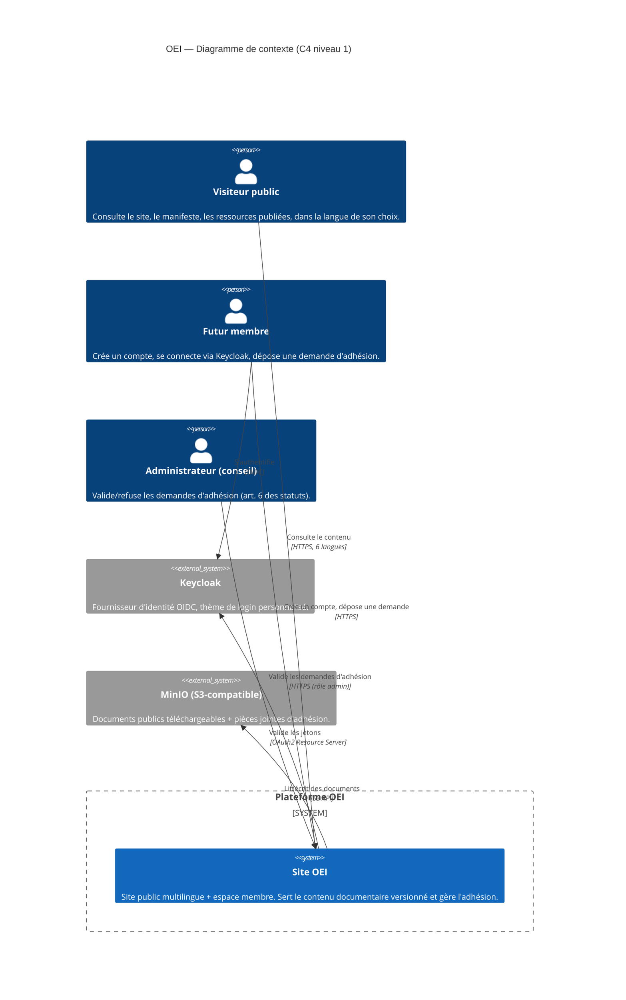
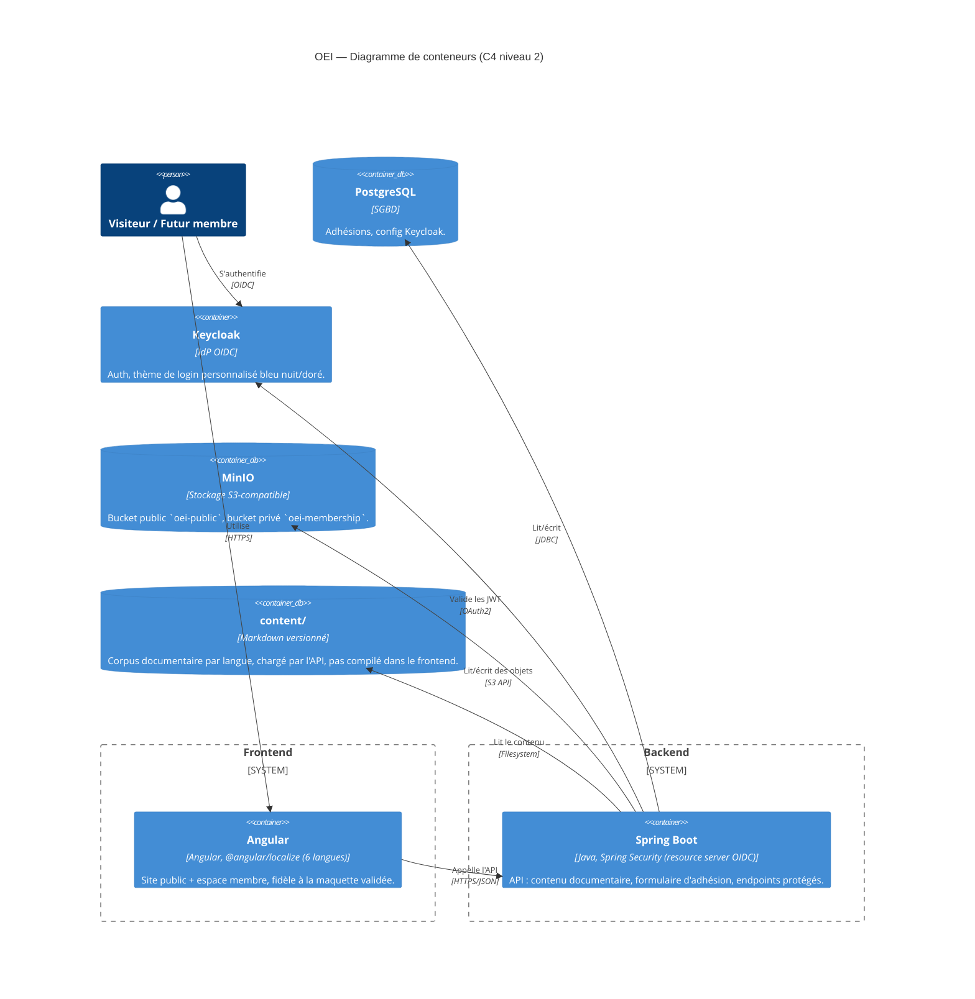
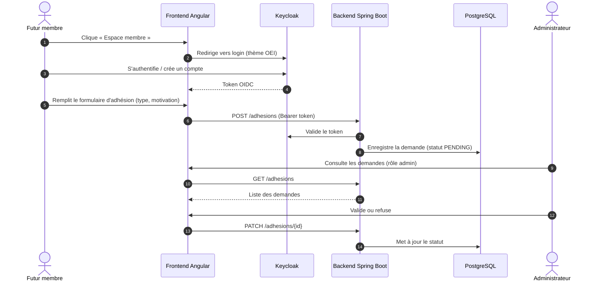

# OEI — Ordre International des Experts de l'Informatique

> **Mouvement fondateur**, pas un ordre professionnel légalement constitué. Vise à faire reconnaître
> progressivement la profession informatique comme une profession à haute responsabilité, dotée d'un
> code de déontologie commun, d'un référentiel de compétences et d'une exigence de formation continue.

*« Compétence. Éthique. Responsabilité. »*

## 1. Pourquoi ce projet

Le logiciel est devenu un bien d'intérêt public — comparable aux infrastructures énergétiques ou de
transport — alors que l'accès à la profession qui le conçoit reste totalement libre, sans exigence de
compétence certifiée, de déontologie commune ou de formation continue obligatoire. L'OEI construit les
fondations (glossaire, livre blanc, code de déontologie, référentiel de compétences) qui pourront, si
l'organisation acquiert une légitimité suffisante, servir de base à une discussion future avec les
pouvoirs publics, dans les pays où le cadre juridique le permet.

Vision, mission et manifeste complets : [`.prompt/02-Vision-Mission-Manifeste.md`](.prompt/02-Vision-Mission-Manifeste.md).
Plan directeur et roadmap : [`.prompt/OEI-Plan-Directeur-Roadmap.md`](.prompt/OEI-Plan-Directeur-Roadmap.md).

> ⚠️ **L'OEI n'est pas un ordre professionnel au sens légal.** Un ordre professionnel est créé par une
> loi ; aucune organisation privée ne peut se l'auto-attribuer. Toute communication doit préciser le
> statut de mouvement associatif.

## 2. Trois chantiers, en parallèle

| Chantier | État réel (2026-07-31) | Où |
|---|---|---|
| **Documentaire** | Ébauche uniquement — le glossaire (`01-Glossaire.md`) est une v1 à compléter, le « livre blanc » actuel n'est que sa synthèse exécutive (4-6 pages), pas les 120-180 pages visées. Corpus complet (code de déontologie, charte des membres, référentiel de compétences) encore à écrire. | `.prompt/`, futur `content/` |
| **Administratif/juridique** | Statuts modèles rédigés (`04-Statuts-Association.md`), en attente de finalisation (siège, composition du CA) et de dépôt formel en Suisse (art. 60 ss CC). Marque et noms de domaine pas encore déposés. | `.prompt/04-Statuts-Association.md`, `.prompt/05-Roadmap-Administrative-Technique.md` |
| **Technique** (ce dépôt) | Design validé, implémentation démarrée par l'infra locale. Voir §3-9 ci-dessous. | `docs/`, `frontend/`, `backend/`, `content/`, `keycloak/`, `infra/` |

Ce README documente le **chantier technique**. Les deux autres avancent en parallèle, hors du code.

## 3. Vue système (C4 — Contexte)

## 4. Vue système (C4 — Conteneurs)

## 5. Flux d'adhésion (séquence)

## 6. Structure du monorepo

| Chemin | Rôle | État |
|---|---|---|
| `.prompt/` | Documents fondateurs (vision, statuts, roadmap) | Existant |
| `docs/superpowers/specs/` | Design technique validé | [`2026-07-31-site-plateforme-oei-design.md`](docs/superpowers/specs/2026-07-31-site-plateforme-oei-design.md) |
| `docs/superpowers/plans/` | Plans d'implémentation détaillés | [`2026-07-31-infra-locale-keycloak-postgres-minio.md`](docs/superpowers/plans/2026-07-31-infra-locale-keycloak-postgres-minio.md) |
| `frontend/` | Angular (site public + espace membre) | À initialiser |
| `backend/` | Spring Boot (API + intégration Keycloak) | À initialiser |
| `content/` | Corpus documentaire versionné, par langue (`fr`, `en`, `de`, `es`, `it`, `pt`) | À initialiser |
| `keycloak/` | Export de realm (`oei`), thème de login personnalisé | En cours |
| `infra/` | `docker-compose.yml` (local) + scripts de vérification | En cours |

## 7. Prérequis

- **Docker** + Docker Compose v2
- **Node.js** et **pnpm/npm** (frontend, une fois initialisé)
- **Java** et **Maven** (backend, une fois initialisé)

## 8. Démarrer l'environnement local

1. `cp infra/.env.example infra/.env` puis adapter les valeurs.
2. `./infra/scripts/dev-up.sh` — démarre Postgres, Keycloak (realm `oei` + thème de login) et MinIO (buckets `oei-public`/`oei-membership`), puis vérifie que tout est opérationnel.
3. Console Keycloak : http://localhost:8081 (admin défini dans `infra/.env`).
4. Console MinIO : http://localhost:9001 (identifiants définis dans `infra/.env`).
5. `./infra/scripts/dev-down.sh` — arrête la stack.

La mise en cloud (AWS EC2 + Traefik/HTTPS) est traitée dans une itération ultérieure, une fois
l'environnement local stable — voir §5 du document de design.

## 9. Tests & qualité

Chaque brique d'infrastructure est vérifiée par un script dédié avant d'être considérée livrée
(`infra/scripts/verify-*.sh`), agrégés par `infra/scripts/verify-all.sh`. Les futurs modules
frontend/backend ajouteront leurs propres suites (tests de composants Angular, JUnit + Testcontainers
côté Spring Boot) selon le même principe : pas de tâche marquée terminée sans vérification exécutée.

## 10. Règles principales (non négociables)

- Le site public est **multilingue dès la v1** (FR, EN, DE, ES, IT, PT) ; repli automatique vers
  l'anglais si un document n'est pas encore traduit dans la langue choisie.
- **Contenu documentaire en Markdown versionné**, pas de CMS headless en v1 — traçabilité git adaptée
  à des documents à portée quasi-juridique (statuts, code de déontologie).
- **Keycloak gère entièrement l'authentification** ; aucune gestion de mot de passe côté application.
- **Aucun secret en clair dans git** — tout passe par `infra/.env` (gitignoré) ; seul
  `infra/.env.example` (valeurs factices) est versionné.
- **HTTPS partout** en production ; pas de HTTP exposé.
- Développement sur **branches dédiées**, jamais directement sur `main` — rebase sur `main` une fois
  stable, merge décidé par le porteur du projet.

## 11. Cadre associatif et juridique

- L'OEI est un **mouvement fondateur** ; toute communication doit éviter la confusion avec un ordre
  professionnel légalement constitué (voir `.prompt/01-Glossaire.md`).
- Création d'association envisagée en **Suisse** (art. 60 ss CC) — voir
  [`.prompt/05-Roadmap-Administrative-Technique.md`](.prompt/05-Roadmap-Administrative-Technique.md)
  pour la checklist complète (nom, marque IPI, RGPD/nLPD, compte bancaire associatif).
- Aucune reconnaissance légale d'ordre professionnel n'est revendiquée tant qu'aucune loi ne la crée.

## 12. Références

- Design technique validé : [`docs/superpowers/specs/2026-07-31-site-plateforme-oei-design.md`](docs/superpowers/specs/2026-07-31-site-plateforme-oei-design.md)
- Plan d'implémentation infra : [`docs/superpowers/plans/2026-07-31-infra-locale-keycloak-postgres-minio.md`](docs/superpowers/plans/2026-07-31-infra-locale-keycloak-postgres-minio.md)
- Plan directeur et roadmap : [`.prompt/OEI-Plan-Directeur-Roadmap.md`](.prompt/OEI-Plan-Directeur-Roadmap.md)
- Roadmap administrative et technique détaillée : [`.prompt/05-Roadmap-Administrative-Technique.md`](.prompt/05-Roadmap-Administrative-Technique.md)
- Maquette validée de la page d'accueil : [`.prompt/maquetteUI.png`](.prompt/maquetteUI.png)
