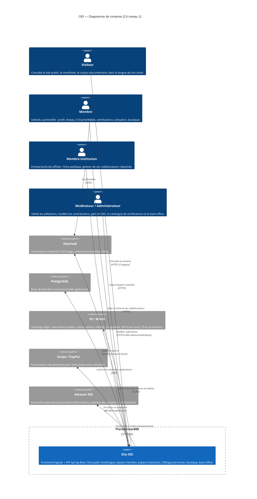
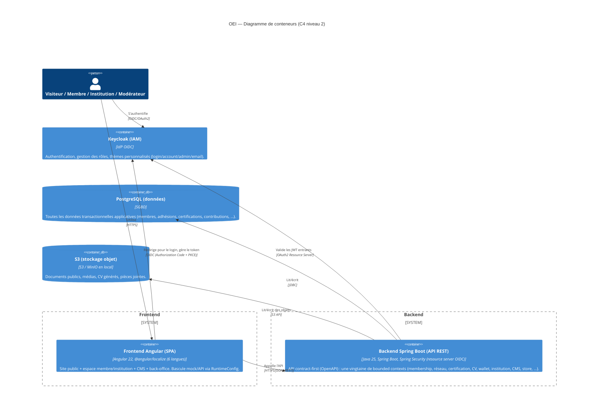
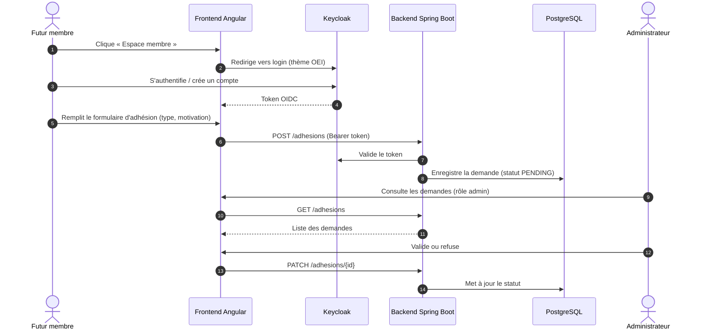

# OEI — Ordre International des Experts de l'Informatique

> **Mouvement fondateur**, pas un ordre professionnel légalement constitué. Vise à faire reconnaître
> progressivement la profession informatique comme une profession à haute responsabilité, dotée d'un
> code de déontologie commun, d'un référentiel de compétences et d'une exigence de formation continue.

*« Compétence. Éthique. Responsabilité. »*

## 1. Pourquoi ce projet

Le logiciel est devenu un bien d'intérêt public — comparable aux infrastructures énergétiques ou de
transport — alors que l'accès à la profession qui le conçoit reste totalement libre, sans exigence de
compétence certifiée, de déontologie commune ou de formation continue obligatoire. L'OEI construit les
fondations (glossaire, livre blanc, code de déontologie, référentiel de compétences) qui pourront, si
l'organisation acquiert une légitimité suffisante, servir de base à une discussion future avec les
pouvoirs publics, dans les pays où le cadre juridique le permet.

Vision, mission et manifeste complets : [`.prompt/02-Vision-Mission-Manifeste.md`](.prompt/02-Vision-Mission-Manifeste.md).
Plan directeur et roadmap : [`.prompt/OEI-Plan-Directeur-Roadmap.md`](.prompt/OEI-Plan-Directeur-Roadmap.md).

> ⚠️ **L'OEI n'est pas un ordre professionnel au sens légal.** Un ordre professionnel est créé par une
> loi ; aucune organisation privée ne peut se l'auto-attribuer. Toute communication doit préciser le
> statut de mouvement associatif.

## 2. Trois chantiers, en parallèle

| Chantier | État réel (2026-07-31) | Où |
|---|---|---|
| **Documentaire** | Ébauche uniquement — le glossaire (`01-Glossaire.md`) est une v1 à compléter, le « livre blanc » actuel n'est que sa synthèse exécutive (4-6 pages), pas les 120-180 pages visées. Corpus complet (code de déontologie, charte des membres, référentiel de compétences) encore à écrire. | `.prompt/`, futur `content/` |
| **Administratif/juridique** | Statuts modèles rédigés (`04-Statuts-Association.md`), en attente de finalisation (siège, composition du CA) et de dépôt formel en Suisse (art. 60 ss CC). Marque et noms de domaine pas encore déposés. | `.prompt/04-Statuts-Association.md`, `.prompt/05-Roadmap-Administrative-Technique.md` |
| **Technique** (ce dépôt) | Design validé, implémentation démarrée par l'infra locale. Voir §3-9 ci-dessous. | `.docs/`, `frontend/`, `backend/`, `content/`, `keycloak/`, `infra/` |

Ce README documente le **chantier technique**. Les deux autres avancent en parallèle, hors du code.

## 3. Fonctionnalités principales de la plateforme

Au-delà du corpus documentaire (§2), le dépôt implémente déjà un produit riche. Détails
techniques dans les README spécifiques ([`backend/README.md`](backend/README.md),
[`frontend/oei-web/README.md`](frontend/oei-web/README.md)) — ci-dessous, une vue produit :

| Fonctionnalité | En une phrase |
|---|---|
| **Réseau neuronal + transparence salariale** | Visualisation 3D (Three.js) du réseau de membres, avec un benchmark de salaires anonymisé et agrégé par domaine/séniorité. |
| **Certifications** | Catalogue de certifications OEI (référentiel de compétences gradué), demande, suivi et validation d'une certification par un membre. |
| **CV / carte de visite / Wallet** | Générateur de CV professionnel (export PDF), carte de visite numérique avec QR code scannable, et carte "Wallet" (Apple/Google Wallet) scellée et notariée. |
| **Boutique (Store)** | Achat de produits/services liés à l'OEI (ex. certifications payantes), intégration de paiement (Stripe/PayPal). |
| **CMS / Gouvernance documentaire** | Édition, revue et publication du corpus documentaire multilingue par les membres habilités, avec un flux de contribution/modération et une synchronisation Git du contenu versionné. |
| **Espace institution** | Portail dédié aux membres-institutions (entreprises, écoles) : fiche publique, gestion de leurs collaborateurs rattachés. |
| **Espace membre** | Profil, cotisation, badges, historique de contributions, accès aux outils ci-dessus (CV, Wallet, réseau). |
| **Administration** | Back-office : gestion des membres, institutions, contenu, catalogue de certifications, templates d'e-mail, menus, traductions, tableau de bord, journal d'audit. |

## 4. Vue système (C4 — Contexte)

> Diagramme mis à jour pour refléter l'état actuel de l'implémentation (au-delà de la seule
> adhésion, qui n'était que le premier flux modélisé) : quatre types d'acteurs, et l'ensemble
> des systèmes externes réellement intégrés par le backend (`infrastructure-client`,
> `infrastructure-mail`, `infrastructure-security`, `infrastructure-persistence`).



## 5. Vue système (C4 — Conteneurs)



## 6. Flux d'adhésion (séquence)



## 7. Structure du monorepo

| Chemin | Rôle |
|---|---|
| `frontend/oei-web/` | SPA Angular 22 (site public + espace membre/institution + CMS + back-office). Détails : [`frontend/oei-web/README.md`](frontend/oei-web/README.md). |
| `backend/` | API Spring Boot, Maven multi-module DDD/hexagonal (contract-first OpenAPI). Détails : [`backend/README.md`](backend/README.md). |
| `content/` | Corpus documentaire versionné en Markdown, par langue (`fr`, `en`, `de`, `es`, `it`, `pt`), organisé par grande section (`000-VISION`, `100-CONSTITUTION`, `200-WHITE-PAPERS`, `300-STANDARDS`, `400-CERTIFICATIONS`, `500-COUNCILS`, `600-COMMUNICATION`, `700-WEBSITE`, `800-INTERNATIONAL`, `900-LEGAL`, `annexes`). Servi par le backend, jamais compilé dans le frontend. |
| `keycloak/` | Export de realm (`oei`) et thèmes personnalisés (login, account, admin, email) aux couleurs de l'OEI. |
| `infra/` | `docker-compose.yml` (stack locale : Postgres, Keycloak, MinIO) + scripts de vérification (`infra/scripts/verify-*.sh`). |
| `.prompt/` | Documents fondateurs (vision, statuts, roadmap), plans d'implémentation détaillés (`.prompt/plan/`), et procédures opérationnelles (`.prompt/local/`, `.prompt/deployment/`). |
| `.docs/` | Specs/plans techniques historiques (`superpowers`) et ADRs (`.docs/adr/`). |

## 8. Comment démarrer

Le guide complet — lancer le frontend seul en mode mock, ou frontend + backend + Postgres +
Keycloak en mode API réelle, avec ou sans Docker — est déjà écrit et à jour :
[`.prompt/local/run-local-frontend-backend.md`](.prompt/local/run-local-frontend-backend.md).
Ce README ne le duplique pas ; se référer directement à ce guide.

En résumé très bref (voir le guide pour le détail et les prérequis) :

```bash
# Frontend seul, mode mock (aucun backend requis)
cd frontend/oei-web && pnpm install && pnpm run start   # http://localhost:4300

# Stack complète (Postgres + Keycloak + MinIO) puis backend + frontend en mode API
cp infra/.env.example infra/.env
./infra/scripts/dev-up.sh
cd backend && mvn spring-boot:run -pl application/web -am
```

## 9. Déploiement

Le manuel de déploiement AWS complet (achat de domaine, EC2, S3, secrets SSM, Dockerfiles,
`docker-compose.prod.yml`, CloudFront, sauvegardes, supervision) et le pipeline CI/CD
GitHub Actions sont déjà rédigés — ce README y renvoie plutôt que de les dupliquer :

- Manuel de déploiement : [`.prompt/deployment/deploiement-aws.md`](.prompt/deployment/deploiement-aws.md)
- Infrastructure as Code (Terraform) : [`.prompt/deployment/terraform/`](.prompt/deployment/terraform/)
- Pipeline GitHub Actions : [`.prompt/deployment/pipeline-github-actions.md`](.prompt/deployment/pipeline-github-actions.md)

## 10. Tests & qualité

- **Backend** : `mvn clean verify` depuis `backend/` — tests unitaires du domaine, tests
  `MockMvc` de la couche web, tests Testcontainers de la persistance, suite ArchUnit
  (pureté du domaine + règles d'architecture cross-module), suite Cucumber d'acceptance.
  Détail : [`backend/README.md`](backend/README.md).
- **Frontend** : `ng test` (Vitest) depuis `frontend/oei-web/` pour les tests unitaires,
  `pnpm run e2e` (Playwright) pour les tests de bout en bout. Détail :
  [`frontend/oei-web/README.md`](frontend/oei-web/README.md).
- **Infra locale** : chaque brique est vérifiée par un script dédié
  (`infra/scripts/verify-*.sh`), agrégés par `infra/scripts/verify-all.sh`.

## 11. Règles principales (non négociables)

- Le site public est **multilingue** (FR, EN, DE, ES, IT, PT) ; repli automatique vers
  l'anglais si un document n'est pas encore traduit dans la langue choisie.
- **Contenu documentaire en Markdown versionné**, pas de CMS headless pour le corpus —
  traçabilité git adaptée à des documents à portée quasi-juridique (statuts, code de déontologie).
- **Aucun texte en dur dans le code** (frontend comme backend) : tout passe par de l'i18n ou
  une API localisée.
- **Keycloak gère entièrement l'authentification** ; aucune gestion de mot de passe côté application.
- **Aucun secret en clair dans git** — tout passe par `infra/.env` (gitignoré) en local, ou
  AWS SSM Parameter Store en production ; seul `infra/.env.example` (valeurs factices) est versionné.
- **HTTPS partout** en production ; pas de HTTP exposé.
- Développement sur **branches dédiées**, jamais directement sur `main` — rebase sur `main` une fois
  stable, merge décidé par le porteur du projet.

## 12. Cadre associatif et juridique

- L'OEI est un **mouvement fondateur** ; toute communication doit éviter la confusion avec un ordre
  professionnel légalement constitué (voir `.prompt/01-Glossaire.md`).
- Création d'association envisagée en **Suisse** (art. 60 ss CC) — voir
  [`.prompt/05-Roadmap-Administrative-Technique.md`](.prompt/05-Roadmap-Administrative-Technique.md)
  pour la checklist complète (nom, marque IPI, RGPD/nLPD, compte bancaire associatif).
- Aucune reconnaissance légale d'ordre professionnel n'est revendiquée tant qu'aucune loi ne la crée.

## 13. Pour aller plus loin

- **Décisions d'architecture (ADR)** : [`.docs/adr/`](.docs/adr/) — journal des choix
  techniques structurants et de leurs raisons.
- **Plans de développement** : [`.prompt/plan/`](.prompt/plan/) — plans détaillés par grande
  fonctionnalité (page d'accueil dynamique, espace membre individuel, espace membre
  institutionnel, CMS/gouvernance documentaire, plan de développement v1).
- **Skill Claude de référence backend** : `spring-boot-ddd-backend-skill` (voir
  `.claude/skills/spring-boot-ddd-backend-skill/`) — les conventions Maven multi-module
  DDD/hexagonal appliquées dans `backend/` en découlent directement ; s'y référer avant
  toute modification du backend.
- Design technique validé : [`.docs/superpowers/specs/2026-07-31-site-plateforme-oei-design.md`](.docs/superpowers/specs/2026-07-31-site-plateforme-oei-design.md)
- Plan directeur et roadmap : [`.prompt/OEI-Plan-Directeur-Roadmap.md`](.prompt/OEI-Plan-Directeur-Roadmap.md)
- Roadmap administrative et technique détaillée : [`.prompt/05-Roadmap-Administrative-Technique.md`](.prompt/05-Roadmap-Administrative-Technique.md)
- Maquette validée de la page d'accueil : [`.prompt/maquetteUI.png`](.prompt/maquetteUI.png)
