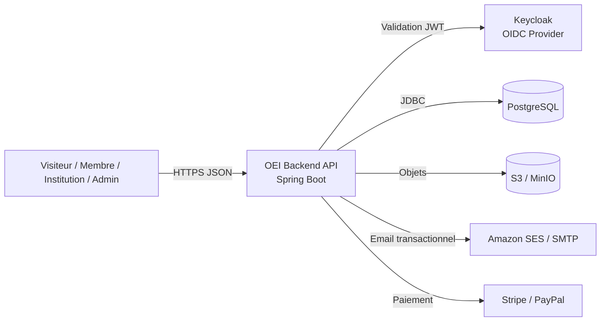
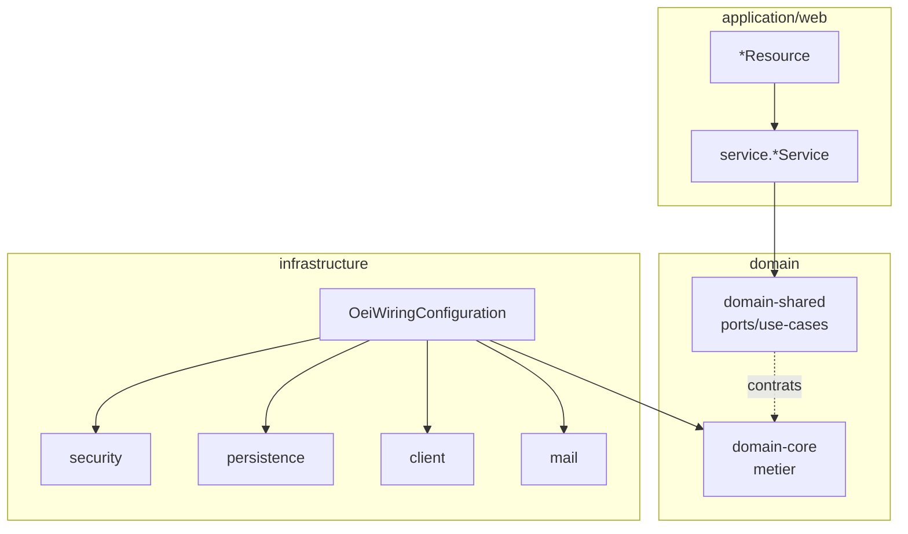
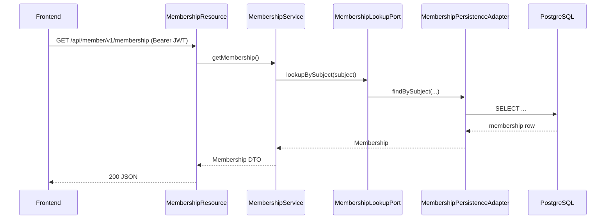
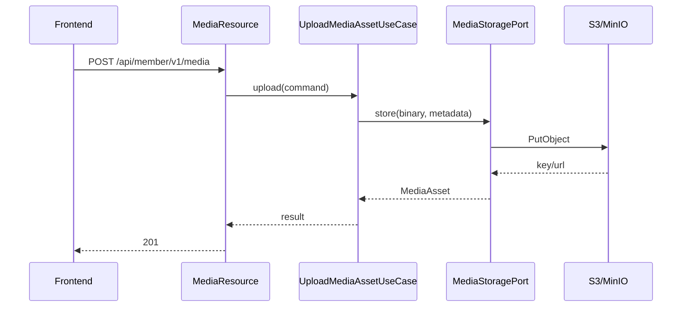
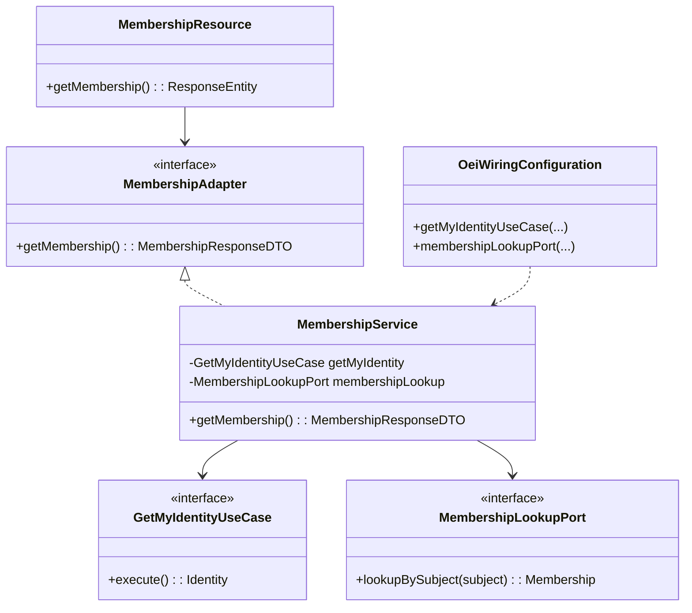
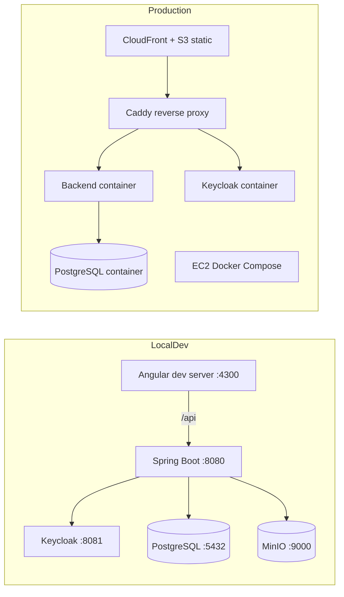

# Backend OEI (Spring Boot)

Backend Spring Boot 4.1 / Java 25 de la plateforme OEI, en architecture DDD + Hexagonale,
multi-modules Maven, contract-first OpenAPI.

## Vue fonctionnelle

| Domaine | Fonctionnalites principales | Etat actuel |
|---|---|---|
| Membership | Adhésion, lecture de profil membre, droits de base | Partiellement implémenté |
| Identity & Security | Auth OIDC Keycloak, mapping roles JWT -> `ROLE_*` | Implémenté |
| CMS / Content | Lecture/édition de contenus multilingues, publication | Contrat présent, implémentation progressive |
| Certifications | Catalogue, objectifs, déclarations | Contrat présent |
| Institutions | Affiliation, invitations, publications, audit | Contrat présent |
| Events | Gestion d'événements, inscriptions | Contrat présent |
| Store | Commandes, paiement, remboursement | Contrat présent |
| Media | Upload de médias, URL de stockage | Slice de base présente |
| Admin | Templates email, supervision métier, gouvernance | Contrat présent |

> Note: le contrat OpenAPI expose ~90 opérations, alors que seule une partie est branchée
> fonctionnellement aujourd'hui. Les endpoints non implémentés retournent encore `501`.

## Structure des modules

| Module | Rôle |
|---|---|
| `domain/shared` | Ports, value objects, contrats de use-cases (sans Spring/JPA) |
| `domain/core` | Implémentations métier (sans dépendance framework) |
| `infrastructure/security` | Adaptateurs sécurité JWT/Keycloak |
| `infrastructure/persistence` | Entités JPA, repositories, Liquibase |
| `infrastructure/client` | Clients externes (paiement, providers) |
| `infrastructure/mail` | Intégration email (SES/SMTP) |
| `infrastructure/wiring` | Composition root (`OeiWiringConfiguration`) |
| `application/web` | API HTTP (`*Resource`, `*Adapter`, `service.*Service`) |
| `test/architecture` | Règles ArchUnit inter-modules |
| `test/acceptance` | Scénarios Cucumber + Testcontainers |

## Architecture C4 (Mermaid)

### C4 - Niveau 1 (Contexte)



### C4 - Niveau 2 (Conteneurs internes backend)



## Diagrammes de sequence

### Sequence - Consultation du profil membre



### Sequence - Upload media (happy path)



## Diagramme de classes (vue logique simplifiee)



## Diagramme de deploiement



## Contrat OpenAPI (source unique)

- Fichier source: `backend/application/web/src/main/resources/openapi/oei-api.yaml`
- Generation serveur: `openapi-generator-maven-plugin` (interfaces Spring + DTO)
- Packaging contrat local npm: `backend/application/web/target/npm-package`
- Consommation frontend: `file:../../backend/application/web/target/npm-package`

Flux CI/deploiement:

1. backend `mvn ... process-resources` (ou `package`)
2. frontend `pnpm run generate:api`
3. build/test frontend/backend

## Build et verification

```bash
cd backend
mvn clean verify
```

Build cible deploy (sans tests, deja executes en CI):

```bash
cd backend
mvn -B clean package -pl application/web -am -DskipTests
```

## Qualite et garde-fous

- `Maven Enforcer` bloque l'introduction de deps Spring/JPA dans `domain/*`
- `ArchUnit` valide les frontières de packages et dépendances inter-modules
- `Checkstyle` sur convention code
- `Cucumber` pour acceptance tests
- `Liquibase` pour versionner le schema DB

## Limites connues

- Une partie significative du contrat OpenAPI reste a implémenter côté application.
- Les tests d'intégration couvrent encore inégalement tous les sous-domaines.
- Le seuil de couverture automatisé `jacoco:check` n'est pas encore verrouillé globalement.
