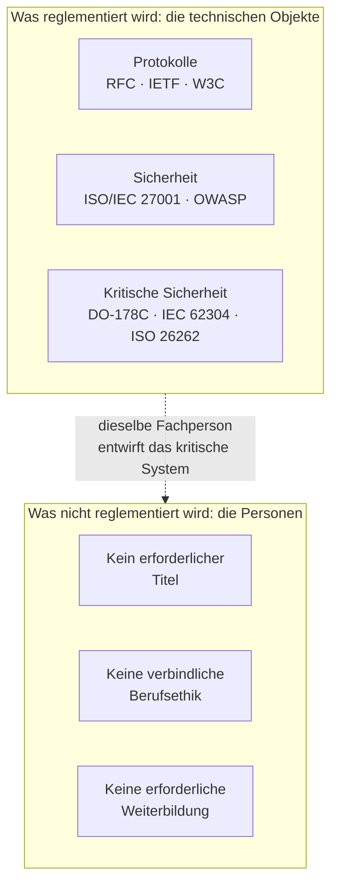
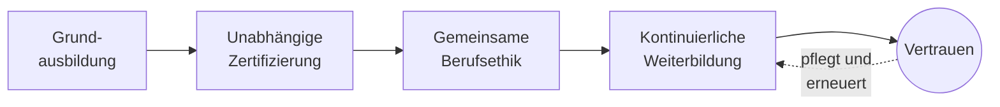
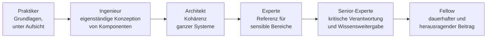

# Weißbuch
## Für eine schrittweise Anerkennung des IT-Berufs

*Ordre des Experts Informaticiens (OEI) — Internationale Gründungsbewegung — Version 3.1*

---

> **Vorbemerkung zum Status der Organisation.** Der Ordre des Experts Informaticiens (OEI) ist zum jetzigen Zeitpunkt eine *Gründungsbewegung*, getragen von einem *Verein*. Er ist kein Berufsorden im rechtlichen Sinne: Ein Berufsorden wird durch Gesetz geschaffen, im Rahmen eines reglementierten Berufs mit vorbehaltenen Tätigkeiten. Keine private Organisation kann sich diesen Status selbst zuschreiben. Das Wort „Orden“ wird hier als Gebrauchsname und als Horizont verwendet, nicht als erworbener Rechtstitel. Diese Klarstellung, die unserem Glossar und unserer Satzung entspricht, wird in diesem Dokument überall dort wiederholt, wo sie notwendig ist — nicht aus rhetorischer Vorsicht, sondern weil sie im Kern unserer intellektuellen Ehrlichkeit steht.

---

## Persönliches Vorwort des Autors

Ich habe dieses Weißbuch nicht geschrieben, weil der Informatik Anerkennung fehlen würde. Die Informatik ist überall. Sie steht im Zentrum von Banken, Krankenhäusern, Verkehrssystemen, der Industrie, öffentlichen Verwaltungen und heute auch der Systeme künstlicher Intelligenz, die einen wachsenden Teil unserer kollektiven Entscheidungen prägen.

Ich habe dieses Weißbuch geschrieben, weil mir ein Paradox zunehmend offensichtlich erscheint. Wir leben in einer Welt, in der Software immer strengeren Normen, Audits sowie Sicherheits- und Konformitätsanforderungen unterliegt. Doch die Frauen und Männer, die diese Systeme entwerfen, üben nach wie vor einen Beruf aus, dessen Konturen weitgehend undefiniert bleiben. Jeder kann sich als Experte ausgeben. Die Kompetenzniveaus sind extrem unterschiedlich. Verantwortlichkeiten sind manchmal verwässert. Berufsethische Pflichten sind selten formalisiert.

Im Laufe meiner Laufbahn als Ingenieur, Entwickler, Softwarearchitekt und dann technischer Verantwortlicher hatte ich die Gelegenheit, an Finanzsystemen, kritischen Plattformen und internationalen Projekten zu arbeiten, bei denen ein einfacher Softwarefehler erhebliche Folgen für Tausende von Menschen haben konnte. Dabei habe ich eine einfache Realität entdeckt: Wenn Software zur Infrastruktur wird, verändert sich die Natur des Berufs derjenigen, die sie bauen.

Das Ziel dieses Dokuments ist es nicht, eine künstliche Zugangsbarriere zum Beruf zu schaffen. Es geht auch nicht darum, mechanisch die Modelle anderer reglementierter Berufe zu kopieren. Der Anspruch ist fundamentaler. Es geht darum, eine internationale Diskussion darüber zu eröffnen, wie unser Beruf seine Rolle in der modernen Gesellschaft vollständig übernehmen kann. Ein Beruf, der in der Lage ist, seine Standards zu definieren, technische Exzellenz zu fördern, sein Wissen weiterzugeben und kollektiv seine Verantwortung zu übernehmen.

Ich bin überzeugt, dass die kommenden Jahrzehnte die Informatik zu einer der prägendsten Disziplinen unserer Zivilisation werden lassen. Digitale Systeme sind längst keine einfachen Werkzeuge mehr; sie sind zu Vertrauensinfrastrukturen geworden. Diese Entwicklung verpflichtet uns.

Dieses Weißbuch liefert nicht alle Antworten. Es ist vor allem eine Einladung zum Nachdenken, zur Debatte und zum Handeln. Ich hoffe, dass es, wenn auch bescheiden, dazu beiträgt, einen stärkeren, verantwortungsbewussteren Beruf entstehen zu lassen, der sich seiner Rolle in der Welt bewusster ist.

Yann Deungoué
Softwarearchitekt
Gründer der Initiative Ordre des Experts Informaticiens (OEI)

---

## Über den Autor

Yann Deungoué ist Ingenieur und Softwarearchitekt. Im Laufe seiner Laufbahn — als Entwickler, Architekt und dann technischer Verantwortlicher — hat er Finanzsysteme, kritische Plattformen und internationale Projekte entworfen, aufgebaut und weiterentwickelt, in Umgebungen, in denen Zuverlässigkeit, Sicherheit und Konformität von Software keine Optionen, sondern erstrangige Anforderungen sind. Aus dieser praktischen Erfahrung, im Kontakt mit Systemen, deren Ausfall Tausende von Menschen betreffen kann, entstand die Überzeugung, die diesem Weißbuch zugrunde liegt: Wenn Software zur Infrastruktur wird, verändert sich die Natur des Berufs derjenigen, die sie bauen, und erfordert eine Verantwortung, die ihren Auswirkungen entspricht.

Mit Sitz in der Schweiz und tätig im Finanzsektor, hat er die Initiative Ordre des Experts Informaticiens (OEI) gegründet, um auf internationaler Ebene eine Diskussion über die schrittweise Anerkennung und Strukturierung des IT-Berufs zu eröffnen. Er vertritt dabei einen maßvollen, nicht alarmistischen Ansatz, der auf kritische Systeme ausgerichtet ist und darauf bedacht ist, die Offenheit, Kreativität und Einbeziehung von Talenten aus allen Bereichen zu bewahren, die den Reichtum der Disziplin ausgemacht haben.

*Eine ausführlichere biografische Notiz, versehen mit einem Porträt des Autors, wird vor dem Druck der endgültigen Version ergänzt.*

---

## Danksagung

Dieses Weißbuch verdankt vielen, die auf die eine oder andere Weise zu seinem Reifeprozess beigetragen haben, sehr viel. Ich danke den ersten Lesern und Lektoren, die sich bereit erklärt haben, diese Seiten ohne Nachsicht zu prüfen, und deren Einwände ebenso wichtig waren wie die Ermutigungen; den Kolleginnen und Kollegen, Ingenieurinnen und Ingenieuren, Architektinnen und Architekten, Sicherheitsverantwortlichen und Lehrenden, mit denen sich im Laufe der Jahre die hier dargelegten Überzeugungen geformt haben; der IT-Berufsgemeinschaft insgesamt, deren Offenheit und intellektuelle Großzügigkeit für mich ein zu bewahrendes und nicht ein einzuschränkendes Vorbild bleiben. Meine Dankbarkeit gilt schließlich meinen Angehörigen, deren Geduld und Unterstützung eine Arbeit ermöglicht haben, die neben einer anspruchsvollen Tätigkeit geleistet wurde. Da dieses Dokument ein erster Beitrag ist, der noch bereichert werden soll, gelten die wichtigsten Danksagungen wohl denjenigen, die ich in künftigen Versionen an die kommenden Mitwirkenden richten werde.

---

## Institutionelles Vorwort

Die Elektrizität hat das 20. Jahrhundert verändert; die Software verändert das 21. Dieser Satz, der unser Manifest eröffnet, ist keine Stilfigur. Er beschreibt eine materielle Zäsur. In weniger als zwei Generationen ist der Programmcode vom Status eines spezialisierten Rechenwerkzeugs zum Bindegewebe moderner Gesellschaften geworden. Er regelt den Luftverkehr, passt Strahlentherapiedosen an, führt Börsenaufträge aus, gleicht Stromnetze aus, authentifiziert Identitäten, verteilt Wasser und Energie und vermittelt einen wachsenden Teil menschlicher Beziehungen. Wo man früher Maschinen sah, gibt es heute Programme; und hinter diesen Programmen Fachleute, deren technische Entscheidungen, oft ohne dass es jemand bemerkt, die Sicherheit und die Interessen einer großen Zahl von Menschen betreffen.

Dieses Weißbuch geht von einer einfachen und überprüfbaren Feststellung aus: Die technischen Objekte der Informatik gehören zu den weltweit am strengsten normierten, aber der Beruf, der sie entwirft, ist es fast gar nicht. Die Netzwerkprotokolle, Austauschformate, kryptografischen Algorithmen und Normen für Softwaresicherheit sind Gegenstand öffentlicher, überarbeiteter, getesteter und verbindlicher Spezifikationen. Der Zugang zum Beruf, der sie umsetzt, bleibt hingegen in den meisten Ländern völlig frei: ohne Nachweis zertifizierter Kompetenz, ohne verbindliche gemeinsame Berufsethik, ohne Pflicht zur kontinuierlichen Weiterbildung. Dieses Ungleichgewicht ist nicht zwangsläufig ein Skandal — es ist das Ergebnis einer schnellen und kreativen Geschichte. Aber es ist zu einer Anomalie geworden, die benannt, dokumentiert und schrittweise behoben werden muss.

Wir beanspruchen nicht, eine schlüsselfertige Lösung anzubieten oder einen einheitlichen Rahmen für Berufe aufzuzwingen, deren Vielfalt ihren Reichtum ausmacht. Eine Website zu schreiben erfordert nicht dieselben Garantien wie die eingebettete Software eines Herzschrittmachers zu entwerfen. Unser Anliegen ist gezielt, abgestuft und in seinen unmittelbaren Ansprüchen bewusst bescheiden: eine gemeinsame Baustelle zu eröffnen, ein gemeinsames Vokabular zu setzen, einen Referenzrahmen und eine Berufsethik vorzuschlagen und die Glaubwürdigkeit aufzubauen, die es eines Tages, in Ländern, in denen der Rechtsrahmen es zulässt, ermöglichen wird, eine formellere Anerkennung ins Auge zu fassen. Dieses Dokument ist kein Abschluss. Es ist ein Anfang, der der Kritik derjenigen offensteht — Wissenschaftlerinnen und Wissenschaftler, Sicherheitsverantwortliche, Ingenieurinnen und Ingenieure, Juristinnen und Juristen des digitalen Rechts, Praktikerinnen und Praktiker vor Ort —, deren Rückmeldungen es verbessern werden.

---

## Über den OEI

*Der Ordre des Experts Informaticiens (OEI) ist eine Gründungsbewegung, getragen von einem Verein, und kein Berufsorden im rechtlichen Sinne des Begriffs (siehe Vorbemerkung). Sein Daseinszweck lässt sich in einer Vision, einer Mission und einem Wertekanon zusammenfassen.*

### Vision

Eine Welt, in der die Fachleute, die die digitalen Systeme entwerfen, entwickeln und betreiben, von denen unsere Gesellschaften abhängen — Gesundheit, Luftfahrt, Energie, Finanzen, Verwaltung —, ihren Beruf mit einem Maß an Kompetenz, Ethik und Verantwortung ausüben, das den Herausforderungen entspricht, die sie tragen.

### Mission

Das Gemeinwohl verteidigen, indem eine verantwortungsvolle, ethische, sichere und nachhaltige Informatik gefördert wird, und den Beruf des IT-Experten schrittweise als einen Beruf mit hoher Verantwortung anerkennen lassen, ausgestattet mit:

- einem gemeinsamen Verhaltenskodex;
- einem gemeinsamen Kompetenzrahmen;
- einer Pflicht zur kontinuierlichen Weiterbildung;
- einer glaubwürdigen Vertretung gegenüber Institutionen, Universitäten und Unternehmen.

### Werte

Unser Leitspruch — **„Kompetenz. Ethik. Verantwortung.“** — fasst den Geist der Bewegung zusammen. Wir gliedern ihn in fünf Werte, die unsere Arbeit und unsere Governance leiten.

- **Kompetenz.** Wir stellen die reale, überprüfbare und über die gesamte Laufbahn hinweg gepflegte Beherrschung über Titel, Labels und Erscheinungsbilder.
- **Ethik.** Wir machen die Berufsethik — Datenschutz, Ehrlichkeit, Ablehnung betrügerischer oder irreführender Praktiken — zu einer beruflichen Anforderung ersten Ranges und nicht zu einer bloßen Zugabe.
- **Verantwortung.** Wir gehen davon aus, dass diejenige oder derjenige, die oder der ein kritisches System entwirft, für ihre bzw. seine technischen Entscheidungen einsteht, ohne sich jemals hinter einem Werkzeug, einer Maschine oder einem automatisierten System zu verstecken.
- **Unabhängigkeit.** Wir bauen unsere Legitimität, unsere Referenzrahmen und unsere Bewertungen abseits kommerzieller Interessen auf, insbesondere abseits von Softwareanbietern, von denen wir uns klar unterscheiden wollen.
- **Offenheit.** Wir setzen uns für einen Beruf ein, der Talenten aus allen Bereichen offensteht, dessen Prozesse transparent sind, und wir stellen nur dort Anforderungen auf, wo die kollektive Sicherheit dies rechtfertigt.

### Name, Struktur und internationaler Anspruch

Der Ordre des Experts Informaticiens (OEI) ist der Name der *Bewegung*: derjenigen, die die in diesem Weißbuch dargelegte Vision trägt und die Gründungsmitglieder versammelt. Er darf nicht mit dem Namen der *juristischen Einheit* verwechselt werden, die ihn beherbergt. Um jede Verwechslung mit rechtlich konstituierten Berufsorden zu vermeiden — eine Frage, die uns mehrere Lektoren zu Recht gestellt haben —, wird der Trägerverein unter einem eigenständigen institutionellen Namen eingetragen, in der Form **OEI Foundation** oder **Internationales Institut für IT-Verantwortung**, mit dem ausdrücklichen Hinweis „Träger der Bewegung Ordre des Experts Informaticiens“. Diese zweistufige Struktur erlaubt es der juristischen Einheit, neutral und unzweideutig zu bleiben, während die Bewegung den Namen behält, der ihre Vision und ihr symbolisches Gedächtnis trägt. Der endgültige Rechtsname wird mit Unterstützung eines Rechtsbeistands festgelegt, vor jeder Markenanmeldung; bis dahin verwendet dieses Weißbuch durchgängig die vollständige Formel *Ordre des Experts Informaticiens — Internationale Gründungsbewegung*.

Dieselbe Anforderung an Klarheit gilt für unseren geografischen Anspruch. Der OEI ist von Anfang an als eine *internationale* Initiative konzipiert: Dieses Weißbuch ruft ausdrücklich dazu auf, „eine internationale Diskussion darüber zu eröffnen, wie unser Beruf seine Rolle vollständig übernehmen kann“. Doch ein internationaler Anspruch hebt die rechtliche Realität nicht auf: Der Gesellschaftssitz, der rechtliche Name des Vereins und seine territorialen Vertretungen müssen im Zuge seiner Entwicklung Land für Land unterschieden — und aufeinander abgestimmt — werden, unter Beachtung der jeweiligen lokalen Rechtsrahmen (siehe auch Anhang A). Das Kürzel OEI bleibt unverändert; es ist der institutionelle Rahmen darum, der sich schrittweise präzisieren wird.

---

## Zusammenfassung

*Diese Zusammenfassung gibt auf wenigen Seiten das Wesentliche des Weißbuchs wieder: das Problem, die Vision, die Vorschläge, einige zahlenmäßige Anhaltspunkte, den Fahrplan und die erwarteten Vorteile. Sie kann eigenständig gelesen und unabhängig verbreitet werden; der Hauptteil des Dokuments entwickelt und untermauert jeden einzelnen Punkt.*

### Das Problem

Die Informatik ist heute einer der weltweit am strengsten normierten Bereiche der technischen Welt. Die Protokolle, die das Internet zum Laufen bringen (die RFCs der IETF), die Webstandards (W3C), die Sicherheitsnormen (ISO/IEC 27001, OWASP-Empfehlungen) und die Sicherheitsreferenzrahmen kritischer Systeme (DO-178C für die eingebettete Luftfahrtsoftware, IEC 62304 für Medizinprodukte, ISO 26262 für die Automobilindustrie) regeln die technischen Objekte akribisch. Doch in der überwiegenden Mehrheit der Länder bleibt der Zugang zum Beruf, der diese Systeme entwirft, völlig frei: ohne Nachweis zertifizierter Kompetenz, ohne verbindliche gemeinsame Berufsethik, ohne Pflicht zur kontinuierlichen Weiterbildung. Jeder kann sich als Experte ausgeben.

Dieses Paradox erzeugt eine Lücke: Die Artefakte sind reglementiert, die Menschen nicht. Doch die Qualität und Sicherheit eines Systems hängen nicht nur von der Konformität seiner Komponenten ab; sie hängen vom Urteilsvermögen, den Abwägungen und der Integrität der Fachleute ab, die es zusammensetzen. Das ist ein kollektiver blinder Fleck, der umso besorgniserregender ist, als die Auswirkungen von Software auf die Welt eine neue Größenordnung erreicht haben.

### Warum jetzt

Drei gleichzeitige Umbrüche machen diese Lücke problematischer, als sie es vor zwanzig Jahren war:

- **Generative künstliche Intelligenz** verändert die Natur der Softwarearbeit selbst grundlegend und verlagert den Wert der Codeerstellung hin zur Fähigkeit, ein System zu spezifizieren, zu überprüfen und dafür Verantwortung zu übernehmen. Eine Maschine kann vorschlagen; eine Fachperson muss dafür einstehen.
- **Cybersicherheit** ist zu einer Frage kollektiver Sicherheit geworden: Krankenhäuser, Gebietskörperschaften, Energieversorger und Logistikketten gehören inzwischen zu den Zielen. Die regulatorische Dynamik beschleunigt sich (NIS2, DORA, Cyber Resilience Act); die Strukturierung des Berufs hinkt hinterher.
- **Wirtschaftlicher und sozialer Druck weltweit** (Preiswettbewerb, Prekarisierung, Verbreitung produktgebundener kommerzieller Zertifizierungen) verwischt die Orientierungspunkte und erschwert es Arbeitgebern wie öffentlichen Stellen, echte Expertise von ihrer Nachahmung zu unterscheiden.

### Die Vision

Unsere These lässt sich in einem Satz zusammenfassen: Software ist zu einem Gut von öffentlichem Interesse geworden, vergleichbar in seinen Auswirkungen mit Energie- oder Verkehrsinfrastrukturen, und diese Realität muss sich in der Art und Weise widerspiegeln, wie der Beruf, der sie produziert, organisiert ist.

Wir schlagen nicht vor, alle digitalen Berufe einheitlich zu reglementieren — eine persönliche Website zu schreiben erfordert nicht dieselben Garantien wie eine eingebettete Medizinsoftware zu entwerfen. Wir vertreten einen *gezielten und schrittweisen* Ansatz, zusammengefasst in einem Leitprinzip:

> Jede Person, die die technische Verantwortung für ein kritisches System übernimmt, sollte Mindestanforderungen an Kompetenz, kontinuierliche Weiterbildung und Berufsethik erfüllen.

### Wer ist ein IT-Experte?

Diese Frage wurde uns direkt gestellt, und wir müssen sie unumwunden beantworten, statt sie offenzulassen. Ein IT-Experte wird nicht allein durch das Diplom, das Dienstalter oder die Beherrschung eines kommerziellen Produkts definiert. Seine Expertise resultiert aus einer überprüfbaren Kombination von Wissen, Erfahrung, nachgewiesenen Leistungen, tatsächlich ausgeübter Verantwortung, Urteilsvermögen in komplexen Situationen, kontinuierlicher Weiterbildung und ethischem Engagement. Diese Definition, operationalisiert durch den Kompetenzrahmen (siehe Abschnitt 10), unterscheidet dauerhafte berufliche Expertise von bloßer scheinbarer Produktivität oder kommerzieller Zertifizierung — und beantwortet sowohl die oben erwähnten Vorfälle als auch das schulische Paradox: Code schreiben zu können, selbst wenn früh erlernt, ist nicht gleichbedeutend damit, diese Verantwortung zu tragen.

### Was wir aufbauen wollen

1. **Einen Kompetenz- und Expertisestufenrahmen**, transparent und öffentlich, der beschreibt, was ein IT-Experte ist, anhand einer abgestuften Skala (Praktiker, Ingenieur, Architekt, Experte, Senior-Experte, Fellow).
2. **Einen gemeinsamen Verhaltenskodex**, inspiriert von Berufen mit hoher Verantwortung: Datenschutz, Ablehnung betrügerischer Praktiken, Offenlegung von Interessenkonflikten, Dokumentation technischer Entscheidungen.
3. **Einen von kommerziellen Anbietern unabhängigen Zertifizierungsrahmen**, entwickelt mit akademischen Partnern, um dauerhafte berufliche Kompetenz von der bloßen Beherrschung eines Produkts zu unterscheiden.
4. **Eine Pflicht zur kontinuierlichen Weiterbildung**, nach dem Vorbild der Gesundheitsberufe, gegliedert nach großen Bereichen (KI, Cybersicherheit, Cloud, Regulierung, Ethik, digitale Nachhaltigkeit).
5. **Eine unabhängige Beobachtungsstelle**, die regelmäßig den tatsächlichen Stand des Berufs veröffentlicht.

### Einige zahlenmäßige Anhaltspunkte

Die genauen Daten zum IT-Beruf sind verstreut und methodisch fragil; wir beschränken uns daher auf Größenordnungen und weisen auf ihren schätzungsweisen Charakter hin.

- Nach gängigen fachlichen Schätzungen geht die Zahl der Softwareentwickler weltweit in die **Dutzende Millionen**, und sie wächst von Jahr zu Jahr. Keine dieser Fachpersonen ist in den meisten Ländern an einen Titel oder eine verbindliche Berufsethik zur Ausübung ihrer Tätigkeit gebunden.
- Die jährlichen Kosten der Cyberkriminalität weltweit werden häufig auf **Billionen von Dollar** geschätzt, mit großen Unsicherheiten je nach Umfang und Methodik. Der Aufwärtstrend hingegen ist unumstritten.
- Der Markt für Technologien der künstlichen Intelligenz verzeichnet ein **schnelles Wachstum**, laut den meisten Branchenanalysen zweistellig, was die Fläche der an automatisierte Systeme delegierten Entscheidungen entsprechend vergrößert.
- Größere Softwarevorfälle veranschaulichen aussagekräftige Größenordnungen: Ein Bereitstellungsfehler kostete ein Finanzunternehmen 2012 **rund 440 Millionen Dollar in weniger als einer Stunde**; ein fehlerhaftes Update einer Sicherheitssoftware verursachte 2024 laut dem betroffenen Betriebssystemhersteller den Ausfall von **rund 8,5 Millionen Geräten** weltweit innerhalb weniger Stunden.
- Die **digitale Abhängigkeit** der Gesellschaften — einige wenige Cloud-Anbieter, einige universelle Bibliotheken, einige identisch auf Millionen Maschinen eingesetzte Komponenten — konzentriert das Risiko: Ein Ausfall an einer einzigen Stelle kann sich heute weltweit ausbreiten.

Diese Zahlen messen das Ausmaß des Problems; sie belegen nicht, dass eine Berufsorganisation die Cyberkriminalität mechanisch senken würde — keine Organisation kann einen entschlossenen Angreifer daran hindern zu handeln. Sie zeigen jedoch, dass Kompetenz, kontinuierliche Weiterbildung und Verantwortung der Fachleute zu wesentlichen Bestandteilen der digitalen Resilienz geworden sind: Auf dieser bescheideneren und ehrlicheren Ebene, als es ein Versprechen mechanischer Reduktion wäre, liegt unser erwarteter Beitrag.

### Der Fahrplan

Wir gehen in *aufeinanderfolgenden Etappen* voran, nicht nach Kalenderfristen: rechtliche und identitätsbezogene Absicherung; minimal tragfähiges dokumentarisches Fundament; öffentliche Präsenz; vollständiger Korpus (Berufsethik, Referenzrahmen, Chartas); erster Kreis glaubwürdiger Mitwirkender; breitere Anerkennung. Jede Etappe bedingt die nächste. Man baut die Anerkennung nicht vor dem Korpus auf, noch den Korpus vor dem gemeinsamen Vokabular.

### Die erwarteten Vorteile

Für die **Fachleute**: eine Anerkennung der tatsächlichen Kompetenz, ein Schutz vor der Nivellierung nach unten, klare Karriereorientierungspunkte. Für **Arbeitgeber und Kunden**: eine Verringerung der Informationsasymmetrie, eine sicherere Personalgewinnung, eine Aufwertung der Teams, die in ihre Kompetenz investieren. Für die **Gesellschaft**: mehr Qualität, Sicherheit, Resilienz und Vertrauen in Systeme, von denen Gesundheit, Finanzen, Energie und öffentliche Dienstleistungen abhängen.

### Was wir nicht sind

Wir sind kein Berufsorden im rechtlichen Sinne; wir haben nicht die Macht, vorbehaltene Tätigkeiten zu schaffen oder den Zugang zum Beruf zu bedingen, und keine private Organisation kann sich diesen Status selbst zuschreiben. Wir sind eine Gründungsbewegung, getragen von einem Verein, die einen Korpus aufbaut. Erlangt dieser Korpus ausreichende Legitimität, kann er als Grundlage für eine künftige Diskussion mit Universitäten, Unternehmen und gegebenenfalls öffentlichen Behörden dienen, in den Ländern, in denen der Rechtsrahmen dies zulässt.

---

## 1. Warum dieses Dokument, warum jetzt

Man könnte einwenden, die Debatte über die Professionalisierung der Informatik sei alt und nie zu einem Ergebnis gekommen. Das trifft zu, und genau deshalb muss sie neu aufgegriffen werden. Die Bedingungen haben sich geändert. Drei gleichzeitige Umbrüche machen die derzeitige Lücke problematischer, als sie es vor zwanzig Jahren war.

Der erste ist der Einbruch der generativen künstlichen Intelligenz in die Softwareproduktion selbst. Werkzeuge, die Code schreiben, vervollständigen und korrigieren können, verändern die Natur der Arbeit und die Definition von Kompetenz grundlegend. Sie verschieben den Wert: weniger hin zur Produktion von Codezeilen, mehr hin zur Fähigkeit, ein System zu spezifizieren, zu überprüfen, abzuwägen und dafür Verantwortung zu übernehmen. Dieser Umbruch macht einen Rahmen umso notwendiger, der echte Expertise von bloß scheinbarer Produktivität unterscheidet und daran erinnert, dass eine Maschine vorschlagen kann, aber eine Fachperson dafür einstehen muss. Die Frage der menschlichen Verantwortung tritt, weit davon entfernt zu verschwinden, in den Mittelpunkt.

Der zweite ist die Verwandlung der Cybersicherheit in eine Frage kollektiver Sicherheit. Cyberangriffe zielen nicht mehr nur auf kommerzielle Daten; sie treffen Krankenhäuser, Gebietskörperschaften, Energieversorger, Logistikketten. Die Ransomware WannaCry hat 2017 einen Teil des britischen Gesundheitsdienstes lahmgelegt; im selben Jahr breitete sich der Angriff NotPetya weit über seine ursprünglichen Ziele hinaus aus und legte unter anderem die Systeme der Reederei Maersk lahm. Diese Episoden haben gezeigt, dass ein Softwareausfall Systemwirkungen haben kann, die außer Verhältnis zum ursprünglichen Vorfall stehen. Der Gesetzgeber hat das verstanden: Die Europäische Union hat Rahmenwerke wie die NIS2-Richtlinie für die Resilienz wesentlicher Infrastrukturen, die DORA-Verordnung für den Finanzsektor oder den Cyber Resilience Act für die Sicherheit digitaler Produkte verabschiedet. Die regulatorische Dynamik beschleunigt sich; die Strukturierung des Berufs hinkt hinterher.

Der dritte Umbruch ist wirtschaftlicher und sozialer Natur. Die Globalisierung der IT-Arbeit hat einen Preisdruck und eine Prekarisierung geschaffen, die vergleichbare reglementierte Berufe nicht kennen. Die Verbreitung kommerzieller Zertifizierungen, oft an einen Anbieter und seine Produkte gebunden, verwischt die Orientierungspunkte: Sie bescheinigen die Beherrschung eines Werkzeugs, selten eine übertragbare und dauerhafte berufliche Kompetenz. Daraus ergibt sich eine Informationsasymmetrie, die für Arbeitgeber, Kunden und öffentliche Behörden schwer zu beheben ist: Wie lässt sich auf einem undurchsichtigen Markt echte Expertise von ihrer Nachahmung unterscheiden? Ein Beruf, der sich so schnell entwickelt wie die Medizin, aber weder über deren ethischen Rahmen noch über deren Pflicht zur kontinuierlichen Weiterbildung verfügt, setzt sich einem doppelten Verlust aus: an Qualität für die Gesellschaft, an Anerkennung für seine Mitglieder.

Dieses Dokument existiert, um diese Feststellungen geordnet darzulegen, Fakten von Meinungen zu unterscheiden und einen Weg vorzuschlagen. Es richtet sich zunächst an den Beruf selbst, dann an akademische Institutionen und Unternehmen und schließlich — aber erst, wenn die Glaubwürdigkeit geduldig aufgebaut wurde — an die öffentlichen Behörden.

## 2. Kurze Geschichte des IT-Berufs

Um zu verstehen, warum die Informatik nicht als Beruf strukturiert ist, muss man zu ihren Anfängen zurückkehren. Anders als Medizin oder Recht, deren Berufsstände sich über Jahrhunderte gebildet haben, hat die Informatik keine Existenz von der Dauer eines Menschenlebens. Die ersten universellen programmierbaren Computer stammen aus den 1940er-Jahren; die Disziplin hat sich im Gehen konstituiert, getragen von einer Reihe von Brüchen statt einer langsamen institutionellen Sedimentierung.

Ihre Gründungsfiguren stammen aus unterschiedlichen Welten: Mathematiker, Physiker, Elektroingenieure, Logiker. Alan Turing formalisiert bereits 1936 den Begriff der Berechenbarkeit; Grace Hopper entwickelt einen der ersten Compiler und trägt zur Entstehung menschenlesbarer Sprachen bei, die den Weg zu einer Informatik ebnen, die nicht mehr nur Maschinenkonstrukteuren vorbehalten ist. Während sich die Hardware verbreitet, verlagert sich der Schwerpunkt auf die Software — und mit ihr die Komplexität. Bereits Ende der 1960er-Jahre stellen die Praktiker fest, dass die Produktion zuverlässiger Programme weit schwieriger ist als erwartet: Projekte überschreiten ihre Budgets, häufen Fehler an, scheitern manchmal vollständig. Aus dieser Diagnose entsteht bei einer NATO-Konferenz in Garmisch im Jahr 1968 der Begriff „Softwarekrise“ und die Forderung nach einer echten *Softwaretechnik* (software engineering): die methodische Strenge der Ingenieurwissenschaft auf die Codeproduktion anzuwenden.

Der Anspruch war richtig, stieß aber auf eine nie gelöste Spannung. Die klassische Ingenieurwissenschaft stützt sich auf stabile physikalische Gesetze, charakterisierte Materialien, erprobte Sicherheitsmargen. Software hingegen ist immateriell, unendlich formbar, und ihre Komplexität wächst ohne die physikalischen Einschränkungen, die eine Brücke oder einen Motor begrenzen. Diese Formbarkeit ist ihre Stärke — sie erklärt die enorme Geschwindigkeit der digitalen Innovation —, aber sie hat auch eine Berufskultur genährt, die einer Standardisierung der Personen ablehnend gegenübersteht. Individuelles Talent, Autodidaktik, die Fähigkeit, schnell zu lernen, wurden dort stets höher geschätzt als das Diplom oder der Titel. Viele der einflussreichsten Mitwirkenden des Fachgebiets haben nie eine formale Informatikausbildung absolviert. Diese Offenheit ist eine wertvolle Errungenschaft, auf die wir nicht verzichten wollen.

Man muss es klar sagen, denn es bestimmt unseren Vorschlag: Das Fehlen von Zugangsbarrieren war ein Motor für Innovation und Inklusion. Es hat Talenten aus unterschiedlichsten Bereichen ermöglicht, beizutragen, und es hat die Besitzstandsrenten vermieden, die bestimmte geschlossene Berufe erstarren lassen. Unsere These ist nicht, dass diese Freiheit ein Fehler war. Sie besagt, dass in einem präzisen Bereich — dem der kritischen Systeme — die sozialen Kosten des völligen Fehlens von Anforderungen höher geworden sind als der Nutzen unbegrenzter Offenheit. Der Beruf ist gereift; seine Auswirkungen auf die Welt haben eine neue Größenordnung erreicht. Es ist Zeit, dass seine Strukturierung diese Entwicklung vorsichtig und ohne Verleugnung nachvollzieht.

## 3. Software als kritische Infrastruktur

Dass Software töten, ruinieren oder lähmen kann, ist keine theoretische Hypothese. Es ist eine dokumentierte Tatsache, veranschaulicht durch eine Reihe von Vorfällen, die zu Lehrbeispielen geworden sind und weltweit in Ingenieurstudiengängen behandelt werden. Sie in Erinnerung zu rufen, hat nichts Sensationslüsternes an sich: Sie sind der empirische Beweis dafür, dass bestimmte Softwaresysteme im Sinne unseres Glossars tatsächlich zur Kategorie der kritischen Infrastrukturen gehören — Systeme, deren Ausfall schwerwiegende Folgen für die Sicherheit von Personen, die Wirtschaft oder das Funktionieren wesentlicher Infrastrukturen haben kann.

Im **Gesundheitswesen** verabreichte das Bestrahlungsgerät Therac-25 Mitte der 1980er-Jahre mehreren Patienten massive Strahlenüberdosen, die zu Todesfällen und schweren Folgeschäden führten. Die Untersuchung zeigte, dass die Ursache nicht ein defektes Bauteil war, sondern eine Reihe von Softwarefehlern — eine Wettlaufsituation (*race condition*) zwischen Aufgaben, übermäßiges Vertrauen in die Software nach der Entfernung von Hardware-Verriegelungen, unzureichendes Management von Fehlerzuständen. Dieser Fall bleibt vierzig Jahre später die Referenz, um zu lehren, dass ein Softwarefehler tödliche Folgen haben kann und dass die Sicherheit eines Systems niemals nur auf seine Hardwarekomponenten reduziert werden darf.

In der **Luftfahrt** endete der Erstflug der Ariane 5 im Jahr 1996 mit der Zerstörung der Trägerrakete wenige Sekunden nach dem Start. Die Ursache: die Wiederverwendung eines von Ariane 4 geerbten Softwaremoduls, bei dem die Umwandlung eines Gleitkommawerts in eine kürzere Ganzzahl zu einem nicht abgefangenen Kapazitätsüberlauf führte. Jüngeren Datums forderten die beiden Abstürze der Boeing 737 MAX 2018 und 2019 das Leben von 346 Menschen; die Untersuchungen belasteten ein automatisches Trimmsystem (MCAS), das sich auf eine einzige Datenquelle stützte und dessen Verhalten weder korrekt dokumentiert noch den Besatzungen vermittelt worden war. Diese Tragödien veranschaulichen eine wiederkehrende Lehre: Es sind nicht immer die ausgefeiltesten Algorithmen, die versagen, sondern implizite Annahmen, Spezifikationsmängel und schlecht definierte Verantwortungsbereiche.

In den **Finanzen** verlor die Firma Knight Capital 2012 rund 440 Millionen Dollar in weniger als einer Stunde, nach der fehlerhaften Bereitstellung einer automatisierten Handelssoftware, die in unkontrollierbarem Tempo fehlerhafte Aufträge ausführte — ein Vorfall, der das Unternehmen beinahe zu Fall gebracht hätte. In der **Energiewirtschaft** wurde der große Stromausfall, der 2003 den Nordosten Nordamerikas traf und zig Millionen Menschen ohne Strom ließ, durch einen Softwarefehler im Alarmsystem einer Leitstelle verschärft, der die Betreiber daran hinderte, die Verschlechterung der Lage rechtzeitig zu erkennen. Schließlich verursachte 2024 ein einfaches fehlerhaftes Update einer weit verbreiteten Sicherheitssoftware nach Angaben des betroffenen Betriebssystemherstellers den Ausfall von rund 8,5 Millionen Geräten weltweit innerhalb weniger Stunden — Flugzeuge blieben am Boden, Krankenhäuser, Banken und Verwaltungen waren gestört. Diese Episode machte eine Realität greifbar, die Experten schon lange als *systemische Abhängigkeit* bezeichnen. Eine einzige, überall präsente Komponente wird zu einem weltweiten Ausfallpunkt.

Was diese Vorfälle über die Vielfalt der Sektoren hinweg verbindet, ist, dass keiner von ihnen Schicksal ist. Jeder belastet Ketten menschlicher Entscheidungen: Architekturentscheidungen, Fristabwägungen, unzureichende Testverfahren, verwässerte Verantwortlichkeiten. Genau das versuchen die Disziplinen, die kritische Systeme regeln, zu disziplinieren — und genau hier zeigt sich die Kluft, auf die wir zurückkommen werden, zwischen der den Artefakten auferlegten Strenge und der den Personen gelassenen völligen Freiheit.

Man muss sich jedoch vor einer allzu schnellen Lesart dieser Episoden hüten, die schweren Ausfall mit individueller Inkompetenz gleichsetzen würde. Keiner der oben genannten Fälle belegt einen Mangel an technischer Kompetenz der beteiligten Fachleute: Die Untersuchungen belasten je nach Fall Spezifikationsmängel, im Nachhinein diskutable Architekturentscheidungen, unzureichende Tests, wirtschaftliche Zwänge, mangelhafte Governance oder eine Verwässerung der Verantwortlichkeiten zwischen mehreren Teams — selten einen einfachen Fehler, den eine bessere individuelle Kompetenz allein verhindert hätte. Genau diese Feststellung begründet unsere These: Technische Kompetenz allein, selbst wenn sie real ist, reicht nicht aus; sie muss in einen kollektiven Rahmen von Governance, Berufsethik und Fähigkeit zur Risikomeldung eingebettet sein, ohne den die besten individuellen Kompetenzen gegenüber organisatorischen Fehlern machtlos bleiben.

## 4. Die neuen Risiken: KI, Cybersicherheit, systemische Abhängigkeit

Zu den klassischen Risiken kritischer Software kommen heute Risiken neuer Art hinzu, die Kompetenzen und eine Wachsamkeit erfordern, über die der Beruf kollektiv noch nicht verfügt.

Das erste betrifft die **Verbreitung künstlicher Intelligenz** in Entscheidungssystemen. Modelle des maschinellen Lernens werden nicht im klassischen Sinne programmiert: Sie werden anhand von Daten trainiert, und ihr Verhalten ergibt sich aus diesem Training statt aus einer expliziten Spezifikation. Daraus resultieren neuartige Eigenschaften — Undurchsichtigkeit der Entscheidungen, Empfindlichkeit gegenüber in den Daten vorhandenen Verzerrungen, unvorhersehbares Verhalten außerhalb des Trainingsbereichs, Schwierigkeit, ein reproduzierbares Ergebnis zu garantieren. Wenn solche Systeme bei der Bewerberauswahl, der Kreditvergabe, der medizinischen Diagnoseunterstützung oder der Inhaltsmoderation zum Einsatz kommen, wird die Frage der Verantwortung dringlich. Der Begriff der *verantwortungsvollen KI*, wie wir ihn definieren — Transparenz, Fairness, Sicherheit und menschliche Verantwortung — ist keine bloße Zugabe: Es ist eine ingenieurtechnische Anforderung. Die Gesetzgeber beginnen, ihn ins Recht aufzunehmen, wie die europäische Verordnung über künstliche Intelligenz zeigt, die die Pflichten je nach Risikograd abstuft. Aber ein Gesetzestext bildet keine Praktiker aus: Es braucht Fachleute, die in der Lage sind, ihn mit Urteilsvermögen umzusetzen.

Das zweite Risiko ist das der **Cybersicherheit**, die inzwischen untrennbar mit der Konzeption der Systeme selbst verbunden ist. Softwareschwachstellen sind keine isolierten Vorfälle mehr, sondern ein strukturelles Phänomen. Die 2014 entdeckte Heartbleed-Schwachstelle in einer allgegenwärtigen kryptografischen Bibliothek legte die Daten von Millionen Servern offen; die Log4Shell-Schwachstelle betraf 2021 eine so weit verbreitete Protokollierungsbibliothek, dass es Monate dauerte, alle Verwendungen zu erfassen. Diese Episoden offenbaren eine tiefe Abhängigkeit von gemeinsam genutzten Softwarekomponenten, die oft von einer Handvoll Freiwilliger entwickelt und gepflegt werden, von denen jedoch ein immenser Teil der digitalen Wirtschaft abhängt. Der 2024 knapp vereitelte Versuch, eine Hintertür in ein weit verbreitetes Kompressionsprogramm einzuschleusen, zeigte, dass diese Software-Lieferkette eine eigenständige Angriffsfläche darstellt. Ein System zu sichern beschränkt sich nicht mehr darauf, seinen Perimeter zu schützen: Man muss die Gesamtheit seiner Abhängigkeiten verstehen, nachverfolgen und beherrschen.

Das dritte, übergreifende Risiko ist die **systemische Abhängigkeit** selbst. Die Bündelung von Infrastrukturen — einige wenige Cloud-Anbieter, einige universelle Bibliotheken, einige identisch auf Millionen Maschinen eingesetzte Sicherheitsprogramme — bringt immense Effizienzgewinne, konzentriert aber das Risiko. Ein Ausfall an einer einzigen Stelle breitet sich heute weltweit aus, wie der oben erwähnte globale Ausfall von 2024 gezeigt hat. Diese Frage berührt die der *digitalen Souveränität*: die Fähigkeit eines Staates, einer Organisation oder einer Einzelperson, ihre Infrastrukturen und technologischen Entscheidungen ohne übermäßige Abhängigkeit von Dritten zu beherrschen. Wir behandeln diese Frage nicht ideologisch, sondern unter dem Gesichtspunkt der Resilienz: Ein System, dessen Komponenten und Konzentrationspunkte man nicht beherrscht, ist ein System, dessen Risiko man nicht beherrscht.

Diese drei Risiken haben einen gemeinsamen Nenner: Sie übersteigen die Kompetenz eines Einzelnen und erfordern eine gemeinsame Berufskultur — Methoden, eine Berufsethik, eine kontinuierliche Aktualisierung des Wissens. Genau das kann ein organisierter Beruf leisten.

## 5. Grüne Informatik und digitale Nachhaltigkeit

Ein lange vernachlässigtes Thema drängt sich nun auf: der ökologische Fußabdruck der Digitalisierung. Man betrachtete die Informatik zunächst als „saubere“, immaterielle Technologie, im Gegensatz zur Schwerindustrie. Dieses Bild täuscht. Hinter der scheinbaren Immaterialität der Software verbergen sich energieintensive Rechenzentren, weltweite Telekommunikationsnetze und vor allem ein erheblicher Strom von Geräten, deren Herstellung seltene Ressourcen und beträchtliche Energie erfordert.

Die verfügbaren Schätzungen siedeln den Anteil der Digitalisierung an den weltweiten Treibhausgasemissionen bei einigen Prozent an — eine Größenordnung, die oft mit der des Flugverkehrs verglichen wird — und dieser Anteil wächst. Wir bleiben bei den genauen Zahlen vorsichtig, die je nach Methodik und Umfang variieren, doch der grundlegende Trend ist unstrittig: Die Rechenleistungsnachfrage wächst rasch, insbesondere getrieben durch den Aufschwung der künstlichen Intelligenz, deren Training und Betrieb großer Modelle besonders energie- und hardwareintensiv sind. Ein Punkt ist unter seriösen Analysen unbestritten: Der überwiegende Teil der Auswirkung stammt von der Herstellung der Endgeräte und Ausrüstungen, mehr als von deren reinem Stromverbrauch im Betrieb. Das heißt, die Verlängerung der Lebensdauer von Geräten und die Zurückhaltung bei der Erneuerung von Ausrüstungen wiegen mindestens ebenso schwer wie die Energieeffizienz von Rechenzentren.

Hier kommt die Verantwortung der Fachperson ins Spiel, denn viele scheinbar technische Entscheidungen haben direkte ökologische Folgen. Eine schlecht konzipierte Softwarearchitektur kann den Rechen- und Speicherbedarf unnötig vervielfachen. Eine Software, deren Anforderungen ohne Notwendigkeit wachsen — was manchmal als „Software-Fettleibigkeit“ bezeichnet wird — treibt den vorzeitigen Austausch noch funktionsfähiger Hardware voran und erzeugt vermeidbaren Elektroschrott. Umgekehrt können ein sparsames Design, eine Optimierung der Verarbeitung, eine angemessene Dimensionierung der Infrastrukturen und eine durchdachte Wahl der Rechenstandorte den Fußabdruck erheblich verringern, oft unter gleichzeitiger Verbesserung von Leistung und Kosten. Die *grüne Informatik*, wie wir sie definieren — die Gesamtheit der Praktiken zur Verringerung des ökologischen Fußabdrucks digitaler Systeme — ist daher kein separater, Spezialisten vorbehaltener Bereich: Sie ist eine übergreifende Dimension des Berufs, ebenso wie die Sicherheit.

Rahmenwerke und Communities entstehen, um diese Anforderung mit Werkzeugen zu versehen, etwa im Zusammenhang mit der Arbeit rund um softwareseitiges Ökodesign, die Messung des Fußabdrucks von Anwendungen oder die von auf nachhaltige Software spezialisierten Kollektiven vertretenen Grundsätze. Öffentliche Behörden und Regulierungsbehörden greifen das Thema ebenfalls auf, mit wachsenden Pflichten zur Messung und Verringerung des digitalen Fußabdrucks. Wir sind der Ansicht, dass digitale Nachhaltigkeit ausdrücklich im Kompetenzrahmen und im Verhaltenskodex des Berufs verankert werden muss: nicht als auferlegter Zwang, sondern als Merkmal beruflicher Qualität. Ein effizientes System zu entwerfen bedeutet auch, es sparsam zu entwerfen.

## 6. Das Paradox: normierte Systeme, nicht reglementierter Beruf

Hier berühren wir den Kern unserer Argumentation. Die Informatik weist eine auffällige Besonderheit auf: Wenige Bereiche menschlicher Tätigkeit haben ihre technischen Objekte so stark normiert und den Zugang zum Beruf, der sie hervorbringt, so wenig strukturiert.

Das folgende Schema fasst dieses Ungleichgewicht zusammen: auf der einen Seite ein dichter und verbindlicher Stapel technischer Anforderungen; auf der anderen Seite ein fast vollständiges Fehlen von Anforderungen an die Personen — obwohl es sich oft um dieselbe Fachperson handelt.

Betrachten wir zunächst das Ausmaß der technischen Normierung. Die digitale Kommunikation stützt sich auf Tausende öffentlicher und überarbeiteter Spezifikationen — die von der IETF veröffentlichten RFCs für Internetprotokolle, die W3C-Standards für das Web, die ISO- und IEC-Normen für unzählige Aspekte von Software und Daten. Die Sicherheit verfügt über eigene Referenzrahmen: die Norm ISO/IEC 27001 für Managementsysteme der Informationssicherheit, die Empfehlungen der OWASP für Anwendungssicherheit, die öffentlichen Schwachstellenkataloge und ihre Bewertungssysteme. Hochkritische Bereiche gehen noch weiter: Die Norm DO-178C regelt eingebettete Luftfahrtsoftware und schreibt eine strenge Rückverfolgbarkeit zwischen Anforderungen, Code und Tests vor; die Norm IEC 62304 regelt den Softwarelebenszyklus von Medizinprodukten; die Norm ISO 26262 behandelt die funktionale Sicherheit von Fahrzeugsystemen; die generische Norm IEC 61508 begründet eine ganze Familie von Anforderungen für sicherheitsrelevante Systeme. In diesen Sektoren kann eine Softwarekomponente nicht in Betrieb genommen werden, ohne detaillierte, auditierbare und verbindliche Anforderungen zu erfüllen.

Betrachten wir nun die andere Seite. In der überwiegenden Mehrheit der Länder ist keine Qualifikation gesetzlich vorgeschrieben, um die meisten dieser Systeme zu entwerfen, zu entwickeln oder zu betreiben. Ein und dieselbe Person kann, ohne jeden anerkannten Titel oder verbindliche Berufsethik, den Code schreiben, der Gesundheitsdaten verarbeitet, Finanztransaktionen orchestriert oder eine Industrieanlage steuert. Während Arzt, Rechtsanwalt, Apotheker oder Wirtschaftsprüfer einen reglementierten Beruf ausüben — dessen Zugang durch einen Titel, ein Diplom oder eine Eintragung bedingt und durch Berufsethik und Disziplin geregelt ist —, bleibt die Informatik im Sinne unseres Glossars ein Beruf, der weder reglementiert noch überall auch nur organisiert ist.

Das Paradox lässt sich einfach formulieren: Wir reglementieren die Artefakte akribisch, und die Personen, die sie produzieren, überhaupt nicht. Doch die Qualität und Sicherheit eines Systems hängen nicht nur von der Konformität seiner Komponenten mit Normen ab; sie hängen vom Urteilsvermögen, den Abwägungen und der Integrität der Fachleute ab, die es zusammensetzen. Die technischen Normen setzen kompetente Praktiker voraus, die sie mit Urteilsvermögen anwenden — aber nichts garantiert diese Kompetenz oder erhält sie über die Zeit. Das ist ein kollektiver blinder Fleck.

Muss man deshalb behaupten, die Informatik sei der einzige Beruf in dieser Lage? Nein, und es wäre unehrlich, das glauben zu lassen. Managementberatung, private Sicherheit außerhalb reglementierter Tätigkeiten, Datenanalyse (*data science*), ein Teil der Compliance-Beratung oder bestimmte Berufe des Bauwesens außerhalb vorbehaltener Tätigkeiten verbinden ebenfalls eine dichte technische Normierung mit einem weitgehend offenen Berufszugang. Die Besonderheit der Informatik liegt daher nicht in ihrer Isoliertheit, sondern in der Kombination von vier Faktoren in diesem Ausmaß: ihre Präsenz in allen Wirtschaftssektoren, die Geschwindigkeit ihrer Entwicklung, ihre Fähigkeit zur weltweiten Ausbreitung und Folgen, die zugleich physisch, wirtschaftlich und sozial sein können. Wenige Berufe vereinen diese vier Merkmale gleichzeitig; diese Kombination, mehr als das Fehlen jeglichen Vergleichsfalls, rechtfertigt unser Vorgehen.

Man muss sich vor einer überzogenen Schlussfolgerung hüten. Dieses Paradox bedeutet nicht, dass der gesamte Beruf reglementiert oder Barrieren dort errichtet werden müssten, wo sich Offenheit bewährt hat. Es bedeutet, dass ein Glied fehlt: Zwischen der technischen Norm, die für das Objekt gilt, und dem allgemeinen Recht, das für alle gilt, existiert kein professioneller Zwischenrahmen speziell für kritische Systeme. Genau dieses Glied schlagen wir vor aufzubauen, indem wir zunächst dokumentieren und wünschenswert machen, statt es aufzuzwingen.

## 7. Bestehende internationale Modelle

Wir beginnen nicht bei null. Andere Berufe, und die Informatik selbst in einigen ihrer Komponenten, haben Formen der Strukturierung aufgebaut, an denen wir uns orientieren können — indem wir sorgfältig unterscheiden, was einem Rechtsstatus entspricht, den wir nicht haben, und was einer durch Qualität erworbenen Autorität entspricht, die wir anstreben können.

Das erste Modell ist das der **klassischen Berufsorden**: Ärzte, Apotheker, Architekten, Wirtschaftsprüfer. Ihr gemeinsames Merkmal ist die Verbindung eines gesetzlich geschützten Titels, eines verbindlichen Verhaltenskodex, einer Disziplinarinstanz und einer Pflicht zur kontinuierlichen Weiterbildung. Diese Berufe zeigen, dass es möglich ist, ein hohes Anspruchsniveau mit dauerhaftem öffentlichem Vertrauen zu vereinbaren. Wir übernehmen ihre Grammatik — Berufsethik, überprüfte Kompetenz, kontinuierliche Weiterbildung, Disziplin —, ohne ihren Rechtsstatus zu beanspruchen, der ein Gesetz voraussetzt, das zu erlassen wir nicht befugt sind.

Das zweite, unmittelbar relevantere Modell ist das der **reglementierten Ingenieurwissenschaft**, wofür das kanadische Beispiel aufschlussreich ist. In Québec regelt der Ordre des ingénieurs du Québec den gesetzlich geschützten Titel des Ingenieurs, mit vorbehaltenen Tätigkeiten in bestimmten Bereichen und einem Disziplinarmechanismus. Die kanadische Tradition hat sogar ein Ritual geschaffen — den Eisenring, der Ingenieurabsolventen verliehen wird —, um das Bewusstsein für Verantwortung symbolisch zu verankern. Die Softwaretechnik wurde je nach Provinz teilweise in diesen Rahmen integriert. In den Vereinigten Staaten gab es sogar eine Professional-Engineer-Lizenz im Bereich Softwaretechnik, bevor die entsprechende Prüfung mangels ausreichender Kandidatenzahl aufgegeben wurde — ein Zeichen dafür, dass die Übertragung des Modells der physischen Ingenieurwissenschaft auf die Software noch auf kulturelle und praktische Widerstände stößt. Diese Erfahrungen, einschließlich ihrer Grenzen, sind für uns eine wertvolle Lehrquelle: Sie zeigen sowohl den Weg als auch seine Hindernisse.

Das dritte Modell ist wohl das inspirierendste für unsere unmittelbare Situation: das der **großen technischen Organisationen ohne Ordensstatus**. IEEE und ACM, die führenden wissenschaftlichen Gesellschaften der Elektronik und Informatik, haben gemeinsam einen Ethikkodex für Softwaretechnik erarbeitet, der weit über jeden rechtlichen Rahmen hinaus intellektuelle Autorität besitzt. IETF und W3C erstellen die Standards, die Internet und Web funktionieren lassen, ohne über irgendeine bindende Macht zu verfügen: Ihre Autorität beruht ausschließlich auf der Qualität ihrer Arbeit, der Transparenz ihrer Prozesse und der freiwilligen Zustimmung der Community. Diese Organisationen beweisen, dass sich eine starke Legitimität ohne Rechtsstatus aufbauen lässt, allein durch verdiente Anerkennung. Genau das ist der Weg, den wir für den OEI in seiner ersten Phase anstreben: durch Qualität zu einer Referenz zu werden, noch bevor er vielleicht eines Tages eine rechtlich anerkannte Institution wird.

Aus diesen Modellen ziehen wir eine Leitlinie: von den Orden ihre ethische Strenge und ihre Verantwortungskultur übernehmen; von der reglementierten Ingenieurwissenschaft ihre Abstufung der Niveaus und ihren Begriff sensibler Tätigkeiten übernehmen; von den großen technischen Organisationen ihre Methode übernehmen — Autorität durch Qualität, Offenheit und Transparenz statt durch Zwang.

## 8. Unsere These und unser Vorschlag

Unsere These lässt sich in einem Satz zusammenfassen: Software ist zu einem Gut von öffentlichem Interesse geworden, vergleichbar in seinen Auswirkungen mit Energie- oder Verkehrsinfrastrukturen, und diese Realität muss sich in der Art und Weise widerspiegeln, wie der Beruf, der sie produziert, organisiert ist. Wenn ein IT-System ein Flugzeug, ein Krankenhaus, eine Bank oder ein Stromnetz steuert, kann ein Fehler erhebliche menschliche und wirtschaftliche Folgen haben. Die Gesellschaft darf von denjenigen, die diese Verantwortung tragen, ein Maß an Kompetenz, Ethik und Wachsamkeit erwarten, das den Herausforderungen entspricht.

Aus dieser These ergibt sich ein Vorschlag, dessen *gezielten und schrittweisen* Charakter wir von Anfang an betonen wollen, denn genau das unterscheidet ihn von früheren Versuchen. Wir schlagen nicht vor, alle digitalen Berufe einheitlich zu reglementieren. Ein solcher Anspruch wäre zugleich unrealistisch und schädlich: Er würde Innovation ersticken, Besitzstandsrenten schaffen und zu Recht auf die Ablehnung des Berufs stoßen. Unser Leitprinzip lautet:

> Jede Person, die die technische Verantwortung für ein kritisches System übernimmt, sollte Mindestanforderungen an Kompetenz, kontinuierliche Weiterbildung und Berufsethik erfüllen.

Das entscheidende Wort ist *kritisch*, im genauen Sinne unseres Glossars. Eine persönliche Website, ein unabhängiges Videospiel oder ein internes Werkzeug ohne Folgen für Sicherheit oder Wirtschaft zu schreiben erfordert keine der von uns geforderten Garantien. Die eingebettete Software eines Medizinprodukts, die Orchestrierung eines Stromnetzes oder den transaktionalen Kern eines Banksystems zu entwerfen, unterliegt einem anderen Verantwortungsregime. Auf diesen eng begrenzten Bereich muss sich die Anforderung richten — ein Bereich, den der Kompetenzrahmen mit Sorgfalt abgrenzen muss, wobei sowohl eine übermäßige Ausdehnung als auch eine nachsichtige Einschränkung zu vermeiden sind.

Was wir aufzubauen vorschlagen, gliedert sich in fünf Baustellen, die in den folgenden Abschnitten entwickelt werden. Erstens ein *Kompetenz- und Expertisestufenrahmen*, transparent und öffentlich, der beschreibt, was ein IT-Experte anhand einer abgestuften Skala ist. Zweitens ein *gemeinsamer Verhaltenskodex*, inspiriert von Berufen mit hoher Verantwortung. Drittens ein *von kommerziellen Anbietern unabhängiger Zertifizierungsrahmen*, entwickelt mit akademischen Partnern, um dauerhafte berufliche Kompetenz von der bloßen Beherrschung eines Produkts zu unterscheiden. Viertens eine *Pflicht zur kontinuierlichen Weiterbildung*, nach dem Vorbild der Gesundheitsberufe, die anerkennt, dass IT-Expertise schnell veraltet und gepflegt werden muss. Fünftens eine *unabhängige Beobachtungsstelle*, die regelmäßig den tatsächlichen Stand des Berufs veröffentlicht.

Diese fünf Baustellen stehen nicht nebeneinander: Sie bilden eine kohärente Wertschöpfungskette, in der jedes Glied den Stoff für das nächste liefert und deren Gesamtheit auf ein einziges Ziel zusteuert — Vertrauen. Die Grundausbildung nährt die Zertifizierung; die Zertifizierung fügt sich in eine gemeinsame Berufsethik ein; die Berufsethik wird durch kontinuierliche Weiterbildung gepflegt; und aus diesem Ganzen entsteht, zum Nutzen der Fachleute wie der Gesellschaft, das Vertrauen in kritische Systeme.

Wir wollen uns über das Ziel dieses Vorschlags klar äußern, denn diese Frage wurde uns zu Recht gestellt: Die Strukturierung eines Berufs kann als Versuch wahrgenommen werden, den Wettbewerb zu begrenzen, einen Arbeitsmarkt zu schützen oder den Zugang zum Beruf einzuschränken — ein korporatistischer Reflex, den Berufsorden in der Vergangenheit manchmal verkörpert haben. Das ist nicht unsere Logik, und wir stellen diese Hierarchie unmissverständlich auf:

1. der Schutz der Öffentlichkeit;
2. das Vertrauen in die Systeme, von denen unsere Gesellschaften abhängen;
3. die berufliche Qualität;
4. die Anerkennung der Experten.

Die Anerkennung und der Schutz der Fachleute — bessere Karriereorientierung, legitime Ablehnung gefährlicher Anweisungen, Schutz vor Usurpation von Expertise — sind eine wünschenswerte Folge dieser Strukturierung, nicht ihr eigentliches Ziel. Genau diese Hierarchie, und nicht das Gegenteil, unterscheidet unser Vorgehen von einem korporatistischen Unterfangen.

Es ist wichtig, noch einmal zu sagen, was wir nicht sind. Wir sind kein Berufsorden im rechtlichen Sinne; wir haben nicht die Macht, vorbehaltene Tätigkeiten zu schaffen oder den Zugang zum Beruf zu bedingen. Wir sind eine Gründungsbewegung, getragen von einem Verein, die einen Korpus aufbaut. Erlangt dieser Korpus ausreichende Legitimität, kann er als Grundlage für eine künftige Diskussion mit Universitäten, Unternehmen und gegebenenfalls öffentlichen Behörden dienen, in den Ländern, in denen der Rechtsrahmen dies zulässt. Wir wollen weder eine künstliche Barriere noch ein Monopol errichten, sondern Qualität, Transparenz und Vertrauen verbessern — zum Nutzen der Fachleute selbst ebenso wie der Gesellschaft.

## 9. Vorgeschlagene Governance

Eine Organisation, die vorgibt, Strenge und Ethik zu fördern, muss selbst in ihrer Funktionsweise vorbildlich sein. Die Governance des OEI folgt drei Grundsätzen: institutionelle Sparsamkeit — ein Gremium erst schaffen, wenn es notwendig wird; Transparenz — Prozesse und Ergebnisse öffentlich zugänglich machen; und Vermeidung von Interessenkonflikten, insbesondere gegenüber kommerziellen Anbietern, von denen wir unabhängig bleiben wollen.

Die anfängliche Rechtsform ist die eines *Vereins*, mit Satzung, Mitgliederversammlung und Vorstand. Diese Wahl — Verein nach dem französischen Gesetz von 1901 oder Verein im Sinne der Artikel 60 ff. des Schweizerischen Zivilgesetzbuchs — bietet eine leichte Rechtsgrundlage ohne Mindestkapital, geeignet für eine entstehende Bewegung. Sie greift ehrgeizigeren späteren Formen, die die Organisation annehmen könnte, sollte sich ihre Anerkennung erweitern, nicht vor; sie stellt aber einen realistischen und sofort funktionsfähigen Ausgangspunkt dar. Die genaue Wahl der Rechtsordnung, die steuerliche und haftungsrechtliche Konsequenzen hat, muss mit Unterstützung eines Rechtsexperten getroffen werden.

Die Mitgliederversammlung vereint die Mitglieder und besitzt die Souveränität über die Ausrichtungen, die Konten und die Wahl des Vorstands. Der Vorstand verwaltet den Verein und wählt aus seiner Mitte ein Präsidium — Vorsitz, stellvertretender Vorsitz, Generalsekretariat, Schatzmeisteramt. Die Zusammensetzung der Mitglieder spiegelt die schrittweise Reife des Projekts wider: *Gründungsmitglieder*, die vor der ersten breiten öffentlichen Anerkennung dabei waren; *anerkannte Mitglieder*, die die Kompetenz- und Ethikkriterien erfüllen werden, sobald der Zertifizierungsrahmen einsatzbereit ist; *assoziierte Mitglieder*, Personen oder Organisationen, die die Mission unterstützen, ohne bereits die Anerkennungskriterien zu erfüllen; und *Ehrenmitglieder*, die ehrenhalber für ihren Beitrag zum Fachgebiet eingeladen werden. Diese Abstufung ist wichtig: Sie erlaubt es, schon heute Unterstützer aufzunehmen, ohne vorzugeben, Mitglieder nach Kriterien anzuerkennen, die noch nicht existieren. Man verleiht keine Anerkennung, bevor man definiert hat, was sie bescheinigt.

Die inhaltliche Arbeit wird thematischen *Räten* übertragen — spezialisierten Arbeitsgruppen für Ethik, Cybersicherheit, künstliche Intelligenz, Cloud, grüne Informatik, Ausbildung, Architektur —, die damit beauftragt sind, öffentliche Empfehlungen zu erarbeiten, die dem Vorstand zur Genehmigung vorgelegt werden. Diese Räte sind der intellektuelle Motor der Organisation; durch die Qualität ihrer Arbeit, nach dem Vorbild der oben erwähnten großen technischen Organisationen, wird sich unsere Legitimität aufbauen. Eine *Beobachtungsstelle*-Funktion ist ihnen angegliedert und damit beauftragt, regelmäßig Daten über den Stand des Berufs zu veröffentlichen.

Zwei Gremien sind erst für eine fortgeschrittene Reifephase vorgesehen, und wir möchten dies klarstellen, um nicht den Eindruck von Befugnissen zu erwecken, die wir nicht ausüben. Der *Anerkennungs*mechanismus für Mitglieder setzt voraus, dass der Kompetenzrahmen fertiggestellt ist; er wird erst zu diesem Zeitpunkt aktiviert. Die *Disziplinarkammer*, die mit der Untersuchung von Verstößen gegen den Verhaltenskodex unter den anerkannten Mitgliedern betraut ist, kann erst funktionieren, wenn der Zertifizierungs- und Anerkennungsrahmen selbst reif und unbestreitbar ist. Eine Disziplin ohne solide Grundlage einzuführen wäre illegitim; das verbieten wir uns. Schließlich muss die Organisation in ihrer gesamten Kommunikation ihren vereinsrechtlichen Status klarstellen und jede Verwechslung mit einem rechtlich konstituierten Berufsorden vermeiden — eine Regel, die unsere Satzung schwarz auf weiß festhält.

## 10. Zertifizierungsrahmen und Niveaus

Die Zertifizierung ist die heikelste Baustelle, denn hier ist das Risiko am größten, die Mängel zu reproduzieren, die wir anprangern. Der Markt ist bereits voller Zertifizierungen; viele bescheinigen die Beherrschung eines bestimmten kommerziellen Produkts statt einer übertragbaren und dauerhaften beruflichen Kompetenz. Unser Anspruch ist es genau, eine *unabhängige Zertifizierung* vorzuschlagen, im Sinne unseres Glossars: ausgestellt von der Organisation oder ihren akademischen Partnern, und nicht an einen kommerziellen Softwareanbieter gebunden.

Bevor wir diese Skala im Detail beschreiben, muss ein häufiges Missverständnis ausgeräumt werden, auf das uns übrigens eine externe Lektorin außerhalb des Fachgebiets hingewiesen hat: Der heute in vielen Schulsystemen verbreitete Grundlagenunterricht im Programmieren an weiterführenden Schulen macht nicht jeden Schüler zu einer IT-Fachperson, ebenso wenig wie der Naturwissenschaftsunterricht in der Schule jeden Schüler zu einem Ingenieur macht. Wir unterscheiden daher vier deutlich verschiedene Stufen. Die **digitale Kompetenz** ist die allgemeine Fähigkeit, digitale Technologien zu verstehen und zu nutzen — ein Bildungsziel für alle, kein beruflicher Status. Der **IT-Praktiker** führt technische Tätigkeiten in einem definierten Rahmen aus, in der Regel unter Aufsicht. Die/der **Fachperson** übt regelmäßig eine IT-Tätigkeit mit klar identifizierten Verantwortlichkeiten aus. Der **IT-Experte** schließlich ist die Fachperson, die in der Lage ist, komplexe Situationen zu bewältigen, ein eigenständiges Urteil zu fällen, dessen Gültigkeit nachzuweisen und dafür Verantwortung zu übernehmen — die in der Zusammenfassung dieses Dokuments dargelegte Definition.

Das Fundament dieses Rahmens ist eine Skala von *Expertisestufen*, die unser Glossar wie folgt festlegt: Praktiker, Ingenieur, Architekt, Experte, Senior-Experte und Fellow. Diese Progression ist keine Prestigehierarchie, sondern eine Abstufung von Verantwortung und Autonomie, die man als den beruflichen Lebenszyklus des IT-Experten lesen kann: Jeder Stufe entsprechen Wissen, nachgewiesene Fähigkeiten und überprüfbare Erfahrung, die sich vertiefen.

Der Praktiker beherrscht die Grundlagen und arbeitet unter Aufsicht; der Ingenieur entwirft und setzt Komponenten eigenständig um; der Architekt trägt die Verantwortung für die Kohärenz ganzer Systeme und strukturbestimmende Abwägungen; Experte und Senior-Experte tragen eine Referenzverantwortung für sensible, auch kritische Bereiche und für die Wissensweitergabe; der Fellow ist eine Anerkennung für einen dauerhaften und herausragenden Beitrag zur Disziplin. Jede Stufe muss im Kompetenzrahmen präzise definiert werden, indem jeder Stufe Wissen, nachgewiesene Fähigkeiten und überprüfbare Erfahrung zugeordnet werden.

Drei Grundsätze müssen diesen Rahmen leiten, damit er nicht zu einer weiteren Zertifizierung wird. Der erste ist die *Unabhängigkeit*: Die Gestaltung der Referenzrahmen und die Bewertung müssen von kommerziellen Interessen ferngehalten werden, was eine akademische Verankerung und strenge Regeln zur Vermeidung von Interessenkonflikten voraussetzt. Der zweite ist die *Validität*: Eine Zertifizierung ist nur dann wertvoll, wenn sie tatsächlich das misst, was sie vorgibt zu messen. Das bedeutet, die Bewertung nachgewiesener Kompetenzen — Fallstudien, Überprüfung von Leistungen, Simulationen — gegenüber der bloßen Abfrage auswendig gelernten Wissens zu bevorzugen und das Verfahren selbst regelmäßig kritisch zu bewerten. Der dritte ist die *Transparenz*: Referenzrahmen, Kriterien und Prozesse müssen öffentlich sein, damit der Wert der Zertifizierung von allen beurteilt werden kann — Arbeitgebern, Kollegen, der Öffentlichkeit.

Aus Ehrlichkeit wollen wir eine Grenze klar benennen. Solange der OEI keine rechtliche Anerkennung besitzt — und wir haben gesagt, dass er sie nicht besitzt —, hat eine von ihm ausgestellte Zertifizierung keinen Rechtswert; sie bedingt den Zugang zu keinem Beruf und verleiht keinen geschützten Titel. Ihr Wert wird zunächst rein der eines Qualitätssignals sein, nach dem Vorbild von Standards, die von Organisationen ohne bindende Macht, aber allgemein anerkannt, hervorgebracht werden. Das ist eine bewusste Entscheidung: Wir bevorzugen eine Zertifizierung ohne Rechtswert, aber wirklich glaubwürdig, gegenüber einem klangvollen Titel ohne Substanz. Die Glaubwürdigkeit wird sich durch die Sorgfalt des Verfahrens und die freiwillige Anerkennung durch Universitäten und Arbeitgeber aufbauen. Erst am Ende dieses Weges kann gegebenenfalls eine formellere Anerkennung diskutiert werden.

## 11. Verpflichtende kontinuierliche Weiterbildung

Von all unseren Vorschlägen ist die Pflicht zur kontinuierlichen Weiterbildung vielleicht die am wenigsten anfechtbare, denn sie ergibt sich unmittelbar aus der Natur des Berufs. Wenige Berufe erneuern ihr Wissen so schnell wie die Informatik. Sprachen, Architekturen, Bedrohungen, Regulierungsrahmen entstehen und verändern sich innerhalb weniger Jahre. Eine Fachperson, die aufhören würde, sich weiterzubilden, würde ihre Kompetenz schnell erodieren sehen — nicht aus mangelndem Talent, sondern durch Veralterung des Wissens. Darin nähert sich die Informatik der Medizin an, wo kontinuierliche Weiterbildung schon lange eine anerkannte Pflicht ist, gerade weil die Sicherheit der Menschen von aktuellem Wissen abhängt.

Wir schlagen daher vor, dass die *kontinuierliche Weiterbildung*, im Sinne unseres Glossars — eine Pflicht zur regelmäßigen Aktualisierung der Kompetenzen, formalisiert in jährlichen Stunden pro Bereich — zu einer Säule der Anerkanntenmitgliedschaft wird, sobald dieser Status funktionsfähig ist. Wir sehen eine Aufteilung nach großen Bereichen vor: künstliche Intelligenz, Cybersicherheit, Cloud und Infrastrukturen, Regulierung, Ethik und digitale Nachhaltigkeit. Ziel ist es nicht, Stunden um ihrer selbst willen zu zählen, sondern zu gewährleisten, dass eine Fachperson, die sich auf ein Expertiseniveau beruft, das entsprechende Wissen tatsächlich pflegt. Kontinuierliche Weiterbildung ist das natürliche Gegenstück zur Zertifizierung: Erstere bescheinigt eine Kompetenz zu einem bestimmten Zeitpunkt, letztere garantiert, dass sie nicht veraltet.

Diese Anforderung muss realistisch gestaltet werden, damit sie nicht zu einem bürokratischen, von der Praxis losgelösten Zwang wird. Drei Vorsichtsmaßnahmen erscheinen uns wesentlich. Zunächst die *Vielfalt der anerkannten Formen*: Kontinuierliche Weiterbildung beschränkt sich nicht auf formale Kurse; sie umfasst die Teilnahme an Normierungsarbeiten, den Beitrag zu offenen Projekten, Publikationen, Betreuung, strukturierte Beobachtung. Ein Beruf, der viel durch Praxis und Austausch unter Kollegen lernt, muss diese Formen anerkennen. Sodann die *Unabhängigkeit der Inhalte*: Wie bei der Zertifizierung darf sich kontinuierliche Weiterbildung nicht in einen verdeckten kommerziellen Werbekanal verwandeln; produktgebundene Inhalte dürfen nur einen begrenzten Anteil ausmachen. Schließlich die *Verhältnismäßigkeit*: Die Anforderung muss für diejenigen, die an kritischen Systemen arbeiten, höher sein und andernorts geringer, im Einklang mit dem gezielten Prinzip, das unser gesamtes Vorgehen leitet.

Solange der Anerkennungsrahmen nicht funktionsfähig ist, bleibt diese Anforderung eine Empfehlung und eine freiwillige Verpflichtung, keine einklagbare Pflicht — wir könnten nicht auferlegen, was zu kontrollieren wir noch kein Mandat haben. Aber wir beabsichtigen, schon jetzt die Grundsätze festzulegen, Referenzwege zu dokumentieren und innerhalb der Organisation selbst mit gutem Beispiel voranzugehen.

## 12. Angestrebte Partnerschaften

Eine Organisation wie die unsere kann nicht allein erfolgreich sein; ihre Legitimität wird sich in der Beziehung zu drei Gruppen von Akteuren aufbauen, deren freiwillige Zustimmung der beste Indikator für unsere Glaubwürdigkeit sein wird. Wir gehen diese Partnerschaften im Geist der Zusammenarbeit an, nicht der Vereinnahmung: Wir wollen das Bestehende ergänzen, nicht konkurrieren.

Die ersten Partner sind die **Universitäten und Hochschulen**. Sie bilden die künftigen Fachleute aus, sie besitzen die notwendige akademische Unabhängigkeit, um Kompetenzrahmen und Bewertungsverfahren fernab kommerzieller Interessen zu entwickeln. Eine Partnerschaft mit der akademischen Welt ist die eigentliche Voraussetzung für die Glaubwürdigkeit unseres Zertifizierungsrahmens. Wir möchten konkret daran arbeiten: gemeinsame Erarbeitung von Referenzrahmen, wissenschaftliche Untermauerung der Bewertungen, Verknüpfung mit bestehenden Studiengängen und Diplomen — nicht um sie zu ersetzen, sondern um eine gemeinsame Sprache anzubieten, die die Grundausbildung mit der Berufsausübung verbindet. Die anerkannten Einrichtungen in Informatik und Ingenieurwissenschaften, im französischsprachigen Europa und darüber hinaus, bilden unseren ersten natürlichen Gesprächskreis.

Die zweiten Partner sind die **Unternehmen**, insbesondere jene, die kritische Systeme entwerfen oder betreiben. Sie haben ein unmittelbares Interesse an unserem Vorgehen: Ein gemeinsamer Referenzrahmen und eine gemeinsame Berufsethik verringern die Informationsasymmetrie auf dem Arbeitsmarkt, sichern die Personalgewinnung ab und werten Fachleute auf, die in ihre Kompetenz investieren. Die Verantwortlichen für die Sicherheit von Informationssystemen und die technischen Leitungen bringen ihrerseits die operative Verankerung ein, ohne die unsere Referenzrahmen theoretisch blieben. Wir schlagen vor, sie durch freiwillige Verpflichtungen einzubinden — eine Charta der Partnerunternehmen —, weniger bindend als ein Verhaltenskodex, aber Träger gegenseitiger Anerkennung.

Die dritten Partner, längerfristig, sind die **Institutionen und öffentlichen Behörden**. Wir wenden uns bewusst zuletzt an sie. Es wäre anmaßend und würde unserer beanspruchten Ehrlichkeit widersprechen, eine institutionelle Anerkennung zu erbitten, bevor wir unsere Ernsthaftigkeit unter Beweis gestellt haben. Unsere Strategie ist umgekehrt: zunächst einen soliden Korpus und glaubwürdige akademische und berufliche Partnerschaften aufzubauen und erst dann zu bestehenden öffentlichen Konsultationen zur Digitalisierung beizutragen und unsere Expertise geltend zu machen. Die institutionelle Anerkennung, sollte sie kommen, wird die Folge unserer Glaubwürdigkeit sein, nicht ihre Voraussetzung. Wir wenden uns an die öffentlichen Behörden als möglichen Abschluss, niemals als eine Bürgschaft, die wir uns anmaßen würden.

In all diesen Partnerschaften gilt eine Regel: an unseren tatsächlichen Status zu erinnern. Wir sind eine vereinsrechtliche Bewegung, kein Rechtsorden, und wir binden unsere Partner nur auf Grundlage einer freien und informierten Entscheidung.

## 13. Fahrplan

Unser Fahrplan ist bewusst in *aufeinanderfolgenden Etappen* statt in Kalenderfristen konzipiert. Eine Gründungsbewegung schreitet nicht im Takt eines auferlegten Kalenders voran, sondern im Takt der tatsächlichen Reife ihrer Ergebnisse und der Zustimmung, die sie hervorruft. Termine anzukündigen, die nichts garantiert, würde unserer Glaubwürdigkeit schaden; wir ziehen es vor, eine logische Abfolge von Etappen zu beschreiben, von denen jede die nächste bedingt.

Die erste Etappe ist die *rechtliche und identitätsbezogene Absicherung*: Gründung des Vereins, Sicherung des Namens und der Domainnamen, Markenanmeldung in den relevanten Rechtsordnungen, Reservierung einer kohärenten Online-Präsenz. Das ist der rechtliche Mindestbaustein, der der Bewegung eine formale Existenz verleiht und ihren Namen schützt.

Die zweite Etappe ist die Errichtung eines *minimal tragfähigen dokumentarischen Fundaments*: ein festgelegtes Glossar, eine klare Vision, Mission und ein klares Manifest, die sofort veröffentlichbare Zusammenfassung dieses Weißbuchs sowie die Satzung des Vereins. Dieses Fundament existiert größtenteils bereits; das vorliegende vollständige Weißbuch ist seine natürliche Fortsetzung. Danach folgt die Etappe der *öffentlichen Präsenz*: eine erste Version einer Website, die Verbreitung der Zusammenfassung und eine sachliche, sorgfältige, polemikfreie Kommunikation — denn unsere Autorität wird sich ebenso durch die Nüchternheit unserer Aussagen wie durch die Substanz unserer Inhalte aufbauen.

Die vierte Etappe ist die des *vollständigen Korpus*: über das Weißbuch hinaus der Verhaltenskodex, der Kompetenz- und Niveaurahmen sowie die für Mitglieder, Unternehmen und Universitäten bestimmten Chartas. Das ist das intellektuelle Fundament, auf dem jede künftige Anerkennung beruhen wird. Die fünfte Etappe besteht darin, einen *ersten Kreis* glaubwürdiger Mitwirkender zusammenzuführen — Wissenschaftlerinnen und Wissenschaftler, Sicherheitsverantwortliche, technische Leitungen, Juristinnen und Juristen des digitalen Rechts —, die zunächst für punktuelle Stellungnahmen und Lektüren angefragt werden, niemals für eine sofortige Mitgliedschaft. Die Bildung eines informellen Beirats geht jeder dauerhaften Struktur voraus.

Die letzte Etappe ist die der *breiteren Anerkennung*: formalisierte Partnerschaften mit Universitäten und Hochschulen, Teilnahme an bestehenden öffentlichen Konsultationen zur Digitalisierung und Veröffentlichung eines regelmäßigen Berichts über den Stand des Berufs durch die Beobachtungsstelle. Erst zu diesem Zeitpunkt kann die Frage einer formelleren institutionellen Anerkennung legitim gestellt werden, in den Ländern, in denen der Rechtsrahmen dies zulässt. Wir bestehen auf der Reihenfolge dieser Etappen: Jede setzt die vorherige voraus. Man baut die Anerkennung nicht vor dem Korpus auf, noch den Korpus vor dem gemeinsamen Vokabular. Diese Disziplin des Fortschreitens ist selbst eine Garantie für Ernsthaftigkeit.

## 14. Schlussfolgerung und Aufruf zum Handeln

Wir wollten in diesem Weißbuch zwei scheinbar widersprüchliche Anforderungen zusammenhalten: Ehrgeiz und Bescheidenheit. Den Ehrgeiz, denn die Feststellung ist ernst und verdient eine ebenso ernsthafte Antwort — Software ist zu einer kritischen Infrastruktur unserer Gesellschaften geworden, und der Beruf, der sie produziert, verfügt nicht über die Strukturierung, die diese Verantwortung erfordern würde. Die Bescheidenheit, denn wir wissen, was wir sind und was wir nicht sind. Wir sind kein Berufsorden im rechtlichen Sinne; wir haben nicht die Macht dazu, und keine private Organisation kann sich diesen Status selbst zuschreiben. Wir sind eine Gründungsbewegung, die vorschlägt, dokumentiert und aufbaut — geduldig, offen, ohne Anspruch auf eine Autorität, die wir nicht besitzen.

Unser Vorschlag ist gezielt: nicht alle digitalen Berufe einheitlich zu reglementieren, sondern zu erreichen, dass diejenigen, die die technische Verantwortung für kritische Systeme übernehmen, sich auf einen gemeinsamen Kompetenzrahmen, eine gemeinsame Berufsethik, eine unabhängige Zertifizierung und kontinuierliche Weiterbildung stützen können. Er ist schrittweise: Er schreitet in Etappen voran, von denen jede die nächste bedingt, ohne Schritte zu überspringen oder etwas zu versprechen, das er nicht halten kann. Er ist offen: Er strebt weder ein Monopol noch eine künstliche Barriere an, sondern die Verbesserung von Qualität, Transparenz und Vertrauen — zum Nutzen der Fachleute ebenso wie der Gesellschaft.

Denjenigen, die den Nutzen dieses Vorgehens bezweifeln würden, rufen wir die in diesem Dokument erwähnten Lehrbeispiele in Erinnerung: Sie sind keine isolierten Unfälle, sondern die Symptome eines kollektiven blinden Flecks — eines Berufs, dessen Auswirkungen auf die Welt eine neue Größenordnung erreicht haben, ohne dass seine Strukturierung Schritt gehalten hätte. Denjenigen, die eine Schließung des Berufs befürchten würden, antworten wir, dass die Geschichte der Informatik selbst — ihre Offenheit, ihre Kreativität, ihre Einbeziehung von Talenten aus allen Bereichen — eine Errungenschaft ist, die wir bewahren wollen, und dass sich unsere Anforderung nur auf einen präzisen Bereich bezieht, dort, wo die sozialen Kosten des Fehlens jeglicher Garantie offensichtlich geworden sind.

Dieses Dokument ist eine Version 3 und wird noch lange ein Werk in Arbeit bleiben — eine methodische Entscheidung: Wir wollen, dass es kritisiert, korrigiert und bereichert wird, bevor es als feststehend gilt. Wir rufen daher Wissenschaftlerinnen und Wissenschaftler, Verantwortliche für die Sicherheit von Informationssystemen, Juristinnen und Juristen des digitalen Rechts, Ingenieurinnen und Ingenieure sowie Praktikerinnen und Praktiker vor Ort zur Mitwirkung auf. Ob Sie mit unserer Diagnose nicht einverstanden sind, unseren Vorschlägen gegenüber zurückhaltend sind oder bereit sind, dazu beizutragen — Ihre Stimme ist uns wichtig. Kompetenz, Ethik, Verantwortung: Diese drei Worte sind kein Slogan, sondern ein Arbeitsprogramm. Dieses Projekt ist kein Abschluss — es ist ein Anfang, und es gehört Ihnen ebenso wie uns.

---

## Die 10 Verpflichtungen des IT-Experten

*Kompakte Version des Verhaltenskodex, für die schnelle Lektüre gedacht. Jede Verpflichtung wird im vollständigen Verhaltenskodex ausgeführt; im Zweifelsfall gilt Letzterer.*

1. **Ich stelle die Sicherheit der Menschen und das öffentliche Interesse über jedes andere Interesse**, einschließlich kommerzieller oder hierarchischer Art, wenn sie in Konflikt geraten.
2. **Ich übe meine Tätigkeit nur innerhalb der Grenzen meiner tatsächlichen Kompetenz aus** und melde ehrlich, was ich nicht beherrsche, statt es zu verbergen.
3. **Ich schütze die mir anvertrauten Daten**, ihre Vertraulichkeit, ihre Integrität und die Privatsphäre der betroffenen Personen.
4. **Ich denke Sicherheit von Beginn des Systems an mit**, nicht als nachträglich hinzugefügte Korrektur.
5. **Ich dokumentiere meine wichtigen technischen Entscheidungen**, ihre Annahmen und ihre Grenzen, damit sie verstanden, überprüft und übernommen werden können.
6. **Ich lege meine Interessenkonflikte offen** und lehne jede betrügerische, irreführende oder verschleierte Praktik ab.
7. **Ich stehe für meine technischen Entscheidungen ein** und verstecke mich niemals hinter einem Werkzeug, einer Maschine oder einem automatisierten System, um mich meiner Verantwortung zu entziehen.
8. **Ich entwerfe sparsame Systeme**, die auf ihren ökologischen Fußabdruck und den angemessenen Ressourcenverbrauch achten.
9. **Ich pflege meine Kompetenz durch regelmäßige kontinuierliche Weiterbildung**, im Bewusstsein, dass das Wissen der Informatik schnell veraltet.
10. **Ich gebe mein Wissen weiter und respektiere meine Kolleginnen und Kollegen**, indem ich dazu beitrage, das kollektive Niveau des Berufs zu heben, statt einen individuellen Vorteil zu schützen.

---

## Charta des Gründungsmitglieds

*Freiwillige Verpflichtung, in der ersten Person formuliert, die jede Person unterschreibt, die dem OEI als Gründungsmitglied beitritt. Diese Charta hat keinen einklagbaren rechtlichen Wert; sie ist eine moralische Verpflichtung und eine gemeinsame Absichtserklärung.*

Mit meinem Beitritt zum Ordre des Experts Informaticiens als Gründungsmitglied verpflichte ich mich:

- **Der Mission** der Bewegung zu dienen: zu einer schrittweisen, gezielten und ehrlichen Anerkennung des IT-Berufs beizutragen, zum Nutzen der Gesellschaft ebenso wie der Fachleute.
- **Die Wahrheit über unseren Status zu respektieren**: den OEI niemals als rechtlich konstituierten Berufsorden darzustellen und, wann immer nötig, daran zu erinnern, dass es sich um eine von einem Verein getragene Gründungsbewegung handelt.
- **Qualität über Attitüde zu stellen**: unsere Legitimität durch die Sorgfalt unserer Arbeiten und die Transparenz unserer Prozesse aufzubauen, nicht durch Titel oder Autoritätsansprüche, die wir nicht besitzen.
- **Die Offenheit des Berufs zu verteidigen**: Anforderungen dort zu fördern, wo sie notwendig sind — bei kritischen Systemen —, ohne jemals künstliche Barrieren zu errichten oder Besitzstände zu schützen.
- **Die vorgeschlagenen ethischen Verpflichtungen zu verkörpern**, die wir dem Beruf vorschlagen, indem ich durch meine eigene Praxis mit gutem Beispiel vorangehe, auch in Bezug auf kontinuierliche Weiterbildung und digitale Nachhaltigkeit.
- **Interessenkonflikte zu vermeiden**, insbesondere gegenüber kommerziellen Anbietern, und die Unabhängigkeit der Organisation zu wahren.
- **In gutem Glauben zum gemeinsamen Korpus beizutragen** — durch Lektüre, konstruktive Kritik, Erstellung oder Verbreitung — im Geist der Zusammenarbeit und des gegenseitigen Respekts.
- **Widerspruch willkommen zu heißen**: Kritik und Meinungsverschiedenheiten als Rohstoff des Projekts zu betrachten, nicht als Bedrohung.

Ich unterschreibe diese Verpflichtungen freiwillig, im Bewusstsein, dass sie mich auf Ehre binden und den Geist widerspiegeln, in dem diese Bewegung gegründet wurde.

---

## Anhang A — Stand des Berufs weltweit

*Dieser Anhang bietet einen bewusst qualitativen vergleichenden Überblick über die Strukturierung des IT-Berufs in einigen Ländern. Die folgenden Informationen spiegeln eine allgemeine und sich entwickelnde Situation wider, nach unserem Kenntnisstand zum Zeitpunkt der Abfassung; sie stellen keine Rechtsberatung dar und müssen mit Unterstützung lokaler Fachleute überprüft und aktualisiert werden. Das allen diesen Ländern gemeinsame Merkmal verdient es, von vornherein hervorgehoben zu werden: Nirgendwo ist die Informatik heute ein im vollen Sinne reglementierter Beruf — mit eigenem geschütztem Titel und vorbehaltenen Tätigkeiten — wie es Medizin oder Recht sind.*

**Frankreich.** Die Informatik ist dort kein reglementierter Beruf: Kein Titel und kein Diplom ist gesetzlich erforderlich, um die meisten Systeme zu entwerfen oder zu betreiben. Der Titel „diplomierter Ingenieur“ wird von der Commission des titres d'ingénieur (CTI) geregelt, schützt aber eine akademische Qualifikation und keine der Informatik vorbehaltene berufliche Tätigkeit. Es gibt Berufs- und Arbeitgeberorganisationen der Digitalwirtschaft (Branchenverbände, wissenschaftliche Gesellschaften), jedoch ohne ordensähnlichen Charakter. In bestimmten Bereichen schreibt das Recht Funktionen oder Pflichten vor — etwa den Datenschutzbeauftragten im Rahmen der DSGVO —, doch handelt es sich dabei um gezielte regulatorische Rollen, nicht um einen Status des Berufs.

**Schweiz.** Der IT-Beruf ist dort ebenfalls nicht im ordensähnlichen Sinne reglementiert. Die Ausbildung stützt sich auf ein robustes duales System und auf von Fachhochschulen und Eidgenössischen Technischen Hochschulen verliehene Titel; Berufsverbände und Branchenorganisationen strukturieren die kontinuierliche Weiterbildung und die Berufszertifizierungen. Wie in Frankreich gibt es keinen gesetzlich geschützten Titel des IT-Experten und keinen Orden mit Disziplinargewalt über den gesamten Beruf.

**Kanada (und Québec).** Kanada bietet das ausgereifteste Beispiel reglementierter Ingenieurwissenschaft. In Québec schützt der Ordre des ingénieurs du Québec den gesetzlich vorgesehenen Titel des Ingenieurs, mit vorbehaltenen Tätigkeiten in bestimmten Bereichen und einem Disziplinarmechanismus; die Tradition des Eisenrings verankert dort symbolisch die Verantwortung. Die Softwaretechnik wurde je nach Provinz teilweise in diesen Rahmen integriert. Daneben gibt es informatikspezifische Berufsbezeichnungen, die von Verbänden getragen werden, die in der Regel jedoch nicht denselben Rechtsstatus wie der Ingenieurtitel verleihen. Kein Orden deckt speziell die Gesamtheit der Nicht-Ingenieur-Informatiker ab.

**Vereinigte Staaten.** Der Zugang zum Beruf ist dort im Wesentlichen frei. Die Professional-Engineer-Lizenz wird auf Bundesstaatsebene vergeben und betrifft vor allem die physische Ingenieurwissenschaft; eine Lizenzprüfung im Bereich Softwaretechnik existierte, bevor sie mangels ausreichender Kandidatenzahl aufgegeben wurde — ein Beleg für die Widerstände gegen die Übertragung des klassischen Ingenieurmodells auf Software. Die Strukturierung erfolgt vor allem über führende wissenschaftliche Gesellschaften (IEEE, ACM), deren Autorität intellektuell und freiwillig ist, sowie über einen florierenden Markt privater, oft anbietergebundener Zertifizierungen.

**Vereinigtes Königreich.** Der Beruf ist dort gesetzlich nicht reglementiert, verfügt aber über ein relativ entwickeltes System freiwilliger Anerkennung. Eine führende Berufsinstitution mit königlicher Charta verleiht berufliche Status (zum Beispiel eine „chartered“ IT-Fachperson), und ein Zugangsweg zum Status des „chartered engineer“ besteht über das zuständige nationale Ingenieurgremium. Diese Anerkennungen würdigen Kompetenz und ethisches Engagement, beruhen aber auf freiwilliger Zustimmung und bedingen die Berufsausübung rechtlich nicht.

**Deutschland.** Der Titel „Ingenieur“ genießt dort eine Form des Schutzes, mit Varianten je nach Bundesland, hauptsächlich aus der klassischen Ingenieurwissenschaft übernommen. Der IT-Beruf selbst ist nicht im ordensähnlichen Sinne reglementiert; er stützt sich auf ein anerkanntes duales Ausbildungssystem und auf eine einflussreiche nationale wissenschaftliche Gesellschaft der Informatik, die zu Referenzrahmen und zur Ethik der Disziplin beiträgt, ohne allgemeine Disziplinargewalt auszuüben.

**Was dieser Überblick lehrt.** Trotz sehr unterschiedlicher institutioneller Traditionen hat keines dieser Länder die Informatik mit einem vollständigen Berufsrahmen ausgestattet — geschützter Titel, verbindliche Berufsethik, Disziplin und Pflicht zur kontinuierlichen Weiterbildung —, vergleichbar dem der Gesundheitsberufe oder des Rechts. Wo eine Strukturierung existiert, folgt sie entweder dem Weg der reglementierten Ingenieurwissenschaft (Kanada) oder dem der freiwilligen Anerkennung durch wissenschaftliche Institutionen (Vereinigtes Königreich, Vereinigte Staaten, Deutschland). Diese Feststellung bestärkt unsere Ausrichtung: zunächst international und durch freiwillige Zustimmung Autorität durch Qualität aufzubauen, bevor Land für Land und nur dort, wo der Rechtsrahmen es zulässt, eine formellere Anerkennung ins Auge gefasst wird.

---

## Anhang B — Bibliografie und Referenzen

*Dieser Anhang verzeichnet die im Hauptteil des Weißbuchs zitierten Normen, Organisationen und regulatorischen Rahmenwerke. Jeder Eintrag enthält die offizielle Bezeichnung und eine kurze Beschreibung. Die unten genannten Kennungen von Normen und Rechtstexten sind öffentliche und stabile Referenzen; der Leser wird gebeten, bei den herausgebenden Stellen die zum Zeitpunkt der Lektüre geltende Fassung zu konsultieren, da Normen und Verordnungen regelmäßig überarbeitet werden.*

### Organisationen und wissenschaftliche Gesellschaften

- **IEEE** — *Institute of Electrical and Electronics Engineers*: internationale Referenz-Fachgesellschaft für Elektrotechnik, Elektronik und Informatik, Herausgeberin von Normen und wissenschaftlichen Publikationen.
- **ACM** — *Association for Computing Machinery*: internationale wissenschaftliche Gesellschaft für Informatik, ihre Forschung und ihre Lehre.
- **IETF** — *Internet Engineering Task Force*: offene Organisation, die die technischen Standards des Internets in Form von *RFC (Request for Comments)*-Dokumenten erarbeitet und veröffentlicht.
- **W3C** — *World Wide Web Consortium*: internationale Normungsorganisation für Webtechnologien (HTML, CSS, zugehörige Protokolle und Formate).
- **OWASP** — *Open Worldwide Application Security Project*: gemeinnützige offene Community, die Empfehlungen, Werkzeuge und Referenzrahmen für die Anwendungssicherheit erstellt.
- **Ordre des ingénieurs du Québec (OIQ)** — Berufsorden, geregelt durch den Code des professions von Québec, der den gesetzlich geschützten Titel des Ingenieurs, dessen vorbehaltene Tätigkeiten und dessen Disziplin regelt.

### Referenztexte zur Berufsethik

- **IEEE-CS/ACM Software Engineering Code of Ethics and Professional Practice** — Ethik- und Berufspraxiskodex der Softwaretechnik, gemeinsam von der IEEE Computer Society und der ACM erarbeitet; internationale Referenz, wenngleich ohne bindenden Rechtswert.

### Technische, Sicherheits- und Zuverlässigkeitsnormen

- **ISO/IEC 27001** — internationale Norm zu Managementsystemen der Informationssicherheit (ISMS), veröffentlicht von ISO und IEC.
- **DO-178C** — Referenzrahmen *Software Considerations in Airborne Systems and Equipment Certification*, der eingebettete Luftfahrtsoftware regelt und eine strenge Rückverfolgbarkeit zwischen Anforderungen, Code und Tests vorschreibt.
- **IEC 62304** — Norm für die Prozesse des Softwarelebenszyklus von Medizinprodukten.
- **ISO 26262** — Norm zur funktionalen Sicherheit elektrischer und elektronischer Systeme von Straßenfahrzeugen.
- **IEC 61508** — generische Norm zur funktionalen Sicherheit elektrischer, elektronischer und programmierbarer elektronischer sicherheitsrelevanter Systeme, Grundlage einer Familie abgeleiteter Branchennormen.
- **CVE / CVSS** — *Common Vulnerabilities and Exposures* (öffentlicher, standardisierter Katalog von Sicherheitsschwachstellen) und *Common Vulnerability Scoring System* (öffentliches System zur Bewertung ihres Schweregrads).

### Regulatorische Rahmenwerke der Europäischen Union

- **DSGVO** — Datenschutz-Grundverordnung, Verordnung (EU) 2016/679, zum Schutz natürlicher Personen bei der Verarbeitung personenbezogener Daten.
- **NIS2-Richtlinie** — Richtlinie (EU) 2022/2555, zur Anhebung des gemeinsamen Niveaus der Cybersicherheit und Resilienz von Netz- und Informationssystemen wesentlicher und wichtiger Einrichtungen in der Union.
- **DORA** — *Digital Operational Resilience Act*, Verordnung (EU) 2022/2554, zur digitalen operationalen Resilienz des Finanzsektors.
- **Cyber Resilience Act (CRA)** — Verordnung der Europäischen Union zu Cybersicherheitsanforderungen an Produkte mit digitalen Elementen, verabschiedet 2024.
- **Verordnung über künstliche Intelligenz (AI Act)** — Verordnung (EU) 2024/1689, zur Festlegung harmonisierter Vorschriften für künstliche Intelligenz nach einem abgestuften Risikoansatz.

---

*Dieses Weißbuch stellt eine Konsolidierungsversion 3.1 dar, erstellt im Anschluss an ein externes Lektorat der Version 3. Es enthält nun, zusätzlich zum persönlichen Vorwort des Autors, den Abschnitt Über den Autor, den Abschnitt Über den OEI (Vision, Mission, Werte), die eigenständige Zusammenfassung, die erläuternden Schemata, die kompakte Version des Verhaltenskodex, die Charta des Gründungsmitglieds, den internationalen Überblick und die Referenzbibliografie: eine Klarstellung der zweistufigen Struktur zwischen juristischer Einheit und Bewegung sowie des internationalen Anspruchs (Abschnitt Über den OEI), eine explizite operationelle Definition des IT-Experten (Zusammenfassung und Abschnitt 10), eine explizite Zielhierarchie, die den Schutz der Öffentlichkeit vor die berufliche Anerkennung stellt (Abschnitt 8), eine Unterscheidung zwischen digitaler Kompetenz und beruflicher Expertise (Abschnitt 10) sowie Nuancen zur Kausalität bei Cyberkriminalität (Zusammenfassung) und zu den Ursachen schwerer Ausfälle (Abschnitt 3), um jedes Versprechen oder jede Abkürzung zu vermeiden, die die Fakten nicht zulassen. Die verwendeten Begriffe folgen den Definitionen des Gründungsglossars des OEI, eines Referenzdokuments, auf das der Leser verwiesen wird.*
