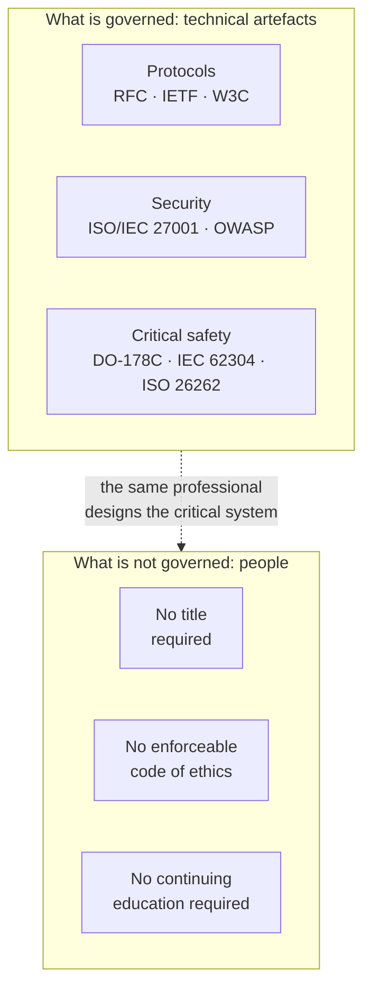
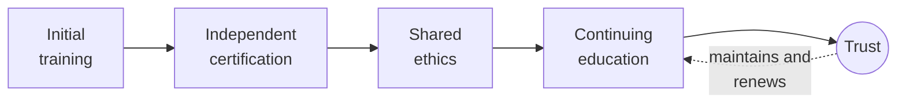
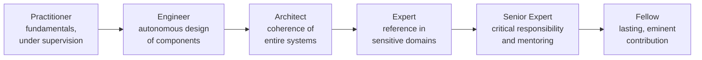

# White Paper
## Towards progressive recognition of the computing profession

*International Order of Information Technology Experts (OEI) — International Founding Movement — Version 4*

---

> **Preliminary note on the organisation's status.** The International Order of Information Technology Experts (OEI) is, at this stage, a *founding movement* resting on an *association*. It is not a professional order in the legal sense of the term: a professional order is created by law, within the framework of a regulated profession with reserved acts. No private organisation can claim that status for itself. The word "Order" is used here as a working name and as a horizon, not as an acquired legal title. This clarification, consistent with our glossary and our bylaws, is repeated throughout this document wherever necessary — not as rhetorical caution, but because it lies at the heart of our intellectual honesty.

---

## Personal preface by the author

I did not write this White Paper because computing lacks recognition. Computing is everywhere. It sits at the heart of banks, hospitals, transport, industry, public administrations, and now the artificial intelligence systems that shape a growing share of our collective decisions.

I wrote this White Paper because a paradox seems increasingly clear to me. We live in a world where software is subject to standards, audits, and ever stricter security and compliance requirements. Yet the women and men who design these systems still practise a profession whose contours remain largely undefined. Anyone can present themselves as an expert. Skill levels vary enormously. Responsibilities are sometimes diluted. Ethical obligations are rarely formalised.

Over the course of my career as an engineer, developer, software architect and then technical lead, I have had the opportunity to work on financial systems, critical platforms and international projects where a single software error could have serious consequences for thousands of people. There I discovered a simple reality: when software becomes infrastructure, the nature of the profession of those who build it changes.

The goal of this document is not to create an artificial barrier to entry into the profession. Nor is it to mechanically replicate the models of other regulated professions. The ambition is more fundamental. It is about opening an international discussion on how our profession can fully take ownership of its role in modern society — a profession capable of setting its own standards, promoting technical excellence, passing on its knowledge, and collectively taking responsibility.

I am convinced that the decades ahead will see computing become one of the most defining disciplines of our civilisation. Digital systems are no longer mere tools; they have become infrastructures of trust. This evolution places an obligation on us.

This White Paper does not provide all the answers. It is above all an invitation to reflection, debate and action. I hope it will contribute, even modestly, to the emergence of a stronger profession, more responsible and more aware of its role in the world.

Yann Deungoué
Software Architect
Founder of the International Order of Information Technology Experts (OEI) initiative

---

## About the author

Yann Deungoué is a software engineer and architect. Over the course of his career — as a developer, then architect, then technical lead — he has designed, built and evolved financial systems, critical platforms and international projects, in environments where the reliability, security and compliance of software are not options but first-order requirements. It is from this hands-on practice, in contact with systems whose failure can affect thousands of people, that the conviction behind this White Paper was born: when software becomes infrastructure, the profession of those who build it changes in nature and calls for a responsibility commensurate with its effects.

Based in Switzerland and working in the financial sector, he founded the International Order of Information Technology Experts (OEI) initiative to open, at an international scale, a discussion on the progressive recognition and structuring of the computing profession. To that end, he advocates a measured, non-alarmist approach, focused on critical systems and mindful of preserving the openness, creativity and inclusion of talent from all backgrounds that have made the discipline what it is.

*A fuller biographical note, together with a portrait of the author, will be added before the final version goes to print.*

---

## Acknowledgements

This White Paper owes a great deal to those who, in one way or another, helped it mature. I thank the first readers and reviewers who agreed to examine these pages without indulgence, and whose objections mattered as much as their encouragement; the colleagues, engineers, architects, security officers and teachers with whom, over the years, the convictions expressed here took shape; the computing professional community as a whole, whose openness and intellectual generosity remain, in my view, a model to preserve rather than constrain. My gratitude goes finally to those close to me, whose patience and support made possible work carried out alongside a demanding job. As this document is a first contribution meant to be enriched, the most important acknowledgements are no doubt the ones I will owe, in future versions, to the contributors yet to come.

---

## Institutional preface

Electricity transformed the twentieth century; software is transforming the twenty-first. This sentence, which opens our manifesto, is not a figure of speech. It describes a material shift. In less than two generations, computer code has moved from being a specialised calculation tool to becoming the connective tissue of modern societies. It regulates air traffic, adjusts radiotherapy doses, executes stock market orders, balances power grids, authenticates identities, distributes water and energy, and mediates a growing share of human relationships. Where there used to be machines, there are now programs; and behind these programs, professionals whose technical decisions engage, often without anyone measuring it, the safety and interests of a great many people.

This White Paper starts from a simple, verifiable observation: the technical artefacts of computing are among the most rigorously standardised in the world, but the profession that designs them is almost not standardised at all. Network protocols, exchange formats, cryptographic algorithms, and software safety standards are the subject of public, revised, tested and enforceable specifications. Access to the profession that implements them, however, remains entirely open in most countries: no requirement for certified competence, no enforceable shared code of ethics, no obligation for continuing education. This imbalance is not necessarily a scandal — it is the product of a fast-moving and creative history. But it has become an anomaly that must be named, documented and, progressively, corrected.

We do not claim to offer a turnkey solution, nor to impose a uniform framework on professions whose diversity is their strength. Writing a showcase website does not require the same guarantees as designing the embedded software of a cardiac pacemaker. Our purpose is targeted, graduated, and deliberately modest in its immediate claims: to open a collective effort, establish a shared vocabulary, propose a framework and a code of ethics, and build the credibility that will one day, in countries where the legal framework allows it, make a more formal recognition conceivable. This document is not an endpoint. It is a beginning, offered to the criticism of those — academics, security officers, engineers, digital-law lawyers, field practitioners — whose feedback will make it better.

---

## About the OEI

*The International Order of Information Technology Experts (OEI) is a founding movement, resting on an association, and not a professional order in the legal sense of the term (see the preliminary note). Its purpose can be summed up in a vision, a mission and a set of values.*

### Vision

A world in which the professionals who design, develop and operate the digital systems our societies depend on — healthcare, aviation, energy, finance, public administration — practise their craft with a level of competence, ethics and responsibility that matches the stakes they carry.

### Mission

To defend the public interest by promoting responsible, ethical, secure and sustainable computing, and to progressively secure recognition of the computer expert profession as a high-responsibility profession, equipped with:

- a shared code of ethics;
- a shared competency framework;
- a requirement for continuing education;
- credible representation with institutions, universities and companies.

### Values

Our motto — **"Competence. Ethics. Responsibility."** — sums up the spirit of the movement. We express it through five values that guide our work and our governance.

- **Competence.** We place genuine, verifiable mastery, maintained throughout a career, above titles, labels and appearances.
- **Ethics.** We treat professional ethics — data protection, honesty, refusal of fraudulent or deceptive practices — as a first-order professional requirement, not a nice-to-have.
- **Responsibility.** We hold that whoever designs a critical system answers for their technical choices, and never hides behind a tool, a machine or an automated system.
- **Independence.** We build our legitimacy, our frameworks and our assessments away from commercial interests, particularly software vendors, from whom we intend to remain distinct.
- **Openness.** We stand for a profession that welcomes talent from all backgrounds, that is transparent in its processes, and we set requirements only where collective safety justifies them.

### Name, structure and international ambition

The International Order of Information Technology Experts (OEI) is the name of the *movement*: the one that carries the vision set out in this White Paper and brings together its founding members. It must not be confused with the name of the *legal entity* that hosts it. To avoid any ambiguity with legally constituted professional orders — a question several reviewers rightly raised with us — the association carrying the movement will be registered under a distinct institutional name, of the form **OEI Foundation** or **International Institute for Computing Accountability**, with the explicit statement "carrying the International Order of Information Technology Experts movement." This two-tier structure allows the legal entity to remain neutral and unambiguous, while the movement retains the name that carries its vision and symbolic memory. The final legal name will be settled with the support of legal counsel, before any trademark filing; until then, this White Paper systematically uses the full formula *International Order of Information Technology Experts — International Founding Movement*.

This same demand for clarity applies to our geographic ambition. The OEI is designed, from the outset, as an *international* initiative: this White Paper explicitly calls for "opening an international discussion on how our profession can fully take ownership of its role." But an international ambition does not erase legal reality: the registered office, the association's legal name and its territorial representations will, as it develops, need to be distinguished — and coordinated — country by country, in keeping with local legal frameworks (see also Annex A). The OEI acronym remains unchanged; it is the institutional framework around it that will progressively take shape.

---

## Executive summary

*This summary distils the essence of the White Paper in a few pages: the problem, the vision, the proposals, some order-of-magnitude figures, the roadmap and the expected benefits. It can be read on its own and distributed independently; the body of the document develops and substantiates each of these points.*

### The problem

Computing is today one of the most rigorously standardised fields in the technical world. The protocols that run the Internet (IETF RFCs), Web standards (W3C), security standards (ISO/IEC 27001, OWASP recommendations) and safety frameworks for critical systems (DO-178C for embedded aviation software, IEC 62304 for medical devices, ISO 26262 for automotive) meticulously govern technical artefacts. Yet in the vast majority of countries, access to the profession that designs these systems remains entirely open: no requirement for certified competence, no enforceable shared code of ethics, no obligation for continuing education. Anyone can present themselves as an expert.

This paradox creates a gap: artefacts are governed, people are not. Yet the quality and safety of a system do not depend solely on the compliance of its components; they depend on the judgment, trade-offs and integrity of the professionals who assemble them. This is a collective blind spot, all the more concerning given that software's effects on the world have changed scale.

### Why now

Three concurrent transformations make this gap more problematic than it was twenty years ago:

- **Generative artificial intelligence** is transforming the very nature of software work and shifting value away from producing code towards the ability to specify, verify and take responsibility for a system. A machine can propose; a professional must answer.
- **Cybersecurity** has become a matter of collective safety: hospitals, local authorities, energy operators and supply chains are now among the targets. The regulatory push is accelerating (NIS2, DORA, Cyber Resilience Act); the structuring of the profession lags behind.
- **Global economic and social pressure** (price competition, precarious employment, the proliferation of vendor-tied commercial certifications) blurs the picture and makes it hard, for employers and public authorities alike, to distinguish genuine expertise from its imitation.

### The vision

Our thesis can be stated in one sentence: software has become a matter of public interest, comparable in its effects to energy or transport infrastructure, and this reality must be reflected in how the profession that produces it is organised.

We are not proposing to regulate all digital professions uniformly — writing a personal website does not require the same guarantees as designing embedded medical software. We advocate a *targeted, progressive* approach, summed up in one guiding principle:

> Anyone taking on technical responsibility for a critical system should meet minimum requirements of competence, continuing education and professional ethics.

### Who is a computer expert?

We have been asked this question directly, and we must answer it plainly rather than leave it hanging. A computer expert is not defined by a degree alone, seniority alone, or mastery of a commercial product. Their expertise results from a verifiable combination of knowledge, experience, demonstrated achievements, responsibility genuinely exercised, capacity for judgment in complex situations, continuing education, and commitment to professional ethics. It is this definition, operationalised through the Competency Framework (see section 10), that distinguishes lasting professional expertise from mere apparent productivity or commercial certification — and that answers both the incidents mentioned above and the school-curriculum paradox: knowing how to write code, even learned young, is not the same as bearing this responsibility.

### What we propose to build

1. **A competency and expertise-level framework**, transparent and public, describing what a computer expert is according to a graduated scale (Practitioner, Engineer, Architect, Expert, Senior Expert, Fellow).
2. **A shared code of ethics**, inspired by high-responsibility professions: data protection, refusal of fraudulent practices, disclosure of conflicts of interest, documentation of technical decisions.
3. **A certification framework independent of commercial vendors**, built with academic partners, to distinguish lasting professional competence from mere mastery of a product.
4. **A requirement for continuing education**, modelled on the health professions, organised by major domains (AI, cybersecurity, cloud, regulation, ethics, digital sustainability).
5. **An independent observatory** regularly publishing the actual state of the profession.

### Some order-of-magnitude figures

Precise data on the computing profession is scattered and methodologically fragile; we therefore rely on orders of magnitude, flagging their estimated nature.

- According to commonly cited professional estimates, the number of software developers worldwide runs into the **tens of millions**, and it grows year after year. In most countries, none of these professionals is required to hold a title or abide by enforceable ethics rules in order to practise.
- The annual cost of cybercrime worldwide is frequently estimated in the **trillions of dollars**, with considerable uncertainty depending on the scope and methods used. The upward trend, however, is a matter of consensus.
- The artificial intelligence technology market is experiencing **rapid growth**, in double digits according to most sector analyses, which correspondingly expands the scope of decisions entrusted to automated systems.
- Major software incidents illustrate telling orders of magnitude: a deployment failure cost a financial firm **around 440 million dollars in under an hour** in 2012; a faulty security-software update caused, in 2024, the outage of **roughly 8.5 million devices** worldwide within a few hours, according to the operating-system vendor concerned.
- The **digital dependency** of societies — a handful of cloud providers, a handful of universal libraries, a handful of components deployed identically on millions of machines — concentrates risk: a failure at a single point can now spread globally.

These figures measure the scale of the problem; they do not prove that a professional organisation would mechanically reduce cybercrime — no organisation can stop a determined attacker from acting. They do show, however, that the competence, continuing education and accountability of professionals have become essential components of digital resilience: it is on this more modest and more honest register, rather than a promise of mechanical reduction, that our expected contribution lies.

### The roadmap

We progress through *sequential milestones* rather than calendar deadlines: legal and identity lock-in; minimum viable documentary foundation; public presence; complete body of work (ethics, framework, charters); first circle of credible contributors; broader recognition. Each milestone conditions the next. Recognition cannot be built before the body of work, nor the body of work before a shared vocabulary.

### Expected benefits

For **professionals**: recognition of genuine competence, protection against a race to the bottom, legible career markers. For **employers and clients**: reduced information asymmetry, safer recruitment, greater value placed on teams that invest in their competence. For **society**: more quality, security, resilience and trust in the systems on which health, finance, energy and public services depend.

### What we are not

We are not a professional order in the legal sense; we do not have the power to create reserved acts or to condition access to the profession, and no private organisation can claim that status for itself. We are a founding movement, resting on an association, building a body of work. If this body of work acquires sufficient legitimacy, it may serve as a basis for future discussion with universities, companies and, where relevant, public authorities, in countries where the legal framework allows it.

---

## 1. Why this document, why now

One could object that the debate on the professionalisation of computing is an old one, and that it has never succeeded. That is true, and it is precisely why it must be taken up again on new terms. Conditions have changed. Three concurrent transformations make the current gap more problematic than it was twenty years ago.

The first is the emergence of generative artificial intelligence in the very production of software. Tools capable of writing, completing and correcting code are deeply changing the nature of the work and the definition of competence. They shift value: less towards producing lines of code, more towards the ability to specify, verify, arbitrate and take responsibility for a system. This shift makes it all the more necessary to have a framework that distinguishes genuine expertise from mere apparent productivity, and that reminds us that a machine can propose, but a professional must answer. The question of human responsibility, far from fading, becomes central.

The second is the transformation of cybersecurity into a matter of collective safety. Cyberattacks no longer target only commercial data; they strike hospitals, local authorities, energy operators, supply chains. The WannaCry ransomware, in 2017, disrupted part of the British health service; the same year, the NotPetya attack spread well beyond its initial targets, notably paralysing the systems of the shipping company Maersk. These episodes showed that a software failure can have system-wide effects, out of all proportion to the initial incident. Legislators have understood this: the European Union has adopted frameworks such as the NIS2 directive for the resilience of essential infrastructure, the DORA regulation for the financial sector, and the Cyber Resilience Act for the security of digital products. The regulatory push is accelerating; the structuring of the profession lags behind.

The third transformation is economic and social. The globalisation of computing work has created price pressure and precarious employment not seen in comparable regulated professions. The proliferation of commercial certifications, often tied to a vendor and its products, blurs the picture: they attest to mastery of a tool, rarely to a transferable, lasting professional competence. The result is an information asymmetry that is hard for employers, clients and public authorities to correct: how, in an opaque market, can genuine expertise be told apart from its imitation? A profession that evolves as fast as medicine, but that has neither its code of ethics nor its requirement for continuing education, is exposed to a double loss: of quality for society, and of recognition for its members.

This document exists to lay out these observations in an orderly way, to separate fact from opinion, and to propose a path forward. It is addressed first to the profession itself, then to academic institutions and companies, and finally — but only once credibility has been patiently built — to public authorities.

## 2. A brief history of the computing profession

Understanding why computing is not structured as a profession requires going back to its youth. Unlike medicine or law, whose professional bodies formed over centuries, computing is younger than a human lifetime. The first programmable general-purpose computers date from the 1940s; the discipline formed on the move, carried by a series of breakthroughs rather than by slow institutional sedimentation.

Its founding figures come from different worlds: mathematicians, physicists, electronics engineers, logicians. Alan Turing formalised the notion of computability as early as 1936; Grace Hopper developed one of the first compilers and helped give rise to human-readable languages, opening computing up beyond machine designers. As hardware became commonplace, the centre of gravity shifted towards software — and with it, complexity. By the late 1960s, practitioners were finding that producing reliable programs was far harder than expected: projects overran their budgets, accumulated defects, sometimes failed entirely. It was from this diagnosis that the expression "software crisis" emerged, at a NATO conference held in Garmisch in 1968, along with the call for genuine *software engineering*: applying the methodical rigour of engineering to the production of code.

The ambition was sound, but it ran into a tension that has never been resolved. Classical engineering rests on stable physical laws, characterised materials, and proven safety margins. Software, by contrast, is immaterial, infinitely malleable, and its complexity grows without the physical constraints that bound a bridge or an engine. This plasticity is its strength — it explains the extraordinary speed of digital innovation — but it has also nurtured a professional culture reluctant to standardise people. Individual talent, self-teaching, the ability to learn quickly have always been valued there more than a degree or a title. Many of the field's most influential contributors never followed a formal computing curriculum. This openness is a precious asset, and we do not intend to give it up.

It must be said clearly, because it shapes our proposal: the absence of barriers to entry has been a driver of innovation and inclusion. It allowed talent from varied backgrounds to contribute, and it avoided the entrenched positions that freeze certain closed professions. Our thesis is not that this freedom was a mistake. It is that, within a precise scope — that of critical systems — the social cost of the total absence of requirements has become greater than the benefit of unlimited openness. The profession has matured; its effects on the world have changed scale. It is time for its structuring to catch up with this transformation, carefully and without disowning its past.

## 3. Software as critical infrastructure

That software can kill, ruin or paralyse is not a theoretical hypothesis. It is a documented fact, illustrated by a series of incidents that have become textbook cases, studied in engineering curricula around the world. Recalling them is not sensationalism: they constitute empirical proof that certain software systems do belong to the category of critical infrastructure, in the sense of our glossary — systems whose failure can lead to serious consequences for people's safety, the economy, or the operation of essential infrastructure.

In **healthcare**, the Therac-25 radiotherapy machine, in the mid-1980s, delivered massive radiation overdoses to several patients, causing deaths and severe injuries. The investigation found that the cause was not a faulty part but a set of software defects — a race condition between tasks, excessive trust placed in the software after hardware safety locks were removed, and inadequate handling of error states. This case remains, forty years on, the reference for teaching that a software defect can have lethal consequences, and that the safety of a system is never reducible to that of its hardware components.

In **aviation**, the maiden flight of Ariane 5, in 1996, ended with the destruction of the launcher a few seconds after lift-off. The cause: the reuse of a software module inherited from Ariane 4, in which converting a floating-point value into a shorter integer format caused an unhandled overflow. More recently, the two Boeing 737 MAX accidents, in 2018 and 2019, cost 346 lives; investigations implicated an automatic trim system (MCAS) that relied on a single data source, whose behaviour had not been properly documented or communicated to flight crews. These tragedies illustrate a recurring lesson: it is not always the most sophisticated algorithms that fail, but implicit assumptions, specification gaps, and poorly defined areas of responsibility.

In **finance**, the firm Knight Capital lost around 440 million dollars in under an hour, in 2012, following the faulty deployment of automated trading software that placed erroneous orders at an uncontrollable pace — an incident that nearly brought down the company. In **energy**, the major power outage that struck north-eastern North America in 2003, cutting power to tens of millions of people, was worsened by a software defect in the alarm system of a control centre, which prevented operators from noticing in time that the situation was deteriorating. Finally, in 2024, a simple faulty update to a widely deployed security software caused, according to the operating-system vendor concerned, the outage of around 8.5 million devices worldwide within a few hours — grounding aircraft, disrupting hospitals, banks and administrations. This episode made tangible a reality experts have long called *systemic dependency*: a single component, present everywhere, becomes a point of failure at a planetary scale.

What connects these incidents, across such different sectors, is that none of them was inevitable. Each involves chains of human decisions: architecture choices, timeline trade-offs, insufficient testing procedures, diluted responsibilities. This is precisely what the disciplines governing critical systems seek to discipline — and this is where the gap lies, which we will return to, between the rigour imposed on artefacts and the total freedom left to people.

That said, one must guard against too quick a reading of these episodes, which would amount to equating a major outage with individual incompetence. None of the cases cited above demonstrates a lack of technical competence on the part of the professionals involved: the investigations point, depending on the case, to specification gaps, architecture choices that look questionable only in hindsight, insufficient testing, economic constraints, failing governance, or responsibility diluted across several teams — rarely a simple error that better individual competence alone would have prevented. It is precisely this observation that grounds our thesis: technical competence, even where genuine, is not enough; it must be embedded in a collective framework of governance, ethics and the ability to flag risks, without which the best individual competence remains powerless against organisational failures.

## 4. New risks: AI, cybersecurity, systemic dependency

To the classic risks of critical software are now added risks of a new nature, which call for competencies and vigilance that the profession has not yet collectively acquired.

The first stems from the **spread of artificial intelligence** into decision-making systems. Machine-learning models are not programmed in the classical sense: they are trained on data, and their behaviour emerges from this training rather than from an explicit specification. This produces unprecedented properties — opacity of decisions, sensitivity to biases present in the data, unpredictable behaviour outside the training domain, difficulty guaranteeing a reproducible result. When such systems are involved in screening job applications, granting credit, assisting medical diagnosis or moderating content, the question of accountability becomes acute. The notion of *responsible AI*, as we define it — transparency, fairness, security and human accountability — is not a nice-to-have: it is an engineering requirement. Legislators are beginning to write it into law, as with the European regulation on artificial intelligence, which grades obligations according to the level of risk. But a piece of legislation does not train practitioners: professionals capable of implementing it with discernment are still needed.

The second risk is **cybersecurity**, now inseparable from the very design of systems. Software vulnerabilities are no longer isolated incidents but a structural phenomenon. The Heartbleed flaw, discovered in 2014 in a ubiquitous cryptographic library, exposed the data of millions of servers; the Log4Shell vulnerability, in 2021, affected a logging library so widely used that it took months to catalogue all its uses. These episodes reveal a deep dependency on shared software components, often developed and maintained by a handful of volunteers, on which an immense share of the digital economy nonetheless depends. The attempted introduction of a backdoor into a widely distributed compression utility, narrowly foiled in 2024, showed that this software supply chain constitutes an attack surface in its own right. Securing a system is no longer just about protecting its perimeter: one must understand, trace and control the whole of its dependencies.

The third risk, a cross-cutting one, is **systemic dependency** itself. The pooling of infrastructure — a handful of cloud providers, a handful of universal libraries, a handful of security software deployed identically on millions of machines — brings enormous efficiency gains, but concentrates risk. A failure at a single point now spreads globally, as shown by the global outage of 2024 mentioned above. This question connects to that of *digital sovereignty*: the ability of a state, an organisation or an individual to control its infrastructure and technology choices without excessive dependence on third parties. We do not approach this issue from an ideological angle, but from that of resilience: a system whose components and points of concentration are not under control is a system whose risk is not under control.

These three risks share a common denominator: they exceed the competence of a single individual and call for a shared professional culture — methods, ethics, a continuous updating of knowledge. This is exactly what an organised profession can provide.

## 5. Green computing and digital sustainability

An issue long neglected is now becoming pressing: the environmental footprint of digital technology. Computing was initially seen as a "clean," immaterial technology, in contrast to heavy industry. This image is misleading. Behind the apparent immateriality of software lie energy-hungry data centres, global telecommunications networks, and above all a considerable flow of equipment whose manufacture consumes scarce resources and significant energy.

Available estimates put the share of digital technology at around a few percent of global greenhouse gas emissions — an order of magnitude often compared to that of air travel — and this share is growing. We remain cautious about precise figures, which vary depending on methodology and scope, but the underlying trend is not in dispute: demand for computing is growing rapidly, driven notably by the rise of artificial intelligence, whose training and operation of large models are particularly energy- and hardware-intensive. One point on which serious analyses agree: the largest share of the impact comes from manufacturing terminals and equipment, more than from their electricity consumption alone during use. This means that extending the lifespan of hardware and restraint in equipment turnover matter at least as much as the energy efficiency of data centres.

This is where the professional's responsibility comes into play, because many seemingly technical decisions have direct environmental consequences. A poorly designed software architecture can needlessly multiply computing and storage needs. Software whose requirements grow without necessity — sometimes called "bloatware" — pushes towards the premature replacement of still-functional hardware, generating avoidable electronic waste. Conversely, restrained design, optimised processing, right-sized infrastructure, and considered choices of computing locations can significantly reduce the footprint, often while improving performance and cost along the way. *Green computing*, as we define it — the set of practices aimed at reducing the environmental footprint of digital systems — is therefore not a separate field reserved for specialists: it is a cross-cutting dimension of the profession, on the same footing as security.

Frameworks and communities are emerging to support this requirement, such as work on software eco-design, application-footprint measurement, or principles championed by collectives dedicated to sustainable software. Public authorities and regulators are also taking up the issue, with growing obligations to measure and reduce digital footprints. We believe digital sustainability should be explicitly included in the profession's competency framework and code of ethics: not as an imposed constraint, but as a marker of professional quality. Designing an efficient system also means designing a lean one.

## 6. The paradox: standardised systems, unregulated profession

We now reach the core of our argument. Computing displays a striking singularity: few fields of human activity have so thoroughly standardised their technical objects, and so little structured access to the profession that produces them.

The diagram below sums up this imbalance: on one side, a dense and enforceable stack of technical requirements; on the other, an almost total absence of requirements on people — even though it is often the same professional on both sides.

Consider first the scale of technical standardisation. Digital communications rest on thousands of public, regularly revised specifications — the RFCs published by the IETF for Internet protocols, W3C standards for the Web, ISO and IEC standards for countless aspects of software and data. Security has its own frameworks: the ISO/IEC 27001 standard for information security management systems, OWASP recommendations for application security, public vulnerability catalogues and their scoring systems. High-criticality domains go further still: the DO-178C standard governs embedded aviation software and imposes rigorous traceability between requirements, code and tests; the IEC 62304 standard governs the software lifecycle of medical devices; the ISO 26262 standard addresses the functional safety of automotive systems; the generic IEC 61508 standard underpins an entire family of requirements for safety-related systems. In these sectors, a software component cannot be put into service without meeting detailed, auditable, enforceable requirements.

Now consider the other side. In the vast majority of countries, no qualification is legally required to design, develop or operate most of these systems. The same person can, without any recognised title or enforceable code of ethics, write the code that will process health data, orchestrate financial transactions, or control industrial equipment. Where doctors, lawyers, pharmacists or chartered accountants practise a regulated profession — access to which is conditioned by a title, a degree or registration, and governed by ethics and discipline — computing remains, in the sense of our glossary, a profession that is neither regulated nor even, everywhere, organised.

The paradox can then be stated simply: we scrupulously govern artefacts, and not at all the people who produce them. Yet the quality and safety of a system do not depend solely on the compliance of its components with standards; they depend on the judgment, trade-offs and integrity of the professionals who assemble them. Technical standards presuppose competent practitioners to apply them with discernment — but nothing guarantees this competence, or maintains it over time. This is a collective blind spot.

Should we therefore claim that computing is the only profession in this situation? No, and it would be dishonest to suggest so. Management consulting, private security outside regulated acts, data science, part of compliance consulting, and certain construction trades outside reserved acts likewise combine dense technical standardisation with largely open professional access. The singularity of computing thus comes not from being isolated, but from combining, to this degree, four factors: its presence across every sector of activity, the speed of its evolution, its capacity to propagate globally, and consequences that can be at once physical, economic and social. Few professions bring together these four traits at once; it is this combination, more than the absence of any comparison, that justifies our approach.

One must guard against an excessive conclusion. This paradox does not mean that the entire profession should be regulated, nor that barriers should be erected where openness has proven its worth. It means that a link is missing: between the technical standard, which applies to the object, and ordinary law, which applies to everyone, there is no intermediate professional framework specific to critical systems. It is this missing link that we propose to build, starting by documenting it and making it desirable, rather than claiming to impose it.

## 7. Existing international models

We are not starting from a blank page. Other professions, and computing itself in some of its components, have built forms of structuring we can draw on — carefully distinguishing what belongs to a legal status, which we do not have, from what belongs to authority earned through quality, which we can aim for.

The first model is that of **classic professional orders**: doctors, pharmacists, architects, chartered accountants. Their common feature is combining a title protected by law, an enforceable code of ethics, a disciplinary body, and a requirement for continuing education. These professions demonstrate that it is possible to reconcile high standards with lasting public trust. We draw from them their grammar — ethics, verified competence, continuing education, discipline — without claiming their legal status, which requires a law we have no power to enact.

The second model, more directly relevant, is that of **regulated engineering**, of which the Canadian example is instructive. In Quebec, the Ordre des ingénieurs du Québec governs the title of engineer, protected by law, with reserved activities in certain domains and a disciplinary mechanism. Canadian tradition even created a ritual — the iron ring given to graduating engineers — to symbolically anchor awareness of responsibility. Software engineering has been partly integrated into this framework. In the United States, a Professional Engineer licence in software engineering even existed, before the corresponding exam was discontinued for lack of a sufficient number of candidates — a sign that transposing the physical-engineering model to software still runs into cultural and practical resistance. These experiences, including their limitations, are for us a valuable source of learning: they show both the path and its obstacles.

The third model is perhaps the most inspiring for our immediate situation: that of **major technical organisations without order status**. The IEEE and the ACM, leading learned societies in electronics and computing, jointly produced a software engineering code of ethics that carries intellectual authority well beyond any legal framework. The IETF and the W3C produce the standards that run the Internet and the Web without holding any binding power: their authority rests entirely on the quality of their work, the transparency of their processes, and the voluntary support of the community. These organisations prove that strong legitimacy can be built without legal status, through merited recognition alone. This is precisely the trajectory we envisage for the OEI in its first phase: to become a reference through quality, before perhaps one day becoming an institution recognised by law.

From these models, we draw a guiding line: borrow from the orders their ethical rigour and their culture of accountability; borrow from regulated engineering its gradation of levels and its notion of sensitive activities; borrow from the major technical organisations their method — authority through quality, openness and transparency, rather than through compulsion.

## 8. Our thesis and our proposal

Our thesis can be stated in one sentence: software has become a matter of public interest, comparable in its effects to energy or transport infrastructure, and this reality must be reflected in how the profession that produces it is organised. When a computer system controls an aircraft, a hospital, a bank or an electricity grid, an error can have major human and economic consequences. Society is entitled to expect, from those who bear this responsibility, a level of competence, ethics and vigilance that matches the stakes.

From this thesis follows a proposal whose *targeted and progressive* character we want to underline from the outset, as it is what sets it apart from past attempts. We are not proposing to regulate all digital professions uniformly. Such a claim would be both unrealistic and harmful: it would stifle innovation, create entrenched positions, and rightly meet the profession's refusal. Our guiding principle is as follows:

> Anyone taking on technical responsibility for a critical system should meet minimum requirements of competence, continuing education and professional ethics.

The decisive word is *critical*, in the precise sense of our glossary. Writing a personal website, an independent video game, or an internal tool with no consequence for safety or the economy requires none of the guarantees we call for. Designing the embedded software of a medical device, the orchestration of an electricity grid, or the transactional core of a banking system falls under a different regime of responsibility. It is on this narrow scope that the requirements must bear — a scope that the Competency Framework will have the task of delimiting rigorously, avoiding both excessive extension and complacent restriction.

What we propose to build breaks down into five workstreams, developed in the following sections. First, a *competency and expertise-level framework*, transparent and public, describing what a computer expert is according to a graduated scale. Second, a *shared code of ethics*, inspired by high-responsibility professions. Third, a *certification framework independent of commercial vendors*, built with academic partners, to distinguish lasting professional competence from mere mastery of a product. Fourth, a *requirement for continuing education*, modelled on the health professions, which recognises that computing expertise becomes obsolete quickly and must be maintained. Fifth, an *independent observatory* regularly publishing the actual state of the profession.

These five workstreams are not simply juxtaposed: they form a coherent value chain, in which each link produces the material for the next, and the whole converges towards a single goal — trust. Initial training feeds certification; certification is tied to a shared code of ethics; ethics is maintained through continuing education; and it is from this whole that trust in critical systems is born, to the benefit of professionals and society alike.

We want to be clear about the purpose of this proposal, because the question has rightly been put to us: structuring a profession can be seen as an attempt to limit competition, protect a labour market, or restrict access to the profession — a corporatist reflex that professional orders have sometimes embodied in the past. This is not our logic, and we set out this hierarchy without ambiguity:

1. protection of the public;
2. trust in the systems our societies depend on;
3. professional quality;
4. recognition of experts.

The recognition and protection of professionals — clearer career paths, the legitimate right to refuse dangerous instructions, protection against the misappropriation of expertise — are a desirable consequence of this structuring, not its primary purpose. It is this hierarchy, and not the reverse, that sets our approach apart from a corporatist undertaking.

It is worth repeating what we are not. We are not a professional order in the legal sense; we do not have the power to create reserved acts or to condition access to the profession. We are a founding movement, resting on an association, building a body of work. If this body of work acquires sufficient legitimacy, it may serve as a basis for future discussion with universities, companies and, where relevant, public authorities, in countries where the legal framework allows it. We are not seeking to erect an artificial barrier or a monopoly, but to improve quality, transparency and trust — for the benefit of professionals as much as of society.

## 9. Proposed governance

An organisation that claims to promote rigour and ethics must itself be exemplary in how it operates. The OEI's governance follows three principles: institutional restraint — creating a body only once it becomes necessary; transparency — making processes and outputs public; and prevention of conflicts of interest, particularly with regard to commercial vendors from whom we want to remain independent.

The initial legal form is that of an *association*, with bylaws, a general assembly and a board of directors. This choice — a French "loi 1901" association or an association within the meaning of Articles 60 et seq. of the Swiss Civil Code — offers a lightweight legal basis, with no minimum capital, suited to a nascent movement. It does not preclude more ambitious forms the organisation might later take should its recognition broaden; but it constitutes a realistic and immediately operational starting point. The precise choice of jurisdiction, which carries tax and liability consequences, must be settled with the support of a legal professional.

The general assembly brings members together and holds sovereignty over direction, accounts and the election of the board of directors. The board administers the association and elects from among its members an executive committee — chair, vice-chair, general secretary, treasurer. The composition of members reflects the project's progressive maturity: *founding members*, present before the first broad public recognition; *accredited members*, who will meet competence and ethics criteria once the certification framework is operational; *associate members*, individuals or organisations supporting the mission without yet meeting accreditation criteria; and *honorary members*, invited as a mark of honour for their contribution to the field. This gradation matters: it allows the OEI to welcome supporters today without pretending to accredit members against criteria that do not yet exist. Accreditation cannot be granted before defining what it attests to.

The substantive work is entrusted to thematic *councils* — specialised working groups on ethics, cybersecurity, artificial intelligence, cloud, green computing, training, architecture — tasked with producing public recommendations subject to the board's approval. These councils are the intellectual engine of the organisation; it is through the quality of their work, following the example of the major technical organisations discussed above, that our legitimacy will be built. An *observatory* function is attached to them, tasked with regularly publishing data on the state of the profession.

Two bodies are intended to come into being only at an advanced stage of maturity, and we wish to state this clearly so as not to suggest powers we do not exercise. The member *accreditation* mechanism presupposes that the Competency Framework has been finalised; it will be activated only at that point. The *disciplinary chamber*, tasked with examining breaches of the code of ethics among accredited members, can function only once the certification and accreditation framework is itself mature and beyond question. Instituting discipline without a solid foundation would be illegitimate; we rule that out for ourselves. Finally, in all its communications, the organisation must state its associative status clearly and avoid any confusion with a legally constituted professional order — a rule our bylaws set out in black and white.

## 10. Certification framework and levels

Certification is the most delicate workstream, because it is the one where the risk of reproducing the very shortcomings we criticise is greatest. The market is already saturated with certifications; many attest to mastery of a particular commercial product rather than a transferable, lasting professional competence. Our ambition is precisely to propose an *independent certification*, in the sense of our glossary: issued by the organisation or its academic partners, and not tied to a commercial software vendor.

Before detailing this scale, a common confusion must be cleared up, one that was in fact flagged to us by a reviewer from outside the field: teaching the basics of coding in middle school, now widespread in many education systems, does not make every pupil a computing professional, any more than teaching science at school makes every pupil an engineer. We therefore distinguish four quite different tiers. **Digital literacy** is the general ability to understand and use digital technologies — an educational goal for everyone, not a professional status. The **computing practitioner** carries out technical activities within a defined scope, generally under supervision. The **professional** regularly practises a computing activity with identified responsibilities. The **computer expert**, finally, is the professional able to handle complex situations, produce autonomous judgment, demonstrate its validity and take responsibility for its consequences — the definition set out in this document's executive summary.

The foundation of this framework is a scale of *expertise levels*, which our glossary sets out as follows: Practitioner, Engineer, Architect, Expert, Senior Expert, and Fellow. This progression is not a hierarchy of prestige but a gradation of responsibility and autonomy, which can be read as the professional life cycle of the computer expert: each level corresponds to knowledge, demonstrated skills and verifiable experience that deepen progressively.

The Practitioner masters the fundamentals and works under supervision; the Engineer designs and implements components autonomously; the Architect takes responsibility for the coherence of entire systems and its structuring trade-offs; the Expert and Senior Expert carry reference-level responsibility for sensitive, including critical, domains and for mentoring; the Fellow is a recognition of lasting and eminent contribution to the discipline. Each level will need to be precisely defined in the Competency Framework, associating each tier with knowledge, demonstrated skills and verifiable experience.

Three principles must govern this framework so that it does not become just another certification. The first is *independence*: the design of frameworks and their assessment must be kept away from commercial interests, which requires academic backing and strict rules to prevent conflicts of interest. The second is *validity*: a certification is only worth as much as its ability to actually measure what it claims to measure. This means favouring the assessment of demonstrated competencies — case studies, portfolio reviews, situational exercises — over mere tests of memorised knowledge, and subjecting the framework itself to regular critical evaluation. The third is *transparency*: frameworks, criteria and processes must be public, so that the value of the certification can be assessed by everyone — employers, peers, the public.

We want to be explicit about a limitation, in the interest of honesty. As long as the OEI has no legal recognition — and we have said that it does not — a certification it issues has no legal value; it does not condition access to any profession and confers no protected title. Its value, initially, will be purely that of a quality signal, in the manner of standards produced by organisations with no binding power but universally respected. This is a deliberate choice: we prefer a certification with no legal value but genuine credibility, over an impressive-sounding title with no substance. Credibility will be built through the rigour of the framework and through the recognition that universities and employers voluntarily give it. It is only at the end of this path that a more formal recognition could, eventually, be discussed.

## 11. Mandatory continuing education

Of all our proposals, the requirement for continuing education is perhaps the least contestable, as it follows directly from the nature of the profession. Few professions see their knowledge renewed as fast as computing. Languages, architectures, threats and regulatory frameworks emerge and transform within a few years. A professional who stopped learning would see their competence erode quickly — not for lack of talent, but through the obsolescence of knowledge. In this, computing resembles medicine, where continuing education has long been a recognised obligation, precisely because people's safety depends on up-to-date knowledge.

We therefore propose that *continuing education*, in the sense of our glossary — an obligation to regularly update one's skills, formalised as annual hours per domain — become a pillar of accredited membership, once that status is operational. We envisage a breakdown by major domains: artificial intelligence, cybersecurity, cloud and infrastructure, regulation, ethics, and digital sustainability. The goal is not to count hours for their own sake, but to ensure that a professional who claims a given level of expertise actually maintains the corresponding knowledge. Continuing education is the natural counterpart to certification: the latter attests to a competence at a given moment, the former guarantees it does not become obsolete.

This requirement must be designed with realism, so that it does not become a bureaucratic burden disconnected from practice. Three safeguards seem essential to us. First, the *diversity of recognised formats*: continuing education is not limited to formal courses; it also encompasses participation in standardisation work, contribution to open projects, publishing, mentoring, structured monitoring of the field. A profession that learns a great deal through practice and peer sharing must value these forms too. Second, *content independence*: as with certification, continuing education must not turn into a disguised channel for commercial promotion; content tied to a product can only make up a limited share. Finally, *proportionality*: the requirement must be higher for those working on critical systems, and lighter elsewhere, consistent with the targeted principle that governs our whole approach.

Until the accreditation framework is operational, this requirement will remain a recommendation and a voluntary commitment, not an enforceable obligation — we cannot impose what we do not yet have the mandate to oversee. But we intend, from now on, to set out its principles, document reference pathways, and lead by example within the organisation itself.

## 12. Targeted partnerships

An organisation like ours cannot succeed alone; its legitimacy will be built through its relationship with three groups of stakeholders, whose voluntary support will be the best indicator of our credibility. We approach these partnerships in a spirit of cooperation, not of capture: we seek to complement what already exists, not to compete with it.

The first partners are **universities and schools**. They train future professionals, and they hold the academic independence needed to design competency frameworks and assessment mechanisms shielded from commercial interests. A partnership with the academic world is the very condition for the credibility of our certification framework. We want to work with them concretely: co-building frameworks, providing scientific grounding for assessments, aligning with existing curricula and degrees — not to replace them, but to offer a shared language linking initial training and professional practice. Recognised institutions in computer science and engineering, in French-speaking Europe and beyond, form our first natural circle of interlocutors.

The second partners are **companies**, particularly those that design or operate critical systems. They have a direct interest in our approach: a shared framework and common ethics reduce information asymmetry in the labour market, make recruitment safer, and add value to professionals who invest in their competence. Information security officers and technical management, for their part, bring the operational grounding without which our frameworks would remain theoretical. We propose to involve them through voluntary commitments — a charter for partner companies — less binding than a code of ethics, but carrying mutual recognition.

The third partners, over the longer term, are **institutions and public authorities**. We address them last, and deliberately so. It would be presumptuous, and contrary to the honesty we display, to seek institutional recognition before having proven our seriousness. Our strategy runs the other way: build first a solid body of work and credible academic and professional partnerships, then, only then, contribute to existing public consultations on digital policy and put forward our expertise. Institutional recognition, should it come, will be the consequence of our credibility, not its precondition. We approach public authorities as a possible outcome, never as an endorsement we would claim for ourselves.

Across all these partnerships, one rule holds: to state our actual status. We are an associative movement, not a legal order, and we bind our partners only on the basis of a free and informed choice.

## 13. Roadmap

Our roadmap is deliberately designed as *sequential milestones* rather than calendar deadlines. A founding movement does not progress at the pace of an imposed schedule, but at the pace of the actual maturity of its output and the support it earns. Announcing dates that nothing guarantees would harm our credibility; we prefer to describe a logical sequence of steps, each conditioning the next.

The first milestone is *legal and identity lock-in*: constitution of the association, securing the name and domain names, trademark filing in relevant jurisdictions, and reserving a coherent online presence. This is the minimal legal building block, the one that gives the movement a formal existence and protects its name.

The second milestone is establishing a *minimum viable documentary foundation*: a locked-down glossary, a clear vision, mission and manifesto, the executive summary of this White Paper ready for immediate publication, and the association's bylaws. This foundation already largely exists; this complete White Paper is its natural continuation. Next comes the milestone of *public presence*: a first version of a website, distribution of the executive summary, and factual, rigorous communication free of polemic — because our authority will be built as much through the restraint of our language as through the solidity of our substance.

The fourth milestone is that of the *complete body of work*: beyond the White Paper, the code of ethics, the Competency and Levels Framework, and the charters intended for members, companies and universities. This is the intellectual foundation on which any future recognition will rest. The fifth milestone consists of assembling a *first circle* of credible contributors — academics, security officers, technical management, digital-law lawyers — approached first for occasional opinions and reviews, never for immediate membership. The formation of an informal advisory council will precede any permanent structure.

The final milestone is that of *broader recognition*: formalised partnerships with universities and schools, participation in existing public consultations on digital policy, and publication of a regular report on the state of the profession by the observatory function. It is only at this stage that the question of a more formal institutional recognition can legitimately be raised, in countries where the legal framework allows it. We insist on the order of these milestones: each presupposes the one before. Recognition cannot be built before the body of work, nor the body of work before a shared vocabulary. This discipline in progression is, in itself, a guarantee of seriousness.

## 14. Conclusion and call to action

In this White Paper, we have sought to hold together two demands that might seem contradictory: ambition and modesty. Ambition, because the observation is serious and deserves a response to match — software has become critical infrastructure for our societies, and the profession that produces it lacks the structuring this responsibility would call for. Modesty, because we know what we are and what we are not. We are not a professional order in the legal sense; we do not have that power, and no private organisation can claim that status for itself. We are a founding movement that proposes, documents and builds — patiently, openly, with no claim to an authority we do not hold.

Our proposal is targeted: not to regulate all digital professions uniformly, but to ensure that those who take on technical responsibility for critical systems can rely on a shared competency framework, a common code of ethics, independent certification and continuing education. It is progressive: it advances through milestones, each conditioning the next, without skipping steps or promising what it cannot deliver. It is open: it seeks neither monopoly nor artificial barriers, but the improvement of quality, transparency and trust — for the benefit of professionals as much as of society.

To those who might doubt the usefulness of this effort, we recall the textbook cases mentioned in this document: they are not isolated accidents but symptoms of a collective blind spot, that of a profession whose effects on the world have changed scale without its structuring keeping pace. To those who fear the profession might become closed, we answer that the very history of computing — its openness, its creativity, its inclusion of talent from all backgrounds — is an asset we intend to preserve, and that our requirements bear only on a precise scope, where the social cost of the total absence of any guarantee has become plain to see.

This document is a version 3, and it will remain a work in progress for a long time, by methodological choice: we want it to be criticised, corrected, enriched before it is treated as settled. We therefore call for contributions from academics, information security officers, digital-law lawyers, engineers and field practitioners. Whether you disagree with our diagnosis, are reserved about our proposals, or are ready to contribute to them, your voice is useful to us. Competence, ethics, responsibility: these three words are not a slogan, but a programme of work. This project is not an endpoint — it is a beginning, and it belongs to you as much as to us.

---

## The 10 commitments of the computer expert

*A condensed version of the code of ethics, meant for quick reading. Each commitment is developed in full in the complete code of ethics; in case of doubt, the latter prevails.*

1. **I place the safety of people and the public interest above any other interest**, including commercial or hierarchical interests, when they conflict.
2. **I practise only within the limits of my genuine competence** and I honestly disclose what I do not master rather than concealing it.
3. **I protect the data entrusted to me**, its confidentiality, its integrity, and the privacy of the people concerned.
4. **I design security into a system from the outset**, not as a fix added afterwards.
5. **I document my significant technical decisions**, their assumptions and their limits, so that they can be understood, verified and revisited.
6. **I disclose my conflicts of interest** and I refuse any fraudulent, deceptive or concealed practice.
7. **I answer for my technical choices** and I never hide behind a tool, a machine or an automated system to escape my responsibility.
8. **I design lean systems**, mindful of their environmental footprint and of the fair use of resources.
9. **I maintain my competence through regular continuing education**, aware that computing knowledge becomes obsolete quickly.
10. **I pass on my knowledge and respect my peers**, contributing to raising the collective standard of the profession rather than protecting an individual advantage.

---

## Founding Member Charter

*A voluntary commitment, expressed in the first person, subscribed to by anyone joining the OEI as a founding member. This charter has no enforceable legal value; it is a moral commitment and a shared declaration of intent.*

By joining the International Order of Information Technology Experts as a founding member, I commit to:

- **Serving the mission** of the movement: contributing to a progressive, targeted and honest recognition of the computing profession, for the benefit of society as much as of professionals.
- **Respecting the truth about our status**: never presenting the OEI as a legally constituted professional order, and recalling, whenever necessary, that it is a founding movement resting on an association.
- **Letting quality prevail over posturing**: building our legitimacy through the rigour of our work and the transparency of our processes, and not through titles or claims of authority we do not hold.
- **Defending the openness of the profession**: promoting rigour where it is necessary — on critical systems — without ever seeking to erect artificial barriers or protect entrenched positions.
- **Embodying the ethical commitments** we propose to the profession, leading by example through my own practice, including in continuing education and digital sustainability.
- **Preventing conflicts of interest**, particularly with regard to commercial vendors, and preserving the independence of the organisation.
- **Contributing in good faith** to the shared body of work — through review, constructive critique, production or dissemination — in a spirit of cooperation and respect for peers.
- **Welcoming disagreement**: treating criticism and disagreement as raw material for the project, not as a threat.

I subscribe to these commitments freely, aware that they bind me on my honour and that they reflect the spirit in which this movement was founded.

---

## Annex A — State of the profession around the world

*This annex offers a deliberately qualitative comparative overview of how the computing profession is structured in a few countries. The information below reflects a general and evolving situation, to the best of our knowledge and as of the date of writing; it does not constitute legal advice and must be verified and updated with the support of local specialists. The common trait across all these countries deserves to be highlighted from the outset: nowhere is computing, to date, a fully regulated profession — with its own protected title and reserved acts — the way medicine or law are.*

**France.** Computing is not a regulated profession there: no title or degree is legally required to design or operate most systems. The title of "certified engineer" ("ingénieur diplômé") is governed by the Commission des titres d'ingénieur (CTI), but it protects an academic qualification rather than an act reserved to computing. Professional and employer organisations for the digital sector exist (industry federations, learned societies), without any order-like character. In specific areas, the law imposes roles or obligations — for example, the data protection officer under the GDPR — but these are targeted regulatory roles, not a professional status for the field as a whole.

**Switzerland.** The computing profession is likewise not regulated in an order-like sense there. Training rests on a robust dual system and on titles awarded by polytechnic schools and universities of applied sciences; professional associations and sector bodies structure continuing education and vocational certifications. As in France, there is no legally protected title of computer expert, nor any order holding disciplinary power over the profession as a whole.

**Canada (and Quebec).** Canada offers the most developed example of regulated engineering. In Quebec, the Ordre des ingénieurs du Québec protects the title of engineer, provided for by law, with reserved activities in certain domains and a disciplinary mechanism; the tradition of the iron ring symbolically anchors this sense of responsibility. Software engineering has been partly integrated into this framework depending on the province. There are also professional designations specific to computing carried by associations, but they generally do not confer the same legal status as the title of engineer. No order specifically covers non-engineer computing professionals as a whole.

**United States.** Access to the profession is largely open. The Professional Engineer licence is issued at the state level and mainly concerns physical engineering; a licensing exam in software engineering did exist before being discontinued for lack of a sufficient number of candidates — illustrating the resistance to transposing the classical engineering model to software. Structuring mainly comes through leading learned societies (IEEE, ACM), whose authority is intellectual and voluntary, and through a bustling market of private certifications, often tied to vendors.

**United Kingdom.** The profession is not regulated by law there, but it has a relatively developed system of voluntary recognition. A leading professional institution, holding a royal charter, awards professional statuses (for example, a "chartered" IT professional status), and a path to "chartered" engineer status exists via the relevant national engineering body. These recognitions reward competence and ethical commitment, but they rest on voluntary participation and do not legally condition practice.

**Germany.** The title of "engineer" ("Ingenieur") enjoys a form of protection there, with variations depending on the Länder, mainly inherited from traditional engineering. The computing profession itself is not regulated in an order-like sense; it rests on a recognised dual training system and an influential national learned society in computing, which contributes to frameworks and ethics in the discipline without exercising any general disciplinary power.

**What this overview teaches us.** Despite very different institutional traditions, none of these countries has given computing a complete professional framework — protected title, enforceable ethics, discipline and mandatory continuing education — comparable to that of the health professions or law. Where structuring exists, it follows either the path of regulated engineering (Canada) or that of voluntary recognition by learned institutions (United Kingdom, United States, Germany). This finding supports our orientation: to start by building, at an international scale and through voluntary support, authority through quality, before considering, country by country and only where the legal framework allows it, a more formal recognition.

---

## Annex B — Bibliography and references

*This annex lists the standards, organisations and regulatory frameworks cited in the body of the White Paper. Each entry gives its official name and a brief description. The standard and regulatory identifiers mentioned below are stable public references; readers are invited to consult, with the bodies that publish them, the version in force at the time of reading, as standards and regulations undergo periodic revision.*

### Organisations and learned societies

- **IEEE** — *Institute of Electrical and Electronics Engineers*: a leading international learned society in electrical engineering, electronics and computing, publisher of standards and scientific publications.
- **ACM** — *Association for Computing Machinery*: an international learned society dedicated to computing, its research and its teaching.
- **IETF** — *Internet Engineering Task Force*: an open organisation that develops and publishes the Internet's technical standards as *RFC (Request for Comments)* documents.
- **W3C** — *World Wide Web Consortium*: an international standards body for Web technologies (HTML, CSS, and related protocols and formats).
- **OWASP** — *Open Worldwide Application Security Project*: an open, non-profit community producing recommendations, tools and frameworks for application security.
- **Ordre des ingénieurs du Québec (OIQ)** — a professional order governed by Quebec's Code des professions, which regulates the legally protected title of engineer, its reserved activities and its discipline.

### Reference ethics texts

- **IEEE-CS/ACM Software Engineering Code of Ethics and Professional Practice** — a code of ethics and professional practice for software engineering, jointly developed by the IEEE Computer Society and the ACM; an international reference despite carrying no binding legal value.

### Technical, security and safety standards

- **ISO/IEC 27001** — an international standard on information security management systems (ISMS), published by ISO and IEC.
- **DO-178C** — the *Software Considerations in Airborne Systems and Equipment Certification* framework, governing embedded aviation software and imposing rigorous traceability between requirements, code and tests.
- **IEC 62304** — a standard governing the software lifecycle processes of medical devices.
- **ISO 26262** — a standard addressing the functional safety of electrical and electronic systems in road vehicles.
- **IEC 61508** — a generic functional-safety standard for electrical, electronic and programmable electronic safety-related systems, the foundation of a family of derived sector-specific standards.
- **CVE / CVSS** — *Common Vulnerabilities and Exposures* (a public, standardised catalogue of security vulnerabilities) and *Common Vulnerability Scoring System* (a public system for scoring their severity).

### European Union regulatory frameworks

- **GDPR** — the General Data Protection Regulation, Regulation (EU) 2016/679, on the protection of natural persons with regard to the processing of personal data.
- **NIS2 Directive** — Directive (EU) 2022/2555, raising the common level of cybersecurity and resilience of network and information systems for essential and important entities across the Union.
- **DORA** — the *Digital Operational Resilience Act*, Regulation (EU) 2022/2554, on digital operational resilience in the financial sector.
- **Cyber Resilience Act (CRA)** — a European Union regulation on cybersecurity requirements for products with digital elements, adopted in 2024.
- **Artificial Intelligence Regulation (AI Act)** — Regulation (EU) 2024/1689, establishing harmonised rules on artificial intelligence based on a graduated, risk-based approach.

---

*This White Paper constitutes a v3.1 consolidation version, produced following an external review of version 3. It now includes, in addition to the author's personal preface, the About the author section, the About the OEI section (vision, mission, values), the stand-alone executive summary, the explanatory diagrams, the condensed version of the code of ethics, the Founding Member Charter, the international overview and the reference bibliography: a clarification of the two-tier structure between the legal entity and the movement, as well as of the international ambition (About the OEI section), an explicit operational definition of the computer expert (executive summary and section 10), an explicit hierarchy of purposes placing protection of the public ahead of professional recognition (section 8), a distinction between digital literacy and professional expertise (section 10), and nuances of causality regarding cybercrime (executive summary) and the causes of major outages (section 3), to avoid any promise or shortcut the facts do not support. The terms used follow the definitions in the OEI's founding Glossary, a reference document readers are invited to consult.*
