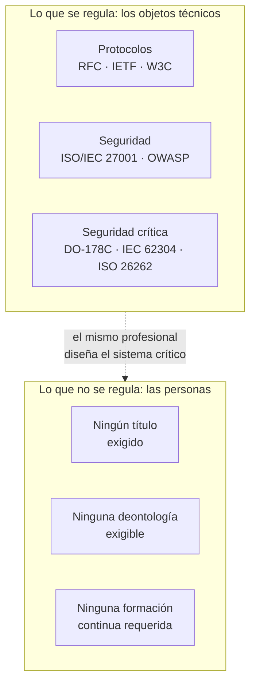
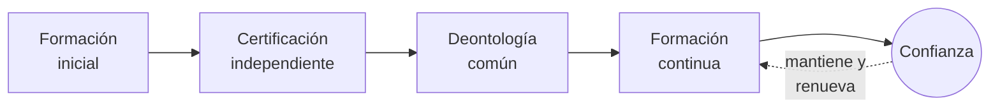
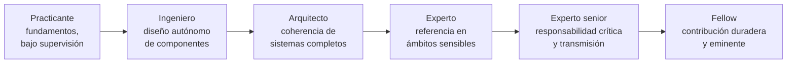

# Libro Blanco
## Por un reconocimiento progresivo de la profesión informática

*Orden de Expertos en Informática (OEI) — Movimiento fundador internacional — Versión 3.1*

---

> **Nota preliminar sobre el estatus de la organización.** La Orden de Expertos en Informática (OEI) es, en esta etapa, un *movimiento fundador* apoyado en una *asociación*. No es una orden profesional en el sentido legal del término: una orden profesional es creada por la ley, en el marco de una profesión reglamentada dotada de actos reservados. Ninguna organización privada puede autoatribuirse ese estatus. La palabra «Orden» se emplea aquí como nombre de uso y como horizonte, no como título jurídico adquirido. Esta precisión, conforme a nuestro glosario y a nuestros estatutos, se repite en este documento allí donde es necesaria, no por prudencia retórica, sino porque es el núcleo de nuestra honestidad intelectual.

---

## Prefacio personal del autor

No he escrito este Libro Blanco porque a la informática le falte reconocimiento. La informática está en todas partes. Está en el centro de los bancos, los hospitales, los transportes, la industria, las administraciones públicas y, en la actualidad, de los sistemas de inteligencia artificial que dan forma a una parte creciente de nuestras decisiones colectivas.

He escrito este Libro Blanco porque una paradoja me resulta cada vez más evidente. Vivimos en un mundo en el que el software está sometido a normas, a auditorías, a exigencias de seguridad y de conformidad cada vez más estrictas. Sin embargo, las mujeres y los hombres que diseñan estos sistemas ejercen todavía una profesión cuyos contornos siguen en gran medida sin definir. Cualquiera puede presentarse como experto. Los niveles de competencia son extremadamente variables. Las responsabilidades a veces se diluyen. Las obligaciones deontológicas rara vez están formalizadas.

A lo largo de mi carrera como ingeniero, desarrollador, arquitecto de software y luego responsable técnico, he tenido la oportunidad de trabajar en sistemas financieros, plataformas críticas y proyectos internacionales donde un simple error de software podía tener consecuencias importantes para miles de personas. Allí descubrí una realidad simple: cuando el software se convierte en infraestructura, la profesión de quienes lo construyen cambia de naturaleza.

El objetivo de este documento no es crear una barrera artificial a la entrada de la profesión. Tampoco lo es reproducir mecánicamente los modelos de otras profesiones reguladas. La ambición es más fundamental. Se trata de abrir una discusión internacional sobre la manera en que nuestra profesión puede tomar plena posesión de su papel en la sociedad moderna. Una profesión capaz de definir sus estándares, de promover la excelencia técnica, de transmitir sus saberes y de asumir colectivamente sus responsabilidades.

Estoy convencido de que las décadas venideras verán a la informática convertirse en una de las disciplinas más estructurantes de nuestra civilización. Los sistemas digitales ya no son simples herramientas; se han convertido en infraestructuras de confianza. Esta evolución nos obliga.

Este Libro Blanco no aporta todas las respuestas. Constituye, ante todo, una invitación a la reflexión, al debate y a la acción. Espero que contribuya, aunque sea modestamente, a hacer emerger una profesión más fuerte, más responsable y más consciente de su papel en el mundo.

Yann Deungoué
Arquitecto de software
Fundador de la iniciativa Orden de Expertos en Informática (OEI)

---

## Sobre el autor

Yann Deungoué es ingeniero y arquitecto de software. A lo largo de su trayectoria —como desarrollador, arquitecto y luego responsable técnico—, ha diseñado, construido y hecho evolucionar sistemas financieros, plataformas críticas y proyectos internacionales, en entornos donde la fiabilidad, la seguridad y la conformidad del software no son opciones sino exigencias de primer orden. De esta práctica de campo, en contacto con sistemas cuyo fallo puede afectar a miles de personas, nació la convicción que dio origen a este Libro Blanco: cuando el software se convierte en infraestructura, la profesión de quienes lo construyen cambia de naturaleza y exige una responsabilidad a la medida de sus efectos.

Establecido en Suiza y ejerciendo en el sector financiero, fundó la iniciativa Orden de Expertos en Informática (OEI) con el fin de abrir, a escala internacional, una discusión sobre el reconocimiento progresivo y la estructuración de la profesión informática. Defiende para ello un enfoque mesurado y no alarmista, centrado en los sistemas críticos y atento a preservar la apertura, la creatividad y la inclusión de talentos de todos los orígenes que han hecho la riqueza de la disciplina.

*Una nota biográfica más completa, acompañada de un retrato del autor, se integrará antes de la impresión de la versión definitiva.*

---

## Agradecimientos

Este Libro Blanco debe mucho a quienes, de una u otra forma, acompañaron su maduración. Agradezco a los primeros lectores y revisores que aceptaron examinar estas páginas sin complacencia, y cuyas objeciones contaron tanto como los ánimos; a los colegas, ingenieros, arquitectos, responsables de seguridad y docentes con quienes, a lo largo de los años, se forjaron las convicciones expuestas aquí; a la comunidad profesional de la informática en su conjunto, cuya apertura y generosidad intelectual siguen siendo, a mis ojos, un modelo que preservar más que constreñir. Mi gratitud va, por último, a mis allegados, cuya paciencia y apoyo hicieron posible un trabajo llevado a cabo al margen de una actividad exigente. Siendo este documento una primera contribución llamada a enriquecerse, los agradecimientos más importantes serán sin duda los que, en versiones futuras, deberé dirigir a sus futuros contribuyentes.

---

## Prefacio institucional

La electricidad transformó el siglo XX; el software transforma el XXI. Esta frase, que abre nuestro manifiesto, no es una figura retórica. Describe un vuelco material. En menos de dos generaciones, el código informático pasó de ser una herramienta de cálculo especializada a convertirse en el tejido conjuntivo de las sociedades modernas. Regula la circulación aérea, ajusta las dosis de radioterapia, ejecuta las órdenes bursátiles, equilibra las redes eléctricas, autentica identidades, distribuye el agua y la energía, y media una parte creciente de las relaciones humanas. Donde antes se veían máquinas, hoy hay programas; y detrás de esos programas, profesionales cuyas decisiones técnicas comprometen, a menudo sin que nadie lo perciba, la seguridad y los intereses de un gran número de personas.

Este Libro Blanco parte de una constatación simple y verificable: los objetos técnicos de la informática se cuentan entre los más rigurosamente normalizados del mundo, pero la profesión que los diseña casi no lo está. Los protocolos de red, los formatos de intercambio, los algoritmos criptográficos, las normas de seguridad del software son objeto de especificaciones públicas, revisadas, probadas y exigibles. El acceso a la profesión que las pone en práctica, en cambio, sigue siendo en la mayoría de los países completamente libre: sin exigencia de competencia certificada, sin deontología común exigible, sin obligación de formación continua. Este desequilibrio no es necesariamente un escándalo —es el producto de una historia rápida y creativa. Pero se ha convertido en una anomalía que hay que nombrar, documentar y, progresivamente, corregir.

No pretendemos aportar una solución llave en mano, ni imponer un marco uniforme a profesiones cuya diversidad constituye su riqueza. Escribir un sitio web vitrina no requiere las mismas garantías que diseñar el software embebido de un marcapasos. Nuestro planteamiento es focalizado, gradual y voluntariamente modesto en sus pretensiones inmediatas: abrir un proyecto colectivo, establecer un vocabulario común, proponer un referencial y una deontología, y construir la credibilidad que permitirá, algún día, en los países donde el marco jurídico lo permita, plantear un reconocimiento más formal. Este documento no es un punto de llegada. Es un comienzo, ofrecido a la crítica de quienes —académicos, responsables de seguridad, ingenieros, juristas del ámbito digital, profesionales de campo— con sus aportaciones lo harán mejor.

---

## Sobre la OEI

*La Orden de Expertos en Informática (OEI) es un movimiento fundador, respaldado por una asociación, y no una orden profesional en el sentido legal del término (véase la nota preliminar). Su razón de ser se resume en una visión, una misión y un conjunto de valores.*

### Visión

Un mundo en el que los profesionales que diseñan, desarrollan y explotan los sistemas digitales de los que dependen nuestras sociedades —salud, aviación, energía, finanzas, administración— ejerzan su profesión con un nivel de competencia, ética y responsabilidad reconocido a la altura de los desafíos que asumen.

### Misión

Defender el interés general promoviendo una informática responsable, ética, segura y sostenible, y hacer reconocer progresivamente la profesión de experto informático como una profesión de alta responsabilidad, dotada de:

- un código deontológico común;
- un referencial de competencias compartido;
- una exigencia de formación continua;
- una representación creíble ante las instituciones, universidades y empresas.

### Valores

Nuestro lema —**«Competencia. Ética. Responsabilidad.»**— resume el espíritu del movimiento. Lo desglosamos en cinco valores que guían nuestros trabajos y nuestra gobernanza.

- **Competencia.** Situamos el dominio real, verificable y mantenido a lo largo de la carrera por encima de los títulos, las etiquetas y las apariencias.
- **Ética.** Hacemos de la deontología —protección de datos, honestidad, rechazo de las prácticas fraudulentas o engañosas— una exigencia profesional de primer orden, y no un añadido decorativo.
- **Responsabilidad.** Asumimos que quien diseña un sistema crítico responde de sus decisiones técnicas, sin refugiarse jamás detrás de una herramienta, una máquina o un sistema automatizado.
- **Independencia.** Construimos nuestra legitimidad, nuestros referenciales y nuestras evaluaciones al margen de los intereses comerciales, en particular de los fabricantes de software de los que pretendemos mantenernos distintos.
- **Apertura.** Defendemos una profesión acogedora con los talentos de todos los orígenes, transparente en sus procesos, y no erigimos exigencias salvo donde la seguridad colectiva lo justifica.

### Nombre, estructura y ambición internacional

La Orden de Expertos en Informática (OEI) es el nombre del *movimiento*: el que porta la visión expuesta en este Libro Blanco y reúne a los miembros fundadores. No debe confundirse con el nombre de la *entidad jurídica* que lo alberga. Para evitar toda ambigüedad con las órdenes profesionales legalmente constituidas —una cuestión que varios revisores nos plantearon con razón—, la asociación de sostén se registrará bajo un nombre institucional distinto, con una forma como **OEI Foundation** o **Instituto Internacional de la Responsabilidad Informática**, con la mención explícita «que sostiene el movimiento Orden de Expertos en Informática». Esta estructura de dos niveles permite que la entidad legal permanezca neutra y sin ambigüedad, mientras que el movimiento conserva el nombre que porta su visión y su memoria simbólica. El nombre legal definitivo se decidirá con el apoyo de un asesor jurídico, antes de cualquier registro de marca; hasta entonces, este Libro Blanco emplea sistemáticamente la fórmula completa *Orden de Expertos en Informática — Movimiento fundador internacional*.

Esta misma exigencia de claridad se aplica a nuestra ambición geográfica. La OEI está concebida, desde su origen, como una iniciativa *internacional*: este Libro Blanco llama explícitamente a «abrir una discusión internacional sobre la manera en que nuestra profesión puede tomar plena posesión de su papel». Pero una ambición internacional no borra la realidad jurídica: la sede social, el nombre legal de la asociación y sus representaciones territoriales deberán, a medida que se desarrolle, distinguirse —y articularse— país por país, respetando los marcos jurídicos locales (véase también el Anexo A). La sigla OEI permanece inalterada; es el marco institucional que la rodea el que se precisará progresivamente.

---

## Síntesis ejecutiva

*Esta síntesis recoge en pocas páginas lo esencial del Libro Blanco: el problema, la visión, las propuestas, algunas referencias numéricas, la hoja de ruta y los beneficios esperados. Puede leerse por sí sola y difundirse de manera autónoma; el cuerpo del documento desarrolla y sustenta cada uno de estos puntos.*

### El problema

La informática es hoy uno de los ámbitos más rigurosamente normalizados del mundo técnico. Los protocolos que hacen funcionar Internet (las RFC del IETF), los estándares de la Web (W3C), las normas de seguridad (ISO/IEC 27001, recomendaciones OWASP) y los referenciales de seguridad de los sistemas críticos (DO-178C para la aeronáutica embebida, IEC 62304 para los dispositivos médicos, ISO 26262 para la automoción) encuadran minuciosamente los objetos técnicos. Sin embargo, en la inmensa mayoría de los países, el acceso a la profesión que diseña estos sistemas sigue siendo completamente libre: sin exigencia de competencia certificada, sin deontología común exigible, sin obligación de formación continua. Cualquiera puede presentarse como experto.

Esta paradoja crea un vacío: los artefactos están regulados, las personas no lo están. Ahora bien, la calidad y la seguridad de un sistema no dependen solo de la conformidad de sus componentes; dependen de los juicios, las decisiones y la integridad de los profesionales que los ensamblan. Es un ángulo ciego colectivo, tanto más preocupante cuanto que los efectos del software en el mundo han cambiado de escala.

### Por qué ahora

Tres transformaciones concomitantes hacen que este vacío sea más problemático de lo que era hace veinte años:

- **La inteligencia artificial generativa** transforma la naturaleza misma del trabajo de software y desplaza el valor de la producción de código hacia la capacidad de especificar, verificar y asumir la responsabilidad de un sistema. Una máquina puede proponer; un profesional debe responder.
- **La ciberseguridad** se ha convertido en un asunto de seguridad colectiva: hospitales, administraciones locales, operadores de energía y cadenas logísticas figuran ahora entre los objetivos. El movimiento regulatorio se acelera (NIS2, DORA, Cyber Resilience Act); la estructuración de la profesión, en cambio, sigue rezagada.
- **La presión económica y social mundial** (competencia tarifaria, precarización, proliferación de certificaciones comerciales ligadas a un producto) confunde las referencias y dificulta, tanto a los empleadores como a los poderes públicos, distinguir la experiencia verdadera de su imitación.

### La visión

Nuestra tesis se resume en una frase: el software se ha convertido en un bien de interés público, comparable por sus efectos a las infraestructuras energéticas o de transporte, y esta realidad debe traducirse en la manera en que se organiza la profesión que lo produce.

No proponemos regular de manera uniforme el conjunto de las profesiones digitales —escribir un sitio personal no requiere las mismas garantías que diseñar un software médico embebido. Defendemos un enfoque *focalizado y progresivo*, resumido en un principio rector:

> Toda persona que asuma la responsabilidad técnica de un sistema crítico debería cumplir exigencias mínimas de competencia, formación continua y deontología.

### ¿Quién es un experto informático?

Esta pregunta nos la han planteado directamente, y debemos responderla sin rodeos en lugar de dejarla en suspenso. Un experto informático no se define solo por el diploma, ni solo por la antigüedad, ni por el dominio de un producto comercial. Su experiencia resulta de una combinación verificable de conocimientos, experiencia, logros demostrados, responsabilidad efectivamente ejercida, capacidad de juicio ante situaciones complejas, formación continua y compromiso deontológico. Es esta definición, puesta en práctica por el Referencial de competencias (véase la sección 10), la que distingue la experiencia profesional duradera de la simple productividad aparente o de la certificación comercial —y que responde tanto a los incidentes mencionados anteriormente como a la paradoja escolar: saber escribir código, incluso aprendido desde joven, no equivale a asumir esa responsabilidad.

### Lo que proponemos construir

1. **Un referencial de competencias y niveles de experiencia**, transparente y público, que describa qué es un experto informático según una escala graduada (Practicante, Ingeniero, Arquitecto, Experto, Experto senior, Fellow).
2. **Un código deontológico común**, inspirado en las profesiones de alta responsabilidad: protección de datos, rechazo de las prácticas fraudulentas, declaración de conflictos de interés, documentación de las decisiones técnicas.
3. **Un marco de certificación independiente de los fabricantes comerciales**, construido con socios académicos, para distinguir la competencia profesional duradera del simple dominio de un producto.
4. **Una exigencia de formación continua**, siguiendo el modelo de las profesiones de la salud, repartida en grandes ámbitos (IA, ciberseguridad, nube, regulación, ética, sobriedad digital).
5. **Un observatorio independiente** que publique regularmente el estado real de la profesión.

### Algunas referencias numéricas

Los datos precisos sobre la profesión informática son dispersos y metodológicamente frágiles; nos atenemos, por tanto, a órdenes de magnitud, señalando su carácter estimativo.

- Según las estimaciones profesionales comúnmente citadas, el número de desarrolladores de software en el mundo se cuenta en **decenas de millones**, y crece año tras año. Ninguno de estos profesionales, en la mayoría de los países, está obligado a poseer un título o una deontología exigible para ejercer.
- El costo anual de la cibercriminalidad a escala mundial se estima con frecuencia en **billones de dólares**, con fuertes incertidumbres según los alcances y métodos empleados. La tendencia al alza, sin embargo, es objeto de consenso.
- El mercado de las tecnologías de inteligencia artificial experimenta un **crecimiento rápido**, de dos dígitos según la mayoría de los análisis sectoriales, lo que amplía en la misma medida la superficie de las decisiones confiadas a sistemas automatizados.
- Los incidentes de software mayores ilustran órdenes de magnitud elocuentes: un fallo de despliegue costó a una firma financiera **cerca de 440 millones de dólares en menos de una hora** en 2012; una actualización defectuosa de un software de seguridad provocó, en 2024, la caída de **cerca de 8,5 millones de dispositivos** en el mundo en cuestión de horas, según el fabricante del sistema operativo afectado.
- La **dependencia digital** de las sociedades —unos pocos proveedores de nube, unas pocas bibliotecas universales, unos pocos componentes desplegados de forma idéntica en millones de máquinas— concentra el riesgo: un fallo en un punto puede propagarse ahora a escala planetaria.

Estas cifras miden la magnitud del problema; no demuestran que una organización profesional haría disminuir mecánicamente la cibercriminalidad —ninguna organización puede impedir que un atacante decidido actúe. Muestran, en cambio, que la competencia, la formación continua y la responsabilidad de los profesionales se han convertido en componentes esenciales de la resiliencia digital: es en ese registro, más modesto y más honesto que una promesa de reducción mecánica, donde se sitúa nuestra contribución esperada.

### La hoja de ruta

Avanzamos por *hitos secuenciales* más que por plazos calendarios: consolidación jurídica y de la identidad; base documental mínima viable; presencia pública; corpus completo (deontología, referencial, cartas); primer círculo de contribuyentes creíbles; reconocimiento ampliado. Cada hito condiciona el siguiente. No se construye el reconocimiento antes del corpus, ni el corpus antes del vocabulario común.

### Los beneficios esperados

Para los **profesionales**: un reconocimiento de la competencia real, una protección contra el nivelamiento hacia abajo, referencias de carrera claras. Para los **empleadores y clientes**: una reducción de la asimetría de información, una contratación más segura, una valorización de los equipos que invierten en su competencia. Para la **sociedad**: mayor calidad, seguridad, resiliencia y confianza en los sistemas de los que dependen la salud, las finanzas, la energía y los servicios públicos.

### Lo que no somos

No somos una orden profesional en el sentido legal; no tenemos el poder de crear actos reservados ni de condicionar el acceso a la profesión, y ninguna organización privada puede autoatribuirse ese estatus. Somos un movimiento fundador, respaldado por una asociación, que construye un corpus. Si este corpus adquiere una legitimidad suficiente, podrá servir de base a una discusión futura con las universidades, las empresas y, en su caso, los poderes públicos, en los países donde el marco jurídico lo permita.

---

## 1. Por qué este documento, por qué ahora

Se podría objetar que el debate sobre la profesionalización de la informática es antiguo, y que nunca llegó a buen puerto. Es cierto, y es precisamente por eso que hay que retomarlo con nuevos argumentos. Las condiciones han cambiado. Tres transformaciones concomitantes hacen que el vacío actual sea más problemático de lo que era hace veinte años.

La primera es la irrupción de la inteligencia artificial generativa en la producción misma del software. Herramientas capaces de escribir, completar y corregir código modifican profundamente la naturaleza del trabajo y la definición de la competencia. Desplazan el valor: menos hacia la producción de líneas de código, más hacia la capacidad de especificar, verificar, decidir y asumir la responsabilidad de un sistema. Este vuelco hace aún más necesario un marco que distinga la experiencia real de la simple productividad aparente, y que recuerde que una máquina puede proponer, pero que un profesional debe responder. La cuestión de la responsabilidad humana, lejos de desvanecerse, se vuelve central.

La segunda es la transformación de la ciberseguridad en un asunto de seguridad colectiva. Los ataques informáticos ya no apuntan solo a datos comerciales; golpean hospitales, administraciones locales, operadores de energía, cadenas logísticas. El ransomware WannaCry, en 2017, desorganizó una parte del servicio de salud británico; ese mismo año, el ataque NotPetya se propagó mucho más allá de sus objetivos iniciales, inmovilizando en particular los sistemas de la naviera Maersk. Estos episodios mostraron que un fallo de software puede tener efectos sistémicos, desproporcionados respecto al incidente inicial. El legislador lo ha comprendido: la Unión Europea ha adoptado marcos como la directiva NIS2 para la resiliencia de las infraestructuras esenciales, el reglamento DORA para el sector financiero, o el Cyber Resilience Act para la seguridad de los productos digitales. El movimiento regulatorio se acelera; la estructuración de la profesión, en cambio, sigue rezagada.

La tercera transformación es económica y social. La globalización del trabajo informático ha creado una presión tarifaria y una precarización que no conocen las profesiones reguladas comparables. La proliferación de certificaciones comerciales, a menudo ligadas a un fabricante y a sus productos, confunde las referencias: acreditan el dominio de una herramienta, rara vez una competencia profesional transferible y duradera. De ello resulta una asimetría de información difícil de corregir para los empleadores, los clientes y los poderes públicos: ¿cómo distinguir, en un mercado opaco, la experiencia verdadera de su imitación? Una profesión que evoluciona tan rápido como la medicina, pero que no dispone ni de su marco deontológico ni de su exigencia de formación continua, se expone a una doble pérdida: de calidad para la sociedad, de reconocimiento para sus miembros.

Este documento existe para plantear estas constataciones de manera ordenada, distinguir los hechos de las opiniones, y proponer un camino. Se dirige primero a la propia profesión, luego a las instituciones académicas y a las empresas, y finalmente —pero solo cuando la credibilidad se haya construido con paciencia— a los poderes públicos.

## 2. Breve historia de la profesión informática

Comprender por qué la informática no está estructurada como una profesión supone volver a su juventud. A diferencia de la medicina o el derecho, cuyos cuerpos profesionales se formaron a lo largo de siglos, la informática tiene menos de una existencia humana. Los primeros ordenadores universales programables datan de la década de 1940; la disciplina se constituyó sobre la marcha, impulsada por una sucesión de rupturas más que por una lenta sedimentación institucional.

Sus figuras fundadoras pertenecen a mundos diferentes: matemáticos, físicos, ingenieros electrónicos, lógicos. Alan Turing formaliza ya en 1936 la noción de computabilidad; Grace Hopper desarrolla uno de los primeros compiladores y contribuye al nacimiento de lenguajes legibles por humanos, abriendo el camino a una informática que ya no está reservada a los diseñadores de máquinas. A medida que el hardware se banaliza, el centro de gravedad se desplaza hacia el software —y con él, la complejidad—. Ya a finales de la década de 1960, los profesionales constatan que producir programas fiables es mucho más difícil de lo previsto: los proyectos superan sus presupuestos, acumulan defectos, a veces fracasan por completo. De ese diagnóstico surge, en una conferencia de la OTAN celebrada en Garmisch en 1968, la expresión «crisis del software» y la reivindicación de una verdadera *ingeniería de software* (software engineering): aplicar a la producción de código el rigor metódico de la ingeniería.

La ambición era justa, pero chocó con una tensión nunca resuelta. La ingeniería clásica se apoya en leyes físicas estables, materiales caracterizados, márgenes de seguridad probados. El software, por su parte, es inmaterial, infinitamente maleable, y su complejidad crece sin las restricciones físicas que acotan un puente o un motor. Esta plasticidad es su fuerza —explica la prodigiosa velocidad de la innovación digital— pero también alimentó una cultura profesional reacia a la estandarización de las personas. El talento individual, el autodidactismo, la capacidad de aprender rápido siempre se valoraron allí más que el diploma o el título. Muchos de los contribuyentes más influyentes del sector nunca siguieron un currículo formal en informática. Esta apertura es un logro valioso, y no pretendemos renunciar a él.

Hay que decirlo con claridad, porque condiciona nuestra propuesta: la ausencia de barreras de entrada fue un motor de innovación y de inclusión. Permitió que talentos de orígenes variados contribuyeran, y evitó las rentas de situación que anquilosan ciertas profesiones cerradas. Nuestra tesis no es que esa libertad fuera un error. Es que, en un perímetro preciso —el de los sistemas críticos— el costo social de la ausencia total de exigencia se ha vuelto superior al beneficio de la apertura ilimitada. La profesión ha madurado; sus efectos en el mundo han cambiado de escala. Es hora de que su estructuración alcance, con prudencia y sin renegar de lo anterior, esta transformación.

## 3. El software como infraestructura crítica

Que un software pueda matar, arruinar o paralizar no es una hipótesis teórica. Es un hecho documentado, ilustrado por una serie de incidentes convertidos en casos de estudio, analizados en los programas de ingeniería de todo el mundo. Recordarlos no tiene nada de sensacionalista: constituyen la prueba empírica de que ciertos sistemas de software pertenecen, en efecto, a la categoría de infraestructuras críticas, en el sentido de nuestro glosario —sistemas cuyo fallo puede provocar consecuencias graves para la seguridad de las personas, la economía o el funcionamiento de infraestructuras esenciales.

En la **salud**, el equipo de radioterapia Therac-25, a mediados de la década de 1980, administró a varios pacientes sobredosis masivas de radiación, causando muertes y graves secuelas. La investigación demostró que la causa no fue una pieza defectuosa sino un conjunto de defectos de software —una condición de carrera (*race condition*) entre tareas, una confianza excesiva en el software tras la eliminación de bloqueos de hardware, una gestión insuficiente de los estados de error—. Este caso sigue siendo, cuarenta años después, la referencia para enseñar que un defecto de software puede tener consecuencias letales y que la seguridad de un sistema nunca se reduce a la de sus componentes de hardware.

En la **aeronáutica**, el vuelo inaugural del Ariane 5, en 1996, terminó con la destrucción del lanzador pocos segundos después del despegue. La causa: la reutilización de un módulo de software heredado del Ariane 4, en el que la conversión de un valor en coma flotante a un entero de formato más corto provocó un desbordamiento de capacidad no controlado. Más recientemente, los dos accidentes del Boeing 737 MAX, en 2018 y 2019, costaron la vida a 346 personas; las investigaciones señalaron a un sistema de compensación automática (MCAS) que se apoyaba en una única fuente de datos y cuyo comportamiento no había sido correctamente documentado ni transmitido a las tripulaciones. Estas tragedias ilustran una lección recurrente: no siempre son los algoritmos más sofisticados los que fallan, sino las hipótesis implícitas, los defectos de especificación y las zonas de responsabilidad mal definidas.

En las **finanzas**, la firma Knight Capital perdió cerca de 440 millones de dólares en menos de una hora, en 2012, tras el despliegue defectuoso de un software de negociación automatizada que emitió órdenes erróneas a un ritmo incontrolable —un incidente que estuvo a punto de arruinar a la empresa. En la **energía**, el gran apagón eléctrico que afectó al noreste de América del Norte en 2003, dejando sin electricidad a decenas de millones de personas, se vio agravado por un defecto de software en el sistema de alarma de un centro de control, que impidió a los operadores percibir a tiempo el deterioro de la situación. Por último, en 2024, una simple actualización defectuosa de un software de seguridad ampliamente desplegado provocó, según el fabricante del sistema operativo afectado, la caída de cerca de 8,5 millones de dispositivos en el mundo en cuestión de horas —dejando aviones en tierra, alterando hospitales, bancos y administraciones. Este episodio hizo tangible una realidad que los expertos denominan desde hace tiempo: la *dependencia sistémica*. Un componente único, presente en todas partes, se convierte en un punto de fallo planetario.

Lo que conecta estos incidentes, más allá de la diversidad de sectores, es que ninguno responde a la fatalidad. Cada uno involucra cadenas de decisiones humanas: decisiones de arquitectura, compromisos de plazo, procedimientos de prueba insuficientes, responsabilidades diluidas. Es precisamente lo que las disciplinas que regulan los sistemas críticos buscan disciplinar —y es ahí donde se juega la brecha, sobre la que volveremos, entre el rigor impuesto a los artefactos y la libertad total dejada a las personas.

Conviene, sin embargo, guardarse de una lectura demasiado rápida de estos episodios, que equivaldría a asimilar fallo mayor e incompetencia individual. Ninguno de los casos citados anteriormente demuestra una falta de competencia técnica de los profesionales implicados: las investigaciones señalan, según los casos, defectos de especificación, decisiones de arquitectura cuestionables a posteriori, pruebas insuficientes, limitaciones económicas, una gobernanza deficiente o una dilución de responsabilidades entre varios equipos —rara vez un simple error que una mejor competencia individual hubiera bastado para evitar. Es precisamente esta constatación la que fundamenta nuestra tesis: la competencia técnica, incluso siendo real, no basta; debe inscribirse en un marco colectivo de gobernanza, deontología y capacidad de señalar los riesgos, sin lo cual las mejores competencias individuales permanecen impotentes frente a fallos organizativos.

## 4. Los nuevos riesgos: IA, ciberseguridad, dependencia sistémica

A los riesgos clásicos del software crítico se suman hoy riesgos de una naturaleza nueva, que exigen competencias y una vigilancia de las que la profesión aún no se ha dotado colectivamente.

El primero se debe a la **generalización de la inteligencia artificial** en sistemas de toma de decisiones. Los modelos de aprendizaje automático no se programan en el sentido clásico: se entrenan con datos, y su comportamiento emerge de ese entrenamiento en lugar de una especificación explícita. De ello resultan propiedades inéditas —opacidad de las decisiones, sensibilidad a los sesgos presentes en los datos, comportamientos imprevisibles fuera del dominio de entrenamiento, dificultad para garantizar un resultado reproducible—. Cuando tales sistemas intervienen en la selección de candidaturas, la concesión de créditos, la ayuda al diagnóstico médico o la moderación de contenidos, la cuestión de la responsabilidad se vuelve acuciante. La noción de *IA responsable*, tal como la definimos —transparencia, equidad, seguridad y responsabilidad humana— no es un añadido decorativo: es una exigencia de ingeniería. Los legisladores empiezan a inscribirla en el derecho, como ilustra el reglamento europeo sobre inteligencia artificial, que gradúa las obligaciones según el nivel de riesgo. Pero un texto legal no forma a profesionales: aún se necesitan expertos capaces de aplicarlo con discernimiento.

El segundo riesgo es el de la **ciberseguridad**, ahora indisociable del propio diseño de los sistemas. Las vulnerabilidades de software ya no son incidentes aislados sino un fenómeno estructural. La falla Heartbleed, descubierta en 2014 en una biblioteca criptográfica omnipresente, expuso los datos de millones de servidores; la vulnerabilidad Log4Shell, en 2021, afectó a una biblioteca de registro tan ampliamente utilizada que hicieron falta meses para inventariar todos sus usos. Estos episodios revelan una dependencia profunda de componentes de software compartidos, a menudo desarrollados y mantenidos por un puñado de voluntarios, de los que depende sin embargo una parte inmensa de la economía digital. El intento de introducción de una puerta trasera en un utilitario de compresión ampliamente difundido, frustrado por muy poco en 2024, mostró que esta cadena de suministro de software constituye una superficie de ataque en sí misma. Asegurar un sistema ya no se limita a proteger su perímetro: hay que comprender, rastrear y controlar el conjunto de sus dependencias.

El tercer riesgo, transversal, es la propia **dependencia sistémica**. La mutualización de las infraestructuras —unos pocos proveedores de nube, unas pocas bibliotecas universales, unos pocos programas de seguridad desplegados de forma idéntica en millones de máquinas— aporta enormes ganancias de eficiencia, pero concentra el riesgo. Un fallo en un punto se propaga ahora a escala mundial, como mostró el apagón global de 2024 mencionado anteriormente. Esta cuestión se conecta con la de la *soberanía digital*: la capacidad de un Estado, una organización o un individuo de controlar sus infraestructuras y sus decisiones tecnológicas sin dependencia excesiva de terceros. No abordamos este asunto desde un ángulo ideológico, sino desde el de la resiliencia: un sistema del que no se controlan ni los componentes ni los puntos de concentración es un sistema cuyo riesgo no se controla.

Estos tres riesgos tienen un denominador común: exceden la competencia de un solo individuo y exigen una cultura profesional compartida —métodos, una deontología, una actualización continua de los saberes—. Es exactamente lo que una profesión organizada puede aportar.

## 5. Informática verde y sobriedad digital

Un problema largamente descuidado se impone ahora: la huella ambiental de lo digital. Al principio se vio en la informática una tecnología «limpia», inmaterial, opuesta a las industrias pesadas. Esta imagen es engañosa. Detrás de la aparente inmaterialidad del software se ocultan centros de datos que consumen mucha energía, redes de telecomunicaciones mundiales, y sobre todo un flujo considerable de equipos cuya fabricación moviliza recursos escasos y una energía importante.

Las estimaciones disponibles sitúan la parte de lo digital en torno a unos pocos puntos porcentuales de las emisiones mundiales de gases de efecto invernadero —un orden de magnitud a menudo comparado con el del transporte aéreo— y esta proporción aumenta. Seguimos siendo prudentes respecto a las cifras precisas, que varían según las metodologías y el alcance considerado, pero la tendencia de fondo no se discute: la demanda de cómputo crece rápidamente, impulsada en particular por el auge de la inteligencia artificial, cuyo entrenamiento y explotación de los grandes modelos son especialmente exigentes en energía y en hardware. Un punto goza de consenso entre los análisis serios: la parte predominante del impacto proviene de la fabricación de los terminales y equipos, más que de su sola consumición eléctrica en funcionamiento. Es decir, que alargar la vida útil del hardware y la sobriedad en la renovación de equipos pesan al menos tanto como la eficiencia energética de los centros de datos.

Es aquí donde entra en juego la responsabilidad del profesional, porque numerosas decisiones aparentemente técnicas tienen consecuencias ambientales directas. Una arquitectura de software mal diseñada puede multiplicar innecesariamente las necesidades de cómputo y almacenamiento. Un software cuyos requisitos crecen sin necesidad —lo que a veces se denomina «obesidad del software»— empuja al reemplazo prematuro de hardware todavía funcional, generando residuos electrónicos evitables. A la inversa, un diseño sobrio, una optimización de los procesos, un dimensionamiento adecuado de las infraestructuras y una elección razonada de las ubicaciones de cómputo pueden reducir significativamente la huella, a menudo mejorando de paso el rendimiento y el costo. La *informática verde*, tal como la definimos —el conjunto de prácticas destinadas a reducir la huella ambiental de los sistemas digitales— no es, por tanto, un ámbito separado reservado a especialistas: es una dimensión transversal de la profesión, al mismo título que la seguridad.

Marcos y comunidades emergen para dotar de herramientas a esta exigencia, como los trabajos realizados en torno a la ecoconcepción de software, la medición de la huella de las aplicaciones, o los principios sostenidos por colectivos dedicados al software sostenible. Los poderes públicos y los reguladores también se apropian del tema, con obligaciones crecientes de medición y reducción de la huella digital. Consideramos que la sobriedad digital debe figurar explícitamente en el referencial de competencias y en el código deontológico de la profesión: no como una restricción sufrida, sino como un marcador de calidad profesional. Diseñar un sistema eficaz es también diseñarlo sobrio.

## 6. La paradoja: sistemas normalizados, profesión no regulada

Aquí llegamos al núcleo de nuestro argumento. La informática presenta una singularidad llamativa: pocos ámbitos de la actividad humana han normalizado tanto sus objetos técnicos, y han estructurado tan poco el acceso a la profesión que los produce.

El siguiente esquema resume este desequilibrio: por un lado, un conjunto denso y exigible de requisitos técnicos; por otro, una ausencia casi total de requisitos sobre las personas —aunque se trate, muy a menudo, del mismo profesional.

Consideremos primero la magnitud de la normalización técnica. Las comunicaciones digitales se apoyan en miles de especificaciones públicas y revisadas —las RFC publicadas por el IETF para los protocolos de Internet, los estándares del W3C para la Web, las normas ISO e IEC para innumerables aspectos del software y los datos. La seguridad dispone de sus propios referenciales: la norma ISO/IEC 27001 para los sistemas de gestión de la seguridad de la información, las recomendaciones de OWASP para la seguridad de las aplicaciones, los catálogos públicos de vulnerabilidades y sus sistemas de puntuación. Los ámbitos de alta criticidad van aún más lejos: la norma DO-178C regula el software embebido aeronáutico e impone una trazabilidad rigurosa entre requisitos, código y pruebas; la norma IEC 62304 rige el ciclo de vida del software de los dispositivos médicos; la norma ISO 26262 trata la seguridad funcional de los sistemas automotrices; la norma genérica IEC 61508 funda toda una familia de requisitos para los sistemas relacionados con la seguridad. En estos sectores, un componente de software no puede ponerse en servicio sin satisfacer requisitos detallados, auditables y exigibles.

Consideremos ahora la otra cara. En la inmensa mayoría de los países, no se exige legalmente ninguna cualificación para diseñar, desarrollar o explotar la mayoría de estos sistemas. Una misma persona puede, sin el menor título reconocido ni compromiso deontológico exigible, escribir el código que procesará datos de salud, orquestará transacciones financieras o pilotará un equipo industrial. Donde el médico, el abogado, el farmacéutico o el contador público ejercen una profesión regulada —cuyo acceso está condicionado por un título, un diploma o una inscripción, y encuadrado por una deontología y una disciplina—, la informática sigue siendo, en el sentido de nuestro glosario, una profesión que no está regulada ni siquiera organizada en todas partes.

La paradoja se formula entonces de manera sencilla: regulamos escrupulosamente los artefactos, y en absoluto a las personas que los producen. Ahora bien, la calidad y la seguridad de un sistema no dependen solo de la conformidad de sus componentes con normas; dependen de los juicios, las decisiones y la integridad de los profesionales que los ensamblan. Las normas técnicas presuponen profesionales competentes para aplicarlas con discernimiento —pero nada garantiza esa competencia, ni la mantiene en el tiempo. Es un ángulo ciego colectivo.

¿Hay que pretender por ello que la informática sería la única profesión en esta situación? No, y sería deshonesto dar esa impresión. La consultoría de gestión, la seguridad privada fuera de los actos regulados, el análisis de datos (*data science*), una parte de la consultoría de cumplimiento normativo o ciertos oficios de la construcción fuera de actos reservados combinan, también ellos, una normalización técnica densa y un acceso profesional ampliamente abierto. La singularidad de la informática no proviene, por tanto, de su aislamiento, sino de la combinación, a este grado, de cuatro factores: su presencia en todos los sectores de actividad, la velocidad de su evolución, su capacidad de propagación a escala mundial, y consecuencias que pueden ser a la vez físicas, económicas y sociales. Pocas profesiones reúnen estos cuatro rasgos simultáneamente; es esta combinación, más que la ausencia de todo comparable, lo que justifica nuestro planteamiento.

Hay que guardarse de una conclusión excesiva. Esta paradoja no significa que haya que regular el conjunto de la profesión, ni erigir barreras allí donde la apertura ha demostrado su valor. Significa que falta un eslabón: entre la norma técnica, que se aplica al objeto, y el derecho común, que se aplica a todos, no existe un marco profesional intermedio propio de los sistemas críticos. Es ese eslabón el que proponemos construir, comenzando por documentarlo y hacerlo deseable, en lugar de pretender imponerlo.

## 7. Modelos internacionales existentes

No partimos de una página en blanco. Otras profesiones, y la propia informática en algunas de sus vertientes, han construido formas de estructuración de las que podemos inspirarnos —distinguiendo cuidadosamente lo que corresponde a un estatus legal, que no tenemos, de lo que corresponde a una autoridad adquirida por la calidad, a la que sí podemos aspirar.

El primer modelo es el de las **órdenes profesionales clásicas**: médicos, farmacéuticos, arquitectos, contadores públicos. Su punto en común es asociar un título protegido por la ley, un código deontológico exigible, una instancia disciplinaria y una exigencia de formación continua. Estas profesiones demuestran que es posible conciliar un alto nivel de exigencia y la confianza del público a lo largo del tiempo. De ellas retenemos la gramática —deontología, competencia verificada, formación continua, disciplina— sin reivindicar su estatus legal, que supone una ley que no tenemos el poder de dictar.

El segundo modelo, más directamente pertinente, es el de la **ingeniería regulada**, del que el ejemplo canadiense resulta esclarecedor. En Quebec, la Ordre des ingénieurs du Québec regula el título de ingeniero, protegido por la ley, con actividades reservadas en ciertos ámbitos y un mecanismo disciplinario. La tradición canadiense incluso forjó un ritual —el anillo de hierro entregado a los ingenieros graduados— para anclar simbólicamente la conciencia de la responsabilidad. La ingeniería de software se integró parcialmente en este marco. En Estados Unidos, incluso existió una licencia de ingeniero profesional (Professional Engineer) en ingeniería de software, antes de que se abandonara el examen correspondiente por falta de un número suficiente de candidatos —señal de que la transposición del modelo de la ingeniería física al software todavía choca con resistencias culturales y prácticas. Estas experiencias, incluso en sus límites, son para nosotros una fuente de aprendizaje valiosa: muestran a la vez el camino y sus obstáculos.

El tercer modelo es sin duda el más inspirador para nuestra situación inmediata: el de las **grandes organizaciones técnicas sin estatus de orden**. El IEEE y la ACM, sociedades científicas de referencia en electrónica e informática, elaboraron conjuntamente un código de ética de la ingeniería de software que tiene autoridad intelectual mucho más allá de cualquier marco legal. El IETF y el W3C producen los estándares que hacen funcionar Internet y la Web sin poseer ningún poder coercitivo: su autoridad descansa enteramente en la calidad de sus trabajos, la transparencia de sus procesos y la adhesión voluntaria de la comunidad. Estas organizaciones demuestran que se puede construir una legitimidad fuerte sin estatus legal, por el mero reconocimiento merecido. Es precisamente la trayectoria que buscamos para la OEI en su primera fase: convertirse en una referencia por la calidad, incluso antes de ser, quizás algún día, una institución reconocida por el derecho.

De estos modelos extraemos una línea directriz: tomar de las órdenes su exigencia deontológica y su cultura de la responsabilidad; tomar de la ingeniería regulada su gradación de niveles y su noción de actividades sensibles; tomar de las grandes organizaciones técnicas su método —la autoridad por la calidad, la apertura y la transparencia, en lugar de por la coerción.

## 8. Nuestra tesis y nuestra propuesta

Nuestra tesis se resume en una frase: el software se ha convertido en un bien de interés público, comparable por sus efectos a las infraestructuras energéticas o de transporte, y esta realidad debe traducirse en la manera en que se organiza la profesión que lo produce. Cuando un sistema informático controla un avión, un hospital, un banco o una red eléctrica, un error puede tener consecuencias humanas y económicas mayores. La sociedad tiene derecho a esperar, de quienes asumen esta responsabilidad, un nivel de competencia, ética y vigilancia a la altura de los desafíos.

De esta tesis se desprende una propuesta cuyo carácter *focalizado y progresivo* queremos subrayar desde el principio, pues es lo que la distingue de los intentos pasados. No proponemos regular de manera uniforme el conjunto de las profesiones digitales. Semejante pretensión sería a la vez irrealista y perjudicial: asfixiaría la innovación, crearía rentas de situación y chocaría, con razón, con el rechazo de la profesión. Nuestro principio rector es el siguiente:

> Toda persona que asuma la responsabilidad técnica de un sistema crítico debería cumplir exigencias mínimas de competencia, formación continua y deontología.

La palabra determinante es *crítico*, en el sentido preciso de nuestro glosario. Escribir un sitio personal, un videojuego independiente o una herramienta interna sin consecuencias para la seguridad o la economía no requiere ninguna de las garantías que reclamamos. Diseñar el software embebido de un dispositivo médico, la orquestación de una red eléctrica o el núcleo transaccional de un sistema bancario corresponde a otro régimen de responsabilidad. Es sobre este perímetro acotado donde debe recaer la exigencia —un perímetro que el Referencial de competencias tendrá la tarea de delimitar con rigor, evitando tanto la extensión excesiva como la restricción complaciente.

Lo que proponemos construir se desglosa en cinco proyectos, desarrollados en las secciones siguientes. En primer lugar, un *referencial de competencias y niveles de experiencia*, transparente y público, que describa qué es un experto informático según una escala graduada. En segundo lugar, un *código deontológico común*, inspirado en las profesiones de alta responsabilidad. En tercer lugar, un *marco de certificación independiente de los fabricantes comerciales*, construido con socios académicos, para distinguir la competencia profesional duradera del simple dominio de un producto. En cuarto lugar, una *exigencia de formación continua*, siguiendo el modelo de las profesiones de la salud, que reconozca que la experiencia informática caduca rápido y debe mantenerse. En quinto lugar, un *observatorio independiente* que publique regularmente el estado real de la profesión.

Estos cinco proyectos no están simplemente yuxtapuestos: forman una cadena de valor coherente, donde cada eslabón produce la materia del siguiente y donde el conjunto converge hacia un único objetivo —la confianza. La formación inicial alimenta la certificación; la certificación se articula con una deontología común; la deontología se mantiene mediante la formación continua; y de ese conjunto nace, en beneficio tanto de los profesionales como de la sociedad, la confianza en los sistemas críticos.

Queremos ser claros sobre la finalidad de esta propuesta, porque se nos ha planteado la pregunta con razón: estructurar una profesión puede percibirse como un intento de limitar la competencia, proteger un mercado laboral o restringir el acceso a la profesión —un reflejo corporativista que las órdenes profesionales a veces han podido encarnar en el pasado. No es nuestra lógica, y planteamos esta jerarquía sin ambigüedad:

1. la protección del público;
2. la confianza en los sistemas de los que dependen nuestras sociedades;
3. la calidad profesional;
4. el reconocimiento de los expertos.

El reconocimiento y la protección de los profesionales —mejor claridad de carrera, rechazo legítimo de instrucciones peligrosas, protección contra la usurpación de experiencia— son una consecuencia deseable de esta estructuración, no su finalidad primera. Es esta jerarquía, y no la inversa, la que distingue nuestro planteamiento de una empresa corporativista.

Conviene reiterar lo que no somos. No somos una orden profesional en el sentido legal; no tenemos el poder de crear actos reservados ni de condicionar el acceso a la profesión. Somos un movimiento fundador, respaldado por una asociación, que construye un corpus. Si este corpus adquiere una legitimidad suficiente, podrá servir de base a una discusión futura con las universidades, las empresas y, en su caso, los poderes públicos, en los países donde el marco jurídico lo permita. No buscamos erigir una barrera artificial ni un monopolio, sino mejorar la calidad, la transparencia y la confianza —en beneficio tanto de los propios profesionales como de la sociedad.

## 9. Gobernanza propuesta

Una organización que pretende promover el rigor y la ética debe ser ella misma ejemplar en su funcionamiento. La gobernanza de la OEI responde a tres principios: sobriedad institucional —crear un órgano solo cuando se vuelve necesario—; transparencia —hacer públicos los procesos y las producciones—; y prevención de conflictos de interés, en particular respecto a los fabricantes comerciales de los que queremos mantenernos independientes.

La forma jurídica de partida es la de una *asociación*, dotada de estatutos, una asamblea general y un consejo de administración. Esta elección —association loi 1901 en Francia o asociación en el sentido de los artículos 60 y siguientes del Código Civil suizo— ofrece una base legal ligera, sin capital mínimo, adaptada a un movimiento naciente. No prejuzga las formas posteriores, más ambiciosas, que la organización podrá adoptar si su reconocimiento se amplía; pero constituye un punto de partida realista e inmediatamente operativo. La elección precisa de la jurisdicción, que conlleva consecuencias fiscales y de responsabilidad, debe decidirse con el apoyo de un profesional del derecho.

La asamblea general reúne a los miembros y ostenta la soberanía sobre las orientaciones, las cuentas y la elección del consejo de administración. El consejo de administración administra la asociación y elige en su seno una junta directiva —presidencia, vicepresidencia, secretaría general, tesorería. La composición de los miembros refleja la madurez progresiva del proyecto: *miembros fundadores*, presentes antes del primer reconocimiento público ampliado; *miembros acreditados*, que satisfarán los criterios de competencia y deontología una vez que el marco de certificación esté operativo; *miembros asociados*, personas u organizaciones que apoyan la misión sin cumplir todavía los criterios de acreditación; y *miembros de honor*, invitados a título honorífico por su contribución al ámbito. Esta gradación es importante: permite acoger desde ahora a los apoyos, sin pretender acreditar a miembros según criterios que todavía no existen. No se otorga una acreditación antes de haber definido qué acredita.

El trabajo de fondo se confía a *consejos* temáticos —grupos de trabajo especializados en ética, ciberseguridad, inteligencia artificial, nube, informática verde, formación, arquitectura— encargados de producir recomendaciones públicas sometidas a la validación del consejo de administración. Estos consejos son el motor intelectual de la organización; es por la calidad de sus trabajos, al igual que las grandes organizaciones técnicas mencionadas anteriormente, que se construirá nuestra legitimidad. Una función de *observatorio* está adosada a ellos, encargada de publicar regularmente datos sobre el estado de la profesión.

Dos órganos solo están llamados a ver la luz en una fase de madurez avanzada, y nos importa precisarlo para no dar a entender poderes que no ejercemos. El mecanismo de *acreditación* de los miembros supone que el Referencial de competencias esté finalizado; solo se activará en ese momento. La *cámara disciplinaria*, encargada de instruir los incumplimientos del código deontológico entre los miembros acreditados, solo podrá funcionar cuando el marco de certificación y acreditación sea a su vez maduro e incontestable. Instaurar una disciplina sin una base sólida sería ilegítimo; nos lo prohibimos. Por último, en toda su comunicación, la organización debe precisar su estatus asociativo y evitar toda confusión con una orden profesional legalmente constituida —regla que nuestros estatutos inscriben con toda claridad.

## 10. Marco de certificación y niveles

La certificación es el proyecto más delicado, porque es aquel en el que el riesgo de reproducir los defectos que denunciamos es mayor. El mercado ya rebosa de certificaciones; muchas acreditan el dominio de un producto comercial concreto más que una competencia profesional transferible y duradera. Nuestra ambición es precisamente proponer una *certificación independiente*, en el sentido de nuestro glosario: otorgada por la organización o sus socios académicos, y no ligada a un fabricante comercial de software.

Antes de detallar esta escala, hay que despejar una confusión frecuente, que además nos fue señalada por una revisora ajena al sector: la enseñanza de las bases de la programación en la escuela secundaria, hoy extendida en numerosos sistemas educativos, no convierte a cada alumno en un profesional de la informática, del mismo modo que la enseñanza de las ciencias en la escuela no convierte a cada alumno en un ingeniero. Distinguimos, por tanto, cuatro niveles bien diferentes. La **cultura digital** es la capacidad general de comprender y utilizar las tecnologías digitales —un objetivo educativo para todos, no un estatus profesional. El **practicante informático** realiza actividades técnicas dentro de un perímetro definido, generalmente bajo supervisión. El **profesional** ejerce regularmente una actividad informática con responsabilidades identificadas. El **experto informático**, por último, es el profesional capaz de tratar situaciones complejas, de emitir un juicio autónomo, de demostrar su validez y de asumir sus consecuencias —la definición planteada en la síntesis ejecutiva de este documento.

El fundamento de este marco es una escala de *niveles de experiencia*, que nuestro glosario fija así: Practicante, Ingeniero, Arquitecto, Experto, Experto senior y Fellow. Esta progresión no es una jerarquía de prestigio sino una gradación de responsabilidad y autonomía, que puede leerse como el ciclo de vida profesional del experto informático: a cada escalón corresponden conocimientos, aptitudes demostradas y una experiencia verificable cada vez más profundos.

El Practicante domina los fundamentos y trabaja bajo supervisión; el Ingeniero diseña y pone en práctica componentes de manera autónoma; el Arquitecto asume la coherencia de sistemas completos y las decisiones estructurantes; el Experto y el Experto senior portan una responsabilidad de referencia en ámbitos sensibles, incluidos los críticos, y en la transmisión; el Fellow es un reconocimiento de contribución duradera y eminente a la disciplina. Cada nivel deberá definirse con precisión en el Referencial de competencias, asociando a cada escalón conocimientos, aptitudes demostradas y una experiencia verificable.

Tres principios deben regir este marco para que no se convierta en una certificación más. El primero es la *independencia*: el diseño de los referenciales y la evaluación deben mantenerse al margen de los intereses comerciales, lo que supone un respaldo académico y reglas estrictas de prevención de conflictos de interés. El segundo es la *validez*: una certificación solo vale si mide realmente lo que pretende medir. Esto implica privilegiar la evaluación de competencias demostradas —estudios de caso, revisiones de logros, simulaciones de situaciones reales— por encima del simple control de conocimientos memorizados, y someter el propio dispositivo a una evaluación crítica regular. El tercero es la *transparencia*: los referenciales, los criterios y los procesos deben ser públicos, para que el valor de la certificación pueda ser apreciado por todos —empleadores, pares, público.

Queremos ser explícitos sobre un límite, por honestidad. Mientras la OEI no tenga reconocimiento legal —y hemos dicho que no lo tiene—, una certificación que otorgara no tiene ningún valor jurídico; no condiciona el acceso a ninguna profesión ni confiere ningún título protegido. Su valor, en un primer momento, será puramente el de una señal de calidad, al igual que los estándares producidos por organizaciones sin poder coercitivo pero universalmente respetadas. Es una elección asumida: preferimos una certificación sin valor legal pero realmente creíble, a un título rimbombante sin sustancia. La credibilidad se construirá por el rigor del dispositivo y por el reconocimiento que le otorguen, voluntariamente, las universidades y los empleadores. Solo al final de ese camino podrá, eventualmente, discutirse un reconocimiento más formal.

## 11. Formación continua obligatoria

De todas nuestras propuestas, la exigencia de formación continua es quizás la menos discutible, tanto se desprende directamente de la naturaleza de la profesión. Pocas profesiones ven sus saberes renovarse tan rápido como la informática. Lenguajes, arquitecturas, amenazas, marcos regulatorios aparecen y se transforman en pocos años. Un profesional que dejara de formarse vería su competencia erosionarse rápidamente —no por falta de talento, sino por obsolescencia de los saberes. En esto, la informática se aproxima a la medicina, donde la formación continua es desde hace tiempo una obligación reconocida, precisamente porque la seguridad de las personas depende de conocimientos actualizados.

Proponemos, por tanto, que la *formación continua*, en el sentido de nuestro glosario —una obligación de actualización regular de las competencias, formalizada en horas anuales por ámbito— se convierta en un pilar de la condición de miembro acreditado, una vez que ese estatus esté operativo. Contemplamos un reparto en grandes ámbitos: inteligencia artificial, ciberseguridad, nube e infraestructuras, regulación, ética y sobriedad digital. El objetivo no es contabilizar horas por sí mismas, sino garantizar que un profesional que se acredita con un nivel de experiencia mantiene efectivamente los saberes correspondientes. La formación continua es el equivalente natural de la certificación: la primera acredita una competencia en un momento dado, la segunda garantiza que no caduca.

Esta exigencia debe concebirse con realismo, para no convertirse en una carga burocrática desconectada de la práctica. Nos parecen esenciales tres precauciones. Primero, la *diversidad de las modalidades reconocidas*: la formación continua no se reduce a cursos formales; abarca la participación en trabajos de normalización, la contribución a proyectos abiertos, la publicación, la tutoría, la vigilancia estructurada. Una profesión que aprende mucho mediante la práctica y el intercambio entre pares debe valorar estas formas. Luego, la *independencia de los contenidos*: al igual que con la certificación, la formación continua no debe convertirse en un canal de promoción comercial encubierta; los contenidos ligados a un producto solo pueden representar una parte limitada. Por último, la *proporcionalidad*: la exigencia debe ser más elevada para quienes trabajan en sistemas críticos, y más ligera en el resto, en coherencia con el principio focalizado que rige el conjunto de nuestro planteamiento.

Mientras el marco de acreditación no esté operativo, esta exigencia seguirá siendo una recomendación y un compromiso voluntario, no una obligación exigible —no podríamos imponer lo que aún no tenemos el mandato de controlar. Pero pretendemos, desde ahora, sentar sus principios, documentar trayectorias de referencia, y dar ejemplo dentro de la propia organización.

## 12. Alianzas previstas

Una organización como la nuestra no puede tener éxito en solitario; su legitimidad se construirá en la relación con tres familias de actores, cuya adhesión voluntaria será el mejor indicador de nuestra credibilidad. Abordamos estas alianzas con un espíritu de cooperación y no de captación: buscamos complementar lo existente, no competir con ello.

Los primeros socios son las **universidades y escuelas**. Son ellas quienes forman a los futuros profesionales, quienes poseen la independencia académica necesaria para diseñar referenciales de competencias y dispositivos de evaluación al margen de los intereses comerciales. Una alianza con el mundo académico es la condición misma de la credibilidad de nuestro marco de certificación. Queremos trabajar en ello de manera concreta: co-construcción de referenciales, respaldo científico de las evaluaciones, articulación con los currículos y los diplomas existentes —no para reemplazarlos, sino para ofrecer un lenguaje común que conecte la formación inicial y el ejercicio profesional. Los centros reconocidos en ciencias informáticas e ingeniería, en Europa francófona y más allá, constituyen nuestro primer círculo de interlocutores naturales.

Los segundos socios son las **empresas**, en particular las que diseñan o explotan sistemas críticos. Tienen un interés directo en nuestro planteamiento: un referencial común y una deontología compartida reducen la asimetría de información en el mercado laboral, dan mayor seguridad a la contratación, y valorizan a los profesionales que invierten en su competencia. Los responsables de seguridad de los sistemas de información y las direcciones técnicas aportan, por su parte, el anclaje operativo sin el cual nuestros referenciales seguirían siendo teóricos. Proponemos asociarlas mediante compromisos voluntarios —una carta de las empresas asociadas— menos vinculante que un código deontológico, pero portadora de un reconocimiento mutuo.

Los terceros socios, a más largo plazo, son las **instituciones y los poderes públicos**. Los abordamos en último lugar, y de forma deliberada. Sería presuntuoso, y contrario a nuestra honestidad declarada, solicitar un reconocimiento institucional antes de haber demostrado nuestra seriedad. Nuestra estrategia es la inversa: construir primero un corpus sólido y alianzas académicas y profesionales creíbles, y solo entonces contribuir a las consultas públicas existentes sobre lo digital y hacer valer nuestra experiencia. El reconocimiento institucional, si llega, será la consecuencia de nuestra credibilidad, no su condición previa. Nos dirigimos a los poderes públicos como a un posible punto de llegada, nunca como a un aval que nos arrogaríamos.

En todas estas alianzas, una regla permanece: recordar nuestro estatus real. Somos un movimiento asociativo, no una orden legal, y solo comprometemos a nuestros socios sobre la base de una elección libre e informada.

## 13. Hoja de ruta

Nuestra hoja de ruta está deliberadamente concebida en *hitos secuenciales* más que en plazos calendarios. Un movimiento fundador no avanza al ritmo de un calendario impuesto, sino al ritmo de la madurez efectiva de sus producciones y de la adhesión que suscita. Anunciar fechas que nada garantiza perjudicaría nuestra credibilidad; preferimos describir un orden lógico de etapas, cada una condicionando la siguiente.

El primer hito es la *consolidación jurídica y de la identidad*: constitución de la asociación, protección del nombre y de los nombres de dominio, registro de marca en las jurisdicciones pertinentes, reserva de una presencia en línea coherente. Es el ladrillo legal mínimo, el que da al movimiento una existencia formal y protege su nombre.

El segundo hito es el establecimiento de una *base documental mínima viable*: un glosario consolidado, una visión, una misión y un manifiesto claros, la síntesis ejecutiva del presente Libro Blanco publicable de inmediato, y los estatutos de la asociación. Esta base existe ya en gran parte; el presente Libro Blanco completo constituye su prolongación natural. Viene luego el hito de la *presencia pública*: un sitio web de primera versión, la difusión de la síntesis ejecutiva, y una comunicación factual, rigurosa, exenta de polémica —porque nuestra autoridad se construirá tanto por la sobriedad del discurso como por la solidez del fondo.

El cuarto hito es el del *corpus completo*: más allá del Libro Blanco, el código deontológico, el Referencial de competencias y niveles, y las cartas destinadas a los miembros, las empresas y las universidades. Es la base intelectual sobre la que descansará todo reconocimiento futuro. El quinto hito consiste en reunir un *primer círculo* de contribuyentes creíbles —académicos, responsables de seguridad, direcciones técnicas, juristas del ámbito digital— solicitados primero para opiniones y relecturas puntuales, nunca para una adhesión inmediata. La constitución de un consejo consultivo informal precederá a toda estructura permanente.

El último hito es el del *reconocimiento ampliado*: alianzas formalizadas con universidades y escuelas, participación en las consultas públicas existentes sobre lo digital, y publicación de un informe regular sobre el estado de la profesión por la función de observatorio. Es solo en esta etapa cuando la cuestión de un reconocimiento institucional más formal podrá plantearse legítimamente, en los países donde el marco jurídico lo permita. Insistimos en el orden de estos hitos: cada uno supone el anterior. No se construye el reconocimiento antes del corpus, ni el corpus antes del vocabulario común. Esta disciplina de la progresión es, en sí misma, una garantía de seriedad.

## 14. Conclusión y llamado a la acción

Hemos querido, en este Libro Blanco, sostener juntas dos exigencias que podrían parecer contradictorias: la ambición y la modestia. La ambición, porque la constatación es seria y merece una respuesta a su medida —el software se ha convertido en una infraestructura crítica de nuestras sociedades, y la profesión que lo produce no dispone de la estructuración que esta responsabilidad exigiría. La modestia, porque sabemos lo que somos y lo que no somos. No somos una orden profesional en el sentido legal; no tenemos ese poder, y ninguna organización privada puede autoatribuirse ese estatus. Somos un movimiento fundador que propone, documenta y construye —con paciencia, abiertamente, sin pretensión a una autoridad que no poseemos.

Nuestra propuesta es focalizada: no reglamentar de manera uniforme todas las profesiones digitales, sino hacer que quienes asumen la responsabilidad técnica de sistemas críticos puedan apoyarse en un referencial de competencias compartido, una deontología común, una certificación independiente y una formación continua. Es progresiva: avanza por hitos, cada uno condicionando el siguiente, sin saltarse etapas ni prometer lo que no puede cumplir. Es abierta: no busca ni monopolio ni barrera artificial, sino la mejora de la calidad, la transparencia y la confianza —en beneficio tanto de los profesionales como de la sociedad.

A quienes dudarían de la utilidad de este planteamiento, les recordamos los casos de estudio mencionados en este documento: no son accidentes aislados sino los síntomas de un ángulo ciego colectivo, el de una profesión cuyos efectos en el mundo han cambiado de escala sin que su estructuración los haya seguido. A quienes temerían un cierre de la profesión, les respondemos que la propia historia de la informática —su apertura, su creatividad, su inclusión de talentos de todos los orígenes— es un logro que pretendemos preservar, y que nuestra exigencia recae solo sobre un perímetro preciso, allí donde el costo social de la ausencia de toda garantía se ha vuelto manifiesto.

Este documento es una versión 3, y seguirá siendo durante mucho tiempo una obra en curso por elección metodológica: queremos que sea criticado, corregido, enriquecido antes de considerarlo establecido. Llamamos, por tanto, a contribuir a los académicos, los responsables de seguridad de los sistemas de información, los juristas del ámbito digital, los ingenieros y los profesionales de campo. Ya esté usted en desacuerdo con nuestro diagnóstico, reservado respecto a nuestras propuestas, o dispuesto a contribuir, su voz nos resulta útil. Competencia, ética, responsabilidad: estas tres palabras no son un eslogan, sino un programa de trabajo. Este proyecto no es un punto de llegada —es un comienzo, y le pertenece tanto a usted como a nosotros.

---

## Los 10 compromisos del experto informático

*Versión condensada del código deontológico, destinada a una lectura rápida. Cada compromiso se desarrolla en el código deontológico completo; en caso de duda, este último prevalece.*

1. **Sitúo la seguridad de las personas y el interés público por encima de cualquier otro interés**, incluido el comercial o jerárquico, cuando entran en conflicto.
2. **No ejerzo más allá de los límites de mi competencia real** y señalo honestamente lo que no domino en lugar de ocultarlo.
3. **Protejo los datos que se me confían**, su confidencialidad, su integridad y la privacidad de las personas afectadas.
4. **Diseño la seguridad desde el origen del sistema**, y no como una corrección añadida a posteriori.
5. **Documento mis decisiones técnicas importantes**, sus hipótesis y sus límites, para que puedan ser comprendidas, verificadas y retomadas.
6. **Declaro mis conflictos de interés** y rechazo toda práctica fraudulenta, engañosa u oculta.
7. **Respondo de mis decisiones técnicas** y nunca me refugio detrás de una herramienta, una máquina o un sistema automatizado para eximirme de mi responsabilidad.
8. **Diseño sistemas sobrios**, atentos a su huella ambiental y al uso justo de los recursos.
9. **Mantengo mi competencia mediante una formación continua regular**, consciente de que los saberes de la informática caducan rápido.
10. **Transmito mi saber y respeto a mis pares**, contribuyendo a elevar el nivel colectivo de la profesión en lugar de proteger una ventaja individual.

---

## Carta del miembro fundador

*Compromiso voluntario, expresado en primera persona, que suscribe toda persona que se une a la OEI en calidad de miembro fundador. Esta carta no tiene valor legal exigible; es un compromiso moral y una declaración de intención compartida.*

Al unirme a la Orden de Expertos en Informática en calidad de miembro fundador, me comprometo a:

- **Servir a la misión** del movimiento: contribuir a un reconocimiento progresivo, focalizado y honesto de la profesión informática, en beneficio tanto de la sociedad como de los profesionales.
- **Respetar la verdad sobre nuestro estatus**: no presentar nunca a la OEI como una orden profesional legalmente constituida, y recordar, cada vez que sea necesario, que se trata de un movimiento fundador respaldado por una asociación.
- **Hacer prevalecer la calidad sobre la postura**: construir nuestra legitimidad por el rigor de nuestros trabajos y la transparencia de nuestros procesos, y no por títulos o pretensiones de autoridad que no tenemos.
- **Defender la apertura de la profesión**: promover la exigencia allí donde es necesaria —en los sistemas críticos— sin buscar jamás erigir barreras artificiales ni proteger rentas de situación.
- **Encarnar los compromisos deontológicos** que proponemos a la profesión, dando ejemplo mediante mi propia práctica, incluso en materia de formación continua y sobriedad digital.
- **Prevenir los conflictos de interés**, en particular respecto a los fabricantes comerciales, y preservar la independencia de la organización.
- **Contribuir de buena fe** al corpus común —mediante la relectura, la crítica constructiva, la producción o la difusión— con espíritu de cooperación y respeto entre pares.
- **Acoger la contradicción**: considerar las críticas y los desacuerdos como una materia prima del proyecto, y no como una amenaza.

Suscribo estos compromisos libremente, consciente de que me obligan por el honor y de que reflejan el espíritu en el que se fundó este movimiento.

---

## Anexo A — Estado de la profesión en el mundo

*Este anexo propone un panorama comparativo, deliberadamente cualitativo, de la estructuración de la profesión informática en algunos países. La información que sigue refleja una situación general y cambiante, según nuestro conocimiento y a la fecha de redacción; no constituye un dictamen jurídico y deberá ser verificada y actualizada con el apoyo de especialistas locales. El rasgo común a todos estos países merece subrayarse desde el principio: en ninguna parte la informática es, hasta la fecha, una profesión regulada en el sentido pleno —dotada de un título protegido y de actos reservados propios— como lo son la medicina o el derecho.*

**Francia.** La informática no es allí una profesión regulada: ningún título ni diploma se exige legalmente para diseñar o explotar la mayoría de los sistemas. El título de «ingeniero titulado» está regulado por la Commission des titres d'ingénieur (CTI), pero protege una cualificación académica y no un acto profesional reservado a la informática. Existen organizaciones profesionales y patronales del sector digital (federaciones sectoriales, sociedades científicas), sin carácter de orden. En ámbitos específicos, el derecho impone funciones u obligaciones —por ejemplo, el delegado de protección de datos en el marco del RGPD—, pero se trata de roles regulatorios focalizados, no de un estatus de la profesión.

**Suiza.** La profesión informática tampoco está regulada allí en el sentido de orden. La formación se apoya en un sistema dual robusto y en títulos otorgados por las escuelas politécnicas y las escuelas superiores especializadas; asociaciones profesionales y organismos sectoriales estructuran la formación continua y las certificaciones de oficio. Como en Francia, no existe un título de experto informático protegido por la ley ni una orden con poder disciplinario sobre el conjunto de la profesión.

**Canadá (y Quebec).** Canadá ofrece el ejemplo más consumado de ingeniería regulada. En Quebec, la Ordre des ingénieurs du Québec protege el título de ingeniero, previsto por la ley, con actividades reservadas en ciertos ámbitos y un mecanismo disciplinario; la tradición del anillo de hierro ancla allí simbólicamente la responsabilidad. La ingeniería de software se ha integrado parcialmente en este marco según las provincias. Existen además designaciones profesionales propias del ámbito informático sostenidas por asociaciones, pero por lo general no confieren el mismo estatus legal que el título de ingeniero. Ninguna orden cubre específicamente al conjunto de los informáticos no ingenieros.

**Estados Unidos.** El acceso a la profesión es allí libre en su mayor parte. La licencia de ingeniero profesional (Professional Engineer) se otorga a nivel estatal y concierne sobre todo a la ingeniería física; existió un examen de licencia en ingeniería de software antes de ser abandonado, por falta de un número suficiente de candidatos —ilustración de las resistencias a trasladar el modelo de la ingeniería clásica al software. La estructuración pasa sobre todo por sociedades científicas de primer nivel (IEEE, ACM), cuya autoridad es intelectual y voluntaria, y por un mercado abundante de certificaciones privadas, a menudo ligadas a fabricantes.

**Reino Unido.** La profesión no está regulada por la ley, pero dispone de un dispositivo de reconocimiento voluntario relativamente desarrollado. Una institución profesional de referencia, dotada de una carta real, otorga estatus profesionales (por ejemplo, un reconocimiento de profesional «chartered» de la informática), y existe una vía de acceso al estatus de ingeniero «chartered» a través del organismo nacional competente en ingeniería. Estos reconocimientos valorizan la competencia y el compromiso deontológico, pero descansan en la adhesión voluntaria y no condicionan legalmente el ejercicio.

**Alemania.** El título de «ingeniero» (Ingenieur) goza allí de una forma de protección, con variantes según los Länder, heredada principalmente de la ingeniería tradicional. La profesión informática en sí no está regulada en el sentido de orden; se apoya en un sistema de formación dual reconocido y en una sociedad científica nacional influyente en informática, que contribuye a los referenciales y a la ética de la disciplina sin ejercer un poder disciplinario general.

**Lo que enseña este panorama.** A pesar de tradiciones institucionales muy diferentes, ninguno de estos países ha dotado a la informática de un marco profesional completo —título protegido, deontología exigible, disciplina y formación continua obligatoria— comparable al de las profesiones de la salud o del derecho. Donde existe una estructuración, esta toma o bien el camino de la ingeniería regulada (Canadá), o bien el del reconocimiento voluntario por instituciones científicas (Reino Unido, Estados Unidos, Alemania). Esta constatación refuerza nuestra orientación: comenzar por construir, a escala internacional y mediante la adhesión voluntaria, la autoridad por la calidad, antes de contemplar, país por país y solo allí donde el marco jurídico lo permita, un reconocimiento más formal.

---

## Anexo B — Bibliografía y referencias

*Este anexo recoge las normas, organizaciones y marcos regulatorios citados en el cuerpo del Libro Blanco. Cada entrada incluye su denominación oficial y una breve descripción. Los identificadores de normas y textos regulatorios mencionados a continuación son referencias públicas y estables; se invita al lector a consultar, ante los organismos que los publican, la versión vigente en el momento de su lectura, ya que las normas y reglamentos son objeto de revisiones periódicas.*

### Organizaciones y sociedades científicas

- **IEEE** — *Institute of Electrical and Electronics Engineers*: sociedad científica internacional de referencia en ingeniería eléctrica, electrónica e informática, editora de normas y publicaciones científicas.
- **ACM** — *Association for Computing Machinery*: sociedad científica internacional dedicada a la informática, su investigación y su enseñanza.
- **IETF** — *Internet Engineering Task Force*: organización abierta que elabora y publica los estándares técnicos de Internet en forma de documentos *RFC (Request for Comments)*.
- **W3C** — *World Wide Web Consortium*: organismo internacional de normalización de las tecnologías de la Web (HTML, CSS, protocolos y formatos asociados).
- **OWASP** — *Open Worldwide Application Security Project*: comunidad abierta sin fines de lucro que produce recomendaciones, herramientas y referenciales para la seguridad de las aplicaciones.
- **Ordre des ingénieurs du Québec (OIQ)** — orden profesional regida por el Código de Profesiones de Quebec, que regula el título de ingeniero protegido por la ley, sus actividades reservadas y su disciplina.

### Textos deontológicos de referencia

- **IEEE-CS/ACM Software Engineering Code of Ethics and Professional Practice** — código de ética y práctica profesional de la ingeniería de software, elaborado conjuntamente por el IEEE Computer Society y la ACM; referencia internacional aunque carente de valor legal vinculante.

### Normas técnicas, de seguridad y de fiabilidad

- **ISO/IEC 27001** — norma internacional relativa a los sistemas de gestión de la seguridad de la información (SGSI), publicada por la ISO y la CEI.
- **DO-178C** — referencial *Software Considerations in Airborne Systems and Equipment Certification*, que regula el software embebido aeronáutico e impone una trazabilidad rigurosa entre requisitos, código y pruebas.
- **IEC 62304** — norma que rige los procesos del ciclo de vida del software de los dispositivos médicos.
- **ISO 26262** — norma que trata la seguridad funcional de los sistemas eléctricos y electrónicos de los vehículos de carretera.
- **IEC 61508** — norma genérica de seguridad funcional de los sistemas eléctricos, electrónicos y electrónicos programables relacionados con la seguridad, base de una familia de normas sectoriales derivadas.
- **CVE / CVSS** — *Common Vulnerabilities and Exposures* (catálogo público y normalizado de vulnerabilidades de seguridad) y *Common Vulnerability Scoring System* (sistema público de puntuación de su gravedad).

### Marcos regulatorios de la Unión Europea

- **RGPD** — Reglamento General de Protección de Datos, Reglamento (UE) 2016/679, relativo a la protección de las personas físicas respecto al tratamiento de datos personales.
- **Directiva NIS2** — Directiva (UE) 2022/2555, que eleva el nivel común de ciberseguridad y resiliencia de las redes y los sistemas de información de las entidades esenciales e importantes en la Unión.
- **DORA** — *Digital Operational Resilience Act*, Reglamento (UE) 2022/2554, sobre la resiliencia operativa digital del sector financiero.
- **Cyber Resilience Act (CRA)** — reglamento de la Unión Europea relativo a los requisitos de ciberseguridad de los productos con elementos digitales, adoptado en 2024.
- **Reglamento sobre inteligencia artificial (AI Act)** — Reglamento (UE) 2024/1689, que establece reglas armonizadas sobre inteligencia artificial según un enfoque graduado por nivel de riesgo.

---

*Este Libro Blanco constituye una versión 3.1 de consolidación, elaborada tras una revisión externa de la versión 3. Incorpora ahora, además del prefacio personal del autor, la sección Sobre el autor, la sección Sobre la OEI (visión, misión, valores), la síntesis ejecutiva autónoma, los esquemas explicativos, la versión condensada del código deontológico, la carta del miembro fundador, el panorama internacional y la bibliografía de referencia: una clarificación de la estructura de dos niveles entre la entidad legal y el movimiento, así como de la ambición internacional (sección Sobre la OEI), una definición operativa explícita del experto informático (síntesis ejecutiva y sección 10), una jerarquía explícita de las finalidades que sitúa la protección del público antes que el reconocimiento profesional (sección 8), una distinción entre cultura digital y experiencia profesional (sección 10), y matices de causalidad sobre la cibercriminalidad (síntesis ejecutiva) y sobre las causas de los fallos mayores (sección 3), para evitar toda promesa o atajo que los hechos no permitan establecer. Los términos empleados siguen las definiciones del Glosario fundador de la OEI, documento de referencia al que se invita al lector a remitirse.*
