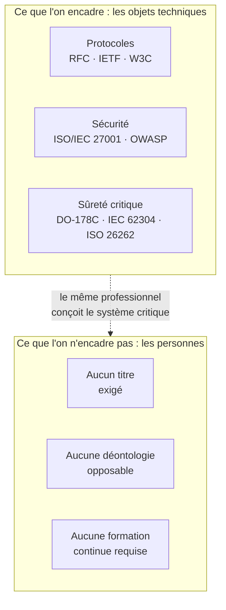
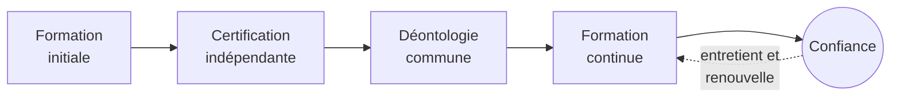
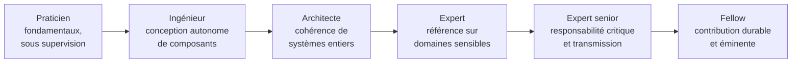

# Livre Blanc
## Pour une reconnaissance progressive de la profession informatique

*Ordre des Experts Informaticiens (OEI) — Mouvement fondateur — Version 3*

---

> **Note liminaire sur le statut de l'organisation.** L'Ordre des Experts Informaticiens (OEI) est, à ce stade, un *mouvement fondateur* appuyé sur une *association*. Il n'est pas un ordre professionnel au sens légal du terme : un ordre professionnel est créé par la loi, dans le cadre d'une profession réglementée dotée d'actes réservés. Aucune organisation privée ne peut s'auto-attribuer ce statut. Le mot « Ordre » est employé ici comme nom d'usage et comme horizon, non comme titre juridique acquis. Cette précision, conforme à notre glossaire et à nos statuts, est répétée dans le présent document partout où elle est nécessaire, non par prudence rhétorique, mais parce qu'elle est au cœur de notre honnêteté intellectuelle.

---

## Préface personnelle de l'auteur

Je n'ai pas écrit ce Livre Blanc parce que l'informatique manquerait de reconnaissance. L'informatique est partout. Elle est au cœur des banques, des hôpitaux, des transports, de l'industrie, des administrations publiques et désormais des systèmes d'intelligence artificielle qui façonnent une part croissante de nos décisions collectives.

J'ai écrit ce Livre Blanc parce qu'un paradoxe me semble de plus en plus évident. Nous vivons dans un monde où les logiciels sont soumis à des normes, à des audits, à des exigences de sécurité et de conformité toujours plus strictes. Pourtant, les femmes et les hommes qui conçoivent ces systèmes exercent encore une profession dont les contours restent largement non définis. N'importe qui peut se présenter comme expert. Les niveaux de compétence sont extrêmement variables. Les responsabilités sont parfois diluées. Les obligations déontologiques sont rarement formalisées.

Au cours de ma carrière d'ingénieur, de développeur, d'architecte logiciel puis de responsable technique, j'ai eu l'opportunité de travailler sur des systèmes financiers, des plateformes critiques et des projets internationaux où une simple erreur logicielle pouvait avoir des conséquences importantes pour des milliers de personnes. J'y ai découvert une réalité simple : lorsque le logiciel devient une infrastructure, le métier de ceux qui le construisent change de nature.

L'objectif de ce document n'est pas de créer une barrière artificielle à l'entrée de la profession. Il n'est pas davantage de reproduire mécaniquement les modèles d'autres métiers réglementés. L'ambition est plus fondamentale. Il s'agit d'ouvrir une discussion internationale sur la manière dont notre profession peut prendre pleinement possession de son rôle dans la société moderne. Une profession capable de définir ses standards, de promouvoir l'excellence technique, de transmettre ses savoirs et d'assumer collectivement ses responsabilités.

Je suis convaincu que les décennies à venir verront l'informatique devenir l'une des disciplines les plus structurantes de notre civilisation. Les systèmes numériques ne sont plus de simples outils ; ils sont devenus des infrastructures de confiance. Cette évolution nous oblige.

Ce Livre Blanc n'apporte pas toutes les réponses. Il constitue avant tout une invitation à la réflexion, au débat et à l'action. J'espère qu'il contribuera, même modestement, à faire émerger une profession plus forte, plus responsable et plus consciente de son rôle dans le monde.

Yann Deungoué
Architecte logiciel
Fondateur de l'initiative Ordre des Experts Informaticiens (OEI)

---

## À propos de l'auteur

Yann Deungoué est ingénieur et architecte logiciel. Au fil de son parcours — comme développeur, architecte, puis responsable technique —, il a conçu, construit et fait évoluer des systèmes financiers, des plateformes critiques et des projets internationaux, dans des environnements où la fiabilité, la sécurité et la conformité des logiciels ne sont pas des options mais des exigences de premier ordre. C'est de cette pratique de terrain, au contact de systèmes dont une défaillance peut affecter des milliers de personnes, qu'est née la conviction à l'origine de ce Livre blanc : lorsque le logiciel devient une infrastructure, le métier de celles et ceux qui le construisent change de nature et appelle une responsabilité à la mesure de ses effets.

Établi en Suisse et exerçant dans le secteur financier, il a fondé l'initiative Ordre des Experts Informaticiens (OEI) afin d'ouvrir, à l'échelle internationale, une discussion sur la reconnaissance progressive et la structuration de la profession informatique. Il défend pour cela une approche mesurée et non alarmiste, ciblée sur les systèmes critiques et soucieuse de préserver l'ouverture, la créativité et l'inclusion de talents venus de tous horizons qui ont fait la richesse de la discipline.

*Une notice biographique plus complète, accompagnée d'un portrait de l'auteur, sera intégrée avant l'impression de la version définitive.*

---

## Remerciements

Ce Livre blanc doit beaucoup à celles et ceux qui, à un titre ou à un autre, en ont accompagné la maturation. Je remercie les premiers lecteurs et relecteurs qui ont accepté d'examiner ces pages sans complaisance, et dont les objections ont autant compté que les encouragements ; les collègues, ingénieurs, architectes, responsables de sécurité et enseignants avec lesquels, au fil des années, se sont forgées les convictions exposées ici ; la communauté professionnelle de l'informatique dans son ensemble, dont l'ouverture et la générosité intellectuelle restent, à mes yeux, un modèle à préserver plutôt qu'à contraindre. Ma gratitude va enfin à mes proches, dont la patience et le soutien ont rendu possible un travail mené en marge d'une activité exigeante. Ce document étant une première contribution appelée à être enrichie, les remerciements les plus importants sont sans doute ceux que je devrai, dans les versions futures, adresser à ses contributeurs à venir.

---

## Préface institutionnelle

L'électricité a transformé le XXe siècle ; le logiciel transforme le XXIe. Cette phrase, qui ouvre notre manifeste, n'est pas une figure de style. Elle décrit une bascule matérielle. En moins de deux générations, le code informatique est passé du statut d'outil de calcul spécialisé à celui de tissu conjonctif des sociétés modernes. Il régule la circulation aérienne, ajuste les doses de radiothérapie, exécute les ordres de bourse, équilibre les réseaux électriques, authentifie les identités, distribue l'eau et l'énergie, et médiatise une part croissante des rapports humains. Là où l'on voyait autrefois des machines, il y a désormais des programmes ; et derrière ces programmes, des professionnels dont les décisions techniques engagent, souvent sans que nul ne le mesure, la sécurité et les intérêts d'un grand nombre de personnes.

Ce Livre blanc part d'un constat simple et vérifiable : les objets techniques de l'informatique comptent parmi les plus rigoureusement normalisés au monde, mais la profession qui les conçoit ne l'est presque pas. Les protocoles réseau, les formats d'échange, les algorithmes cryptographiques, les normes de sûreté logicielle font l'objet de spécifications publiques, révisées, testées et opposables. L'accès au métier qui les met en œuvre, lui, reste dans la plupart des pays entièrement libre : sans exigence de compétence certifiée, sans déontologie commune opposable, sans obligation de formation continue. Ce déséquilibre n'est pas nécessairement un scandale — il est le produit d'une histoire rapide et créative. Mais il est devenu une anomalie qu'il faut nommer, documenter et, progressivement, corriger.

Nous ne prétendons pas apporter une solution clé en main, ni imposer un cadre uniforme à des métiers dont la diversité fait la richesse. Écrire un site vitrine ne requiert pas les mêmes garanties que concevoir le logiciel embarqué d'un stimulateur cardiaque. Notre propos est ciblé, gradué et volontairement modeste dans ses prétentions immédiates : ouvrir un chantier collectif, poser un vocabulaire commun, proposer un référentiel et une déontologie, et construire la crédibilité qui permettra, un jour, dans les pays où le cadre juridique s'y prête, d'envisager une reconnaissance plus formelle. Ce document n'est pas un aboutissement. C'est un commencement, offert à la critique de celles et ceux — universitaires, responsables de sécurité, ingénieurs, juristes du numérique, praticiens de terrain — dont les retours le rendront meilleur.

---

## À propos de l'OEI

*L'Ordre des Experts Informaticiens (OEI) est un mouvement fondateur, adossé à une association, et non un ordre professionnel au sens légal du terme (voir la note liminaire). Sa raison d'être se résume en une vision, une mission et un ensemble de valeurs.*

### Vision

Un monde où les professionnels qui conçoivent, développent et exploitent les systèmes numériques dont dépendent nos sociétés — santé, aviation, énergie, finance, administration — exercent leur métier avec un niveau de compétence, d'éthique et de responsabilité reconnu à la hauteur des enjeux qu'ils portent.

### Mission

Défendre l'intérêt général en promouvant une informatique responsable, éthique, sécurisée et durable, et faire reconnaître progressivement la profession d'expert informaticien comme une profession à haute responsabilité, dotée :

- d'un code de déontologie commun ;
- d'un référentiel de compétences partagé ;
- d'une exigence de formation continue ;
- d'une représentation crédible auprès des institutions, universités et entreprises.

### Valeurs

Notre devise — **« Compétence. Éthique. Responsabilité. »** — résume l'esprit du mouvement. Nous la déclinons en cinq valeurs qui guident nos travaux et notre gouvernance.

- **Compétence.** Nous plaçons la maîtrise réelle, vérifiable et entretenue tout au long de la carrière au-dessus des titres, des labels et des apparences.
- **Éthique.** Nous faisons de la déontologie — protection des données, honnêteté, refus des pratiques frauduleuses ou trompeuses — une exigence professionnelle de premier ordre, et non un supplément d'âme.
- **Responsabilité.** Nous assumons que celui ou celle qui conçoit un système critique répond de ses choix techniques, sans jamais se réfugier derrière un outil, une machine ou un système automatisé.
- **Indépendance.** Nous construisons notre légitimité, nos référentiels et nos évaluations à l'écart des intérêts commerciaux, en particulier des éditeurs de logiciels dont nous entendons rester distincts.
- **Ouverture.** Nous défendons une profession accueillante aux talents de tous horizons, transparente dans ses processus, et nous n'érigeons d'exigence que là où la sécurité collective le justifie.

---

## Synthèse exécutive

*Cette synthèse restitue en quelques pages l'essentiel du Livre blanc : le problème, la vision, les propositions, quelques repères chiffrés, la feuille de route et les bénéfices attendus. Elle peut être lue seule et diffusée de manière autonome ; le corps du document en développe et en étaye chacun des points.*

### Le problème

L'informatique est aujourd'hui l'un des domaines les plus rigoureusement normalisés du monde technique. Les protocoles qui font fonctionner Internet (les RFC de l'IETF), les standards du Web (W3C), les normes de sécurité (ISO/IEC 27001, recommandations OWASP) et les référentiels de sûreté des systèmes critiques (DO-178C pour l'aéronautique embarqué, IEC 62304 pour les dispositifs médicaux, ISO 26262 pour l'automobile) encadrent minutieusement les objets techniques. Pourtant, dans la très grande majorité des pays, l'accès à la profession qui conçoit ces systèmes reste entièrement libre : sans exigence de compétence certifiée, sans déontologie commune opposable, sans obligation de formation continue. N'importe qui peut se présenter comme expert.

Ce paradoxe crée un vide : les artefacts sont encadrés, les personnes ne le sont pas. Or la qualité et la sûreté d'un système ne tiennent pas seulement à la conformité de ses composants ; elles tiennent aux jugements, aux arbitrages et à l'intégrité des professionnels qui les assemblent. C'est un angle mort collectif, d'autant plus préoccupant que les effets du logiciel sur le monde ont changé d'échelle.

### Pourquoi maintenant

Trois transformations concomitantes rendent ce vide plus problématique qu'il ne l'était il y a vingt ans :

- **L'intelligence artificielle générative** transforme la nature même du travail logiciel et déplace la valeur de la production de code vers la capacité à spécifier, vérifier et assumer la responsabilité d'un système. Une machine peut proposer ; un professionnel doit répondre.
- **La cybersécurité** est devenue un enjeu de sécurité collective : hôpitaux, collectivités, opérateurs d'énergie et chaînes logistiques figurent désormais parmi les cibles. Le mouvement réglementaire s'accélère (NIS2, DORA, Cyber Resilience Act) ; la structuration de la profession, elle, reste en retard.
- **La pression économique et sociale mondiale** (mise en concurrence tarifaire, précarisation, prolifération de certifications commerciales adossées à un produit) brouille les repères et rend difficile, pour les employeurs comme pour les pouvoirs publics, de distinguer l'expertise véritable de sa contrefaçon.

### La vision

Notre thèse tient en une phrase : le logiciel est devenu un bien d'intérêt public, comparable par ses effets aux infrastructures énergétiques ou de transport, et cette réalité doit se traduire dans la manière dont la profession qui le produit est organisée.

Nous ne proposons pas d'encadrer uniformément l'ensemble des métiers du numérique — écrire un site personnel ne requiert pas les mêmes garanties que concevoir un logiciel médical embarqué. Nous défendons une approche *ciblée et progressive*, résumée par un principe directeur :

> Toute personne assumant la responsabilité technique d'un système critique devrait répondre à des exigences minimales de compétence, de formation continue et de déontologie.

### Ce que nous proposons de construire

1. **Un référentiel de compétences et de niveaux d'expertise**, transparent et public, décrivant ce qu'est un expert informaticien selon une échelle graduée (Praticien, Ingénieur, Architecte, Expert, Expert senior, Fellow).
2. **Un code de déontologie commun**, inspiré des professions à haute responsabilité : protection des données, refus des pratiques frauduleuses, déclaration des conflits d'intérêts, documentation des décisions techniques.
3. **Un cadre de certification indépendant des éditeurs commerciaux**, construit avec des partenaires académiques, pour distinguer la compétence professionnelle durable de la simple maîtrise d'un produit.
4. **Une exigence de formation continue**, sur le modèle des professions de santé, répartie par grands domaines (IA, cybersécurité, cloud, réglementation, éthique, sobriété numérique).
5. **Un observatoire indépendant** publiant régulièrement l'état réel de la profession.

### Quelques repères chiffrés

Les données précises sur la profession informatique sont dispersées et méthodologiquement fragiles ; nous nous en tenons donc à des ordres de grandeur, en signalant leur caractère estimatif.

- Selon les estimations professionnelles couramment citées, le nombre de développeurs de logiciels dans le monde se compte en **dizaines de millions**, et il progresse d'année en année. Aucun de ces professionnels, dans la plupart des pays, n'est tenu à un titre ou à une déontologie opposable pour exercer.
- Le coût annuel de la cybercriminalité à l'échelle mondiale est fréquemment estimé en **milliers de milliards de dollars**, avec de fortes incertitudes selon les périmètres et les méthodes retenus. La tendance à la hausse, elle, fait consensus.
- Le marché des technologies d'intelligence artificielle connaît une **croissance rapide**, à deux chiffres selon la plupart des analyses sectorielles, ce qui accroît d'autant la surface des décisions confiées à des systèmes automatisés.
- Les incidents logiciels majeurs illustrent des ordres de grandeur parlants : une défaillance de déploiement a coûté à une firme financière **environ 440 millions de dollars en moins d'une heure** en 2012 ; une mise à jour défectueuse d'un logiciel de sécurité a provoqué, en 2024, la panne d'**environ 8,5 millions d'appareils** dans le monde en quelques heures, selon l'éditeur du système d'exploitation concerné.
- La **dépendance numérique** des sociétés — quelques fournisseurs de cloud, quelques bibliothèques universelles, quelques composants déployés à l'identique sur des millions de machines — concentre le risque : une défaillance en un point peut désormais se propager à l'échelle planétaire.

### La feuille de route

Nous progressons par *jalons séquentiels* plutôt que par échéances calendaires : verrouillage juridique et de l'identité ; socle documentaire minimal viable ; présence publique ; corpus complet (déontologie, référentiel, chartes) ; premier cercle de contributeurs crédibles ; reconnaissance élargie. Chaque jalon conditionne le suivant. On ne bâtit pas la reconnaissance avant le corpus, ni le corpus avant le vocabulaire commun.

### Les bénéfices attendus

Pour les **professionnels** : une reconnaissance de la compétence réelle, une protection contre le nivellement par le bas, des repères de carrière lisibles. Pour les **employeurs et les clients** : une réduction de l'asymétrie d'information, un recrutement plus sûr, une valorisation des équipes qui investissent dans leur compétence. Pour la **société** : davantage de qualité, de sécurité, de résilience et de confiance dans des systèmes dont dépendent la santé, la finance, l'énergie et les services publics.

### Ce que nous ne sommes pas

Nous ne sommes pas un ordre professionnel au sens légal ; nous n'avons pas le pouvoir de créer des actes réservés ni de conditionner l'accès au métier, et aucune organisation privée ne peut se l'auto-attribuer. Nous sommes un mouvement fondateur, adossé à une association, qui construit un corpus. Si ce corpus acquiert une légitimité suffisante, il pourra servir de base à une discussion future avec les universités, les entreprises et, le cas échéant, les pouvoirs publics, dans les pays où le cadre juridique le permet.

---

## 1. Pourquoi ce document, pourquoi maintenant

On pourrait objecter que le débat sur la professionnalisation de l'informatique est ancien, et qu'il n'a jamais abouti. C'est exact, et c'est précisément pourquoi il faut le reprendre à nouveaux frais. Les conditions ont changé. Trois transformations concomitantes rendent le vide actuel plus problématique qu'il ne l'était il y a vingt ans.

La première est l'irruption de l'intelligence artificielle générative dans la production même du logiciel. Des outils capables d'écrire, de compléter et de corriger du code modifient en profondeur la nature du travail et la définition de la compétence. Ils déplacent la valeur : moins vers la production de lignes de code, davantage vers la capacité à spécifier, vérifier, arbitrer et assumer la responsabilité d'un système. Cette bascule rend d'autant plus nécessaire un cadre qui distingue l'expertise réelle de la simple productivité apparente, et qui rappelle qu'une machine peut proposer, mais qu'un professionnel doit répondre. La question de la responsabilité humaine, loin de s'effacer, devient centrale.

La deuxième est la transformation de la cybersécurité en enjeu de sécurité collective. Les attaques informatiques ne visent plus seulement des données commerciales ; elles frappent des hôpitaux, des collectivités, des opérateurs d'énergie, des chaînes logistiques. Le rançongiciel WannaCry, en 2017, a désorganisé une partie du service de santé britannique ; la même année, l'attaque NotPetya s'est propagée bien au-delà de ses cibles initiales, immobilisant notamment les systèmes du transporteur maritime Maersk. Ces épisodes ont montré qu'une défaillance logicielle peut avoir des effets de système, hors de proportion avec l'incident initial. Le législateur l'a compris : l'Union européenne a adopté des cadres tels que la directive NIS2 pour la résilience des infrastructures essentielles, le règlement DORA pour le secteur financier, ou encore le Cyber Resilience Act pour la sécurité des produits numériques. Le mouvement réglementaire s'accélère ; la structuration de la profession, elle, reste en retard.

La troisième transformation est économique et sociale. La mondialisation du travail informatique a créé une pression tarifaire et une précarisation que ne connaissent pas les professions réglementées comparables. La prolifération de certifications commerciales, souvent adossées à un éditeur et à ses produits, brouille les repères : elles attestent la maîtrise d'un outil, rarement une compétence professionnelle transférable et durable. Il en résulte une asymétrie d'information difficile à corriger pour les employeurs, les clients et les pouvoirs publics : comment distinguer, sur un marché opaque, l'expertise véritable de sa contrefaçon ? Une profession qui évolue aussi vite que la médecine, mais qui ne dispose ni de son cadre déontologique ni de son exigence de formation continue, s'expose à une double perte : de qualité pour la société, de reconnaissance pour ses membres.

Ce document existe pour poser ces constats de manière ordonnée, en distinguer les faits des opinions, et proposer une voie. Il s'adresse d'abord à la profession elle-même, puis aux institutions académiques et aux entreprises, et enfin — mais seulement lorsque la crédibilité aura été patiemment construite — aux pouvoirs publics.

## 2. Brève histoire de la profession informatique

Comprendre pourquoi l'informatique n'est pas structurée comme une profession suppose de revenir à sa jeunesse. À la différence de la médecine ou du droit, dont les corps professionnels se sont formés sur des siècles, l'informatique a moins d'une existence humaine. Les premiers ordinateurs universels programmables datent des années 1940 ; la discipline s'est constituée en marchant, portée par une succession de ruptures plutôt que par une lente sédimentation institutionnelle.

Ses figures fondatrices appartiennent à des mondes différents : mathématiciens, physiciens, ingénieurs électroniciens, logiciens. Alan Turing formalise dès 1936 la notion de calculabilité ; Grace Hopper développe l'un des premiers compilateurs et contribue à la naissance de langages lisibles par des humains, ouvrant la voie à une informatique qui n'est plus réservée aux concepteurs de machines. À mesure que le matériel se banalise, le centre de gravité se déplace vers le logiciel — et avec lui, la complexité. Dès la fin des années 1960, les praticiens constatent que la production de programmes fiables est bien plus difficile que prévu : les projets dépassent leurs budgets, accumulent les défauts, échouent parfois entièrement. C'est de ce diagnostic qu'émerge, lors d'une conférence de l'OTAN tenue à Garmisch en 1968, l'expression de « crise du logiciel » et la revendication d'un véritable *génie logiciel* (software engineering) : appliquer à la production de code la rigueur méthodique de l'ingénierie.

L'ambition était juste, mais elle s'est heurtée à une tension jamais résolue. L'ingénierie classique s'appuie sur des lois physiques stables, des matériaux caractérisés, des marges de sécurité éprouvées. Le logiciel, lui, est immatériel, infiniment malléable, et sa complexité croît sans les contraintes physiques qui bornent un pont ou un moteur. Cette plasticité est sa force — elle explique la vitesse prodigieuse de l'innovation numérique — mais elle a aussi nourri une culture professionnelle réticente à la standardisation des personnes. Le talent individuel, l'autodidaxie, la capacité à apprendre vite y ont toujours été davantage valorisés que le diplôme ou le titre. Beaucoup des contributeurs les plus influents du domaine n'ont jamais suivi de cursus formel en informatique. Cette ouverture est un acquis précieux, et nous n'entendons pas y renoncer.

Il faut le dire clairement, car cela conditionne notre proposition : l'absence de barrière à l'entrée a été un moteur d'innovation et d'inclusion. Elle a permis à des talents venus d'horizons variés de contribuer, et elle a évité les rentes de situation qui figent certaines professions fermées. Notre thèse n'est pas que cette liberté fut une erreur. Elle est que, dans un périmètre précis — celui des systèmes critiques — le coût social de l'absence totale d'exigence est devenu supérieur au bénéfice de l'ouverture illimitée. La profession a mûri ; ses effets sur le monde ont changé d'échelle. Il est temps que sa structuration rattrape, prudemment et sans reniement, cette transformation.

## 3. Le logiciel comme infrastructure critique

Qu'un logiciel puisse tuer, ruiner ou paralyser n'est pas une hypothèse théorique. C'est un fait documenté, illustré par une série d'incidents devenus des cas d'école, étudiés dans les cursus d'ingénierie du monde entier. Les rappeler n'a rien de sensationnaliste : ils constituent la preuve empirique que certains systèmes logiciels appartiennent bel et bien à la catégorie des infrastructures critiques, au sens de notre glossaire — des systèmes dont la défaillance peut entraîner des conséquences graves pour la sécurité des personnes, l'économie ou le fonctionnement d'infrastructures essentielles.

Dans la **santé**, l'appareil de radiothérapie Therac-25, au milieu des années 1980, a délivré à plusieurs patients des surdoses massives de rayonnement, causant des décès et de graves séquelles. L'enquête a montré que la cause n'était pas une pièce défectueuse mais un ensemble de défauts logiciels — une situation de compétition (*race condition*) entre tâches, une confiance excessive dans le logiciel après la suppression de verrous matériels, une gestion insuffisante des états d'erreur. Ce cas reste, quarante ans plus tard, la référence pour enseigner qu'un défaut logiciel peut avoir des conséquences létales et que la sûreté d'un système ne se réduit jamais à celle de ses composants matériels.

Dans l'**aéronautique**, le vol inaugural d'Ariane 5, en 1996, s'est soldé par la destruction du lanceur quelques secondes après le décollage. La cause : la réutilisation d'un module logiciel hérité d'Ariane 4, dans lequel la conversion d'une valeur en virgule flottante vers un entier de format plus court a provoqué un dépassement de capacité non rattrapé. Plus récemment, les deux accidents du Boeing 737 MAX, en 2018 et 2019, ont coûté la vie à 346 personnes ; les enquêtes ont mis en cause un système de compensation automatique (MCAS) qui s'appuyait sur une source de données unique et dont le comportement n'avait pas été correctement documenté ni transmis aux équipages. Ces drames illustrent une leçon récurrente : ce ne sont pas toujours les algorithmes les plus sophistiqués qui échouent, mais les hypothèses implicites, les défauts de spécification et les zones de responsabilité mal définies.

Dans la **finance**, la firme Knight Capital a perdu environ 440 millions de dollars en moins d'une heure, en 2012, à la suite du déploiement défectueux d'un logiciel de négociation automatisée qui a passé des ordres erronés à un rythme incontrôlable — un incident qui a failli emporter l'entreprise. Dans l'**énergie**, la grande panne électrique qui a touché le nord-est de l'Amérique du Nord en 2003, privant des dizaines de millions de personnes de courant, a été aggravée par un défaut logiciel dans le système d'alarme d'un centre de contrôle, qui a empêché les opérateurs de percevoir à temps la dégradation de la situation. Enfin, en 2024, une simple mise à jour défectueuse d'un logiciel de sécurité largement déployé a provoqué, selon l'éditeur de système d'exploitation concerné, la panne d'environ 8,5 millions d'appareils dans le monde en quelques heures — clouant des avions au sol, perturbant des hôpitaux, des banques et des administrations. Cet épisode a rendu tangible une réalité que les experts nomment depuis longtemps : la *dépendance systémique*. Un composant unique, présent partout, devient un point de défaillance planétaire.

Ce qui relie ces incidents, par-delà la diversité des secteurs, c'est qu'aucun ne relève de la fatalité. Chacun met en cause des chaînes de décisions humaines : des choix d'architecture, des arbitrages de délai, des procédures de test insuffisantes, des responsabilités diluées. C'est précisément ce que les disciplines qui encadrent les systèmes critiques cherchent à discipliner — et c'est là que se joue l'écart, sur lequel nous reviendrons, entre la rigueur imposée aux artefacts et la liberté totale laissée aux personnes.

## 4. Les nouveaux risques : IA, cybersécurité, dépendance systémique

Aux risques classiques du logiciel critique s'ajoutent aujourd'hui des risques d'une nature nouvelle, qui appellent des compétences et une vigilance dont la profession ne s'est pas encore collectivement dotée.

Le premier tient à la **généralisation de l'intelligence artificielle** dans des systèmes décisionnels. Les modèles d'apprentissage automatique ne se programment pas au sens classique : ils s'entraînent sur des données, et leur comportement émerge de cet entraînement plutôt que d'une spécification explicite. Il en résulte des propriétés inédites — opacité des décisions, sensibilité aux biais présents dans les données, comportements imprévisibles hors du domaine d'entraînement, difficulté à garantir un résultat reproductible. Lorsque de tels systèmes interviennent dans le tri de candidatures, l'octroi de crédits, l'aide au diagnostic médical ou la modération de contenus, la question de la responsabilité devient aiguë. La notion d'*IA responsable*, telle que nous la définissons — transparence, équité, sécurité et responsabilité humaine — n'est pas un supplément d'âme : c'est une exigence d'ingénierie. Les législateurs commencent à l'inscrire dans le droit, à l'image du règlement européen sur l'intelligence artificielle, qui gradue les obligations selon le niveau de risque. Mais un texte de loi ne forme pas des praticiens : encore faut-il des professionnels capables de le mettre en œuvre avec discernement.

Le deuxième risque est celui de la **cybersécurité**, désormais indissociable de la conception même des systèmes. Les vulnérabilités logicielles ne sont plus des incidents isolés mais un phénomène structurel. La faille Heartbleed, découverte en 2014 dans une bibliothèque cryptographique omniprésente, a exposé les données de millions de serveurs ; la vulnérabilité Log4Shell, en 2021, a affecté une bibliothèque de journalisation si largement utilisée qu'il a fallu des mois pour en recenser tous les usages. Ces épisodes révèlent une dépendance profonde à des composants logiciels partagés, souvent développés et maintenus par une poignée de bénévoles, dont dépend pourtant une part immense de l'économie numérique. La tentative d'introduction d'une porte dérobée dans un utilitaire de compression largement diffusé, déjouée de justesse en 2024, a montré que cette chaîne d'approvisionnement logicielle constitue une surface d'attaque à part entière. Sécuriser un système ne se limite plus à protéger son périmètre : il faut comprendre, tracer et maîtriser l'ensemble de ses dépendances.

Le troisième risque, transversal, est la **dépendance systémique** elle-même. La mutualisation des infrastructures — quelques fournisseurs de cloud, quelques bibliothèques universelles, quelques logiciels de sécurité déployés à l'identique sur des millions de machines — apporte d'immenses gains d'efficacité, mais concentre le risque. Une défaillance en un point se propage désormais à l'échelle mondiale, comme l'a montré la panne globale de 2024 évoquée plus haut. Cette question rejoint celle de la *souveraineté numérique* : la capacité d'un État, d'une organisation ou d'un individu à maîtriser ses infrastructures et ses choix technologiques sans dépendance excessive à des tiers. Nous n'abordons pas cet enjeu sous un angle idéologique, mais sous celui de la résilience : un système dont on ne maîtrise ni les composants ni les points de concentration est un système dont on ne maîtrise pas le risque.

Ces trois risques ont un dénominateur commun : ils excèdent la compétence d'un seul individu et exigent une culture professionnelle partagée — des méthodes, une déontologie, une mise à jour continue des savoirs. C'est exactement ce qu'une profession organisée peut apporter.

## 5. Informatique verte et sobriété numérique

Un enjeu longtemps négligé s'impose désormais : l'empreinte environnementale du numérique. On a d'abord vu dans l'informatique une technologie « propre », immatérielle, opposée aux industries lourdes. Cette image est trompeuse. Derrière l'apparente immatérialité du logiciel se cachent des centres de données énergivores, des réseaux de télécommunication mondiaux, et surtout un flux considérable d'équipements dont la fabrication mobilise des ressources rares et une énergie importante.

Les estimations disponibles situent la part du numérique autour de quelques pour cent des émissions mondiales de gaz à effet de serre — un ordre de grandeur souvent comparé à celui du transport aérien — et cette part progresse. Nous restons prudents sur les chiffres précis, qui varient selon les méthodologies et le périmètre retenu, mais la tendance de fond ne fait pas débat : la demande de calcul croît rapidement, portée notamment par l'essor de l'intelligence artificielle, dont l'entraînement et l'exploitation des grands modèles sont particulièrement gourmands en énergie et en matériel. Un point fait consensus parmi les analyses sérieuses : la part prépondérante de l'impact provient de la fabrication des terminaux et des équipements, davantage que de leur seule consommation électrique en fonctionnement. C'est dire que l'allongement de la durée de vie du matériel et la sobriété dans le renouvellement des équipements pèsent au moins autant que l'efficacité énergétique des centres de données.

C'est ici que la responsabilité du professionnel entre en jeu, car nombre de décisions apparemment techniques ont des conséquences environnementales directes. Une architecture logicielle mal conçue peut multiplier inutilement les besoins en calcul et en stockage. Un logiciel dont les exigences croissent sans nécessité — ce que l'on nomme parfois l'« obésiciel » — pousse au remplacement prématuré de matériel encore fonctionnel, générant des déchets électroniques évitables. À l'inverse, une conception sobre, une optimisation des traitements, un dimensionnement juste des infrastructures et un choix raisonné des localisations de calcul peuvent réduire significativement l'empreinte, souvent en améliorant au passage la performance et le coût. L'*informatique verte*, telle que nous la définissons — l'ensemble des pratiques visant à réduire l'empreinte environnementale des systèmes numériques — n'est donc pas un domaine séparé réservé à des spécialistes : c'est une dimension transversale du métier, au même titre que la sécurité.

Des cadres et des communautés émergent pour outiller cette exigence, à l'image des travaux menés autour de l'écoconception logicielle, de la mesure de l'empreinte des applications, ou des principes portés par des collectifs dédiés au logiciel durable. Les pouvoirs publics et les régulateurs s'en saisissent également, avec des obligations croissantes de mesure et de réduction de l'empreinte numérique. Nous considérons que la sobriété numérique doit figurer explicitement dans le référentiel de compétences et dans le code de déontologie de la profession : non comme une contrainte subie, mais comme un marqueur de qualité professionnelle. Concevoir un système efficace, c'est aussi le concevoir sobre.

## 6. Le paradoxe : systèmes normalisés, profession non régulée

Nous touchons ici au cœur de notre argumentation. L'informatique présente une singularité frappante : peu de domaines de l'activité humaine ont autant normalisé leurs objets techniques, et si peu structuré l'accès à la profession qui les produit.

Le schéma suivant résume ce déséquilibre : d'un côté, une pile d'exigences techniques dense et opposable ; de l'autre, une absence quasi totale d'exigences portant sur les personnes — alors qu'il s'agit, bien souvent, du même professionnel.

Considérons d'abord l'ampleur de la normalisation technique. Les communications numériques reposent sur des milliers de spécifications publiques et révisées — les RFC publiées par l'IETF pour les protocoles d'Internet, les standards du W3C pour le Web, les normes ISO et IEC pour d'innombrables aspects du logiciel et des données. La sécurité dispose de ses propres référentiels : la norme ISO/IEC 27001 pour les systèmes de management de la sécurité de l'information, les recommandations de l'OWASP pour la sécurité applicative, les catalogues publics de vulnérabilités et leurs systèmes de cotation. Les domaines à haute criticité vont plus loin encore : la norme DO-178C encadre le logiciel embarqué aéronautique et impose une traçabilité rigoureuse entre exigences, code et tests ; la norme IEC 62304 régit le cycle de vie du logiciel des dispositifs médicaux ; la norme ISO 26262 traite de la sécurité fonctionnelle des systèmes automobiles ; la norme générique IEC 61508 fonde toute une famille d'exigences pour les systèmes relatifs à la sécurité. Dans ces secteurs, un composant logiciel ne peut être mis en service sans satisfaire à des exigences détaillées, auditables et opposables.

Considérons maintenant l'autre versant. Dans la très grande majorité des pays, aucune qualification n'est légalement exigée pour concevoir, développer ou exploiter la plupart de ces systèmes. Une même personne peut, sans le moindre titre reconnu ni engagement déontologique opposable, écrire le code qui traitera des données de santé, orchestrera des transactions financières ou pilotera un équipement industriel. Là où le médecin, l'avocat, le pharmacien ou l'expert-comptable exercent une profession réglementée — dont l'accès est conditionné par un titre, un diplôme ou une inscription, et encadré par une déontologie et une discipline —, l'informatique demeure, au sens de notre glossaire, une profession qui n'est ni réglementée ni même partout organisée.

Le paradoxe se formule alors simplement : nous encadrons scrupuleusement les artefacts, et pas du tout les personnes qui les produisent. Or la qualité et la sûreté d'un système ne tiennent pas seulement à la conformité de ses composants à des normes ; elles tiennent aux jugements, aux arbitrages et à l'intégrité des professionnels qui les assemblent. Les normes techniques présupposent des praticiens compétents pour les appliquer avec discernement — mais rien ne garantit cette compétence, ni ne la maintient dans le temps. C'est un angle mort collectif.

Il faut se garder d'une conclusion excessive. Ce paradoxe ne signifie pas qu'il faille réglementer l'ensemble du métier, ni ériger des barrières là où l'ouverture a fait ses preuves. Il signifie qu'un chaînon manque : entre la norme technique, qui s'applique à l'objet, et le droit commun, qui s'applique à tous, il n'existe pas de cadre professionnel intermédiaire propre aux systèmes critiques. C'est ce chaînon que nous proposons de construire, en commençant par le documenter et le rendre désirable, plutôt qu'en prétendant l'imposer.

## 7. Modèles internationaux existants

Nous ne partons pas d'une page blanche. D'autres professions, et l'informatique elle-même dans certaines de ses composantes, ont construit des formes de structuration dont nous pouvons nous inspirer — en distinguant soigneusement ce qui relève d'un statut légal, que nous n'avons pas, de ce qui relève d'une autorité acquise par la qualité, que nous pouvons viser.

Le premier modèle est celui des **ordres professionnels classiques** : médecins, pharmaciens, architectes, experts-comptables. Leur point commun est d'associer un titre protégé par la loi, un code de déontologie opposable, une instance disciplinaire et une exigence de formation continue. Ces professions démontrent qu'il est possible de concilier haut niveau d'exigence et confiance du public sur la durée. Nous en retenons la grammaire — déontologie, compétence vérifiée, formation continue, discipline — sans en revendiquer le statut légal, qui suppose une loi que nous n'avons pas le pouvoir d'édicter.

Le deuxième modèle, plus directement pertinent, est celui de l'**ingénierie réglementée**, dont l'exemple canadien est éclairant. Au Québec, l'Ordre des ingénieurs du Québec encadre le titre d'ingénieur, protégé par la loi, avec des activités réservées dans certains domaines et un mécanisme disciplinaire. La tradition canadienne a même forgé un rituel — l'anneau de fer remis aux ingénieurs diplômés — pour ancrer symboliquement la conscience de la responsabilité. L'ingénierie logicielle y a été partiellement intégrée à ce cadre. Aux États-Unis, une licence d'ingénieur professionnel (Professional Engineer) en génie logiciel a même existé, avant que l'examen correspondant ne soit abandonné faute d'un nombre suffisant de candidats — signe que la transposition du modèle de l'ingénierie physique au logiciel se heurte encore à des résistances culturelles et pratiques. Ces expériences, y compris dans leurs limites, sont pour nous une source d'enseignement précieuse : elles montrent à la fois la voie et ses obstacles.

Le troisième modèle est sans doute le plus inspirant pour notre situation immédiate : celui des **grandes organisations techniques sans statut d'ordre**. L'IEEE et l'ACM, sociétés savantes de référence en électronique et en informatique, ont élaboré ensemble un code d'éthique du génie logiciel qui fait autorité intellectuelle bien au-delà de tout cadre légal. L'IETF et le W3C produisent les standards qui font fonctionner Internet et le Web sans posséder aucun pouvoir contraignant : leur autorité repose entièrement sur la qualité de leurs travaux, la transparence de leurs processus et l'adhésion volontaire de la communauté. Ces organisations prouvent qu'une légitimité forte peut se construire sans statut légal, par la seule reconnaissance méritée. C'est très précisément la trajectoire que nous visons pour l'OEI dans sa première phase : devenir une référence par la qualité, avant même d'être, peut-être un jour, une institution reconnue par le droit.

De ces modèles, nous tirons une ligne directrice : emprunter aux ordres leur exigence déontologique et leur culture de la responsabilité ; emprunter à l'ingénierie réglementée sa gradation des niveaux et sa notion d'activités sensibles ; emprunter aux grandes organisations techniques leur méthode — l'autorité par la qualité, l'ouverture et la transparence, plutôt que par la contrainte.

## 8. Notre thèse et notre proposition

Notre thèse tient en une phrase : le logiciel est devenu un bien d'intérêt public, comparable par ses effets aux infrastructures énergétiques ou de transport, et cette réalité doit se traduire dans la manière dont la profession qui le produit est organisée. Lorsqu'un système informatique contrôle un avion, un hôpital, une banque ou un réseau électrique, une erreur peut avoir des conséquences humaines et économiques majeures. La société est en droit d'attendre, de celles et ceux qui assument cette responsabilité, un niveau de compétence, d'éthique et de vigilance à la hauteur des enjeux.

De cette thèse découle une proposition dont nous voulons souligner d'emblée le caractère *ciblé et progressif*, car c'est ce qui la distingue des tentatives passées. Nous ne proposons pas d'encadrer uniformément l'ensemble des métiers du numérique. Une telle prétention serait à la fois irréaliste et nuisible : elle étoufferait l'innovation, créerait des rentes et se heurterait à juste titre au refus de la profession. Notre principe directeur est le suivant :

> Toute personne assumant la responsabilité technique d'un système critique devrait répondre à des exigences minimales de compétence, de formation continue et de déontologie.

Le mot déterminant est *critique*, au sens précis de notre glossaire. Écrire un site personnel, un jeu vidéo indépendant ou un outil interne sans conséquence pour la sécurité ou l'économie ne requiert aucune des garanties que nous appelons de nos vœux. Concevoir le logiciel embarqué d'un dispositif médical, l'orchestration d'un réseau électrique ou le cœur transactionnel d'un système bancaire relève d'un autre régime de responsabilité. C'est sur ce périmètre resserré que l'exigence doit porter — un périmètre que le Référentiel de compétences aura pour tâche de délimiter avec rigueur, en évitant aussi bien l'extension excessive que la restriction complaisante.

Ce que nous proposons de construire se décline en cinq chantiers, développés dans les sections suivantes. Premièrement, un *référentiel de compétences et de niveaux d'expertise*, transparent et public, qui décrive ce qu'est un expert informaticien selon une échelle graduée. Deuxièmement, un *code de déontologie commun*, inspiré des professions à haute responsabilité. Troisièmement, un *cadre de certification indépendant des éditeurs commerciaux*, construit avec des partenaires académiques, pour distinguer la compétence professionnelle durable de la simple maîtrise d'un produit. Quatrièmement, une *exigence de formation continue*, sur le modèle des professions de santé, qui reconnaisse que l'expertise informatique se périme vite et doit s'entretenir. Cinquièmement, un *observatoire indépendant* publiant régulièrement l'état réel de la profession.

Ces cinq chantiers ne sont pas juxtaposés : ils forment une chaîne de valeur cohérente, où chaque maillon produit la matière du suivant et où l'ensemble converge vers un unique objectif — la confiance. La formation initiale nourrit la certification ; la certification s'articule à une déontologie commune ; la déontologie s'entretient par la formation continue ; et c'est de cet ensemble que naît, au bénéfice des professionnels comme de la société, la confiance dans les systèmes critiques.

Il importe de redire ce que nous ne sommes pas. Nous ne sommes pas un ordre professionnel au sens légal ; nous n'avons pas le pouvoir de créer des actes réservés ni de conditionner l'accès au métier. Nous sommes un mouvement fondateur, adossé à une association, qui construit un corpus. Si ce corpus acquiert une légitimité suffisante, il pourra servir de base à une discussion future avec les universités, les entreprises et, le cas échéant, les pouvoirs publics, dans les pays où le cadre juridique le permet. Nous ne cherchons pas à ériger une barrière artificielle ni un monopole, mais à améliorer la qualité, la transparence et la confiance — au bénéfice des professionnels eux-mêmes autant que de la société.

## 9. Gouvernance proposée

Une organisation qui prétend promouvoir la rigueur et l'éthique se doit d'être elle-même exemplaire dans son fonctionnement. La gouvernance de l'OEI répond à trois principes : sobriété institutionnelle — ne créer un organe que lorsqu'il devient nécessaire ; transparence — rendre publics les processus et les productions ; et prévention des conflits d'intérêts, notamment vis-à-vis des éditeurs commerciaux dont nous voulons rester indépendants.

La forme juridique de départ est celle d'une *association*, dotée de statuts, d'une assemblée générale et d'un conseil d'administration. Ce choix — association loi 1901 en France ou association au sens des articles 60 et suivants du Code civil suisse — offre une base légale légère, sans capital minimum, adaptée à un mouvement naissant. Il ne préjuge pas des formes ultérieures, plus ambitieuses, que l'organisation pourra prendre si sa reconnaissance s'élargit ; mais il constitue un point de départ réaliste et immédiatement opérationnel. Le choix précis de la juridiction, qui emporte des conséquences fiscales et de responsabilité, doit être arrêté avec l'appui d'un professionnel du droit.

L'assemblée générale réunit les membres et détient la souveraineté sur les orientations, les comptes et l'élection du conseil d'administration. Le conseil d'administration administre l'association et élit en son sein un bureau — présidence, vice-présidence, secrétariat général, trésorerie. La composition des membres reflète la maturité progressive du projet : *membres fondateurs*, présents avant la première reconnaissance publique élargie ; *membres agréés*, qui satisferont aux critères de compétence et de déontologie une fois le cadre de certification opérationnel ; *membres associés*, personnes ou organisations soutenant la mission sans répondre encore aux critères d'agrément ; et *membres d'honneur*, invités à titre honorifique pour leur contribution au domaine. Cette gradation est importante : elle permet d'accueillir dès aujourd'hui des soutiens, sans prétendre agréer des membres selon des critères qui n'existent pas encore. On ne délivre pas un agrément avant d'avoir défini ce qu'il atteste.

Le travail de fond est confié à des *conseils* thématiques — groupes de travail spécialisés en éthique, cybersécurité, intelligence artificielle, cloud, informatique verte, formation, architecture — chargés de produire des recommandations publiques soumises à la validation du conseil d'administration. Ces conseils sont le moteur intellectuel de l'organisation ; c'est par la qualité de leurs travaux, à l'image des grandes organisations techniques évoquées plus haut, que se construira notre légitimité. Une fonction d'*observatoire* leur est adossée, chargée de publier régulièrement des données sur l'état de la profession.

Deux organes n'ont vocation à voir le jour que dans une phase de maturité avancée, et nous tenons à le préciser pour ne pas laisser croire à des pouvoirs que nous n'exerçons pas. Le mécanisme d'*agrément* des membres suppose que le Référentiel de compétences soit finalisé ; il ne sera activé qu'à ce moment. La *chambre disciplinaire*, chargée d'instruire les manquements au code de déontologie parmi les membres agréés, ne pourra fonctionner que lorsque le cadre de certification et d'agrément sera lui-même mature et incontestable. Instaurer une discipline sans base solide serait illégitime ; nous nous l'interdisons. Enfin, dans toute sa communication, l'organisation doit préciser son statut associatif et éviter toute confusion avec un ordre professionnel légalement constitué — règle que nos statuts inscrivent noir sur blanc.

## 10. Cadre de certification et niveaux

La certification est le chantier le plus délicat, car c'est celui où le risque de reproduire les travers que nous dénonçons est le plus grand. Le marché regorge déjà de certifications ; beaucoup attestent la maîtrise d'un produit commercial particulier plutôt qu'une compétence professionnelle transférable et durable. Notre ambition est précisément de proposer une *certification indépendante*, au sens de notre glossaire : délivrée par l'organisation ou ses partenaires académiques, et non liée à un éditeur commercial de logiciels.

Le socle de ce cadre est une échelle de *niveaux d'expertise*, que notre glossaire fixe ainsi : Praticien, Ingénieur, Architecte, Expert, Expert senior, et Fellow. Cette progression n'est pas une hiérarchie de prestige mais une gradation de responsabilité et d'autonomie, que l'on peut lire comme le cycle de vie professionnel de l'expert informaticien : à chaque échelon correspondent des connaissances, des aptitudes démontrées et une expérience vérifiable qui s'approfondissent.

Le Praticien maîtrise les fondamentaux et travaille sous supervision ; l'Ingénieur conçoit et met en œuvre des composants de manière autonome ; l'Architecte assume la cohérence de systèmes entiers et les arbitrages structurants ; l'Expert et l'Expert senior portent une responsabilité de référence sur des domaines sensibles, y compris critiques, et sur la transmission ; le Fellow est une reconnaissance de contribution durable et éminente à la discipline. Chaque niveau devra être défini précisément dans le Référentiel de compétences, en associant à chaque échelon des connaissances, des aptitudes démontrées et une expérience vérifiable.

Trois principes doivent gouverner ce cadre pour qu'il ne devienne pas une certification de plus. Le premier est l'*indépendance* : la conception des référentiels et l'évaluation doivent être tenues à l'écart des intérêts commerciaux, ce qui suppose un adossement académique et des règles strictes de prévention des conflits d'intérêts. Le deuxième est la *validité* : une certification ne vaut que si elle mesure réellement ce qu'elle prétend mesurer. Cela implique de privilégier l'évaluation de compétences démontrées — études de cas, revues de réalisations, mises en situation — sur le simple contrôle de connaissances mémorisées, et de soumettre le dispositif lui-même à une évaluation critique régulière. Le troisième est la *transparence* : les référentiels, les critères et les processus doivent être publics, afin que la valeur de la certification puisse être appréciée par tous — employeurs, pairs, public.

Nous voulons être explicites sur une limite, par honnêteté. Tant que l'OEI n'a pas de reconnaissance légale — et nous avons dit qu'il n'en a pas —, une certification qu'il délivrerait n'a aucune valeur juridique ; elle ne conditionne l'accès à aucun métier et ne confère aucun titre protégé. Sa valeur, dans un premier temps, sera purement celle d'un signal de qualité, à l'image des standards produits par des organisations sans pouvoir contraignant mais universellement respectées. C'est un choix assumé : nous préférons une certification sans valeur légale mais réellement crédible, à un titre ronflant sans substance. La crédibilité se construira par la rigueur du dispositif et par la reconnaissance qu'en feront, volontairement, les universités et les employeurs. C'est seulement au terme de ce chemin qu'une reconnaissance plus formelle pourra, éventuellement, être discutée.

## 11. Formation continue obligatoire

De toutes nos propositions, l'exigence de formation continue est peut-être la moins contestable, tant elle découle directement de la nature du métier. Peu de professions voient leurs savoirs se renouveler aussi vite que l'informatique. Des langages, des architectures, des menaces, des cadres réglementaires apparaissent et se transforment en quelques années. Un professionnel qui cesserait de se former verrait sa compétence s'éroder rapidement — non par manque de talent, mais par obsolescence des savoirs. En cela, l'informatique se rapproche de la médecine, où la formation continue est depuis longtemps une obligation reconnue, précisément parce que la sécurité des personnes dépend de connaissances à jour.

Nous proposons donc que la *formation continue*, au sens de notre glossaire — une obligation de mise à jour régulière des compétences, formalisée en heures annuelles par domaine — devienne un pilier de la qualité de membre agréé, une fois ce statut opérationnel. Nous envisageons une répartition par grands domaines : intelligence artificielle, cybersécurité, cloud et infrastructures, réglementation, éthique, et sobriété numérique. L'objectif n'est pas de comptabiliser des heures pour elles-mêmes, mais de garantir qu'un professionnel qui se prévaut d'un niveau d'expertise entretient effectivement les savoirs correspondants. La formation continue est le pendant naturel de la certification : la première atteste une compétence à un instant donné, la seconde garantit qu'elle ne se périme pas.

Cette exigence doit être conçue avec réalisme, pour ne pas devenir une contrainte bureaucratique déconnectée de la pratique. Trois précautions nous paraissent essentielles. D'abord, la *diversité des modalités reconnues* : la formation continue ne se réduit pas à des cours formels ; elle englobe la participation à des travaux de normalisation, la contribution à des projets ouverts, la publication, l'encadrement, la veille structurée. Une profession qui apprend beaucoup par la pratique et le partage entre pairs doit valoriser ces formes-là. Ensuite, l'*indépendance des contenus* : comme pour la certification, la formation continue ne doit pas se transformer en canal de promotion commerciale déguisée ; les contenus adossés à un produit ne peuvent en constituer qu'une part limitée. Enfin, la *proportionnalité* : l'exigence doit être plus élevée pour celles et ceux qui interviennent sur des systèmes critiques, et allégée ailleurs, en cohérence avec le principe ciblé qui gouverne l'ensemble de notre démarche.

Tant que le cadre d'agrément n'est pas opérationnel, cette exigence restera une recommandation et un engagement volontaire, non une obligation opposable — nous ne saurions imposer ce que nous n'avons pas encore le mandat de contrôler. Mais nous entendons, dès à présent, en poser les principes, documenter des parcours de référence, et donner l'exemple au sein même de l'organisation.

## 12. Partenariats visés

Une organisation comme la nôtre ne peut réussir seule ; sa légitimité se construira dans la relation avec trois familles d'acteurs, dont l'adhésion volontaire sera le meilleur indicateur de notre crédibilité. Nous abordons ces partenariats dans un esprit de coopération et non de captation : nous cherchons à compléter l'existant, non à le concurrencer.

Les premiers partenaires sont les **universités et écoles**. Ce sont elles qui forment les futurs professionnels, elles qui détiennent l'indépendance académique nécessaire pour concevoir des référentiels de compétences et des dispositifs d'évaluation à l'abri des intérêts commerciaux. Un partenariat avec le monde académique est la condition même de la crédibilité de notre cadre de certification. Nous souhaitons y travailler de manière concrète : co-construction de référentiels, adossement scientifique des évaluations, articulation avec les cursus et les diplômes existants — non pour les remplacer, mais pour offrir un langage commun reliant la formation initiale et l'exercice professionnel. Les établissements reconnus en sciences informatiques et en ingénierie, en Europe francophone et au-delà, constituent notre premier cercle d'interlocuteurs naturels.

Les deuxièmes partenaires sont les **entreprises**, en particulier celles qui conçoivent ou exploitent des systèmes critiques. Elles ont un intérêt direct à notre démarche : un référentiel commun et une déontologie partagée réduisent l'asymétrie d'information sur le marché du travail, sécurisent le recrutement, et valorisent les professionnels qui investissent dans leur compétence. Les responsables de la sécurité des systèmes d'information et les directions techniques apportent, de leur côté, l'ancrage opérationnel sans lequel nos référentiels resteraient théoriques. Nous proposons de les associer sous forme d'engagements volontaires — une charte des entreprises partenaires — moins contraignante qu'un code de déontologie, mais porteuse d'une reconnaissance mutuelle.

Les troisièmes partenaires, à plus long terme, sont les **institutions et les pouvoirs publics**. Nous les abordons en dernier, et à dessein. Il serait présomptueux, et contraire à notre honnêteté affichée, de solliciter une reconnaissance institutionnelle avant d'avoir fait la preuve de notre sérieux. Notre stratégie est inverse : construire d'abord un corpus solide et des partenariats académiques et professionnels crédibles, puis, seulement alors, contribuer aux consultations publiques existantes sur le numérique et faire valoir notre expertise. La reconnaissance institutionnelle, si elle vient, sera la conséquence de notre crédibilité, non son préalable. Nous nous adressons aux pouvoirs publics comme à un aboutissement possible, jamais comme à une caution que nous nous arrogerions.

Dans tous ces partenariats, une règle demeure : rappeler notre statut réel. Nous sommes un mouvement associatif, non un ordre légal, et nous n'engageons nos partenaires que sur la base d'un choix libre et éclairé.

## 13. Feuille de route

Notre feuille de route est délibérément conçue en *jalons séquentiels* plutôt qu'en échéances calendaires. Un mouvement fondateur ne progresse pas au rythme d'un calendrier imposé, mais au rythme de la maturité effective de ses productions et de l'adhésion qu'il suscite. Annoncer des dates que rien ne garantit nuirait à notre crédibilité ; nous préférons décrire un ordre logique d'étapes, chacune conditionnant la suivante.

Le premier jalon est le *verrouillage juridique et de l'identité* : constitution de l'association, sécurisation du nom et des noms de domaine, dépôt de marque dans les juridictions pertinentes, réservation d'une présence en ligne cohérente. C'est la brique légale minimale, celle qui donne au mouvement une existence formelle et protège son nom.

Le deuxième jalon est l'établissement d'un *socle documentaire minimal viable* : un glossaire verrouillé, une vision, une mission et un manifeste clairs, la synthèse exécutive du présent Livre blanc publiable immédiatement, et les statuts de l'association. Ce socle existe déjà en grande partie ; le présent Livre blanc complet en constitue le prolongement naturel. Vient ensuite le jalon de la *présence publique* : un site web de première version, la diffusion de la synthèse exécutive, et une communication factuelle, rigoureuse, exempte de polémique — car notre autorité se construira par la sobriété du propos autant que par la solidité du fond.

Le quatrième jalon est celui du *corpus complet* : au-delà du Livre blanc, le code de déontologie, le Référentiel de compétences et de niveaux, et les chartes destinées aux membres, aux entreprises et aux universités. C'est le socle intellectuel sur lequel reposera toute reconnaissance future. Le cinquième jalon consiste à réunir un *premier cercle* de contributeurs crédibles — universitaires, responsables de sécurité, directions techniques, juristes du numérique — sollicités d'abord pour des avis et des relectures ponctuelles, jamais pour une adhésion immédiate. La constitution d'un conseil consultatif informel précédera toute structure permanente.

Le dernier jalon est celui de la *reconnaissance élargie* : partenariats formalisés avec des universités et des écoles, participation aux consultations publiques existantes sur le numérique, et publication d'un rapport régulier sur l'état de la profession par la fonction d'observatoire. C'est à ce stade seulement que la question d'une reconnaissance institutionnelle plus formelle pourra être légitimement posée, dans les pays où le cadre juridique le permet. Nous insistons sur l'ordre de ces jalons : chacun suppose le précédent. On ne bâtit pas la reconnaissance avant le corpus, ni le corpus avant le vocabulaire commun. Cette discipline de la progression est, en elle-même, une garantie de sérieux.

## 14. Conclusion et appel à l'action

Nous avons voulu, dans ce Livre blanc, tenir ensemble deux exigences qui pourraient sembler contradictoires : l'ambition et la modestie. L'ambition, car le constat est sérieux et mérite une réponse à sa mesure — le logiciel est devenu une infrastructure critique de nos sociétés, et la profession qui le produit ne dispose pas de la structuration que cette responsabilité appellerait. La modestie, car nous savons ce que nous sommes et ce que nous ne sommes pas. Nous ne sommes pas un ordre professionnel au sens légal ; nous n'en avons pas le pouvoir, et aucune organisation privée ne peut se l'auto-attribuer. Nous sommes un mouvement fondateur qui propose, documente et construit — patiemment, ouvertement, sans prétention à une autorité que nous n'avons pas.

Notre proposition est ciblée : non pas réglementer uniformément tous les métiers du numérique, mais faire en sorte que celles et ceux qui assument la responsabilité technique de systèmes critiques puissent s'appuyer sur un référentiel de compétences partagé, une déontologie commune, une certification indépendante et une formation continue. Elle est progressive : elle avance par jalons, chacun conditionnant le suivant, sans brûler les étapes ni promettre ce qu'elle ne peut tenir. Elle est ouverte : elle ne cherche ni monopole, ni barrière artificielle, mais l'amélioration de la qualité, de la transparence et de la confiance — au bénéfice des professionnels autant que de la société.

À ceux qui douteraient de l'utilité de la démarche, nous rappelons les cas d'école évoqués dans ce document : ils ne sont pas des accidents isolés mais les symptômes d'un angle mort collectif, celui d'une profession dont les effets sur le monde ont changé d'échelle sans que sa structuration ne suive. À ceux qui craindraient une fermeture du métier, nous répondons que l'histoire même de l'informatique — son ouverture, sa créativité, son inclusion de talents venus de tous horizons — est un acquis que nous entendons préserver, et que notre exigence ne porte que sur un périmètre précis, là où le coût social de l'absence de toute garantie est devenu manifeste.

Ce document est une version 3, et il restera longtemps une œuvre en cours par choix méthodologique : nous voulons qu'il soit critiqué, corrigé, enrichi avant d'être tenu pour établi. Nous appelons donc à contribution les universitaires, les responsables de la sécurité des systèmes d'information, les juristes du numérique, les ingénieurs et les praticiens de terrain. Que vous soyez en désaccord avec notre diagnostic, réservé sur nos propositions, ou prêts à y contribuer, votre voix nous est utile. Compétence, éthique, responsabilité : ces trois mots ne sont pas un slogan, mais un programme de travail. Ce projet n'est pas un aboutissement — c'est un commencement, et il vous appartient autant qu'à nous.

---

## Les 10 engagements de l'expert informatique

*Version condensée du code de déontologie, destinée à une lecture rapide. Chaque engagement est développé dans le code de déontologie complet ; en cas de doute, ce dernier fait foi.*

1. **Je place la sécurité des personnes et l'intérêt public au-dessus de tout autre intérêt**, y compris commercial ou hiérarchique, lorsqu'ils entrent en conflit.
2. **Je n'exerce que dans les limites de ma compétence réelle** et je signale honnêtement ce que je ne maîtrise pas plutôt que de le dissimuler.
3. **Je protège les données qui me sont confiées**, leur confidentialité, leur intégrité et la vie privée des personnes concernées.
4. **Je conçois la sécurité dès l'origine du système**, et non comme une correction ajoutée après coup.
5. **Je documente mes décisions techniques importantes**, leurs hypothèses et leurs limites, afin qu'elles puissent être comprises, vérifiées et reprises.
6. **Je déclare mes conflits d'intérêts** et je refuse toute pratique frauduleuse, trompeuse ou dissimulée.
7. **Je réponds de mes choix techniques** et je ne me réfugie jamais derrière un outil, une machine ou un système automatisé pour m'exonérer de ma responsabilité.
8. **Je conçois des systèmes sobres**, soucieux de leur empreinte environnementale et de la juste consommation des ressources.
9. **J'entretiens ma compétence par une formation continue régulière**, consciente que les savoirs de l'informatique se périment vite.
10. **Je transmets mon savoir et je respecte mes pairs**, en contribuant à élever le niveau collectif de la profession plutôt qu'à protéger un avantage individuel.

---

## Charte du membre fondateur

*Engagement volontaire, exprimé à la première personne, que souscrit toute personne rejoignant l'OEI en qualité de membre fondateur. Cette charte n'a pas de valeur légale opposable ; elle est un engagement moral et une déclaration d'intention partagée.*

En rejoignant l'Ordre des Experts Informaticiens en qualité de membre fondateur, je m'engage à :

- **Servir la mission** du mouvement : contribuer à une reconnaissance progressive, ciblée et honnête de la profession informatique, au bénéfice de la société autant que des professionnels.
- **Respecter la vérité sur notre statut** : ne jamais présenter l'OEI comme un ordre professionnel légalement constitué, et rappeler, chaque fois que nécessaire, qu'il s'agit d'un mouvement fondateur adossé à une association.
- **Faire prévaloir la qualité sur la posture** : construire notre légitimité par la rigueur de nos travaux et la transparence de nos processus, et non par des titres ou des prétentions d'autorité que nous n'avons pas.
- **Défendre l'ouverture de la profession** : promouvoir l'exigence là où elle est nécessaire — sur les systèmes critiques — sans jamais chercher à ériger des barrières artificielles ni à protéger des rentes.
- **Incarner les engagements déontologiques** que nous proposons à la profession, en donnant l'exemple par ma propre pratique, y compris en matière de formation continue et de sobriété numérique.
- **Prévenir les conflits d'intérêts**, en particulier vis-à-vis des éditeurs commerciaux, et préserver l'indépendance de l'organisation.
- **Contribuer de bonne foi** au corpus commun — par la relecture, la critique constructive, la production ou la diffusion — dans un esprit de coopération et de respect des pairs.
- **Accueillir la contradiction** : considérer les critiques et les désaccords comme une matière première du projet, et non comme une menace.

Je souscris à ces engagements librement, conscient qu'ils me lient sur l'honneur et qu'ils reflètent l'esprit dans lequel ce mouvement a été fondé.

---

## Annexe A — État de la profession dans le monde

*Cette annexe propose un panorama comparatif, volontairement qualitatif, de la structuration de la profession informatique dans quelques pays. Les informations qui suivent reflètent une situation générale et évolutive, à notre connaissance et à la date de rédaction ; elles ne constituent pas un avis juridique et devront être vérifiées et actualisées avec l'appui de spécialistes locaux. Le trait commun à tous ces pays mérite d'être souligné d'emblée : nulle part l'informatique n'est, à ce jour, une profession réglementée au sens plein — dotée d'un titre protégé et d'actes réservés propres — comme le sont la médecine ou le droit.*

**France.** L'informatique n'y est pas une profession réglementée : nul titre ni diplôme n'est légalement requis pour concevoir ou exploiter la plupart des systèmes. Le titre d'« ingénieur diplômé » est encadré par la Commission des titres d'ingénieur (CTI), mais il protège une qualification académique et non un acte professionnel réservé à l'informatique. Des organisations professionnelles et patronales du numérique existent (fédérations de branche, associations savantes), sans caractère ordinal. Sur des domaines spécifiques, le droit impose des fonctions ou des obligations — par exemple le délégué à la protection des données dans le cadre du RGPD —, mais il s'agit de rôles réglementaires ciblés, non d'un statut de la profession.

**Suisse.** La profession informatique n'y est pas davantage réglementée au sens ordinal. La formation s'appuie sur un système dual robuste et sur des titres délivrés par les écoles polytechniques et les hautes écoles spécialisées ; des associations professionnelles et des organismes de branche structurent la formation continue et les certifications de métier. Comme en France, il n'existe pas de titre d'expert informaticien protégé par la loi ni d'ordre disposant d'un pouvoir disciplinaire sur l'ensemble de la profession.

**Canada (et Québec).** Le Canada offre l'exemple le plus abouti d'ingénierie réglementée. Au Québec, l'Ordre des ingénieurs du Québec protège le titre d'ingénieur, prévu par la loi, avec des activités réservées dans certains domaines et un mécanisme disciplinaire ; la tradition de l'anneau de fer y ancre symboliquement la responsabilité. Le génie logiciel a été partiellement intégré à ce cadre selon les provinces. Il existe par ailleurs des désignations professionnelles propres au domaine informatique portées par des associations, mais elles ne confèrent pas, en règle générale, le même statut légal que le titre d'ingénieur. Aucun ordre ne couvre spécifiquement l'ensemble des informaticiens non-ingénieurs.

**États-Unis.** L'accès à la profession y est libre pour l'essentiel. La licence d'ingénieur professionnel (Professional Engineer) est délivrée au niveau des États et concerne surtout l'ingénierie physique ; un examen de licence en génie logiciel a existé avant d'être abandonné, faute d'un nombre suffisant de candidats — illustration des résistances à la transposition du modèle de l'ingénierie classique au logiciel. La structuration passe surtout par des sociétés savantes de premier plan (IEEE, ACM), dont l'autorité est intellectuelle et volontaire, et par un marché foisonnant de certifications privées, souvent adossées à des éditeurs.

**Royaume-Uni.** La profession n'y est pas réglementée par la loi, mais elle dispose d'un dispositif de reconnaissance volontaire relativement développé. Une institution professionnelle de référence, dotée d'une charte royale, décerne des statuts professionnels (par exemple une reconnaissance de professionnel « chartered » de l'informatique), et une voie d'accès au statut d'ingénieur « chartered » existe via l'organe national compétent en ingénierie. Ces reconnaissances valorisent la compétence et l'engagement déontologique, mais elles reposent sur l'adhésion volontaire et ne conditionnent pas légalement l'exercice.

**Allemagne.** Le titre d'« ingénieur » (Ingenieur) y bénéficie d'une forme de protection, avec des variantes selon les Länder, principalement héritée de l'ingénierie traditionnelle. La profession informatique elle-même n'est pas réglementée au sens ordinal ; elle s'appuie sur un système de formation duale reconnu et sur une société savante nationale influente en informatique, qui contribue aux référentiels et à l'éthique de la discipline sans exercer de pouvoir disciplinaire général.

**Ce que ce panorama enseigne.** Malgré des traditions institutionnelles très différentes, aucun de ces pays n'a doté l'informatique d'un cadre professionnel complet — titre protégé, déontologie opposable, discipline et formation continue obligatoire — comparable à celui des professions de santé ou du droit. Là où une structuration existe, elle emprunte soit la voie de l'ingénierie réglementée (Canada), soit celle de la reconnaissance volontaire par des institutions savantes (Royaume-Uni, États-Unis, Allemagne). Ce constat conforte notre orientation : commencer par construire, à l'échelle internationale et par l'adhésion volontaire, l'autorité par la qualité, avant d'envisager, pays par pays et seulement là où le cadre juridique le permet, une reconnaissance plus formelle.

---

## Annexe B — Bibliographie et références

*Cette annexe recense les normes, organisations et cadres réglementaires cités dans le corps du Livre blanc. Chaque entrée en donne la dénomination officielle et une brève description. Les identifiants de normes et de textes réglementaires mentionnés ci-dessous sont des références publiques et stables ; le lecteur est invité à consulter, auprès des organismes qui les publient, la version en vigueur au moment de sa lecture, les normes et règlements faisant l'objet de révisions périodiques.*

### Organisations et sociétés savantes

- **IEEE** — *Institute of Electrical and Electronics Engineers* : société savante internationale de référence en génie électrique, électronique et informatique, éditrice de normes et de publications scientifiques.
- **ACM** — *Association for Computing Machinery* : société savante internationale dédiée à l'informatique, à sa recherche et à son enseignement.
- **IETF** — *Internet Engineering Task Force* : organisation ouverte qui élabore et publie les standards techniques d'Internet sous forme de documents *RFC (Request for Comments)*.
- **W3C** — *World Wide Web Consortium* : organisme international de normalisation des technologies du Web (HTML, CSS, protocoles et formats associés).
- **OWASP** — *Open Worldwide Application Security Project* : communauté ouverte à but non lucratif produisant des recommandations, des outils et des référentiels pour la sécurité des applications.
- **Ordre des ingénieurs du Québec (OIQ)** — ordre professionnel régi par le Code des professions du Québec, qui encadre le titre d'ingénieur protégé par la loi, ses activités réservées et sa discipline.

### Textes déontologiques de référence

- **IEEE-CS/ACM Software Engineering Code of Ethics and Professional Practice** — code d'éthique et de pratique professionnelle du génie logiciel, élaboré conjointement par l'IEEE Computer Society et l'ACM ; référence internationale bien que dépourvue de valeur légale contraignante.

### Normes techniques, de sécurité et de sûreté

- **ISO/IEC 27001** — norme internationale relative aux systèmes de management de la sécurité de l'information (SMSI), publiée par l'ISO et la CEI.
- **DO-178C** — référentiel *Software Considerations in Airborne Systems and Equipment Certification*, encadrant le logiciel embarqué aéronautique et imposant une traçabilité rigoureuse entre exigences, code et tests.
- **IEC 62304** — norme régissant les processus du cycle de vie du logiciel des dispositifs médicaux.
- **ISO 26262** — norme traitant de la sécurité fonctionnelle des systèmes électriques et électroniques des véhicules routiers.
- **IEC 61508** — norme générique de sécurité fonctionnelle des systèmes électriques, électroniques et électroniques programmables relatifs à la sécurité, socle d'une famille de normes sectorielles dérivées.
- **CVE / CVSS** — *Common Vulnerabilities and Exposures* (catalogue public et normalisé des vulnérabilités de sécurité) et *Common Vulnerability Scoring System* (système public de cotation de leur gravité).

### Cadres réglementaires de l'Union européenne

- **RGPD** — Règlement général sur la protection des données, Règlement (UE) 2016/679, relatif à la protection des personnes physiques à l'égard du traitement des données à caractère personnel.
- **Directive NIS2** — Directive (UE) 2022/2555, relevant le niveau commun de cybersécurité et de résilience des réseaux et des systèmes d'information des entités essentielles et importantes dans l'Union.
- **DORA** — *Digital Operational Resilience Act*, Règlement (UE) 2022/2554, sur la résilience opérationnelle numérique du secteur financier.
- **Cyber Resilience Act (CRA)** — règlement de l'Union européenne relatif aux exigences de cybersécurité des produits comportant des éléments numériques, adopté en 2024.
- **Règlement sur l'intelligence artificielle (AI Act)** — Règlement (UE) 2024/1689, établissant des règles harmonisées sur l'intelligence artificielle selon une approche graduée par niveau de risque.

---

*Ce Livre blanc constitue une troisième rédaction complète, destinée à être enrichie par les retours de la communauté avant publication d'une version consolidée. Il intègre désormais une préface personnelle de l'auteur et une section À propos de l'auteur, une section À propos de l'OEI (vision, mission, valeurs), une synthèse exécutive autonome, des schémas explicatifs, une version condensée du code de déontologie, une charte du membre fondateur, un panorama international et une bibliographie de référence. Les termes employés suivent les définitions du Glossaire fondateur de l'OEI, document de référence auquel le lecteur est invité à se reporter.*
