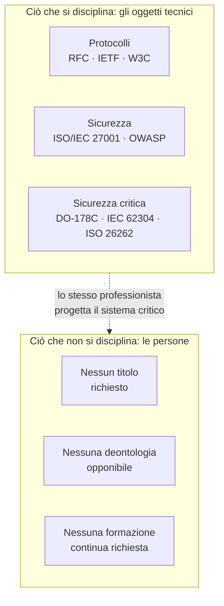
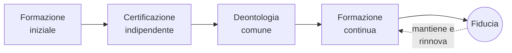
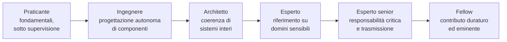

# Libro Bianco
## Per un riconoscimento progressivo della professione informatica

*Ordine Internazionale degli Esperti di Informatica (OEI) — Movimento fondatore internazionale — Versione 4*

---

> **Nota preliminare sullo statuto dell'organizzazione.** L'Ordine Internazionale degli Esperti di Informatica (OEI) è, in questa fase, un *movimento fondatore* sostenuto da un'*associazione*. Non è un ordine professionale in senso legale: un ordine professionale è istituito dalla legge, nell'ambito di una professione regolamentata dotata di atti riservati. Nessuna organizzazione privata può autoattribuirsi tale statuto. La parola « Ordine » è impiegata qui come nome d'uso e come orizzonte, non come titolo giuridico acquisito. Questa precisazione, conforme al nostro glossario e ai nostri statuti, viene ripetuta nel presente documento ovunque sia necessaria, non per prudenza retorica, ma perché è al centro della nostra onestà intellettuale.

---

## Prefazione personale dell'autore

Non ho scritto questo Libro Bianco perché all'informatica manchi riconoscimento. L'informatica è ovunque. È al centro delle banche, degli ospedali, dei trasporti, dell'industria, delle amministrazioni pubbliche e ormai dei sistemi di intelligenza artificiale che plasmano una parte crescente delle nostre decisioni collettive.

Ho scritto questo Libro Bianco perché un paradosso mi sembra sempre più evidente. Viviamo in un mondo in cui i software sono soggetti a norme, ad audit, a requisiti di sicurezza e di conformità sempre più rigorosi. Eppure le donne e gli uomini che progettano questi sistemi esercitano ancora una professione i cui contorni restano in gran parte indefiniti. Chiunque può presentarsi come esperto. I livelli di competenza sono estremamente variabili. Le responsabilità sono talvolta diluite. Gli obblighi deontologici sono raramente formalizzati.

Nel corso della mia carriera di ingegnere, sviluppatore, architetto software e poi responsabile tecnico, ho avuto l'opportunità di lavorare su sistemi finanziari, piattaforme critiche e progetti internazionali dove un semplice errore software poteva avere conseguenze importanti per migliaia di persone. Vi ho scoperto una realtà semplice: quando il software diventa un'infrastruttura, il mestiere di chi lo costruisce cambia natura.

L'obiettivo di questo documento non è creare una barriera artificiale all'ingresso della professione. Non è nemmeno riprodurre meccanicamente i modelli di altre professioni regolamentate. L'ambizione è più fondamentale. Si tratta di aprire una discussione internazionale sul modo in cui la nostra professione può prendere pienamente possesso del proprio ruolo nella società moderna. Una professione capace di definire i propri standard, di promuovere l'eccellenza tecnica, di trasmettere i propri saperi e di assumere collettivamente le proprie responsabilità.

Sono convinto che i decenni a venire vedranno l'informatica diventare una delle discipline più strutturanti della nostra civiltà. I sistemi digitali non sono più semplici strumenti; sono diventati infrastrutture di fiducia. Questa evoluzione ci obbliga.

Questo Libro Bianco non fornisce tutte le risposte. Costituisce anzitutto un invito alla riflessione, al dibattito e all'azione. Spero che contribuirà, anche modestamente, a far emergere una professione più forte, più responsabile e più consapevole del proprio ruolo nel mondo.

Yann Deungoué
Architetto software
Fondatore dell'iniziativa Ordine Internazionale degli Esperti di Informatica (OEI)

---

## Sull'autore

Yann Deungoué è ingegnere e architetto software. Nel corso del suo percorso — come sviluppatore, architetto, poi responsabile tecnico —, ha progettato, costruito e fatto evolvere sistemi finanziari, piattaforme critiche e progetti internazionali, in contesti in cui l'affidabilità, la sicurezza e la conformità dei software non sono opzioni ma requisiti di primaria importanza. È da questa pratica sul campo, a contatto con sistemi la cui difettosità può colpire migliaia di persone, che è nata la convinzione all'origine di questo Libro bianco: quando il software diventa un'infrastruttura, il mestiere di chi lo costruisce cambia natura e richiede una responsabilità commisurata ai suoi effetti.

Stabilito in Svizzera ed esercitante nel settore finanziario, ha fondato l'iniziativa Ordine Internazionale degli Esperti di Informatica (OEI) al fine di aprire, su scala internazionale, una discussione sul riconoscimento progressivo e sulla strutturazione della professione informatica. Difende a tal fine un approccio misurato e non allarmistico, mirato ai sistemi critici e attento a preservare l'apertura, la creatività e l'inclusione di talenti provenienti da ogni orizzonte che hanno fatto la ricchezza della disciplina.

*Una nota biografica più completa, accompagnata da un ritratto dell'autore, sarà integrata prima della stampa della versione definitiva.*

---

## Ringraziamenti

Questo Libro bianco deve molto a coloro che, a vario titolo, ne hanno accompagnato la maturazione. Ringrazio i primi lettori e revisori che hanno accettato di esaminare queste pagine senza compiacenza, e le cui obiezioni hanno contato quanto gli incoraggiamenti; i colleghi, ingegneri, architetti, responsabili della sicurezza e docenti con cui, nel corso degli anni, si sono forgiate le convinzioni qui esposte; la comunità professionale dell'informatica nel suo insieme, la cui apertura e generosità intellettuale restano, ai miei occhi, un modello da preservare piuttosto che da vincolare. La mia gratitudine va infine ai miei cari, la cui pazienza e il cui sostegno hanno reso possibile un lavoro condotto ai margini di un'attività impegnativa. Poiché questo documento è un primo contributo destinato a essere arricchito, i ringraziamenti più importanti sono senza dubbio quelli che dovrò, nelle versioni future, rivolgere ai suoi futuri contributori.

---

## Prefazione istituzionale

L'elettricità ha trasformato il XX secolo; il software trasforma il XXI. Questa frase, che apre il nostro manifesto, non è una figura retorica. Descrive un cambiamento materiale. In meno di due generazioni, il codice informatico è passato dallo statuto di strumento di calcolo specializzato a quello di tessuto connettivo delle società moderne. Regola il traffico aereo, dosa la radioterapia, esegue gli ordini di borsa, bilancia le reti elettriche, autentica le identità, distribuisce acqua ed energia, e media una parte crescente dei rapporti umani. Dove un tempo si vedevano macchine, ora ci sono programmi; e dietro questi programmi, professionisti le cui decisioni tecniche coinvolgono, spesso senza che nessuno lo misuri, la sicurezza e gli interessi di un gran numero di persone.

Questo Libro bianco parte da una constatazione semplice e verificabile: gli oggetti tecnici dell'informatica sono tra i più rigorosamente normalizzati al mondo, ma la professione che li concepisce non lo è quasi affatto. I protocolli di rete, i formati di scambio, gli algoritmi crittografici, le norme di sicurezza software sono oggetto di specifiche pubbliche, riviste, testate e opponibili. L'accesso al mestiere che li mette in opera, invece, resta nella maggior parte dei paesi interamente libero: senza requisito di competenza certificata, senza deontologia comune opponibile, senza obbligo di formazione continua. Questo squilibrio non è necessariamente uno scandalo — è il prodotto di una storia rapida e creativa. Ma è diventato un'anomalia che occorre nominare, documentare e, progressivamente, correggere.

Non pretendiamo di offrire una soluzione chiavi in mano, né di imporre un quadro uniforme a mestieri la cui diversità ne costituisce la ricchezza. Scrivere un sito vetrina non richiede le stesse garanzie di progettare il software embedded di uno stimolatore cardiaco. Il nostro proposito è mirato, graduato e volutamente modesto nelle sue pretese immediate: aprire un cantiere collettivo, porre un vocabolario comune, proporre un quadro di riferimento e una deontologia, e costruire la credibilità che permetterà, un giorno, nei paesi in cui il quadro giuridico lo consente, di prevedere un riconoscimento più formale. Questo documento non è un punto di arrivo. È un inizio, offerto alla critica di coloro — accademici, responsabili della sicurezza, ingegneri, giuristi del digitale, professionisti sul campo — i cui riscontri lo renderanno migliore.

---

## Sull'OEI

*L'Ordine Internazionale degli Esperti di Informatica (OEI) è un movimento fondatore, sostenuto da un'associazione, e non un ordine professionale in senso legale (vedi la nota preliminare). La sua ragion d'essere si riassume in una visione, una missione e un insieme di valori.*

### Visione

Un mondo in cui i professionisti che concepiscono, sviluppano e gestiscono i sistemi digitali da cui dipendono le nostre società — sanità, aviazione, energia, finanza, amministrazione — esercitano il loro mestiere con un livello di competenza, di etica e di responsabilità riconosciuto all'altezza delle poste in gioco che portano.

### Missione

Difendere l'interesse generale promuovendo un'informatica responsabile, etica, sicura e sostenibile, e far riconoscere progressivamente la professione di esperto informatico come una professione ad alta responsabilità, dotata:

- di un codice deontologico comune;
- di un quadro di riferimento delle competenze condiviso;
- di un requisito di formazione continua;
- di una rappresentanza credibile presso le istituzioni, le università e le imprese.

### Valori

Il nostro motto — **« Competenza. Etica. Responsabilità. »** — riassume lo spirito del movimento. Lo declinamo in cinque valori che guidano i nostri lavori e la nostra governance.

- **Competenza.** Poniamo la padronanza reale, verificabile e mantenuta lungo tutta la carriera al di sopra dei titoli, delle etichette e delle apparenze.
- **Etica.** Facciamo della deontologia — protezione dei dati, onestà, rifiuto di pratiche fraudolente o ingannevoli — un requisito professionale di primaria importanza, e non un supplemento d'animo.
- **Responsabilità.** Assumiamo che chi progetta un sistema critico risponda delle proprie scelte tecniche, senza mai rifugiarsi dietro uno strumento, una macchina o un sistema automatizzato.
- **Indipendenza.** Costruiamo la nostra legittimità, i nostri quadri di riferimento e le nostre valutazioni al riparo dagli interessi commerciali, in particolare dagli editori di software da cui intendiamo restare distinti.
- **Apertura.** Difendiamo una professione accogliente verso i talenti di ogni orizzonte, trasparente nei suoi processi, e non erigiamo alcun requisito se non dove la sicurezza collettiva lo giustifica.

### Nome, struttura e ambizione internazionale

L'Ordine Internazionale degli Esperti di Informatica (OEI) è il nome del *movimento*: quello che porta la visione esposta in questo Libro bianco e raduna i membri fondatori. Non va confuso con il nome dell'*entità giuridica* che lo ospita. Per evitare qualsiasi ambiguità con gli ordini professionali legalmente costituiti — una questione che diversi revisori ci hanno giustamente posto —, l'associazione promotrice sarà registrata sotto un nome istituzionale distinto, nella forma **OEI Foundation** o **Istituto internazionale della responsabilità informatica**, con la menzione esplicita « promotore del movimento Ordine Internazionale degli Esperti di Informatica ». Questa struttura a due livelli permette all'entità legale di restare neutra e priva di ambiguità, mentre il movimento conserva il nome che ne porta la visione e la memoria simbolica. Il nome legale definitivo sarà stabilito con il supporto di una consulenza legale, prima di qualsiasi deposito di marchio; fino ad allora, questo Libro bianco impiega sistematicamente la formula completa *Ordine Internazionale degli Esperti di Informatica — Movimento fondatore internazionale*.

Questa stessa esigenza di chiarezza si applica alla nostra ambizione geografica. L'OEI è concepito, sin dall'origine, come un'iniziativa *internazionale*: questo Libro bianco invita esplicitamente ad « aprire una discussione internazionale sul modo in cui la nostra professione può prendere pienamente possesso del proprio ruolo ». Ma un'ambizione internazionale non cancella la realtà giuridica: la sede legale, il nome legale dell'associazione e le sue rappresentanze territoriali dovranno, man mano che si sviluppa, essere distinti — e articolati — paese per paese, nel rispetto dei quadri giuridici locali (vedi anche l'Allegato A). La sigla OEI resta invariata; è il quadro istituzionale che la circonda a definirsi progressivamente.

---

## Sintesi esecutiva

*Questa sintesi restituisce in poche pagine l'essenziale del Libro bianco: il problema, la visione, le proposte, alcuni riferimenti numerici, la tabella di marcia e i benefici attesi. Può essere letta da sola e diffusa in modo autonomo; il corpo del documento sviluppa e approfondisce ciascuno di questi punti.*

### Il problema

L'informatica è oggi uno dei domini più rigorosamente normalizzati del mondo tecnico. I protocolli che fanno funzionare Internet (gli RFC dell'IETF), gli standard del Web (W3C), le norme di sicurezza (ISO/IEC 27001, raccomandazioni OWASP) e i quadri di riferimento di sicurezza dei sistemi critici (DO-178C per l'aeronautica embedded, IEC 62304 per i dispositivi medici, ISO 26262 per l'automotive) disciplinano minuziosamente gli oggetti tecnici. Eppure, nella grande maggioranza dei paesi, l'accesso alla professione che concepisce questi sistemi resta interamente libero: senza requisito di competenza certificata, senza deontologia comune opponibile, senza obbligo di formazione continua. Chiunque può presentarsi come esperto.

Questo paradosso crea un vuoto: gli artefatti sono disciplinati, le persone no. Ora, la qualità e la sicurezza di un sistema non dipendono soltanto dalla conformità dei suoi componenti; dipendono dai giudizi, dagli arbitraggi e dall'integrità dei professionisti che li assemblano. È un punto cieco collettivo, tanto più preoccupante in quanto gli effetti del software sul mondo hanno cambiato scala.

### Perché ora

Tre trasformazioni concomitanti rendono questo vuoto più problematico di quanto non fosse vent'anni fa:

- **L'intelligenza artificiale generativa** trasforma la natura stessa del lavoro software e sposta il valore dalla produzione di codice verso la capacità di specificare, verificare e assumersi la responsabilità di un sistema. Una macchina può proporre; un professionista deve rispondere.
- **La cybersicurezza** è diventata una questione di sicurezza collettiva: ospedali, enti locali, operatori energetici e catene logistiche figurano ormai tra gli obiettivi. Il movimento regolamentare accelera (NIS2, DORA, Cyber Resilience Act); la strutturazione della professione, invece, resta in ritardo.
- **La pressione economica e sociale globale** (messa in concorrenza tariffaria, precarizzazione, proliferazione di certificazioni commerciali legate a un prodotto) offusca i punti di riferimento e rende difficile, sia per i datori di lavoro sia per i poteri pubblici, distinguere la competenza autentica dalla sua contraffazione.

### La visione

La nostra tesi si riassume in una frase: il software è diventato un bene di interesse pubblico, paragonabile per i suoi effetti alle infrastrutture energetiche o di trasporto, e questa realtà deve tradursi nel modo in cui è organizzata la professione che lo produce.

Non proponiamo di disciplinare uniformemente l'insieme dei mestieri del digitale — scrivere un sito personale non richiede le stesse garanzie di progettare un software medicale embedded. Difendiamo un approccio *mirato e progressivo*, riassunto da un principio guida:

> Chiunque assuma la responsabilità tecnica di un sistema critico dovrebbe rispondere a requisiti minimi di competenza, formazione continua e deontologia.

### Chi è un esperto informatico?

Questa domanda ci è stata posta direttamente, e dobbiamo rispondervi senza esitazione piuttosto che lasciarla in sospeso. Un esperto informatico non è definito dal solo titolo di studio, dalla sola anzianità o dalla padronanza di un prodotto commerciale. La sua competenza risulta da una combinazione verificabile di conoscenze, esperienza, realizzazioni dimostrate, responsabilità effettivamente esercitata, capacità di giudizio di fronte a situazioni complesse, formazione continua e impegno deontologico. È questa definizione, resa operativa dal Quadro di riferimento delle competenze (vedi sezione 10), a distinguere la competenza professionale duratura dalla semplice produttività apparente o dalla certificazione commerciale — e che risponde sia agli incidenti evocati sopra sia al paradosso scolastico: saper scrivere codice, anche appreso da giovani, non equivale a portare questa responsabilità.

### Cosa proponiamo di costruire

1. **Un quadro di riferimento delle competenze e dei livelli di esperienza**, trasparente e pubblico, che descriva cos'è un esperto informatico secondo una scala graduata (Praticante, Ingegnere, Architetto, Esperto, Esperto senior, Fellow).
2. **Un codice deontologico comune**, ispirato alle professioni ad alta responsabilità: protezione dei dati, rifiuto delle pratiche fraudolente, dichiarazione dei conflitti di interesse, documentazione delle decisioni tecniche.
3. **Un quadro di certificazione indipendente dagli editori commerciali**, costruito con partner accademici, per distinguere la competenza professionale duratura dalla semplice padronanza di un prodotto.
4. **Un requisito di formazione continua**, sul modello delle professioni sanitarie, ripartita per grandi domini (IA, cybersicurezza, cloud, regolamentazione, etica, sobrietà digitale).
5. **Un osservatorio indipendente** che pubblichi regolarmente lo stato reale della professione.

### Alcuni riferimenti numerici

I dati precisi sulla professione informatica sono dispersi e metodologicamente fragili; ci atteniamo dunque a ordini di grandezza, segnalandone il carattere stimativo.

- Secondo le stime professionali comunemente citate, il numero di sviluppatori di software nel mondo si conta in **decine di milioni**, ed è in aumento di anno in anno. Nessuno di questi professionisti, nella maggior parte dei paesi, è tenuto a un titolo o a una deontologia opponibile per esercitare.
- Il costo annuale della criminalità informatica a livello mondiale è frequentemente stimato in **migliaia di miliardi di dollari**, con forti incertezze a seconda dei perimetri e dei metodi adottati. La tendenza al rialzo, invece, fa consenso.
- Il mercato delle tecnologie di intelligenza artificiale conosce una **crescita rapida**, a due cifre secondo la maggior parte delle analisi settoriali, il che accresce altrettanto la superficie delle decisioni affidate a sistemi automatizzati.
- Gli incidenti software maggiori illustrano ordini di grandezza eloquenti: un guasto di distribuzione è costato a una società finanziaria **circa 440 milioni di dollari in meno di un'ora** nel 2012; un aggiornamento difettoso di un software di sicurezza ha provocato, nel 2024, il blocco di **circa 8,5 milioni di dispositivi** nel mondo in poche ore, secondo l'editore del sistema operativo interessato.
- La **dipendenza digitale** delle società — pochi fornitori cloud, poche librerie universali, pochi componenti distribuiti in modo identico su milioni di macchine — concentra il rischio: un guasto in un punto può ormai propagarsi su scala planetaria.

Queste cifre misurano l'ampiezza del problema; non dimostrano che un'organizzazione professionale ridurrebbe meccanicamente la criminalità informatica — nessuna organizzazione può impedire a un attaccante determinato di agire. Mostrano invece che la competenza, la formazione continua e la responsabilità dei professionisti sono diventate componenti essenziali della resilienza digitale: è su questo registro, più modesto e più onesto di una promessa di riduzione meccanica, che si colloca il nostro contributo atteso.

### La tabella di marcia

Procediamo per *tappe sequenziali* piuttosto che per scadenze calendariali: consolidamento giuridico e dell'identità; base documentaria minima praticabile; presenza pubblica; corpus completo (deontologia, quadro di riferimento, carte); primo circolo di contributori credibili; riconoscimento allargato. Ogni tappa condiziona la successiva. Non si costruisce il riconoscimento prima del corpus, né il corpus prima del vocabolario comune.

### I benefici attesi

Per i **professionisti**: un riconoscimento della competenza reale, una protezione contro il livellamento verso il basso, riferimenti di carriera leggibili. Per i **datori di lavoro e i clienti**: una riduzione dell'asimmetria informativa, un reclutamento più sicuro, una valorizzazione delle squadre che investono nella propria competenza. Per la **società**: maggiore qualità, sicurezza, resilienza e fiducia in sistemi da cui dipendono la salute, la finanza, l'energia e i servizi pubblici.

### Ciò che non siamo

Non siamo un ordine professionale in senso legale; non abbiamo il potere di creare atti riservati né di condizionare l'accesso al mestiere, e nessuna organizzazione privata può autoattribuirselo. Siamo un movimento fondatore, sostenuto da un'associazione, che costruisce un corpus. Se questo corpus acquisisce una legittimità sufficiente, potrà servire da base per una discussione futura con le università, le imprese e, eventualmente, i poteri pubblici, nei paesi in cui il quadro giuridico lo consente.

---

## 1. Perché questo documento, perché ora

Si potrebbe obiettare che il dibattito sulla professionalizzazione dell'informatica è antico, e che non è mai approdato a nulla. È vero, ed è proprio per questo che occorre riprenderlo su basi nuove. Le condizioni sono cambiate. Tre trasformazioni concomitanti rendono il vuoto attuale più problematico di quanto non fosse vent'anni fa.

La prima è l'irruzione dell'intelligenza artificiale generativa nella produzione stessa del software. Strumenti capaci di scrivere, completare e correggere codice modificano profondamente la natura del lavoro e la definizione della competenza. Spostano il valore: meno verso la produzione di righe di codice, di più verso la capacità di specificare, verificare, arbitrare e assumersi la responsabilità di un sistema. Questo cambiamento rende tanto più necessario un quadro che distingua la competenza reale dalla semplice produttività apparente, e che ricordi che una macchina può proporre, ma un professionista deve rispondere. La questione della responsabilità umana, lungi dallo sparire, diventa centrale.

La seconda è la trasformazione della cybersicurezza in una questione di sicurezza collettiva. Gli attacchi informatici non colpiscono più solo dati commerciali; colpiscono ospedali, enti locali, operatori energetici, catene logistiche. Il ransomware WannaCry, nel 2017, ha disorganizzato parte del servizio sanitario britannico; lo stesso anno, l'attacco NotPetya si è propagato ben oltre i suoi obiettivi iniziali, immobilizzando in particolare i sistemi del vettore marittimo Maersk. Questi episodi hanno mostrato che un guasto software può avere effetti di sistema, sproporzionati rispetto all'incidente iniziale. Il legislatore lo ha compreso: l'Unione europea ha adottato quadri come la direttiva NIS2 per la resilienza delle infrastrutture essenziali, il regolamento DORA per il settore finanziario, o ancora il Cyber Resilience Act per la sicurezza dei prodotti digitali. Il movimento regolamentare accelera; la strutturazione della professione, invece, resta in ritardo.

La terza trasformazione è economica e sociale. La globalizzazione del lavoro informatico ha creato una pressione tariffaria e una precarizzazione che le professioni regolamentate comparabili non conoscono. La proliferazione di certificazioni commerciali, spesso legate a un editore e ai suoi prodotti, offusca i punti di riferimento: attestano la padronanza di uno strumento, raramente una competenza professionale trasferibile e duratura. Ne risulta un'asimmetria informativa difficile da correggere per i datori di lavoro, i clienti e i poteri pubblici: come distinguere, su un mercato opaco, la competenza autentica dalla sua contraffazione? Una professione che evolve tanto rapidamente quanto la medicina, ma che non dispone né del proprio quadro deontologico né del proprio requisito di formazione continua, si espone a una doppia perdita: di qualità per la società, di riconoscimento per i suoi membri.

Questo documento esiste per esporre queste constatazioni in modo ordinato, distinguere i fatti dalle opinioni e proporre una via. Si rivolge anzitutto alla professione stessa, poi alle istituzioni accademiche e alle imprese, e infine — ma solo quando la credibilità sarà stata pazientemente costruita — ai poteri pubblici.

## 2. Breve storia della professione informatica

Comprendere perché l'informatica non è strutturata come una professione presuppone di tornare alla sua giovinezza. A differenza della medicina o del diritto, i cui corpi professionali si sono formati nel corso di secoli, l'informatica ha meno di una vita umana. I primi computer universali programmabili risalgono agli anni 1940; la disciplina si è costituita camminando, portata da una successione di rotture piuttosto che da una lenta sedimentazione istituzionale.

Le sue figure fondatrici appartengono a mondi diversi: matematici, fisici, ingegneri elettronici, logici. Alan Turing formalizza già nel 1936 la nozione di calcolabilità; Grace Hopper sviluppa uno dei primi compilatori e contribuisce alla nascita di linguaggi leggibili da esseri umani, aprendo la via a un'informatica non più riservata ai progettisti di macchine. Man mano che l'hardware si banalizza, il baricentro si sposta verso il software — e con esso la complessità. Già alla fine degli anni 1960, i professionisti constatano che la produzione di programmi affidabili è molto più difficile del previsto: i progetti superano i budget, accumulano difetti, talvolta falliscono del tutto. È da questa diagnosi che emerge, in occasione di una conferenza della NATO tenutasi a Garmisch nel 1968, l'espressione « crisi del software » e la rivendicazione di una vera *ingegneria del software* (software engineering): applicare alla produzione di codice il rigore metodico dell'ingegneria.

L'ambizione era giusta, ma si è scontrata con una tensione mai risolta. L'ingegneria classica si basa su leggi fisiche stabili, materiali caratterizzati, margini di sicurezza collaudati. Il software, invece, è immateriale, infinitamente malleabile, e la sua complessità cresce senza i vincoli fisici che limitano un ponte o un motore. Questa plasticità è la sua forza — spiega la velocità prodigiosa dell'innovazione digitale — ma ha anche alimentato una cultura professionale riluttante alla standardizzazione delle persone. Il talento individuale, l'autodidattismo, la capacità di apprendere in fretta sono sempre stati valorizzati più del titolo di studio o del titolo professionale. Molti dei contributori più influenti del settore non hanno mai seguito un percorso formale in informatica. Questa apertura è un patrimonio prezioso, e non intendiamo rinunciarvi.

Va detto chiaramente, perché condiziona la nostra proposta: l'assenza di barriere all'ingresso è stata un motore di innovazione e di inclusione. Ha permesso a talenti provenienti da orizzonti diversi di contribuire, ed ha evitato le rendite di posizione che irrigidiscono certe professioni chiuse. La nostra tesi non è che questa libertà sia stata un errore. È che, in un perimetro preciso — quello dei sistemi critici — il costo sociale dell'assenza totale di requisiti è diventato superiore al beneficio dell'apertura illimitata. La professione è maturata; i suoi effetti sul mondo hanno cambiato scala. È tempo che la sua strutturazione raggiunga, prudentemente e senza rinnegare nulla, questa trasformazione.

## 3. Il software come infrastruttura critica

Che un software possa uccidere, rovinare o paralizzare non è un'ipotesi teorica. È un fatto documentato, illustrato da una serie di incidenti diventati casi di scuola, studiati nei corsi di ingegneria di tutto il mondo. Richiamarli non ha nulla di sensazionalistico: costituiscono la prova empirica che alcuni sistemi software appartengono davvero alla categoria delle infrastrutture critiche, nel senso del nostro glossario — sistemi la cui difettosità può comportare conseguenze gravi per la sicurezza delle persone, l'economia o il funzionamento di infrastrutture essenziali.

Nella **sanità**, l'apparecchio di radioterapia Therac-25, a metà degli anni 1980, ha somministrato a diversi pazienti sovradosaggi massicci di radiazioni, causando decessi e gravi conseguenze. L'inchiesta ha mostrato che la causa non era un componente difettoso ma un insieme di difetti software — una condizione di competizione (*race condition*) tra processi, una fiducia eccessiva nel software dopo la rimozione di blocchi hardware, una gestione insufficiente degli stati di errore. Questo caso resta, quarant'anni dopo, il riferimento per insegnare che un difetto software può avere conseguenze letali e che la sicurezza di un sistema non si riduce mai a quella dei suoi componenti hardware.

Nell'**aeronautica**, il volo inaugurale dell'Ariane 5, nel 1996, si è concluso con la distruzione del lanciatore pochi secondi dopo il decollo. La causa: il riutilizzo di un modulo software ereditato dall'Ariane 4, in cui la conversione di un valore in virgola mobile in un intero di formato più corto ha provocato un overflow non intercettato. Più recentemente, i due incidenti del Boeing 737 MAX, nel 2018 e nel 2019, sono costati la vita a 346 persone; le inchieste hanno chiamato in causa un sistema di compensazione automatica (MCAS) che si basava su un'unica fonte di dati e il cui comportamento non era stato correttamente documentato né trasmesso agli equipaggi. Questi drammi illustrano una lezione ricorrente: non sono sempre gli algoritmi più sofisticati a fallire, ma le ipotesi implicite, i difetti di specifica e le zone di responsabilità mal definite.

Nella **finanza**, la società Knight Capital ha perso circa 440 milioni di dollari in meno di un'ora, nel 2012, a seguito della distribuzione difettosa di un software di negoziazione automatizzata che ha inviato ordini errati a un ritmo incontrollabile — un incidente che ha rischiato di travolgere l'azienda. Nell'**energia**, il grande blackout elettrico che ha colpito il nord-est del Nord America nel 2003, privando decine di milioni di persone di elettricità, è stato aggravato da un difetto software nel sistema di allarme di un centro di controllo, che ha impedito agli operatori di percepire in tempo il degrado della situazione. Infine, nel 2024, un semplice aggiornamento difettoso di un software di sicurezza ampiamente diffuso ha provocato, secondo l'editore del sistema operativo interessato, il blocco di circa 8,5 milioni di dispositivi nel mondo in poche ore — bloccando aerei a terra, perturbando ospedali, banche e amministrazioni. Questo episodio ha reso tangibile una realtà che gli esperti chiamano da tempo: la *dipendenza sistemica*. Un componente unico, presente ovunque, diventa un punto di guasto planetario.

Ciò che accomuna questi incidenti, al di là della diversità dei settori, è che nessuno di essi rientra nella fatalità. Ciascuno chiama in causa catene di decisioni umane: scelte architetturali, arbitraggi sui tempi, procedure di test insufficienti, responsabilità diluite. È esattamente ciò che le discipline che disciplinano i sistemi critici cercano di regolare — ed è qui che si gioca lo scarto, su cui torneremo, tra il rigore imposto agli artefatti e la libertà totale lasciata alle persone.

Occorre tuttavia guardarsi da una lettura troppo affrettata di questi episodi, che equivarrebbe ad assimilare guasto maggiore e incompetenza individuale. Nessuno dei casi citati sopra dimostra una mancanza di competenza tecnica dei professionisti coinvolti: le inchieste chiamano in causa, a seconda dei casi, difetti di specifica, scelte architetturali discutibili a posteriori, test insufficienti, vincoli economici, una governance carente o una diluizione delle responsabilità tra più squadre — raramente un semplice errore che una migliore competenza individuale sarebbe bastata a evitare. È proprio questa constatazione a fondare la nostra tesi: la competenza tecnica, anche reale, non basta; deve iscriversi in un quadro collettivo di governance, deontologia e capacità di segnalare i rischi, senza il quale le migliori competenze individuali restano impotenti di fronte a guasti organizzativi.

## 4. I nuovi rischi: IA, cybersicurezza, dipendenza sistemica

Ai rischi classici del software critico si aggiungono oggi rischi di natura nuova, che richiedono competenze e una vigilanza di cui la professione non si è ancora collettivamente dotata.

Il primo riguarda la **generalizzazione dell'intelligenza artificiale** nei sistemi decisionali. I modelli di apprendimento automatico non si programmano nel senso classico: si addestrano su dati, e il loro comportamento emerge da questo addestramento piuttosto che da una specifica esplicita. Ne risultano proprietà inedite — opacità delle decisioni, sensibilità ai bias presenti nei dati, comportamenti imprevedibili al di fuori del dominio di addestramento, difficoltà a garantire un risultato riproducibile. Quando tali sistemi intervengono nella selezione delle candidature, nella concessione di crediti, nell'assistenza alla diagnosi medica o nella moderazione dei contenuti, la questione della responsabilità diventa acuta. La nozione di *IA responsabile*, come la definiamo — trasparenza, equità, sicurezza e responsabilità umana — non è un supplemento d'animo: è un requisito di ingegneria. I legislatori iniziano a inserirla nel diritto, come nel caso del regolamento europeo sull'intelligenza artificiale, che gradua gli obblighi secondo il livello di rischio. Ma un testo di legge non forma professionisti: occorrono ancora professionisti capaci di applicarlo con discernimento.

Il secondo rischio è quello della **cybersicurezza**, ormai indissociabile dalla progettazione stessa dei sistemi. Le vulnerabilità software non sono più incidenti isolati ma un fenomeno strutturale. La falla Heartbleed, scoperta nel 2014 in una libreria crittografica onnipresente, ha esposto i dati di milioni di server; la vulnerabilità Log4Shell, nel 2021, ha colpito una libreria di logging talmente diffusa che ci sono voluti mesi per censirne tutti gli usi. Questi episodi rivelano una dipendenza profonda da componenti software condivisi, spesso sviluppati e mantenuti da una manciata di volontari, da cui dipende tuttavia una parte immensa dell'economia digitale. Il tentativo di introdurre una backdoor in un'utility di compressione ampiamente diffusa, sventato per un pelo nel 2024, ha mostrato che questa catena di approvvigionamento software costituisce una superficie di attacco a pieno titolo. Mettere in sicurezza un sistema non si limita più a proteggerne il perimetro: occorre comprendere, tracciare e padroneggiare l'insieme delle sue dipendenze.

Il terzo rischio, trasversale, è la **dipendenza sistemica** stessa. La mutualizzazione delle infrastrutture — pochi fornitori cloud, poche librerie universali, pochi software di sicurezza distribuiti in modo identico su milioni di macchine — apporta immensi guadagni di efficienza, ma concentra il rischio. Un guasto in un punto si propaga ormai su scala mondiale, come ha mostrato il blackout globale del 2024 evocato sopra. Questa questione si ricollega a quella della *sovranità digitale*: la capacità di uno Stato, di un'organizzazione o di un individuo di controllare le proprie infrastrutture e le proprie scelte tecnologiche senza dipendenza eccessiva da terzi. Non affrontiamo questo tema sotto un'angolatura ideologica, ma sotto quella della resilienza: un sistema di cui non si controllano né i componenti né i punti di concentrazione è un sistema di cui non si controlla il rischio.

Questi tre rischi hanno un denominatore comune: eccedono la competenza di un singolo individuo e richiedono una cultura professionale condivisa — metodi, deontologia, aggiornamento continuo dei saperi. È esattamente ciò che una professione organizzata può offrire.

## 5. Informatica verde e sobrietà digitale

Una questione a lungo trascurata si impone ormai: l'impronta ambientale del digitale. Si è visto dapprima nell'informatica una tecnologia « pulita », immateriale, contrapposta alle industrie pesanti. Questa immagine è ingannevole. Dietro l'apparente immaterialità del software si nascondono data center energivori, reti di telecomunicazione mondiali, e soprattutto un flusso considerevole di apparecchiature la cui fabbricazione mobilita risorse rare e un'energia importante.

Le stime disponibili collocano la quota del digitale intorno a qualche punto percentuale delle emissioni mondiali di gas serra — un ordine di grandezza spesso paragonato a quello del trasporto aereo — e questa quota è in crescita. Restiamo prudenti sulle cifre precise, che variano a seconda delle metodologie e del perimetro adottato, ma la tendenza di fondo non è in discussione: la domanda di calcolo cresce rapidamente, sospinta in particolare dallo sviluppo dell'intelligenza artificiale, il cui addestramento e il cui utilizzo dei grandi modelli sono particolarmente energivori e materialmente onerosi. Un punto fa consenso tra le analisi serie: la parte preponderante dell'impatto proviene dalla fabbricazione dei terminali e delle apparecchiature, più che dal loro solo consumo elettrico in funzionamento. Ciò significa che l'allungamento della vita utile dell'hardware e la sobrietà nel rinnovo delle apparecchiature pesano almeno quanto l'efficienza energetica dei data center.

È qui che entra in gioco la responsabilità del professionista, poiché numerose decisioni apparentemente tecniche hanno conseguenze ambientali dirette. Un'architettura software mal concepita può moltiplicare inutilmente i bisogni di calcolo e di storage. Un software i cui requisiti crescono senza necessità — ciò che talvolta si chiama « obesità del software » — spinge alla sostituzione prematura di hardware ancora funzionante, generando rifiuti elettronici evitabili. Al contrario, una progettazione sobria, un'ottimizzazione delle elaborazioni, un dimensionamento adeguato delle infrastrutture e una scelta ponderata delle localizzazioni di calcolo possono ridurre significativamente l'impronta, spesso migliorando al contempo le prestazioni e i costi. L'*informatica verde*, come la definiamo — l'insieme delle pratiche volte a ridurre l'impronta ambientale dei sistemi digitali — non è dunque un dominio separato riservato a specialisti: è una dimensione trasversale del mestiere, al pari della sicurezza.

Emergono quadri e comunità per strumentare questa esigenza, come i lavori condotti attorno all'ecoprogettazione software, alla misurazione dell'impronta delle applicazioni, o ai principi sostenuti da collettivi dedicati al software sostenibile. I poteri pubblici e i regolatori se ne stanno occupando a loro volta, con obblighi crescenti di misurazione e riduzione dell'impronta digitale. Riteniamo che la sobrietà digitale debba figurare esplicitamente nel quadro di riferimento delle competenze e nel codice deontologico della professione: non come un vincolo subito, ma come un marcatore di qualità professionale. Progettare un sistema efficiente significa anche progettarlo sobrio.

## 6. Il paradosso: sistemi normalizzati, professione non regolamentata

Tocchiamo qui il cuore della nostra argomentazione. L'informatica presenta una singolarità sorprendente: pochi domini dell'attività umana hanno normalizzato tanto i propri oggetti tecnici, e strutturato così poco l'accesso alla professione che li produce.

Lo schema seguente riassume questo squilibrio: da un lato, una pila di requisiti tecnici densa e opponibile; dall'altro, un'assenza pressoché totale di requisiti riguardanti le persone — mentre si tratta, spesso, dello stesso professionista.

Consideriamo anzitutto l'ampiezza della normalizzazione tecnica. Le comunicazioni digitali si basano su migliaia di specifiche pubbliche e riviste — gli RFC pubblicati dall'IETF per i protocolli di Internet, gli standard del W3C per il Web, le norme ISO e IEC per innumerevoli aspetti del software e dei dati. La sicurezza dispone dei propri quadri di riferimento: la norma ISO/IEC 27001 per i sistemi di gestione della sicurezza delle informazioni, le raccomandazioni dell'OWASP per la sicurezza applicativa, i cataloghi pubblici di vulnerabilità e i loro sistemi di valutazione. I domini ad alta criticità vanno ancora oltre: la norma DO-178C disciplina il software embedded aeronautico e impone una tracciabilità rigorosa tra requisiti, codice e test; la norma IEC 62304 regola il ciclo di vita del software dei dispositivi medici; la norma ISO 26262 tratta la sicurezza funzionale dei sistemi automotive; la norma generica IEC 61508 fonda un'intera famiglia di requisiti per i sistemi relativi alla sicurezza. In questi settori, un componente software non può essere messo in servizio senza soddisfare requisiti dettagliati, verificabili e opponibili.

Consideriamo ora l'altro versante. Nella grande maggioranza dei paesi, nessuna qualifica è legalmente richiesta per progettare, sviluppare o gestire la maggior parte di questi sistemi. Una stessa persona può, senza alcun titolo riconosciuto né impegno deontologico opponibile, scrivere il codice che tratterà dati sanitari, orchestrerà transazioni finanziarie o pilotare un'apparecchiatura industriale. Laddove il medico, l'avvocato, il farmacista o il commercialista esercitano una professione regolamentata — il cui accesso è condizionato da un titolo, un diploma o un'iscrizione, e disciplinato da una deontologia e da una disciplina —, l'informatica resta, nel senso del nostro glossario, una professione che non è né regolamentata né ovunque organizzata.

Il paradosso si formula allora semplicemente: disciplinamo scrupolosamente gli artefatti, e per nulla le persone che li producono. Ora, la qualità e la sicurezza di un sistema non dipendono soltanto dalla conformità dei suoi componenti a delle norme; dipendono dai giudizi, dagli arbitraggi e dall'integrità dei professionisti che li assemblano. Le norme tecniche presuppongono professionisti competenti per applicarle con discernimento — ma nulla garantisce questa competenza, né la mantiene nel tempo. È un punto cieco collettivo.

Occorre per questo pretendere che l'informatica sia l'unica professione in questa situazione? No, e sarebbe disonesto lasciarlo credere. Il consulting manageriale, la sicurezza privata al di fuori degli atti regolamentati, l'analisi dei dati (*data science*), una parte della consulenza in conformità o certi mestieri dell'edilizia al di fuori degli atti riservati combinano, anch'essi, una normalizzazione tecnica densa e un accesso professionale largamente aperto. La singolarità dell'informatica non deriva dunque dal suo isolamento, ma dalla combinazione, a questo grado, di quattro fattori: la sua presenza in tutti i settori di attività, la velocità della sua evoluzione, la sua capacità di propagazione su scala mondiale, e conseguenze che possono essere al contempo fisiche, economiche e sociali. Poche professioni riuniscono contemporaneamente questi quattro tratti; è questa combinazione, più dell'assenza di ogni termine di paragone, a giustificare il nostro approccio.

Occorre guardarsi da una conclusione eccessiva. Questo paradosso non significa che si debba regolamentare l'insieme del mestiere, né erigere barriere là dove l'apertura ha dato prova di sé. Significa che manca un anello: tra la norma tecnica, che si applica all'oggetto, e il diritto comune, che si applica a tutti, non esiste un quadro professionale intermedio proprio ai sistemi critici. È questo anello che proponiamo di costruire, cominciando dal documentarlo e renderlo desiderabile, piuttosto che pretendere di imporlo.

## 7. Modelli internazionali esistenti

Non partiamo da una pagina bianca. Altre professioni, e l'informatica stessa in alcune delle sue componenti, hanno costruito forme di strutturazione da cui possiamo trarre ispirazione — distinguendo con cura ciò che rientra in uno statuto legale, che non abbiamo, da ciò che rientra in un'autorità acquisita tramite la qualità, a cui possiamo puntare.

Il primo modello è quello degli **ordini professionali classici**: medici, farmacisti, architetti, commercialisti. Il loro punto comune è associare un titolo protetto dalla legge, un codice deontologico opponibile, un'istanza disciplinare e un requisito di formazione continua. Queste professioni dimostrano che è possibile conciliare un alto livello di requisiti con la fiducia del pubblico nel tempo. Ne traiamo la grammatica — deontologia, competenza verificata, formazione continua, disciplina — senza rivendicarne lo statuto legale, che presuppone una legge che non abbiamo il potere di emanare.

Il secondo modello, più direttamente pertinente, è quello dell'**ingegneria regolamentata**, di cui l'esempio canadese è illuminante. In Quebec, l'Ordine degli ingegneri del Quebec disciplina il titolo di ingegnere, protetto dalla legge, con attività riservate in alcuni domini e un meccanismo disciplinare. La tradizione canadese ha persino forgiato un rituale — l'anello di ferro consegnato agli ingegneri laureati — per ancorare simbolicamente la coscienza della responsabilità. L'ingegneria del software vi è stata parzialmente integrata a questo quadro. Negli Stati Uniti, una licenza di ingegnere professionale (Professional Engineer) in ingegneria del software è persino esistita, prima che l'esame corrispondente venisse abbandonato per mancanza di un numero sufficiente di candidati — segno che la trasposizione del modello dell'ingegneria fisica al software si scontra ancora con resistenze culturali e pratiche. Queste esperienze, comprese nei loro limiti, sono per noi una fonte di insegnamento preziosa: mostrano al contempo la via e i suoi ostacoli.

Il terzo modello è probabilmente il più ispiratore per la nostra situazione immediata: quello delle **grandi organizzazioni tecniche prive di statuto di ordine**. L'IEEE e l'ACM, società scientifiche di riferimento in elettronica e informatica, hanno elaborato insieme un codice etico dell'ingegneria del software che è autorevole a livello intellettuale ben al di là di qualsiasi quadro legale. L'IETF e il W3C producono gli standard che fanno funzionare Internet e il Web senza possedere alcun potere vincolante: la loro autorità si basa interamente sulla qualità dei loro lavori, sulla trasparenza dei loro processi e sull'adesione volontaria della comunità. Queste organizzazioni dimostrano che una legittimità forte può costruirsi senza statuto legale, per il solo tramite di un riconoscimento meritato. È esattamente la traiettoria che puntiamo per l'OEI nella sua prima fase: diventare un punto di riferimento per la qualità, prima ancora di essere, forse un giorno, un'istituzione riconosciuta dal diritto.

Da questi modelli traiamo una linea guida: prendere in prestito dagli ordini il loro rigore deontologico e la loro cultura della responsabilità; prendere in prestito dall'ingegneria regolamentata la sua gradazione dei livelli e la sua nozione di attività sensibili; prendere in prestito dalle grandi organizzazioni tecniche il loro metodo — l'autorità tramite la qualità, l'apertura e la trasparenza, piuttosto che tramite il vincolo.

## 8. La nostra tesi e la nostra proposta

La nostra tesi si riassume in una frase: il software è diventato un bene di interesse pubblico, paragonabile per i suoi effetti alle infrastrutture energetiche o di trasporto, e questa realtà deve tradursi nel modo in cui è organizzata la professione che lo produce. Quando un sistema informatico controlla un aereo, un ospedale, una banca o una rete elettrica, un errore può avere conseguenze umane ed economiche maggiori. La società ha il diritto di attendersi, da coloro che assumono questa responsabilità, un livello di competenza, di etica e di vigilanza all'altezza della posta in gioco.

Da questa tesi discende una proposta di cui vogliamo sottolineare fin da subito il carattere *mirato e progressivo*, perché è ciò che la distingue dai tentativi passati. Non proponiamo di disciplinare uniformemente l'insieme dei mestieri del digitale. Una simile pretesa sarebbe al contempo irrealistica e dannosa: soffocherebbe l'innovazione, creerebbe rendite di posizione e si scontrerebbe a ragione con il rifiuto della professione. Il nostro principio guida è il seguente:

> Chiunque assuma la responsabilità tecnica di un sistema critico dovrebbe rispondere a requisiti minimi di competenza, formazione continua e deontologia.

La parola determinante è *critico*, nel senso preciso del nostro glossario. Scrivere un sito personale, un videogioco indipendente o uno strumento interno senza conseguenze per la sicurezza o l'economia non richiede alcuna delle garanzie che auspichiamo. Progettare il software embedded di un dispositivo medico, l'orchestrazione di una rete elettrica o il cuore transazionale di un sistema bancario rientra in un altro regime di responsabilità. È su questo perimetro ristretto che il requisito deve concentrarsi — un perimetro che il Quadro di riferimento delle competenze avrà il compito di delimitare con rigore, evitando sia l'estensione eccessiva sia la restrizione compiacente.

Ciò che proponiamo di costruire si declina in cinque cantieri, sviluppati nelle sezioni seguenti. Primo, un *quadro di riferimento delle competenze e dei livelli di esperienza*, trasparente e pubblico, che descriva cos'è un esperto informatico secondo una scala graduata. Secondo, un *codice deontologico comune*, ispirato alle professioni ad alta responsabilità. Terzo, un *quadro di certificazione indipendente dagli editori commerciali*, costruito con partner accademici, per distinguere la competenza professionale duratura dalla semplice padronanza di un prodotto. Quarto, un *requisito di formazione continua*, sul modello delle professioni sanitarie, che riconosca che la competenza informatica si deteriora in fretta e deve essere mantenuta. Quinto, un *osservatorio indipendente* che pubblichi regolarmente lo stato reale della professione.

Questi cinque cantieri non sono giustapposti: formano una catena del valore coerente, in cui ogni anello produce la materia del successivo e in cui l'insieme converge verso un unico obiettivo — la fiducia. La formazione iniziale alimenta la certificazione; la certificazione si articola a una deontologia comune; la deontologia si mantiene tramite la formazione continua; ed è da questo insieme che nasce, a beneficio dei professionisti quanto della società, la fiducia nei sistemi critici.

Vogliamo essere chiari sulla finalità di questa proposta, perché la domanda ci è stata posta a ragione: strutturare una professione può essere percepito come un tentativo di limitare la concorrenza, di proteggere un mercato del lavoro o di restringere l'accesso al mestiere — un riflesso corporativista che gli ordini professionali hanno talvolta potuto incarnare in passato. Non è la nostra logica, e poniamo questa gerarchia senza ambiguità:

1. la protezione del pubblico;
2. la fiducia nei sistemi da cui dipendono le nostre società;
3. la qualità professionale;
4. il riconoscimento degli esperti.

Il riconoscimento e la protezione dei professionisti — migliore leggibilità di carriera, legittimo rifiuto di istruzioni pericolose, protezione contro l'usurpazione di competenza — sono una conseguenza desiderabile di questa strutturazione, non la sua finalità primaria. È questa gerarchia, e non il contrario, a distinguere il nostro approccio da un'impresa corporativista.

È importante ribadire ciò che non siamo. Non siamo un ordine professionale in senso legale; non abbiamo il potere di creare atti riservati né di condizionare l'accesso al mestiere. Siamo un movimento fondatore, sostenuto da un'associazione, che costruisce un corpus. Se questo corpus acquisisce una legittimità sufficiente, potrà servire da base per una discussione futura con le università, le imprese e, eventualmente, i poteri pubblici, nei paesi in cui il quadro giuridico lo consente. Non cerchiamo di erigere una barriera artificiale né un monopolio, ma di migliorare la qualità, la trasparenza e la fiducia — a beneficio dei professionisti stessi quanto della società.

## 9. Governance proposta

Un'organizzazione che pretende di promuovere il rigore e l'etica deve essere essa stessa esemplare nel proprio funzionamento. La governance dell'OEI risponde a tre principi: sobrietà istituzionale — creare un organo solo quando diventa necessario; trasparenza — rendere pubblici i processi e le produzioni; e prevenzione dei conflitti di interesse, in particolare nei confronti degli editori commerciali da cui vogliamo restare indipendenti.

La forma giuridica di partenza è quella di un'*associazione*, dotata di statuti, di un'assemblea generale e di un consiglio di amministrazione. Questa scelta — associazione legge 1901 in Francia o associazione ai sensi degli articoli 60 e seguenti del Codice civile svizzero — offre una base legale leggera, senza capitale minimo, adatta a un movimento nascente. Non pregiudica le forme successive, più ambiziose, che l'organizzazione potrà assumere se il suo riconoscimento si allarga; ma costituisce un punto di partenza realistico e immediatamente operativo. La scelta precisa della giurisdizione, che comporta conseguenze fiscali e di responsabilità, deve essere stabilita con il supporto di un professionista del diritto.

L'assemblea generale riunisce i membri e detiene la sovranità sugli orientamenti, i conti e l'elezione del consiglio di amministrazione. Il consiglio di amministrazione amministra l'associazione ed elegge al proprio interno un ufficio di presidenza — presidenza, vicepresidenza, segreteria generale, tesoreria. La composizione dei membri riflette la maturità progressiva del progetto: *membri fondatori*, presenti prima del primo riconoscimento pubblico allargato; *membri qualificati*, che soddisferanno i criteri di competenza e di deontologia una volta operativo il quadro di certificazione; *membri associati*, persone od organizzazioni che sostengono la missione senza ancora rispondere ai criteri di qualifica; e *membri onorari*, invitati a titolo onorifico per il loro contributo al settore. Questa gradazione è importante: permette di accogliere fin d'ora sostenitori, senza pretendere di qualificare membri secondo criteri che non esistono ancora. Non si rilascia una qualifica prima di aver definito ciò che essa attesta.

Il lavoro di fondo è affidato a *consigli* tematici — gruppi di lavoro specializzati in etica, cybersicurezza, intelligenza artificiale, cloud, informatica verde, formazione, architettura — incaricati di produrre raccomandazioni pubbliche sottoposte alla convalida del consiglio di amministrazione. Questi consigli sono il motore intellettuale dell'organizzazione; è tramite la qualità dei loro lavori, sul modello delle grandi organizzazioni tecniche evocate sopra, che si costruirà la nostra legittimità. Una funzione di *osservatorio* è ad essi collegata, incaricata di pubblicare regolarmente dati sullo stato della professione.

Due organi hanno vocazione a vedere la luce solo in una fase di maturità avanzata, e teniamo a precisarlo per non lasciar credere a poteri che non esercitiamo. Il meccanismo di *qualifica* dei membri presuppone che il Quadro di riferimento delle competenze sia finalizzato; sarà attivato solo a quel momento. La *camera disciplinare*, incaricata di istruire le violazioni del codice deontologico tra i membri qualificati, potrà funzionare solo quando il quadro di certificazione e di qualifica sarà esso stesso maturo e incontestabile. Instaurare una disciplina senza una base solida sarebbe illegittimo; ce lo vietiamo. Infine, in tutta la sua comunicazione, l'organizzazione deve precisare il proprio statuto associativo ed evitare qualsiasi confusione con un ordine professionale legalmente costituito — regola che i nostri statuti sanciscono nero su bianco.

## 10. Quadro di certificazione e livelli

La certificazione è il cantiere più delicato, poiché è quello in cui il rischio di riprodurre le derive che denunciamo è maggiore. Il mercato abbonda già di certificazioni; molte attestano la padronanza di un prodotto commerciale particolare piuttosto che una competenza professionale trasferibile e duratura. La nostra ambizione è precisamente proporre una *certificazione indipendente*, nel senso del nostro glossario: rilasciata dall'organizzazione o dai suoi partner accademici, e non legata a un editore commerciale di software.

Prima di dettagliare questa scala, occorre chiarire una confusione frequente, che ci è stata peraltro segnalata da una revisora esterna al settore: l'insegnamento delle basi del codice alle medie, ormai diffuso in numerosi sistemi scolastici, non fa di ogni alunno un professionista dell'informatica, così come l'insegnamento delle scienze a scuola non fa di ogni alunno un ingegnere. Distinguiamo dunque quattro livelli ben diversi. La **cultura digitale** è la capacità generale di comprendere e utilizzare le tecnologie digitali — un obiettivo di educazione per tutti, non uno statuto professionale. Il **praticante informatico** svolge attività tecniche in un perimetro definito, generalmente sotto supervisione. Il **professionista** esercita regolarmente un'attività informatica con responsabilità identificate. L'**esperto informatico**, infine, è il professionista capace di trattare situazioni complesse, di produrre un giudizio autonomo, di dimostrarne la validità e di assumerne le conseguenze — la definizione posta nella sintesi esecutiva di questo documento.

La base di questo quadro è una scala di *livelli di esperienza*, che il nostro glossario fissa così: Praticante, Ingegnere, Architetto, Esperto, Esperto senior, e Fellow. Questa progressione non è una gerarchia di prestigio ma una gradazione di responsabilità e autonomia, che si può leggere come il ciclo di vita professionale dell'esperto informatico: a ciascun gradino corrispondono conoscenze, capacità dimostrate ed esperienza verificabile che si approfondiscono.

Il Praticante padroneggia i fondamentali e lavora sotto supervisione; l'Ingegnere progetta e realizza componenti in modo autonomo; l'Architetto assume la coerenza di sistemi interi e gli arbitraggi strutturanti; l'Esperto e l'Esperto senior portano una responsabilità di riferimento su domini sensibili, compresi quelli critici, e sulla trasmissione; il Fellow è un riconoscimento di contributo duraturo ed eminente alla disciplina. Ogni livello dovrà essere definito con precisione nel Quadro di riferimento delle competenze, associando a ciascun gradino conoscenze, capacità dimostrate ed esperienza verificabile.

Tre principi devono governare questo quadro affinché non diventi una certificazione in più. Il primo è l'*indipendenza*: la progettazione dei quadri di riferimento e la valutazione devono essere tenute al riparo dagli interessi commerciali, il che presuppone un ancoraggio accademico e regole rigorose di prevenzione dei conflitti di interesse. Il secondo è la *validità*: una certificazione ha valore solo se misura realmente ciò che pretende di misurare. Ciò implica di privilegiare la valutazione di competenze dimostrate — studi di caso, revisioni di realizzazioni, simulazioni — rispetto al semplice controllo di conoscenze mnemoniche, e di sottoporre il dispositivo stesso a una valutazione critica regolare. Il terzo è la *trasparenza*: i quadri di riferimento, i criteri e i processi devono essere pubblici, affinché il valore della certificazione possa essere apprezzato da tutti — datori di lavoro, pari, pubblico.

Vogliamo essere espliciti su un limite, per onestà. Finché l'OEI non ha un riconoscimento legale — e abbiamo detto che non ce l'ha —, una certificazione che rilascerebbe non ha alcun valore giuridico; non condiziona l'accesso ad alcun mestiere e non conferisce alcun titolo protetto. Il suo valore, in un primo tempo, sarà puramente quello di un segnale di qualità, sul modello degli standard prodotti da organizzazioni prive di potere vincolante ma universalmente rispettate. È una scelta assunta: preferiamo una certificazione priva di valore legale ma realmente credibile, a un titolo altisonante privo di sostanza. La credibilità si costruirà tramite il rigore del dispositivo e tramite il riconoscimento che ne faranno, volontariamente, le università e i datori di lavoro. È solo al termine di questo percorso che un riconoscimento più formale potrà, eventualmente, essere discusso.

## 11. Formazione continua obbligatoria

Di tutte le nostre proposte, il requisito di formazione continua è forse il meno contestabile, tanto discende direttamente dalla natura del mestiere. Poche professioni vedono i propri saperi rinnovarsi tanto velocemente quanto l'informatica. Linguaggi, architetture, minacce, quadri regolamentari appaiono e si trasformano in pochi anni. Un professionista che smettesse di formarsi vedrebbe la propria competenza erodersi rapidamente — non per mancanza di talento, ma per obsolescenza dei saperi. In questo, l'informatica si avvicina alla medicina, dove la formazione continua è da tempo un obbligo riconosciuto, proprio perché la sicurezza delle persone dipende da conoscenze aggiornate.

Proponiamo dunque che la *formazione continua*, nel senso del nostro glossario — un obbligo di aggiornamento regolare delle competenze, formalizzato in ore annuali per dominio — diventi un pilastro della qualità di membro qualificato, una volta operativo questo statuto. Prevediamo una ripartizione per grandi domini: intelligenza artificiale, cybersicurezza, cloud e infrastrutture, regolamentazione, etica, e sobrietà digitale. L'obiettivo non è contabilizzare ore per se stesse, ma garantire che un professionista che si avvale di un livello di competenza mantenga effettivamente i saperi corrispondenti. La formazione continua è il naturale corrispettivo della certificazione: la prima attesta una competenza in un dato istante, la seconda garantisce che non si deteriori.

Questo requisito deve essere concepito con realismo, per non diventare un vincolo burocratico scollegato dalla pratica. Tre precauzioni ci sembrano essenziali. Anzitutto, la *diversità delle modalità riconosciute*: la formazione continua non si riduce a corsi formali; comprende la partecipazione a lavori di normazione, il contributo a progetti aperti, la pubblicazione, il tutoraggio, il monitoraggio strutturato. Una professione che apprende molto tramite la pratica e la condivisione tra pari deve valorizzare queste forme. Poi, l'*indipendenza dei contenuti*: come per la certificazione, la formazione continua non deve trasformarsi in un canale di promozione commerciale mascherata; i contenuti legati a un prodotto possono costituirne solo una parte limitata. Infine, la *proporzionalità*: il requisito deve essere più elevato per coloro che intervengono su sistemi critici, e alleggerito altrove, in coerenza con il principio mirato che governa l'insieme del nostro approccio.

Finché il quadro di qualifica non è operativo, questo requisito resterà una raccomandazione e un impegno volontario, non un obbligo opponibile — non potremmo imporre ciò che non abbiamo ancora il mandato di controllare. Ma intendiamo, fin d'ora, porne i principi, documentare percorsi di riferimento, e dare l'esempio all'interno stesso dell'organizzazione.

## 12. Partenariati mirati

Un'organizzazione come la nostra non può riuscire da sola; la sua legittimità si costruirà nella relazione con tre famiglie di attori, la cui adesione volontaria sarà il miglior indicatore della nostra credibilità. Affrontiamo questi partenariati in uno spirito di cooperazione e non di appropriazione: cerchiamo di completare l'esistente, non di competere con esso.

I primi partner sono le **università e le scuole**. Sono loro che formano i futuri professionisti, loro che detengono l'indipendenza accademica necessaria per concepire quadri di riferimento delle competenze e dispositivi di valutazione al riparo dagli interessi commerciali. Un partenariato con il mondo accademico è la condizione stessa della credibilità del nostro quadro di certificazione. Desideriamo lavorarvi in modo concreto: co-costruzione di quadri di riferimento, ancoraggio scientifico delle valutazioni, articolazione con i percorsi e i diplomi esistenti — non per sostituirli, ma per offrire un linguaggio comune che colleghi la formazione iniziale e l'esercizio professionale. Gli istituti riconosciuti nelle scienze informatiche e nell'ingegneria, in Europa francofona e oltre, costituiscono il nostro primo circolo di interlocutori naturali.

I secondi partner sono le **imprese**, in particolare quelle che progettano o gestiscono sistemi critici. Hanno un interesse diretto nel nostro approccio: un quadro di riferimento comune e una deontologia condivisa riducono l'asimmetria informativa sul mercato del lavoro, mettono in sicurezza il reclutamento, e valorizzano i professionisti che investono nella propria competenza. I responsabili della sicurezza dei sistemi informativi e le direzioni tecniche apportano, dal canto loro, l'ancoraggio operativo senza il quale i nostri quadri di riferimento resterebbero teorici. Proponiamo di associarli sotto forma di impegni volontari — una carta delle imprese partner — meno vincolante di un codice deontologico, ma portatrice di un riconoscimento reciproco.

I terzi partner, a più lungo termine, sono le **istituzioni e i poteri pubblici**. Li affrontiamo per ultimi, e volutamente. Sarebbe presuntuoso, e contrario alla nostra onestà dichiarata, sollecitare un riconoscimento istituzionale prima di aver dato prova della nostra serietà. La nostra strategia è inversa: costruire prima un corpus solido e partenariati accademici e professionali credibili, poi, solo allora, contribuire alle consultazioni pubbliche esistenti sul digitale e far valere la nostra competenza. Il riconoscimento istituzionale, se verrà, sarà la conseguenza della nostra credibilità, non il suo presupposto. Ci rivolgiamo ai poteri pubblici come a un possibile traguardo, mai come a un avallo che ci arrogheremmo.

In tutti questi partenariati, una regola resta ferma: ricordare il nostro statuto reale. Siamo un movimento associativo, non un ordine legale, e impegniamo i nostri partner solo sulla base di una scelta libera e consapevole.

## 13. Tabella di marcia

La nostra tabella di marcia è deliberatamente concepita in *tappe sequenziali* piuttosto che in scadenze calendariali. Un movimento fondatore non progredisce al ritmo di un calendario imposto, ma al ritmo della maturità effettiva delle sue produzioni e dell'adesione che suscita. Annunciare date che nulla garantisce nuocerebbe alla nostra credibilità; preferiamo descrivere un ordine logico di tappe, ciascuna delle quali condiziona la successiva.

La prima tappa è il *consolidamento giuridico e dell'identità*: costituzione dell'associazione, protezione del nome e dei nomi di dominio, deposito del marchio nelle giurisdizioni pertinenti, riserva di una presenza online coerente. È il mattone legale minimo, quello che dà al movimento un'esistenza formale e protegge il suo nome.

La seconda tappa è l'istituzione di una *base documentaria minima praticabile*: un glossario consolidato, una visione, una missione e un manifesto chiari, la sintesi esecutiva del presente Libro bianco pubblicabile immediatamente, e gli statuti dell'associazione. Questa base esiste già in gran parte; il presente Libro bianco completo ne costituisce il naturale prolungamento. Segue poi la tappa della *presenza pubblica*: un sito web di prima versione, la diffusione della sintesi esecutiva, e una comunicazione fattuale, rigorosa, priva di polemica — poiché la nostra autorità si costruirà tramite la sobrietà del discorso quanto tramite la solidità del contenuto.

La quarta tappa è quella del *corpus completo*: oltre al Libro bianco, il codice deontologico, il Quadro di riferimento delle competenze e dei livelli, e le carte destinate ai membri, alle imprese e alle università. È la base intellettuale su cui poggerà ogni futuro riconoscimento. La quinta tappa consiste nel riunire un *primo circolo* di contributori credibili — accademici, responsabili della sicurezza, direzioni tecniche, giuristi del digitale — sollecitati anzitutto per pareri e revisioni puntuali, mai per un'adesione immediata. La costituzione di un consiglio consultivo informale precederà qualsiasi struttura permanente.

L'ultima tappa è quella del *riconoscimento allargato*: partenariati formalizzati con università e scuole, partecipazione alle consultazioni pubbliche esistenti sul digitale, e pubblicazione di un rapporto regolare sullo stato della professione da parte della funzione di osservatorio. È solo a questo stadio che la questione di un riconoscimento istituzionale più formale potrà essere legittimamente posta, nei paesi in cui il quadro giuridico lo consente. Insistiamo sull'ordine di queste tappe: ciascuna presuppone la precedente. Non si costruisce il riconoscimento prima del corpus, né il corpus prima del vocabolario comune. Questa disciplina della progressione è, di per sé, una garanzia di serietà.

## 14. Conclusione e appello all'azione

Abbiamo voluto, in questo Libro bianco, tenere insieme due esigenze che potrebbero sembrare contraddittorie: l'ambizione e la modestia. L'ambizione, perché la constatazione è seria e merita una risposta commisurata — il software è diventato un'infrastruttura critica delle nostre società, e la professione che lo produce non dispone della strutturazione che questa responsabilità richiederebbe. La modestia, perché sappiamo cosa siamo e cosa non siamo. Non siamo un ordine professionale in senso legale; non ne abbiamo il potere, e nessuna organizzazione privata può autoattribuirselo. Siamo un movimento fondatore che propone, documenta e costruisce — pazientemente, apertamente, senza pretesa di un'autorità che non abbiamo.

La nostra proposta è mirata: non regolamentare uniformemente tutti i mestieri del digitale, ma fare in modo che coloro che assumono la responsabilità tecnica di sistemi critici possano appoggiarsi su un quadro di riferimento delle competenze condiviso, una deontologia comune, una certificazione indipendente e una formazione continua. È progressiva: avanza per tappe, ciascuna delle quali condiziona la successiva, senza bruciare le fasi né promettere ciò che non può mantenere. È aperta: non cerca né monopolio, né barriera artificiale, ma il miglioramento della qualità, della trasparenza e della fiducia — a beneficio dei professionisti quanto della società.

A coloro che dubitassero dell'utilità dell'approccio, ricordiamo i casi di scuola evocati in questo documento: non sono incidenti isolati ma i sintomi di un punto cieco collettivo, quello di una professione i cui effetti sul mondo hanno cambiato scala senza che la sua strutturazione seguisse. A coloro che temessero una chiusura del mestiere, rispondiamo che la storia stessa dell'informatica — la sua apertura, la sua creatività, la sua inclusione di talenti provenienti da ogni orizzonte — è un patrimonio che intendiamo preservare, e che il nostro requisito riguarda solo un perimetro preciso, laddove il costo sociale dell'assenza di ogni garanzia è diventato manifesto.

Questo documento è una versione 3, e resterà a lungo un'opera in corso per scelta metodologica: vogliamo che sia criticato, corretto, arricchito prima di essere considerato definitivo. Invitiamo dunque a contribuire gli accademici, i responsabili della sicurezza dei sistemi informativi, i giuristi del digitale, gli ingegneri e i professionisti sul campo. Che siate in disaccordo con la nostra diagnosi, riservati sulle nostre proposte, o pronti a contribuirvi, la vostra voce ci è utile. Competenza, etica, responsabilità: queste tre parole non sono uno slogan, ma un programma di lavoro. Questo progetto non è un punto di arrivo — è un inizio, e appartiene a voi quanto a noi.

---

## I 10 impegni dell'esperto informatico

*Versione condensata del codice deontologico, destinata a una lettura rapida. Ogni impegno è sviluppato nel codice deontologico completo; in caso di dubbio, quest'ultimo fa fede.*

1. **Pongo la sicurezza delle persone e l'interesse pubblico al di sopra di qualsiasi altro interesse**, incluso quello commerciale o gerarchico, quando entrano in conflitto.
2. **Esercito solo entro i limiti della mia competenza reale** e segnalo onestamente ciò che non padroneggio piuttosto che dissimularlo.
3. **Proteggo i dati che mi vengono affidati**, la loro riservatezza, la loro integrità e la privacy delle persone interessate.
4. **Progetto la sicurezza fin dall'origine del sistema**, e non come una correzione aggiunta a posteriori.
5. **Documento le mie decisioni tecniche importanti**, le loro ipotesi e i loro limiti, affinché possano essere comprese, verificate e riprese.
6. **Dichiaro i miei conflitti di interesse** e rifiuto qualsiasi pratica fraudolenta, ingannevole o dissimulata.
7. **Rispondo delle mie scelte tecniche** e non mi rifugio mai dietro uno strumento, una macchina o un sistema automatizzato per esonerarmi dalla mia responsabilità.
8. **Progetto sistemi sobri**, attenti alla loro impronta ambientale e al giusto consumo delle risorse.
9. **Mantengo la mia competenza tramite una formazione continua regolare**, consapevole che i saperi dell'informatica si deteriorano in fretta.
10. **Trasmetto il mio sapere e rispetto i miei pari**, contribuendo a elevare il livello collettivo della professione piuttosto che a proteggere un vantaggio individuale.

---

## Carta del membro fondatore

*Impegno volontario, espresso in prima persona, che sottoscrive chiunque si unisca all'OEI in qualità di membro fondatore. Questa carta non ha valore legale opponibile; è un impegno morale e una dichiarazione di intenti condivisa.*

Unendomi all'Ordine Internazionale degli Esperti di Informatica in qualità di membro fondatore, mi impegno a:

- **Servire la missione** del movimento: contribuire a un riconoscimento progressivo, mirato e onesto della professione informatica, a beneficio della società quanto dei professionisti.
- **Rispettare la verità sul nostro statuto**: non presentare mai l'OEI come un ordine professionale legalmente costituito, e ricordare, ogni volta che sia necessario, che si tratta di un movimento fondatore sostenuto da un'associazione.
- **Far prevalere la qualità sulla posa**: costruire la nostra legittimità tramite il rigore dei nostri lavori e la trasparenza dei nostri processi, e non tramite titoli o pretese di autorità che non abbiamo.
- **Difendere l'apertura della professione**: promuovere il requisito laddove è necessario — sui sistemi critici — senza mai cercare di erigere barriere artificiali né di proteggere rendite di posizione.
- **Incarnare gli impegni deontologici** che proponiamo alla professione, dando l'esempio con la mia stessa pratica, anche in materia di formazione continua e di sobrietà digitale.
- **Prevenire i conflitti di interesse**, in particolare nei confronti degli editori commerciali, e preservare l'indipendenza dell'organizzazione.
- **Contribuire in buona fede** al corpus comune — tramite revisione, critica costruttiva, produzione o diffusione — in uno spirito di cooperazione e di rispetto dei pari.
- **Accogliere il contraddittorio**: considerare le critiche e i disaccordi come materia prima del progetto, e non come una minaccia.

Sottoscrivo questi impegni liberamente, consapevole che mi vincolano sull'onore e che riflettono lo spirito in cui questo movimento è stato fondato.

---

## Allegato A — Stato della professione nel mondo

*Questo allegato propone un panorama comparativo, volutamente qualitativo, della strutturazione della professione informatica in alcuni paesi. Le informazioni che seguono riflettono una situazione generale ed evolutiva, a nostra conoscenza e alla data di redazione; non costituiscono un parere legale e dovranno essere verificate e aggiornate con il supporto di specialisti locali. Il tratto comune a tutti questi paesi merita di essere sottolineato fin da subito: da nessuna parte l'informatica è, ad oggi, una professione regolamentata in senso pieno — dotata di un titolo protetto e di atti riservati propri — come lo sono la medicina o il diritto.*

**Francia.** L'informatica non vi è una professione regolamentata: nessun titolo né diploma è legalmente richiesto per progettare o gestire la maggior parte dei sistemi. Il titolo di « ingénieur diplômé » è disciplinato dalla Commission des titres d'ingénieur (CTI), ma protegge una qualifica accademica e non un atto professionale riservato all'informatica. Esistono organizzazioni professionali e datoriali del digitale (federazioni di settore, società scientifiche), prive di carattere ordinistico. Su domini specifici, il diritto impone funzioni od obblighi — ad esempio il responsabile della protezione dei dati nell'ambito del RGPD —, ma si tratta di ruoli regolamentari mirati, non di uno statuto della professione.

**Svizzera.** La professione informatica non vi è maggiormente regolamentata in senso ordinistico. La formazione si basa su un solido sistema duale e su titoli rilasciati dai politecnici e dalle scuole universitarie professionali; associazioni professionali e organismi di settore strutturano la formazione continua e le certificazioni di mestiere. Come in Francia, non esiste un titolo di esperto informatico protetto dalla legge né un ordine dotato di un potere disciplinare sull'insieme della professione.

**Canada (e Quebec).** Il Canada offre l'esempio più compiuto di ingegneria regolamentata. In Quebec, l'Ordine degli ingegneri del Quebec protegge il titolo di ingegnere, previsto dalla legge, con attività riservate in alcuni domini e un meccanismo disciplinare; la tradizione dell'anello di ferro vi ancora simbolicamente la responsabilità. L'ingegneria del software vi è stata parzialmente integrata a seconda delle province. Esistono peraltro designazioni professionali proprie del settore informatico sostenute da associazioni, ma esse non conferiscono, in linea generale, lo stesso statuto legale del titolo di ingegnere. Nessun ordine copre specificamente l'insieme degli informatici non ingegneri.

**Stati Uniti.** L'accesso alla professione vi è essenzialmente libero. La licenza di ingegnere professionale (Professional Engineer) è rilasciata a livello statale e riguarda soprattutto l'ingegneria fisica; un esame di licenza in ingegneria del software è esistito prima di essere abbandonato, per mancanza di un numero sufficiente di candidati — illustrazione delle resistenze alla trasposizione del modello dell'ingegneria classica al software. La strutturazione passa soprattutto attraverso società scientifiche di primo piano (IEEE, ACM), la cui autorità è intellettuale e volontaria, e attraverso un mercato fiorente di certificazioni private, spesso legate a editori.

**Regno Unito.** La professione non vi è regolamentata dalla legge, ma dispone di un dispositivo di riconoscimento volontario relativamente sviluppato. Un'istituzione professionale di riferimento, dotata di una carta reale, conferisce statuti professionali (ad esempio un riconoscimento di professionista « chartered » dell'informatica), e una via di accesso allo statuto di ingegnere « chartered » esiste tramite l'organo nazionale competente in ingegneria. Questi riconoscimenti valorizzano la competenza e l'impegno deontologico, ma si basano sull'adesione volontaria e non condizionano legalmente l'esercizio.

**Germania.** Il titolo di « ingegnere » (Ingenieur) vi beneficia di una forma di protezione, con varianti a seconda dei Länder, principalmente ereditata dall'ingegneria tradizionale. La professione informatica in sé non è regolamentata in senso ordinistico; si basa su un sistema di formazione duale riconosciuto e su una società scientifica nazionale influente in informatica, che contribuisce ai quadri di riferimento e all'etica della disciplina senza esercitare un potere disciplinare generale.

**Cosa insegna questo panorama.** Nonostante tradizioni istituzionali molto diverse, nessuno di questi paesi ha dotato l'informatica di un quadro professionale completo — titolo protetto, deontologia opponibile, disciplina e formazione continua obbligatoria — paragonabile a quello delle professioni sanitarie o del diritto. Laddove esiste una strutturazione, essa segue la via dell'ingegneria regolamentata (Canada), oppure quella del riconoscimento volontario da parte di istituzioni scientifiche (Regno Unito, Stati Uniti, Germania). Questa constatazione conforta il nostro orientamento: cominciare a costruire, su scala internazionale e tramite l'adesione volontaria, l'autorità tramite la qualità, prima di prevedere, paese per paese e solo laddove il quadro giuridico lo consente, un riconoscimento più formale.

---

## Allegato B — Bibliografia e riferimenti

*Questo allegato censisce le norme, le organizzazioni e i quadri regolamentari citati nel corpo del Libro bianco. Ogni voce ne fornisce la denominazione ufficiale e una breve descrizione. Gli identificativi di norme e testi regolamentari menzionati di seguito sono riferimenti pubblici e stabili; il lettore è invitato a consultare, presso gli organismi che li pubblicano, la versione in vigore al momento della lettura, poiché le norme e i regolamenti sono oggetto di revisioni periodiche.*

### Organizzazioni e società scientifiche

- **IEEE** — *Institute of Electrical and Electronics Engineers*: società scientifica internazionale di riferimento in ingegneria elettrica, elettronica e informatica, editrice di norme e pubblicazioni scientifiche.
- **ACM** — *Association for Computing Machinery*: società scientifica internazionale dedicata all'informatica, alla sua ricerca e al suo insegnamento.
- **IETF** — *Internet Engineering Task Force*: organizzazione aperta che elabora e pubblica gli standard tecnici di Internet sotto forma di documenti *RFC (Request for Comments)*.
- **W3C** — *World Wide Web Consortium*: organismo internazionale di normazione delle tecnologie del Web (HTML, CSS, protocolli e formati associati).
- **OWASP** — *Open Worldwide Application Security Project*: comunità aperta senza scopo di lucro che produce raccomandazioni, strumenti e quadri di riferimento per la sicurezza delle applicazioni.
- **Ordine degli ingegneri del Quebec (OIQ)** — ordine professionale disciplinato dal Codice delle professioni del Quebec, che disciplina il titolo di ingegnere protetto dalla legge, le sue attività riservate e la sua disciplina.

### Testi deontologici di riferimento

- **IEEE-CS/ACM Software Engineering Code of Ethics and Professional Practice** — codice etico e di pratica professionale dell'ingegneria del software, elaborato congiuntamente dall'IEEE Computer Society e dall'ACM; riferimento internazionale sebbene privo di valore legale vincolante.

### Norme tecniche, di sicurezza e di safety

- **ISO/IEC 27001** — norma internazionale relativa ai sistemi di gestione della sicurezza delle informazioni (SGSI), pubblicata dall'ISO e dall'IEC.
- **DO-178C** — quadro di riferimento *Software Considerations in Airborne Systems and Equipment Certification*, che disciplina il software embedded aeronautico e impone una tracciabilità rigorosa tra requisiti, codice e test.
- **IEC 62304** — norma che disciplina i processi del ciclo di vita del software dei dispositivi medici.
- **ISO 26262** — norma che tratta la sicurezza funzionale dei sistemi elettrici ed elettronici dei veicoli stradali.
- **IEC 61508** — norma generica di sicurezza funzionale dei sistemi elettrici, elettronici ed elettronici programmabili relativi alla sicurezza, base di una famiglia di norme settoriali derivate.
- **CVE / CVSS** — *Common Vulnerabilities and Exposures* (catalogo pubblico e normalizzato delle vulnerabilità di sicurezza) e *Common Vulnerability Scoring System* (sistema pubblico di valutazione della loro gravità).

### Quadri regolamentari dell'Unione europea

- **RGPD** — Regolamento generale sulla protezione dei dati, Regolamento (UE) 2016/679, relativo alla protezione delle persone fisiche con riguardo al trattamento dei dati personali.
- **Direttiva NIS2** — Direttiva (UE) 2022/2555, che innalza il livello comune di cybersicurezza e resilienza delle reti e dei sistemi informativi delle entità essenziali e importanti nell'Unione.
- **DORA** — *Digital Operational Resilience Act*, Regolamento (UE) 2022/2554, sulla resilienza operativa digitale del settore finanziario.
- **Cyber Resilience Act (CRA)** — regolamento dell'Unione europea relativo ai requisiti di cybersicurezza dei prodotti con elementi digitali, adottato nel 2024.
- **Regolamento sull'intelligenza artificiale (AI Act)** — Regolamento (UE) 2024/1689, che stabilisce regole armonizzate sull'intelligenza artificiale secondo un approccio graduato per livello di rischio.

---

*Questo Libro bianco costituisce una versione 3.1 di consolidamento, redatta a seguito di una rilettura esterna della versione 3. Integra ormai, oltre alla prefazione personale dell'autore, la sezione Sull'autore, la sezione Sull'OEI (visione, missione, valori), la sintesi esecutiva autonoma, gli schemi esplicativi, la versione condensata del codice deontologico, la carta del membro fondatore, il panorama internazionale e la bibliografia di riferimento: una chiarificazione della struttura a due livelli tra l'entità legale e il movimento nonché dell'ambizione internazionale (sezione Sull'OEI), una definizione operativa esplicita dell'esperto informatico (sintesi esecutiva e sezione 10), una gerarchia esplicita delle finalità che pone la protezione del pubblico prima del riconoscimento professionale (sezione 8), una distinzione tra cultura digitale ed esperienza professionale (sezione 10), e sfumature di causalità sulla criminalità informatica (sintesi esecutiva) e sulle cause dei guasti maggiori (sezione 3), per evitare qualsiasi promessa o scorciatoia che i fatti non permettano di stabilire. I termini impiegati seguono le definizioni del Glossario fondatore dell'OEI, documento di riferimento a cui il lettore è invitato a fare riferimento.*
