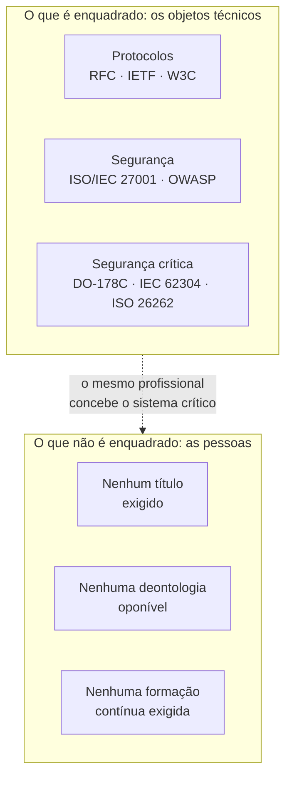
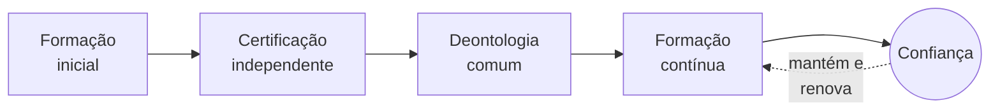
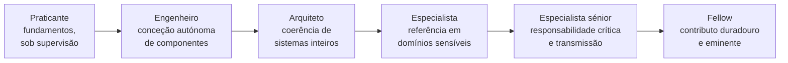

# Livro Branco
## Por um reconhecimento progressivo da profissão informática

*Ordem dos Especialistas em Informática (OEI) — Movimento fundador — Versão 3*

---

> **Nota preliminar sobre o estatuto da organização.** A Ordem dos Especialistas em Informática (OEI) é, nesta fase, um *movimento fundador* apoiado numa *associação*. Não é uma ordem profissional no sentido legal do termo: uma ordem profissional é criada pela lei, no quadro de uma profissão regulamentada dotada de atos reservados. Nenhuma organização privada pode autoatribuir-se este estatuto. A palavra «Ordem» é aqui empregue como designação de uso e como horizonte, não como título jurídico adquirido. Esta precisão, conforme ao nosso glossário e aos nossos estatutos, é repetida no presente documento sempre que necessário, não por prudência retórica, mas porque está no cerne da nossa honestidade intelectual.

---

## Prefácio pessoal do autor

Não escrevi este Livro Branco porque a informática careça de reconhecimento. A informática está em toda a parte. Está no cerne dos bancos, dos hospitais, dos transportes, da indústria, das administrações públicas e, atualmente, dos sistemas de inteligência artificial que moldam uma parte crescente das nossas decisões coletivas.

Escrevi este Livro Branco porque um paradoxo me parece cada vez mais evidente. Vivemos num mundo em que o software está sujeito a normas, a auditorias, a exigências de segurança e de conformidade cada vez mais estritas. No entanto, as mulheres e os homens que concebem estes sistemas exercem ainda uma profissão cujos contornos permanecem largamente indefinidos. Qualquer pessoa se pode apresentar como especialista. Os níveis de competência são extremamente variáveis. As responsabilidades são por vezes diluídas. As obrigações deontológicas raramente são formalizadas.

Ao longo da minha carreira de engenheiro, de programador, de arquiteto de software e depois de responsável técnico, tive a oportunidade de trabalhar em sistemas financeiros, plataformas críticas e projetos internacionais em que um simples erro de software podia ter consequências importantes para milhares de pessoas. Descobri aí uma realidade simples: quando o software se torna infraestrutura, a profissão de quem o constrói muda de natureza.

O objetivo deste documento não é criar uma barreira artificial à entrada na profissão. Também não é reproduzir mecanicamente os modelos de outras profissões regulamentadas. A ambição é mais fundamental. Trata-se de abrir uma discussão internacional sobre a forma como a nossa profissão pode assumir plenamente o seu papel na sociedade moderna. Uma profissão capaz de definir os seus padrões, de promover a excelência técnica, de transmitir os seus saberes e de assumir coletivamente as suas responsabilidades.

Estou convencido de que as próximas décadas verão a informática tornar-se uma das disciplinas mais estruturantes da nossa civilização. Os sistemas digitais deixaram de ser meras ferramentas; tornaram-se infraestruturas de confiança. Esta evolução obriga-nos.

Este Livro Branco não traz todas as respostas. Constitui, acima de tudo, um convite à reflexão, ao debate e à ação. Espero que contribua, ainda que modestamente, para fazer emergir uma profissão mais forte, mais responsável e mais consciente do seu papel no mundo.

Yann Deungoué
Arquiteto de software
Fundador da iniciativa Ordem dos Especialistas em Informática (OEI)

---

## Sobre o autor

Yann Deungoué é engenheiro e arquiteto de software. Ao longo do seu percurso — como programador, arquiteto e, depois, responsável técnico —, concebeu, construiu e fez evoluir sistemas financeiros, plataformas críticas e projetos internacionais, em ambientes onde a fiabilidade, a segurança e a conformidade do software não são opções, mas exigências de primeira ordem. É desta prática de terreno, em contacto com sistemas cuja falha pode afetar milhares de pessoas, que nasceu a convicção na origem deste Livro Branco: quando o software se torna infraestrutura, a profissão de quem o constrói muda de natureza e exige uma responsabilidade à medida dos seus efeitos.

Estabelecido na Suíça e exercendo no setor financeiro, fundou a iniciativa Ordem dos Especialistas em Informática (OEI) para abrir, à escala internacional, uma discussão sobre o reconhecimento progressivo e a estruturação da profissão informática. Defende para isso uma abordagem ponderada e não alarmista, centrada nos sistemas críticos e atenta a preservar a abertura, a criatividade e a inclusão de talentos vindos de todos os horizontes que fizeram a riqueza da disciplina.

*Uma nota biográfica mais completa, acompanhada de um retrato do autor, será integrada antes da impressão da versão definitiva.*

---

## Agradecimentos

Este Livro Branco deve muito a quem, de uma forma ou de outra, acompanhou a sua maturação. Agradeço aos primeiros leitores e revisores que aceitaram examinar estas páginas sem complacência, e cujas objeções contaram tanto quanto os incentivos; aos colegas, engenheiros, arquitetos, responsáveis de segurança e professores com os quais, ao longo dos anos, se forjaram as convicções aqui expostas; à comunidade profissional da informática no seu conjunto, cuja abertura e generosidade intelectual continuam a ser, a meu ver, um modelo a preservar mais do que a constranger. A minha gratidão vai, por fim, para os meus próximos, cuja paciência e apoio tornaram possível um trabalho conduzido à margem de uma atividade exigente. Sendo este documento um primeiro contributo chamado a ser enriquecido, os agradecimentos mais importantes serão, sem dúvida, os que deverei, nas versões futuras, dirigir aos seus futuros colaboradores.

---

## Prefácio institucional

A eletricidade transformou o século XX; o software transforma o século XXI. Esta frase, que abre o nosso manifesto, não é uma figura de estilo. Descreve uma viragem material. Em menos de duas gerações, o código informático passou do estatuto de ferramenta de cálculo especializada ao de tecido conjuntivo das sociedades modernas. Regula o tráfego aéreo, ajusta as doses de radioterapia, executa as ordens de bolsa, equilibra as redes elétricas, autentica identidades, distribui água e energia, e medeia uma parte crescente das relações humanas. Onde antes se viam máquinas, há agora programas; e por detrás desses programas, profissionais cujas decisões técnicas comprometem, muitas vezes sem que ninguém o meça, a segurança e os interesses de um grande número de pessoas.

Este Livro Branco parte de uma constatação simples e verificável: os objetos técnicos da informática contam-se entre os mais rigorosamente normalizados do mundo, mas a profissão que os concebe quase não o é. Os protocolos de rede, os formatos de intercâmbio, os algoritmos criptográficos, as normas de segurança de software são objeto de especificações públicas, revistas, testadas e oponíveis. O acesso à profissão que os aplica, esse, permanece na maioria dos países inteiramente livre: sem exigência de competência certificada, sem deontologia comum oponível, sem obrigação de formação contínua. Este desequilíbrio não é necessariamente um escândalo — é o produto de uma história rápida e criativa. Mas tornou-se uma anomalia que é preciso nomear, documentar e, progressivamente, corrigir.

Não pretendemos apresentar uma solução chave na mão, nem impor um quadro uniforme a profissões cuja diversidade constitui a sua riqueza. Escrever um site institucional não requer as mesmas garantias que conceber o software embarcado de um pacemaker. O nosso propósito é focado, gradual e voluntariamente modesto nas suas pretensões imediatas: abrir um trabalho coletivo, estabelecer um vocabulário comum, propor um referencial e uma deontologia, e construir a credibilidade que permitirá, um dia, nos países onde o quadro jurídico o permita, considerar um reconhecimento mais formal. Este documento não é um culminar. É um começo, oferecido à crítica daqueles — académicos, responsáveis de segurança, engenheiros, juristas do digital, praticantes no terreno — cujos comentários o tornarão melhor.

---

## Sobre a OEI

*A Ordem dos Especialistas em Informática (OEI) é um movimento fundador, apoiado numa associação, e não uma ordem profissional no sentido legal do termo (ver a nota preliminar). A sua razão de ser resume-se numa visão, numa missão e num conjunto de valores.*

### Visão

Um mundo onde os profissionais que concebem, desenvolvem e exploram os sistemas digitais dos quais dependem as nossas sociedades — saúde, aviação, energia, finanças, administração — exerçam a sua profissão com um nível de competência, ética e responsabilidade reconhecido à altura dos desafios que assumem.

### Missão

Defender o interesse geral promovendo uma informática responsável, ética, segura e sustentável, e fazer reconhecer progressivamente a profissão de especialista em informática como uma profissão de alta responsabilidade, dotada:

- de um código deontológico comum;
- de um referencial de competências partilhado;
- de uma exigência de formação contínua;
- de uma representação credível junto das instituições, universidades e empresas.

### Valores

O nosso lema — **«Competência. Ética. Responsabilidade.»** — resume o espírito do movimento. Desdobramo-lo em cinco valores que orientam os nossos trabalhos e a nossa governação.

- **Competência.** Colocamos o domínio real, verificável e mantido ao longo da carreira acima dos títulos, dos rótulos e das aparências.
- **Ética.** Fazemos da deontologia — proteção de dados, honestidade, recusa de práticas fraudulentas ou enganosas — uma exigência profissional de primeira ordem, e não um mero verniz.
- **Responsabilidade.** Assumimos que quem concebe um sistema crítico responde pelas suas escolhas técnicas, sem nunca se refugiar atrás de uma ferramenta, uma máquina ou um sistema automatizado.
- **Independência.** Construímos a nossa legitimidade, os nossos referenciais e as nossas avaliações à margem dos interesses comerciais, em particular dos fornecedores de software, dos quais pretendemos manter-nos distintos.
- **Abertura.** Defendemos uma profissão acolhedora aos talentos de todas as origens, transparente nos seus processos, e só erguemos exigências onde a segurança coletiva o justifica.

---

## Síntese executiva

*Esta síntese resume em poucas páginas o essencial do Livro Branco: o problema, a visão, as propostas, alguns pontos de referência numéricos, o roteiro e os benefícios esperados. Pode ser lida isoladamente e divulgada de forma autónoma; o corpo do documento desenvolve e fundamenta cada um destes pontos.*

### O problema

A informática é hoje um dos domínios mais rigorosamente normalizados do mundo técnico. Os protocolos que fazem funcionar a Internet (as RFC do IETF), os padrões da Web (W3C), as normas de segurança (ISO/IEC 27001, recomendações OWASP) e os referenciais de segurança dos sistemas críticos (DO-178C para a aeronáutica embarcada, IEC 62304 para os dispositivos médicos, ISO 26262 para o automóvel) enquadram minuciosamente os objetos técnicos. No entanto, na grande maioria dos países, o acesso à profissão que concebe estes sistemas permanece inteiramente livre: sem exigência de competência certificada, sem deontologia comum oponível, sem obrigação de formação contínua. Qualquer pessoa se pode apresentar como especialista.

Este paradoxo cria um vazio: os artefactos são enquadrados, as pessoas não o são. Ora, a qualidade e a segurança de um sistema não dependem apenas da conformidade dos seus componentes; dependem dos juízos, das decisões e da integridade dos profissionais que os montam. É um ponto cego coletivo, tanto mais preocupante quanto os efeitos do software no mundo mudaram de escala.

### Porquê agora

Três transformações concomitantes tornam este vazio mais problemático do que era há vinte anos:

- **A inteligência artificial generativa** transforma a própria natureza do trabalho de software e desloca o valor da produção de código para a capacidade de especificar, verificar e assumir a responsabilidade de um sistema. Uma máquina pode propor; um profissional deve responder.
- **A cibersegurança** tornou-se uma questão de segurança coletiva: hospitais, autarquias, operadores de energia e cadeias logísticas figuram agora entre os alvos. O movimento regulamentar acelera-se (NIS2, DORA, Cyber Resilience Act); a estruturação da profissão, essa, permanece atrasada.
- **A pressão económica e social mundial** (concorrência tarifária, precarização, proliferação de certificações comerciais associadas a um produto) confunde os pontos de referência e dificulta, tanto para os empregadores como para os poderes públicos, distinguir a verdadeira especialização da sua contrafação.

### A visão

A nossa tese resume-se numa frase: o software tornou-se um bem de interesse público, comparável pelos seus efeitos às infraestruturas energéticas ou de transporte, e esta realidade deve traduzir-se na forma como é organizada a profissão que o produz.

Não propomos enquadrar de modo uniforme o conjunto das profissões digitais — escrever um site pessoal não requer as mesmas garantias que conceber um software médico embarcado. Defendemos uma abordagem *focada e progressiva*, resumida num princípio orientador:

> Qualquer pessoa que assuma a responsabilidade técnica de um sistema crítico deveria satisfazer exigências mínimas de competência, formação contínua e deontologia.

### O que propomos construir

1. **Um referencial de competências e de níveis de especialização**, transparente e público, que descreva o que é um especialista em informática segundo uma escala graduada (Praticante, Engenheiro, Arquiteto, Especialista, Especialista sénior, Fellow).
2. **Um código deontológico comum**, inspirado nas profissões de alta responsabilidade: proteção de dados, recusa de práticas fraudulentas, declaração de conflitos de interesses, documentação das decisões técnicas.
3. **Um quadro de certificação independente dos fornecedores comerciais**, construído com parceiros académicos, para distinguir a competência profissional duradoura do simples domínio de um produto.
4. **Uma exigência de formação contínua**, segundo o modelo das profissões de saúde, distribuída por grandes domínios (IA, cibersegurança, cloud, regulamentação, ética, sobriedade digital).
5. **Um observatório independente** publicando regularmente o estado real da profissão.

### Alguns pontos de referência numéricos

Os dados precisos sobre a profissão informática estão dispersos e metodologicamente frágeis; atemo-nos, portanto, a ordens de grandeza, sinalizando o seu caráter estimativo.

- Segundo as estimativas profissionais frequentemente citadas, o número de programadores de software no mundo conta-se em **dezenas de milhões**, e progride ano após ano. Nenhum destes profissionais, na maioria dos países, é obrigado a um título ou a uma deontologia oponível para exercer.
- O custo anual da cibercriminalidade a nível mundial é frequentemente estimado em **biliões de dólares**, com fortes incertezas consoante os perímetros e os métodos utilizados. A tendência de subida, essa, é consensual.
- O mercado das tecnologias de inteligência artificial regista um **crescimento rápido**, de dois dígitos segundo a maioria das análises setoriais, o que aumenta na mesma medida a superfície das decisões confiadas a sistemas automatizados.
- Os incidentes de software de grande escala ilustram ordens de grandeza reveladoras: uma falha de implementação custou a uma empresa financeira **cerca de 440 milhões de dólares em menos de uma hora** em 2012; uma atualização defeituosa de um software de segurança provocou, em 2024, a paralisação de **cerca de 8,5 milhões de dispositivos** em todo o mundo em poucas horas, segundo o fornecedor do sistema operativo em causa.
- A **dependência digital** das sociedades — alguns fornecedores de cloud, algumas bibliotecas universais, alguns componentes implantados de forma idêntica em milhões de máquinas — concentra o risco: uma falha num único ponto pode agora propagar-se à escala planetária.

### O roteiro

Progredimos por *marcos sequenciais* e não por prazos calendarizados: consolidação jurídica e da identidade; base documental mínima viável; presença pública; corpus completo (deontologia, referencial, cartas); primeiro círculo de colaboradores credíveis; reconhecimento alargado. Cada marco condiciona o seguinte. Não se constrói o reconhecimento antes do corpus, nem o corpus antes do vocabulário comum.

### Os benefícios esperados

Para os **profissionais**: um reconhecimento da competência real, uma proteção contra o nivelamento por baixo, pontos de referência de carreira claros. Para os **empregadores e os clientes**: uma redução da assimetria de informação, um recrutamento mais seguro, uma valorização das equipas que investem na sua competência. Para a **sociedade**: mais qualidade, segurança, resiliência e confiança em sistemas dos quais dependem a saúde, as finanças, a energia e os serviços públicos.

### O que não somos

Não somos uma ordem profissional no sentido legal; não temos o poder de criar atos reservados nem de condicionar o acesso à profissão, e nenhuma organização privada pode autoatribuir-se esse estatuto. Somos um movimento fundador, apoiado numa associação, que constrói um corpus. Se este corpus adquirir uma legitimidade suficiente, poderá servir de base a uma discussão futura com as universidades, as empresas e, se for caso disso, os poderes públicos, nos países onde o quadro jurídico o permita.

---

## 1. Porquê este documento, porquê agora

Poder-se-ia objetar que o debate sobre a profissionalização da informática é antigo, e que nunca chegou a bom porto. É exato, e é precisamente por isso que é preciso retomá-lo com novos elementos. As condições mudaram. Três transformações concomitantes tornam o vazio atual mais problemático do que era há vinte anos.

A primeira é a irrupção da inteligência artificial generativa na própria produção do software. Ferramentas capazes de escrever, completar e corrigir código modificam profundamente a natureza do trabalho e a definição de competência. Deslocam o valor: menos para a produção de linhas de código, mais para a capacidade de especificar, verificar, decidir e assumir a responsabilidade de um sistema. Esta viragem torna ainda mais necessário um quadro que distinga a especialização real da simples produtividade aparente, e que recorde que uma máquina pode propor, mas que um profissional deve responder. A questão da responsabilidade humana, longe de se apagar, torna-se central.

A segunda é a transformação da cibersegurança numa questão de segurança coletiva. Os ataques informáticos já não visam apenas dados comerciais; atingem hospitais, autarquias, operadores de energia, cadeias logísticas. O ransomware WannaCry, em 2017, desorganizou parte do serviço de saúde britânico; no mesmo ano, o ataque NotPetya propagou-se muito para além dos seus alvos iniciais, imobilizando nomeadamente os sistemas da transportadora marítima Maersk. Estes episódios mostraram que uma falha de software pode ter efeitos de sistema, desproporcionados face ao incidente inicial. O legislador compreendeu-o: a União Europeia adotou quadros como a diretiva NIS2 para a resiliência das infraestruturas essenciais, o regulamento DORA para o setor financeiro, ou ainda o Cyber Resilience Act para a segurança dos produtos digitais. O movimento regulamentar acelera-se; a estruturação da profissão, essa, permanece atrasada.

A terceira transformação é económica e social. A globalização do trabalho informático criou uma pressão tarifária e uma precarização que as profissões regulamentadas comparáveis não conhecem. A proliferação de certificações comerciais, frequentemente associadas a um fornecedor e aos seus produtos, confunde os pontos de referência: atestam o domínio de uma ferramenta, raramente uma competência profissional transferível e duradoura. Daí resulta uma assimetria de informação difícil de corrigir para os empregadores, os clientes e os poderes públicos: como distinguir, num mercado opaco, a verdadeira especialização da sua contrafação? Uma profissão que evolui tão depressa como a medicina, mas que não dispõe nem do seu quadro deontológico nem da sua exigência de formação contínua, expõe-se a uma dupla perda: de qualidade para a sociedade, de reconhecimento para os seus membros.

Este documento existe para expor estas constatações de forma ordenada, distinguir os factos das opiniões, e propor um caminho. Dirige-se primeiro à própria profissão, depois às instituições académicas e às empresas, e por fim — mas só quando a credibilidade tiver sido pacientemente construída — aos poderes públicos.

## 2. Breve história da profissão informática

Compreender por que razão a informática não está estruturada como uma profissão pressupõe voltar à sua juventude. Ao contrário da medicina ou do direito, cujos corpos profissionais se formaram ao longo de séculos, a informática tem menos do que uma existência humana. Os primeiros computadores universais programáveis datam da década de 1940; a disciplina constituiu-se caminhando, impulsionada por uma sucessão de rupturas mais do que por uma lenta sedimentação institucional.

As suas figuras fundadoras pertencem a mundos diferentes: matemáticos, físicos, engenheiros eletrónicos, lógicos. Alan Turing formaliza, já em 1936, a noção de computabilidade; Grace Hopper desenvolve um dos primeiros compiladores e contribui para o nascimento de linguagens legíveis por humanos, abrindo caminho a uma informática que deixa de ser reservada aos conceptores de máquinas. À medida que o hardware se banaliza, o centro de gravidade desloca-se para o software — e com ele, a complexidade. Já no final da década de 1960, os praticantes constatam que a produção de programas fiáveis é muito mais difícil do que previsto: os projetos ultrapassam os orçamentos, acumulam defeitos, falham por vezes completamente. É deste diagnóstico que emerge, numa conferência da NATO realizada em Garmisch em 1968, a expressão «crise do software» e a reivindicação de uma verdadeira *engenharia de software* (software engineering): aplicar à produção de código o rigor metódico da engenharia.

A ambição era justa, mas chocou com uma tensão nunca resolvida. A engenharia clássica apoia-se em leis físicas estáveis, materiais caracterizados, margens de segurança comprovadas. O software, esse, é imaterial, infinitamente maleável, e a sua complexidade cresce sem as restrições físicas que limitam uma ponte ou um motor. Esta plasticidade é a sua força — explica a velocidade prodigiosa da inovação digital — mas também alimentou uma cultura profissional relutante à padronização das pessoas. O talento individual, a autodidaxia, a capacidade de aprender rapidamente foram aí sempre mais valorizados do que o diploma ou o título. Muitos dos contribuidores mais influentes do domínio nunca seguiram um percurso formal em informática. Esta abertura é um património precioso, e não pretendemos renunciar a ela.

É preciso dizê-lo claramente, pois condiciona a nossa proposta: a ausência de barreira à entrada foi um motor de inovação e inclusão. Permitiu a talentos vindos de horizontes variados contribuir, e evitou as posições de renda que enrijecem certas profissões fechadas. A nossa tese não é que esta liberdade tenha sido um erro. É que, num perímetro preciso — o dos sistemas críticos — o custo social da ausência total de exigência se tornou superior ao benefício da abertura ilimitada. A profissão amadureceu; os seus efeitos no mundo mudaram de escala. É tempo de a sua estruturação alcançar, prudentemente e sem renúncia, esta transformação.

## 3. O software como infraestrutura crítica

Que um software possa matar, arruinar ou paralisar não é uma hipótese teórica. É um facto documentado, ilustrado por uma série de incidentes tornados casos de escola, estudados nos currículos de engenharia do mundo inteiro. Recordá-los não tem nada de sensacionalista: constituem a prova empírica de que certos sistemas de software pertencem efetivamente à categoria das infraestruturas críticas, no sentido do nosso glossário — sistemas cuja falha pode provocar consequências graves para a segurança das pessoas, a economia ou o funcionamento de infraestruturas essenciais.

Na **saúde**, o aparelho de radioterapia Therac-25, em meados da década de 1980, administrou a vários pacientes sobredoses maciças de radiação, causando mortes e sequelas graves. A investigação mostrou que a causa não era uma peça defeituosa, mas um conjunto de defeitos de software — uma situação de concorrência (*race condition*) entre tarefas, uma confiança excessiva no software após a supressão de bloqueios físicos, uma gestão insuficiente dos estados de erro. Este caso continua, quarenta anos depois, a ser a referência para ensinar que um defeito de software pode ter consequências letais e que a segurança de um sistema nunca se reduz à dos seus componentes físicos.

Na **aeronáutica**, o voo inaugural do Ariane 5, em 1996, terminou com a destruição do lançador poucos segundos após a descolagem. A causa: a reutilização de um módulo de software herdado do Ariane 4, no qual a conversão de um valor em vírgula flutuante para um inteiro de formato mais curto provocou um estouro de capacidade não corrigido. Mais recentemente, os dois acidentes do Boeing 737 MAX, em 2018 e 2019, custaram a vida a 346 pessoas; as investigações apontaram um sistema de compensação automática (MCAS) que se apoiava numa única fonte de dados e cujo comportamento não tinha sido corretamente documentado nem transmitido às tripulações. Estas tragédias ilustram uma lição recorrente: não são sempre os algoritmos mais sofisticados que falham, mas as hipóteses implícitas, os defeitos de especificação e as zonas de responsabilidade mal definidas.

Na **finança**, a firma Knight Capital perdeu cerca de 440 milhões de dólares em menos de uma hora, em 2012, na sequência da implementação defeituosa de um software de negociação automatizada que passou ordens erradas a um ritmo incontrolável — um incidente que quase levou a empresa à falência. Na **energia**, o grande apagão elétrico que afetou o nordeste da América do Norte em 2003, privando dezenas de milhões de pessoas de eletricidade, foi agravado por um defeito de software no sistema de alarme de um centro de controlo, que impediu os operadores de perceber a tempo a degradação da situação. Por fim, em 2024, uma simples atualização defeituosa de um software de segurança amplamente implantado provocou, segundo o fornecedor do sistema operativo em causa, a paralisação de cerca de 8,5 milhões de dispositivos em todo o mundo em poucas horas — imobilizando aviões, perturbando hospitais, bancos e administrações. Este episódio tornou tangível uma realidade que os especialistas designam há muito: a *dependência sistémica*. Um componente único, presente em toda a parte, torna-se um ponto de falha planetário.

O que liga estes incidentes, para além da diversidade dos setores, é que nenhum decorre da fatalidade. Todos apontam para cadeias de decisões humanas: escolhas de arquitetura, decisões de prazo, procedimentos de teste insuficientes, responsabilidades diluídas. É precisamente isto que as disciplinas que enquadram os sistemas críticos procuram disciplinar — e é aí que se joga o desfasamento, ao qual voltaremos, entre o rigor imposto aos artefactos e a liberdade total deixada às pessoas.

## 4. Os novos riscos: IA, cibersegurança, dependência sistémica

Aos riscos clássicos do software crítico juntam-se hoje riscos de uma natureza nova, que exigem competências e uma vigilância de que a profissão ainda não se dotou coletivamente.

O primeiro prende-se com a **generalização da inteligência artificial** em sistemas decisórios. Os modelos de aprendizagem automática não se programam no sentido clássico: treinam-se com dados, e o seu comportamento emerge desse treino em vez de uma especificação explícita. Daí resultam propriedades inéditas — opacidade das decisões, sensibilidade a enviesamentos presentes nos dados, comportamentos imprevisíveis fora do domínio de treino, dificuldade em garantir um resultado reprodutível. Quando tais sistemas intervêm na triagem de candidaturas, na concessão de crédito, no apoio ao diagnóstico médico ou na moderação de conteúdos, a questão da responsabilidade torna-se aguda. A noção de *IA responsável*, tal como a definimos — transparência, equidade, segurança e responsabilidade humana — não é um mero verniz: é uma exigência de engenharia. Os legisladores começam a inscrevê-la no direito, como o regulamento europeu sobre a inteligência artificial, que gradua as obrigações consoante o nível de risco. Mas uma lei não forma praticantes: é ainda preciso profissionais capazes de a aplicar com discernimento.

O segundo risco é o da **cibersegurança**, agora indissociável da própria conceção dos sistemas. As vulnerabilidades de software deixaram de ser incidentes isolados para se tornarem um fenómeno estrutural. A falha Heartbleed, descoberta em 2014 numa biblioteca criptográfica omnipresente, expôs os dados de milhões de servidores; a vulnerabilidade Log4Shell, em 2021, afetou uma biblioteca de registo tão amplamente utilizada que foram necessários meses para recensear todos os seus usos. Estes episódios revelam uma dependência profunda de componentes de software partilhados, frequentemente desenvolvidos e mantidos por um punhado de voluntários, dos quais depende, no entanto, uma parte imensa da economia digital. A tentativa de introdução de uma porta dos fundos num utilitário de compressão amplamente difundido, frustrada por pouco em 2024, mostrou que esta cadeia de fornecimento de software constitui, em si mesma, uma superfície de ataque. Proteger um sistema já não se limita a proteger o seu perímetro: é preciso compreender, rastrear e controlar o conjunto das suas dependências.

O terceiro risco, transversal, é a própria **dependência sistémica**. A mutualização das infraestruturas — alguns fornecedores de cloud, algumas bibliotecas universais, alguns softwares de segurança implantados de forma idêntica em milhões de máquinas — traz ganhos imensos de eficiência, mas concentra o risco. Uma falha num único ponto propaga-se agora à escala mundial, como mostrou o apagão global de 2024 acima referido. Esta questão liga-se à da *soberania digital*: a capacidade de um Estado, de uma organização ou de um indivíduo de controlar as suas infraestruturas e as suas escolhas tecnológicas sem dependência excessiva de terceiros. Não abordamos esta questão sob um ângulo ideológico, mas sob o da resiliência: um sistema cujos componentes e pontos de concentração não são controlados é um sistema cujo risco não é controlado.

Estes três riscos têm um denominador comum: excedem a competência de um único indivíduo e exigem uma cultura profissional partilhada — métodos, uma deontologia, uma atualização contínua dos saberes. É exatamente o que uma profissão organizada pode oferecer.

## 5. Informática verde e sobriedade digital

Uma questão durante muito tempo negligenciada impõe-se agora: a pegada ambiental do digital. Viu-se primeiro na informática uma tecnologia «limpa», imaterial, oposta às indústrias pesadas. Esta imagem é enganadora. Por detrás da aparente imaterialidade do software escondem-se centros de dados consumidores de energia, redes de telecomunicações mundiais e, sobretudo, um fluxo considerável de equipamentos cujo fabrico mobiliza recursos raros e uma energia importante.

As estimativas disponíveis situam a parte do digital em torno de alguns pontos percentuais das emissões mundiais de gases com efeito de estufa — uma ordem de grandeza frequentemente comparada à do transporte aéreo — e essa parte está a aumentar. Mantemo-nos prudentes quanto aos números precisos, que variam consoante as metodologias e o perímetro considerado, mas a tendência de fundo não é contestada: a procura de capacidade de cálculo cresce rapidamente, impulsionada nomeadamente pelo crescimento da inteligência artificial, cujo treino e exploração dos grandes modelos são particularmente exigentes em energia e em equipamento. Um ponto reúne consenso entre as análises sérias: a parte predominante do impacto provém do fabrico dos terminais e dos equipamentos, mais do que do seu consumo elétrico durante a utilização. Isto significa que o prolongamento da vida útil do equipamento e a sobriedade na renovação dos equipamentos pesam pelo menos tanto quanto a eficiência energética dos centros de dados.

É aqui que a responsabilidade do profissional entra em jogo, pois muitas decisões aparentemente técnicas têm consequências ambientais diretas. Uma arquitetura de software mal concebida pode multiplicar desnecessariamente as necessidades de cálculo e de armazenamento. Um software cujas exigências crescem sem necessidade — o que se designa por vezes de «obesidade de software» — impele à substituição prematura de equipamento ainda funcional, gerando resíduos eletrónicos evitáveis. Inversamente, uma conceção sóbria, uma otimização dos processamentos, um dimensionamento justo das infraestruturas e uma escolha ponderada das localizações de cálculo podem reduzir significativamente a pegada, frequentemente melhorando de caminho o desempenho e o custo. A *informática verde*, tal como a definimos — o conjunto de práticas destinadas a reduzir a pegada ambiental dos sistemas digitais — não é, portanto, um domínio separado reservado a especialistas: é uma dimensão transversal da profissão, tal como a segurança.

Estão a surgir quadros e comunidades para instrumentalizar esta exigência, à imagem dos trabalhos desenvolvidos em torno da ecoconceção de software, da medição da pegada das aplicações, ou dos princípios defendidos por coletivos dedicados ao software sustentável. Os poderes públicos e os reguladores estão também a apropriar-se do tema, com obrigações crescentes de medição e redução da pegada digital. Consideramos que a sobriedade digital deve figurar explicitamente no referencial de competências e no código deontológico da profissão: não como uma restrição imposta, mas como um marcador de qualidade profissional. Conceber um sistema eficaz é também concebê-lo sóbrio.

## 6. O paradoxo: sistemas normalizados, profissão não regulada

Chegamos aqui ao cerne do nosso argumento. A informática apresenta uma singularidade impressionante: poucos domínios da atividade humana normalizaram tanto os seus objetos técnicos, e estruturaram tão pouco o acesso à profissão que os produz.

O esquema seguinte resume este desequilíbrio: de um lado, uma pilha de exigências técnicas densa e oponível; do outro, uma ausência quase total de exigências relativas às pessoas — quando se trata, frequentemente, do mesmo profissional.

Consideremos primeiro a amplitude da normalização técnica. As comunicações digitais assentam em milhares de especificações públicas e revistas — as RFC publicadas pelo IETF para os protocolos da Internet, os padrões do W3C para a Web, as normas ISO e IEC para inúmeros aspetos do software e dos dados. A segurança dispõe dos seus próprios referenciais: a norma ISO/IEC 27001 para os sistemas de gestão da segurança da informação, as recomendações da OWASP para a segurança aplicacional, os catálogos públicos de vulnerabilidades e os seus sistemas de classificação. Os domínios de alta criticidade vão ainda mais longe: a norma DO-178C enquadra o software embarcado aeronáutico e impõe uma rastreabilidade rigorosa entre requisitos, código e testes; a norma IEC 62304 rege o ciclo de vida do software dos dispositivos médicos; a norma ISO 26262 trata da segurança funcional dos sistemas automóveis; a norma genérica IEC 61508 fundamenta toda uma família de exigências para os sistemas relacionados com a segurança. Nestes setores, um componente de software não pode ser colocado em serviço sem satisfazer exigências detalhadas, auditáveis e oponíveis.

Consideremos agora o outro lado. Na grande maioria dos países, nenhuma qualificação é legalmente exigida para conceber, desenvolver ou explorar a maioria destes sistemas. Uma mesma pessoa pode, sem qualquer título reconhecido nem compromisso deontológico oponível, escrever o código que tratará dados de saúde, orquestrará transações financeiras ou pilotará um equipamento industrial. Onde o médico, o advogado, o farmacêutico ou o contabilista certificado exercem uma profissão regulamentada — cujo acesso é condicionado por um título, um diploma ou uma inscrição, e enquadrado por uma deontologia e uma disciplina —, a informática permanece, no sentido do nosso glossário, uma profissão que não é regulamentada nem sequer, em todo o lado, organizada.

O paradoxo formula-se então de forma simples: enquadramos escrupulosamente os artefactos, e nada as pessoas que os produzem. Ora, a qualidade e a segurança de um sistema não dependem apenas da conformidade dos seus componentes com normas; dependem dos juízos, das decisões e da integridade dos profissionais que os montam. As normas técnicas pressupõem praticantes competentes para as aplicar com discernimento — mas nada garante essa competência, nem a mantém ao longo do tempo. É um ponto cego coletivo.

É preciso evitar uma conclusão excessiva. Este paradoxo não significa que seja preciso regulamentar a totalidade da profissão, nem erguer barreiras onde a abertura provou o seu valor. Significa que falta um elo: entre a norma técnica, que se aplica ao objeto, e o direito comum, que se aplica a todos, não existe um quadro profissional intermédio próprio dos sistemas críticos. É este elo que propomos construir, começando por documentá-lo e torná-lo desejável, em vez de pretender impô-lo.

## 7. Modelos internacionais existentes

Não partimos de uma folha em branco. Outras profissões, e a própria informática em algumas das suas componentes, construíram formas de estruturação nas quais nos podemos inspirar — distinguindo cuidadosamente o que decorre de um estatuto legal, que não temos, do que decorre de uma autoridade adquirida pela qualidade, à qual podemos aspirar.

O primeiro modelo é o das **ordens profissionais clássicas**: médicos, farmacêuticos, arquitetos, contabilistas certificados. O seu ponto comum é associar um título protegido por lei, um código deontológico oponível, uma instância disciplinar e uma exigência de formação contínua. Estas profissões demonstram que é possível conciliar um alto nível de exigência e a confiança do público ao longo do tempo. Retemos delas a gramática — deontologia, competência verificada, formação contínua, disciplina — sem reivindicar o seu estatuto legal, que pressupõe uma lei que não temos o poder de decretar.

O segundo modelo, mais diretamente pertinente, é o da **engenharia regulamentada**, do qual o exemplo canadiano é esclarecedor. No Quebeque, a Ordem dos Engenheiros do Quebeque enquadra o título de engenheiro, protegido por lei, com atividades reservadas em certos domínios e um mecanismo disciplinar. A tradição canadiana forjou mesmo um ritual — o anel de ferro entregue aos engenheiros formados — para ancorar simbolicamente a consciência da responsabilidade. A engenharia de software foi parcialmente integrada neste quadro. Nos Estados Unidos, existiu mesmo uma licença de engenheiro profissional (Professional Engineer) em engenharia de software, antes de o exame correspondente ser abandonado por falta de candidatos suficientes — sinal de que a transposição do modelo da engenharia física para o software ainda enfrenta resistências culturais e práticas. Estas experiências, incluindo nos seus limites, constituem para nós uma fonte de ensinamento preciosa: mostram simultaneamente o caminho e os seus obstáculos.

O terceiro modelo é, sem dúvida, o mais inspirador para a nossa situação imediata: o das **grandes organizações técnicas sem estatuto de ordem**. O IEEE e a ACM, sociedades científicas de referência em eletrónica e informática, elaboraram em conjunto um código de ética da engenharia de software que goza de autoridade intelectual muito para além de qualquer quadro legal. O IETF e o W3C produzem os padrões que fazem funcionar a Internet e a Web sem possuírem qualquer poder vinculativo: a sua autoridade assenta inteiramente na qualidade dos seus trabalhos, na transparência dos seus processos e na adesão voluntária da comunidade. Estas organizações provam que uma legitimidade forte se pode construir sem estatuto legal, apenas pelo reconhecimento merecido. É precisamente a trajetória que visamos para a OEI na sua primeira fase: tornar-se uma referência pela qualidade, antes mesmo de ser, talvez um dia, uma instituição reconhecida pelo direito.

Destes modelos, retiramos uma linha diretriz: pedir emprestada às ordens a sua exigência deontológica e a sua cultura da responsabilidade; pedir emprestada à engenharia regulamentada a sua gradação dos níveis e a sua noção de atividades sensíveis; pedir emprestado às grandes organizações técnicas o seu método — a autoridade pela qualidade, a abertura e a transparência, em vez da coação.

## 8. A nossa tese e a nossa proposta

A nossa tese resume-se numa frase: o software tornou-se um bem de interesse público, comparável pelos seus efeitos às infraestruturas energéticas ou de transporte, e esta realidade deve traduzir-se na forma como é organizada a profissão que o produz. Quando um sistema informático controla um avião, um hospital, um banco ou uma rede elétrica, um erro pode ter consequências humanas e económicas importantes. A sociedade tem o direito de esperar, de quem assume esta responsabilidade, um nível de competência, ética e vigilância à altura dos desafios.

Desta tese decorre uma proposta cujo caráter *focado e progressivo* queremos desde já sublinhar, pois é o que a distingue das tentativas passadas. Não propomos enquadrar de modo uniforme o conjunto das profissões digitais. Tal pretensão seria simultaneamente irrealista e prejudicial: sufocaria a inovação, criaria posições de renda e chocaria, com razão, com a recusa da profissão. O nosso princípio orientador é o seguinte:

> Qualquer pessoa que assuma a responsabilidade técnica de um sistema crítico deveria satisfazer exigências mínimas de competência, formação contínua e deontologia.

A palavra determinante é *crítico*, no sentido preciso do nosso glossário. Escrever um site pessoal, um videojogo independente ou uma ferramenta interna sem consequência para a segurança ou a economia não requer nenhuma das garantias que reivindicamos. Conceber o software embarcado de um dispositivo médico, a orquestração de uma rede elétrica ou o núcleo transacional de um sistema bancário decorre de outro regime de responsabilidade. É sobre este perímetro restrito que a exigência deve incidir — um perímetro que o Referencial de competências terá por tarefa delimitar com rigor, evitando tanto a extensão excessiva como a restrição complacente.

O que propomos construir desdobra-se em cinco trabalhos, desenvolvidos nas secções seguintes. Primeiro, um *referencial de competências e de níveis de especialização*, transparente e público, que descreva o que é um especialista em informática segundo uma escala graduada. Segundo, um *código deontológico comum*, inspirado nas profissões de alta responsabilidade. Terceiro, um *quadro de certificação independente dos fornecedores comerciais*, construído com parceiros académicos, para distinguir a competência profissional duradoura do simples domínio de um produto. Quarto, uma *exigência de formação contínua*, segundo o modelo das profissões de saúde, que reconheça que a especialização informática se torna rapidamente obsoleta e deve ser mantida. Quinto, um *observatório independente* publicando regularmente o estado real da profissão.

Estes cinco trabalhos não são justapostos: formam uma cadeia de valor coerente, em que cada elo produz a matéria do seguinte e em que o conjunto converge para um único objetivo — a confiança. A formação inicial alimenta a certificação; a certificação articula-se com uma deontologia comum; a deontologia mantém-se através da formação contínua; e é deste conjunto que nasce, em benefício tanto dos profissionais como da sociedade, a confiança nos sistemas críticos.

Importa repetir o que não somos. Não somos uma ordem profissional no sentido legal; não temos o poder de criar atos reservados nem de condicionar o acesso à profissão. Somos um movimento fundador, apoiado numa associação, que constrói um corpus. Se este corpus adquirir uma legitimidade suficiente, poderá servir de base a uma discussão futura com as universidades, as empresas e, se for caso disso, os poderes públicos, nos países onde o quadro jurídico o permita. Não procuramos erguer uma barreira artificial nem um monopólio, mas melhorar a qualidade, a transparência e a confiança — em benefício tanto dos próprios profissionais como da sociedade.

## 9. Governação proposta

Uma organização que pretende promover o rigor e a ética deve ser ela própria exemplar no seu funcionamento. A governação da OEI responde a três princípios: sobriedade institucional — só criar um órgão quando se torna necessário; transparência — tornar públicos os processos e as produções; e prevenção de conflitos de interesses, nomeadamente face aos fornecedores comerciais dos quais queremos permanecer independentes.

A forma jurídica de partida é a de uma *associação*, dotada de estatutos, de uma assembleia geral e de um conselho de administração. Esta escolha — associação nos termos da lei francesa de 1901 ou associação no sentido dos artigos 60.º e seguintes do Código Civil suíço — oferece uma base legal leve, sem capital mínimo, adaptada a um movimento nascente. Não pré-determina formas ulteriores, mais ambiciosas, que a organização poderá assumir se o seu reconhecimento se alargar; mas constitui um ponto de partida realista e imediatamente operacional. A escolha precisa da jurisdição, que acarreta consequências fiscais e de responsabilidade, deve ser decidida com o apoio de um profissional do direito.

A assembleia geral reúne os membros e detém a soberania sobre as orientações, as contas e a eleição do conselho de administração. O conselho de administração administra a associação e elege no seu seio uma direção — presidência, vice-presidência, secretariado-geral, tesouraria. A composição dos membros reflete a maturidade progressiva do projeto: *membros fundadores*, presentes antes do primeiro reconhecimento público alargado; *membros agregados*, que satisfarão os critérios de competência e deontologia assim que o quadro de certificação estiver operacional; *membros associados*, pessoas ou organizações que apoiam a missão sem ainda satisfazer os critérios de agregação; e *membros honorários*, convidados a título honorífico pelo seu contributo para o domínio. Esta gradação é importante: permite acolher desde já apoios, sem pretender agregar membros segundo critérios que ainda não existem. Não se emite uma agregação antes de se ter definido o que ela atesta.

O trabalho de fundo é confiado a *conselhos* temáticos — grupos de trabalho especializados em ética, cibersegurança, inteligência artificial, cloud, informática verde, formação, arquitetura — encarregados de produzir recomendações públicas submetidas à validação do conselho de administração. Estes conselhos são o motor intelectual da organização; é pela qualidade dos seus trabalhos, à imagem das grandes organizações técnicas acima referidas, que se construirá a nossa legitimidade. Uma função de *observatório* é-lhes associada, encarregada de publicar regularmente dados sobre o estado da profissão.

Dois órgãos só têm vocação para surgir numa fase de maturidade avançada, e fazemos questão de o precisar para não deixar crer em poderes que não exercemos. O mecanismo de *agregação* dos membros pressupõe que o Referencial de competências esteja finalizado; só será ativado nesse momento. A *câmara disciplinar*, encarregada de instruir os incumprimentos ao código deontológico entre os membros agregados, só poderá funcionar quando o quadro de certificação e de agregação for, ele próprio, maduro e incontestável. Instaurar uma disciplina sem base sólida seria ilegítimo; proibimo-nos de o fazer. Por fim, em toda a sua comunicação, a organização deve precisar o seu estatuto associativo e evitar qualquer confusão com uma ordem profissional legalmente constituída — regra que os nossos estatutos inscrevem por escrito.

## 10. Quadro de certificação e níveis

A certificação é o trabalho mais delicado, pois é aquele em que o risco de reproduzir os desvios que denunciamos é maior. O mercado já regurgita de certificações; muitas atestam o domínio de um produto comercial específico em vez de uma competência profissional transferível e duradoura. A nossa ambição é precisamente propor uma *certificação independente*, no sentido do nosso glossário: emitida pela organização ou pelos seus parceiros académicos, e não ligada a um fornecedor comercial de software.

A base deste quadro é uma escala de *níveis de especialização*, que o nosso glossário fixa assim: Praticante, Engenheiro, Arquiteto, Especialista, Especialista sénior, e Fellow. Esta progressão não é uma hierarquia de prestígio, mas uma gradação de responsabilidade e autonomia, que se pode ler como o ciclo de vida profissional do especialista em informática: a cada patamar correspondem conhecimentos, aptidões demonstradas e uma experiência verificável que se aprofundam.

O Praticante domina os fundamentos e trabalha sob supervisão; o Engenheiro concebe e implementa componentes de forma autónoma; o Arquiteto assume a coerência de sistemas inteiros e as decisões estruturantes; o Especialista e o Especialista sénior assumem uma responsabilidade de referência em domínios sensíveis, incluindo críticos, e na transmissão; o Fellow é um reconhecimento de contributo duradouro e eminente para a disciplina. Cada nível deverá ser definido com precisão no Referencial de competências, associando a cada patamar conhecimentos, aptidões demonstradas e uma experiência verificável.

Três princípios devem reger este quadro para que não se torne mais uma certificação entre muitas. O primeiro é a *independência*: a conceção dos referenciais e a avaliação devem ser mantidas à margem dos interesses comerciais, o que pressupõe um apoio académico e regras estritas de prevenção de conflitos de interesses. O segundo é a *validade*: uma certificação só vale se medir realmente aquilo que pretende medir. Isto implica privilegiar a avaliação de competências demonstradas — estudos de caso, revisões de realizações, simulações de situações reais — em detrimento do simples controlo de conhecimentos memorizados, e submeter o próprio dispositivo a uma avaliação crítica regular. O terceiro é a *transparência*: os referenciais, os critérios e os processos devem ser públicos, para que o valor da certificação possa ser apreciado por todos — empregadores, pares, público.

Queremos ser explícitos quanto a um limite, por honestidade. Enquanto a OEI não tiver reconhecimento legal — e já dissemos que não o tem —, uma certificação que emitisse não teria qualquer valor jurídico; não condiciona o acesso a nenhuma profissão nem confere qualquer título protegido. O seu valor, numa primeira fase, será puramente o de um sinal de qualidade, à imagem dos padrões produzidos por organizações sem poder vinculativo mas universalmente respeitadas. É uma escolha assumida: preferimos uma certificação sem valor legal mas realmente credível, a um título grandiloquente sem substância. A credibilidade construir-se-á pelo rigor do dispositivo e pelo reconhecimento que dela farão, voluntariamente, as universidades e os empregadores. É só no final deste caminho que um reconhecimento mais formal poderá, eventualmente, ser discutido.

## 11. Formação contínua obrigatória

De todas as nossas propostas, a exigência de formação contínua é talvez a menos contestável, tanto decorre diretamente da natureza da profissão. Poucas profissões veem os seus saberes renovar-se tão depressa como a informática. Linguagens, arquiteturas, ameaças, quadros regulamentares surgem e transformam-se em poucos anos. Um profissional que deixasse de se formar veria a sua competência erodir-se rapidamente — não por falta de talento, mas por obsolescência dos saberes. Nisto, a informática aproxima-se da medicina, onde a formação contínua é há muito uma obrigação reconhecida, precisamente porque a segurança das pessoas depende de conhecimentos atualizados.

Propomos, portanto, que a *formação contínua*, no sentido do nosso glossário — uma obrigação de atualização regular das competências, formalizada em horas anuais por domínio — se torne um pilar da qualidade de membro agregado, uma vez este estatuto operacional. Prevemos uma distribuição por grandes domínios: inteligência artificial, cibersegurança, cloud e infraestruturas, regulamentação, ética, e sobriedade digital. O objetivo não é contabilizar horas por si mesmas, mas garantir que um profissional que se reivindica de um nível de especialização mantém efetivamente os saberes correspondentes. A formação contínua é o complemento natural da certificação: a primeira atesta uma competência num dado momento, a segunda garante que não se torna obsoleta.

Esta exigência deve ser concebida com realismo, para não se tornar uma restrição burocrática desligada da prática. Três precauções parecem-nos essenciais. Primeiro, a *diversidade das modalidades reconhecidas*: a formação contínua não se reduz a cursos formais; engloba a participação em trabalhos de normalização, o contributo para projetos abertos, a publicação, o mentorado, a vigilância estruturada. Uma profissão que aprende muito pela prática e pela partilha entre pares deve valorizar estas formas. Em seguida, a *independência dos conteúdos*: tal como para a certificação, a formação contínua não deve transformar-se num canal de promoção comercial disfarçada; os conteúdos associados a um produto só podem constituir uma parte limitada. Por fim, a *proporcionalidade*: a exigência deve ser mais elevada para quem intervém em sistemas críticos, e mais leve nos outros casos, em coerência com o princípio focado que rege toda a nossa abordagem.

Enquanto o quadro de agregação não estiver operacional, esta exigência permanecerá uma recomendação e um compromisso voluntário, não uma obrigação oponível — não poderíamos impor aquilo que ainda não temos o mandato de controlar. Mas pretendemos, desde já, estabelecer os seus princípios, documentar percursos de referência, e dar o exemplo dentro da própria organização.

## 12. Parcerias visadas

Uma organização como a nossa não pode ter sucesso sozinha; a sua legitimidade construir-se-á na relação com três famílias de atores, cuja adesão voluntária será o melhor indicador da nossa credibilidade. Abordamos estas parcerias num espírito de cooperação e não de apropriação: procuramos complementar o existente, não concorrer com ele.

Os primeiros parceiros são as **universidades e escolas**. São elas que formam os futuros profissionais, elas que detêm a independência académica necessária para conceber referenciais de competências e dispositivos de avaliação ao abrigo dos interesses comerciais. Uma parceria com o mundo académico é a própria condição da credibilidade do nosso quadro de certificação. Desejamos trabalhar aí de forma concreta: coconstrução de referenciais, apoio científico das avaliações, articulação com os currículos e os diplomas existentes — não para os substituir, mas para oferecer uma linguagem comum que ligue a formação inicial e o exercício profissional. Os estabelecimentos reconhecidos em ciências informáticas e em engenharia, na Europa francófona e para além dela, constituem o nosso primeiro círculo de interlocutores naturais.

Os segundos parceiros são as **empresas**, em particular as que concebem ou exploram sistemas críticos. Têm um interesse direto na nossa abordagem: um referencial comum e uma deontologia partilhada reduzem a assimetria de informação no mercado de trabalho, tornam o recrutamento mais seguro, e valorizam os profissionais que investem na sua competência. Os responsáveis pela segurança dos sistemas de informação e as direções técnicas trazem, por seu lado, a ancoragem operacional sem a qual os nossos referenciais permaneceriam teóricos. Propomos associá-los sob a forma de compromissos voluntários — uma carta das empresas parceiras — menos vinculativa do que um código deontológico, mas portadora de um reconhecimento mútuo.

Os terceiros parceiros, a mais longo prazo, são as **instituições e os poderes públicos**. Abordamo-los em último lugar, e de propósito. Seria presunçoso, e contrário à honestidade que reivindicamos, solicitar um reconhecimento institucional antes de termos provado a nossa seriedade. A nossa estratégia é inversa: construir primeiro um corpus sólido e parcerias académicas e profissionais credíveis, e só depois contribuir para as consultas públicas existentes sobre o digital e fazer valer a nossa especialização. O reconhecimento institucional, se vier, será a consequência da nossa credibilidade, não o seu pressuposto. Dirigimo-nos aos poderes públicos como a um culminar possível, nunca como a um aval que nos arrogaríamos.

Em todas estas parcerias, uma regra permanece: recordar o nosso estatuto real. Somos um movimento associativo, não uma ordem legal, e só vinculamos os nossos parceiros com base numa escolha livre e esclarecida.

## 13. Roteiro

O nosso roteiro é deliberadamente concebido em *marcos sequenciais* e não em prazos calendarizados. Um movimento fundador não progride ao ritmo de um calendário imposto, mas ao ritmo da maturidade efetiva das suas produções e da adesão que suscita. Anunciar datas que nada garante prejudicaria a nossa credibilidade; preferimos descrever uma ordem lógica de etapas, cada uma condicionando a seguinte.

O primeiro marco é a *consolidação jurídica e da identidade*: constituição da associação, proteção do nome e dos nomes de domínio, registo de marca nas jurisdições pertinentes, reserva de uma presença em linha coerente. É a base legal mínima, aquela que confere ao movimento uma existência formal e protege o seu nome.

O segundo marco é o estabelecimento de uma *base documental mínima viável*: um glossário consolidado, uma visão, uma missão e um manifesto claros, a síntese executiva do presente Livro Branco publicável de imediato, e os estatutos da associação. Esta base já existe em grande parte; o presente Livro Branco completo constitui o seu prolongamento natural. Segue-se o marco da *presença pública*: um site web de primeira versão, a divulgação da síntese executiva, e uma comunicação factual, rigorosa, isenta de polémica — pois a nossa autoridade construir-se-á pela sobriedade do discurso tanto quanto pela solidez do conteúdo.

O quarto marco é o do *corpus completo*: para além do Livro Branco, o código deontológico, o Referencial de competências e níveis, e as cartas destinadas aos membros, às empresas e às universidades. É a base intelectual sobre a qual assentará todo o reconhecimento futuro. O quinto marco consiste em reunir um *primeiro círculo* de colaboradores credíveis — académicos, responsáveis de segurança, direções técnicas, juristas do digital — solicitados primeiro para pareceres e revisões pontuais, nunca para uma adesão imediata. A constituição de um conselho consultivo informal precederá qualquer estrutura permanente.

O último marco é o do *reconhecimento alargado*: parcerias formalizadas com universidades e escolas, participação nas consultas públicas existentes sobre o digital, e publicação de um relatório regular sobre o estado da profissão pela função de observatório. É só nesta fase que a questão de um reconhecimento institucional mais formal poderá ser legitimamente colocada, nos países onde o quadro jurídico o permita. Insistimos na ordem destes marcos: cada um pressupõe o anterior. Não se constrói o reconhecimento antes do corpus, nem o corpus antes do vocabulário comum. Esta disciplina da progressão é, em si mesma, uma garantia de seriedade.

## 14. Conclusão e apelo à ação

Quisemos, neste Livro Branco, conjugar duas exigências que poderiam parecer contraditórias: a ambição e a modéstia. A ambição, porque a constatação é séria e merece uma resposta à sua medida — o software tornou-se uma infraestrutura crítica das nossas sociedades, e a profissão que o produz não dispõe da estruturação que esta responsabilidade exigiria. A modéstia, porque sabemos o que somos e o que não somos. Não somos uma ordem profissional no sentido legal; não temos esse poder, e nenhuma organização privada pode autoatribuir-se esse estatuto. Somos um movimento fundador que propõe, documenta e constrói — pacientemente, abertamente, sem pretensão a uma autoridade que não temos.

A nossa proposta é focada: não regulamentar de modo uniforme todas as profissões digitais, mas fazer com que quem assume a responsabilidade técnica de sistemas críticos possa apoiar-se num referencial de competências partilhado, uma deontologia comum, uma certificação independente e uma formação contínua. É progressiva: avança por marcos, cada um condicionando o seguinte, sem queimar etapas nem prometer o que não pode cumprir. É aberta: não procura nem monopólio, nem barreira artificial, mas a melhoria da qualidade, da transparência e da confiança — em benefício tanto dos profissionais como da sociedade.

A quem duvide da utilidade desta abordagem, recordamos os casos de escola evocados neste documento: não são acidentes isolados, mas os sintomas de um ponto cego coletivo, o de uma profissão cujos efeitos no mundo mudaram de escala sem que a sua estruturação acompanhasse. A quem receie um fechamento da profissão, respondemos que a própria história da informática — a sua abertura, a sua criatividade, a sua inclusão de talentos vindos de todos os horizontes — é um património que pretendemos preservar, e que a nossa exigência incide apenas sobre um perímetro preciso, ali onde o custo social da ausência de qualquer garantia se tornou manifesto.

Este documento é uma versão 3, e permanecerá durante muito tempo uma obra em curso, por escolha metodológica: queremos que seja criticado, corrigido, enriquecido antes de ser tido como definitivo. Apelamos, portanto, à contribuição de académicos, responsáveis pela segurança dos sistemas de informação, juristas do digital, engenheiros e praticantes no terreno. Quer esteja em desacordo com o nosso diagnóstico, reservado quanto às nossas propostas, ou pronto a contribuir, a sua voz é-nos útil. Competência, ética, responsabilidade: estas três palavras não são um slogan, mas um programa de trabalho. Este projeto não é um culminar — é um começo, e pertence tanto a si como a nós.

---

## Os 10 compromissos do especialista em informática

*Versão condensada do código deontológico, destinada a uma leitura rápida. Cada compromisso é desenvolvido no código deontológico completo; em caso de dúvida, este último prevalece.*

1. **Coloco a segurança das pessoas e o interesse público acima de qualquer outro interesse**, incluindo comercial ou hierárquico, quando entram em conflito.
2. **Só exerço dentro dos limites da minha competência real** e sinalizo honestamente aquilo que não domino em vez de o dissimular.
3. **Protejo os dados que me são confiados**, a sua confidencialidade, a sua integridade e a privacidade das pessoas em causa.
4. **Concebo a segurança desde a origem do sistema**, e não como uma correção acrescentada posteriormente.
5. **Documento as minhas decisões técnicas importantes**, as suas hipóteses e os seus limites, para que possam ser compreendidas, verificadas e retomadas.
6. **Declaro os meus conflitos de interesses** e recuso qualquer prática fraudulenta, enganosa ou dissimulada.
7. **Respondo pelas minhas escolhas técnicas** e nunca me refugio atrás de uma ferramenta, uma máquina ou um sistema automatizado para me eximir da minha responsabilidade.
8. **Concebo sistemas sóbrios**, atentos à sua pegada ambiental e ao consumo justo de recursos.
9. **Mantenho a minha competência através de uma formação contínua regular**, consciente de que os saberes da informática se tornam rapidamente obsoletos.
10. **Transmito o meu saber e respeito os meus pares**, contribuindo para elevar o nível coletivo da profissão em vez de proteger uma vantagem individual.

---

## Carta do membro fundador

*Compromisso voluntário, expresso na primeira pessoa, que subscreve qualquer pessoa que se junte à OEI na qualidade de membro fundador. Esta carta não tem valor legal oponível; é um compromisso moral e uma declaração de intenção partilhada.*

Ao juntar-me à Ordem dos Especialistas em Informática na qualidade de membro fundador, comprometo-me a:

- **Servir a missão** do movimento: contribuir para um reconhecimento progressivo, focado e honesto da profissão informática, em benefício tanto da sociedade como dos profissionais.
- **Respeitar a verdade sobre o nosso estatuto**: nunca apresentar a OEI como uma ordem profissional legalmente constituída, e recordar, sempre que necessário, que se trata de um movimento fundador apoiado numa associação.
- **Fazer prevalecer a qualidade sobre a postura**: construir a nossa legitimidade pelo rigor dos nossos trabalhos e a transparência dos nossos processos, e não por títulos ou pretensões de autoridade que não temos.
- **Defender a abertura da profissão**: promover a exigência onde é necessária — nos sistemas críticos — sem nunca procurar erguer barreiras artificiais nem proteger posições de renda.
- **Incarnar os compromissos deontológicos** que propomos à profissão, dando o exemplo através da minha própria prática, inclusive em matéria de formação contínua e de sobriedade digital.
- **Prevenir os conflitos de interesses**, em particular face aos fornecedores comerciais, e preservar a independência da organização.
- **Contribuir de boa-fé** para o corpus comum — pela revisão, pela crítica construtiva, pela produção ou pela divulgação — num espírito de cooperação e respeito pelos pares.
- **Acolher a contradição**: considerar as críticas e os desacordos como matéria-prima do projeto, e não como uma ameaça.

Subscrevo estes compromissos livremente, consciente de que me vinculam pela honra e de que refletem o espírito em que este movimento foi fundado.

---

## Anexo A — Estado da profissão no mundo

*Este anexo propõe um panorama comparativo, voluntariamente qualitativo, da estruturação da profissão informática em alguns países. As informações que se seguem refletem uma situação geral e em evolução, ao nosso conhecimento e à data de redação; não constituem um parecer jurídico e deverão ser verificadas e atualizadas com o apoio de especialistas locais. O traço comum a todos estes países merece ser sublinhado desde já: em nenhum deles a informática é, até à data, uma profissão regulamentada no sentido pleno — dotada de um título protegido e de atos reservados próprios — como o são a medicina ou o direito.*

**França.** A informática não é aí uma profissão regulamentada: nenhum título nem diploma é legalmente exigido para conceber ou explorar a maioria dos sistemas. O título de «engenheiro diplomado» é enquadrado pela Comissão dos Títulos de Engenheiro (CTI), mas protege uma qualificação académica e não um ato profissional reservado à informática. Existem organizações profissionais e patronais do digital (federações setoriais, sociedades científicas), sem caráter ordinal. Em domínios específicos, o direito impõe funções ou obrigações — por exemplo o encarregado da proteção de dados no âmbito do RGPD —, mas trata-se de papéis regulamentares focados, não de um estatuto da profissão.

**Suíça.** A profissão informática também não é aí regulamentada no sentido ordinal. A formação assenta num sistema dual robusto e em títulos emitidos pelas escolas politécnicas e pelas escolas superiores especializadas; associações profissionais e organismos setoriais estruturam a formação contínua e as certificações de ofício. Tal como em França, não existe um título de especialista em informática protegido por lei nem uma ordem com poder disciplinar sobre o conjunto da profissão.

**Canadá (e Quebeque).** O Canadá oferece o exemplo mais consumado de engenharia regulamentada. No Quebeque, a Ordem dos Engenheiros do Quebeque protege o título de engenheiro, previsto por lei, com atividades reservadas em certos domínios e um mecanismo disciplinar; a tradição do anel de ferro ancora aí simbolicamente a responsabilidade. A engenharia de software foi parcialmente integrada neste quadro consoante as províncias. Existem, além disso, designações profissionais próprias do domínio informático conferidas por associações, mas que não conferem, em regra geral, o mesmo estatuto legal que o título de engenheiro. Nenhuma ordem cobre especificamente o conjunto dos informáticos não engenheiros.

**Estados Unidos.** O acesso à profissão é aí livre na sua essência. A licença de engenheiro profissional (Professional Engineer) é emitida ao nível dos Estados e diz respeito sobretudo à engenharia física; existiu um exame de licenciatura em engenharia de software antes de ser abandonado, por falta de candidatos suficientes — ilustração das resistências à transposição do modelo da engenharia clássica para o software. A estruturação passa sobretudo por sociedades científicas de primeiro plano (IEEE, ACM), cuja autoridade é intelectual e voluntária, e por um mercado abundante de certificações privadas, frequentemente associadas a fornecedores.

**Reino Unido.** A profissão não é aí regulamentada por lei, mas dispõe de um dispositivo de reconhecimento voluntário relativamente desenvolvido. Uma instituição profissional de referência, dotada de uma carta real, atribui estatutos profissionais (por exemplo, um reconhecimento de profissional «chartered» da informática), e existe uma via de acesso ao estatuto de engenheiro «chartered» através do organismo nacional competente em engenharia. Estes reconhecimentos valorizam a competência e o compromisso deontológico, mas assentam na adesão voluntária e não condicionam legalmente o exercício.

**Alemanha.** O título de «engenheiro» (Ingenieur) beneficia aí de uma forma de proteção, com variantes consoante os Länder, herdada principalmente da engenharia tradicional. A própria profissão informática não é regulamentada no sentido ordinal; assenta num sistema de formação dual reconhecido e numa sociedade científica nacional influente em informática, que contribui para os referenciais e para a ética da disciplina sem exercer poder disciplinar geral.

**O que este panorama ensina.** Apesar de tradições institucionais muito diferentes, nenhum destes países dotou a informática de um quadro profissional completo — título protegido, deontologia oponível, disciplina e formação contínua obrigatória — comparável ao das profissões de saúde ou do direito. Onde existe uma estruturação, esta segue a via da engenharia regulamentada (Canadá), ou a do reconhecimento voluntário por instituições científicas (Reino Unido, Estados Unidos, Alemanha). Esta constatação reforça a nossa orientação: começar por construir, à escala internacional e pela adesão voluntária, a autoridade pela qualidade, antes de considerar, país a país e apenas onde o quadro jurídico o permita, um reconhecimento mais formal.

---

## Anexo B — Bibliografia e referências

*Este anexo recenseia as normas, organizações e quadros regulamentares citados no corpo do Livro Branco. Cada entrada indica a denominação oficial e uma breve descrição. Os identificadores de normas e textos regulamentares mencionados abaixo são referências públicas e estáveis; o leitor é convidado a consultar, junto dos organismos que os publicam, a versão em vigor no momento da sua leitura, sendo as normas e regulamentos objeto de revisões periódicas.*

### Organizações e sociedades científicas

- **IEEE** — *Institute of Electrical and Electronics Engineers*: sociedade científica internacional de referência em engenharia elétrica, eletrónica e informática, editora de normas e publicações científicas.
- **ACM** — *Association for Computing Machinery*: sociedade científica internacional dedicada à informática, à sua investigação e ao seu ensino.
- **IETF** — *Internet Engineering Task Force*: organização aberta que elabora e publica os padrões técnicos da Internet sob a forma de documentos *RFC (Request for Comments)*.
- **W3C** — *World Wide Web Consortium*: organismo internacional de normalização das tecnologias da Web (HTML, CSS, protocolos e formatos associados).
- **OWASP** — *Open Worldwide Application Security Project*: comunidade aberta sem fins lucrativos que produz recomendações, ferramentas e referenciais para a segurança das aplicações.
- **Ordem dos Engenheiros do Quebeque (OIQ)** — ordem profissional regida pelo Código das Profissões do Quebeque, que enquadra o título de engenheiro protegido por lei, as suas atividades reservadas e a sua disciplina.

### Textos deontológicos de referência

- **IEEE-CS/ACM Software Engineering Code of Ethics and Professional Practice** — código de ética e de prática profissional da engenharia de software, elaborado conjuntamente pelo IEEE Computer Society e pela ACM; referência internacional, ainda que desprovida de valor legal vinculativo.

### Normas técnicas, de segurança e de segurança funcional

- **ISO/IEC 27001** — norma internacional relativa aos sistemas de gestão da segurança da informação (SGSI), publicada pela ISO e pela IEC.
- **DO-178C** — referencial *Software Considerations in Airborne Systems and Equipment Certification*, que enquadra o software embarcado aeronáutico e impõe uma rastreabilidade rigorosa entre requisitos, código e testes.
- **IEC 62304** — norma que rege os processos do ciclo de vida do software dos dispositivos médicos.
- **ISO 26262** — norma que trata da segurança funcional dos sistemas elétricos e eletrónicos dos veículos rodoviários.
- **IEC 61508** — norma genérica de segurança funcional dos sistemas elétricos, eletrónicos e eletrónicos programáveis relacionados com a segurança, base de toda uma família de normas setoriais derivadas.
- **CVE / CVSS** — *Common Vulnerabilities and Exposures* (catálogo público e normalizado das vulnerabilidades de segurança) e *Common Vulnerability Scoring System* (sistema público de classificação da sua gravidade).

### Quadros regulamentares da União Europeia

- **RGPD** — Regulamento Geral sobre a Proteção de Dados, Regulamento (UE) 2016/679, relativo à proteção das pessoas singulares no que diz respeito ao tratamento de dados pessoais.
- **Diretiva NIS2** — Diretiva (UE) 2022/2555, que eleva o nível comum de cibersegurança e resiliência das redes e dos sistemas de informação das entidades essenciais e importantes na União.
- **DORA** — *Digital Operational Resilience Act*, Regulamento (UE) 2022/2554, sobre a resiliência operacional digital do setor financeiro.
- **Cyber Resilience Act (CRA)** — regulamento da União Europeia relativo aos requisitos de cibersegurança dos produtos com elementos digitais, adotado em 2024.
- **Regulamento sobre a Inteligência Artificial (AI Act)** — Regulamento (UE) 2024/1689, que estabelece regras harmonizadas sobre a inteligência artificial segundo uma abordagem graduada por nível de risco.

---

*Este Livro Branco constitui uma terceira redação completa, destinada a ser enriquecida pelos comentários da comunidade antes da publicação de uma versão consolidada. Integra agora um prefácio pessoal do autor e uma secção Sobre o autor, uma secção Sobre a OEI (visão, missão, valores), uma síntese executiva autónoma, esquemas explicativos, uma versão condensada do código deontológico, uma carta do membro fundador, um panorama internacional e uma bibliografia de referência. Os termos utilizados seguem as definições do Glossário fundador da OEI, documento de referência ao qual o leitor é convidado a recorrer.*
