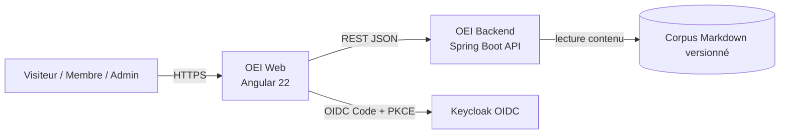
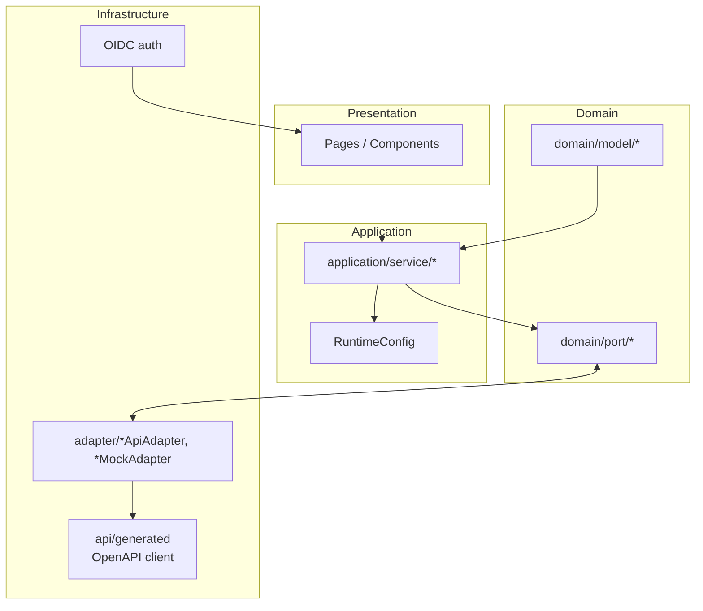
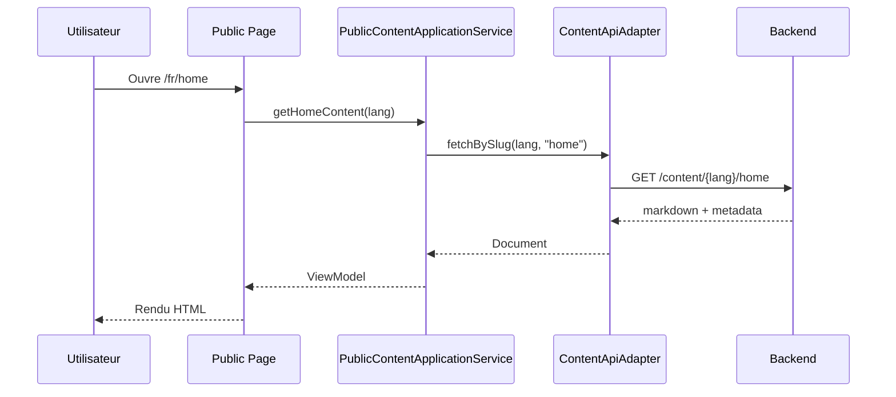
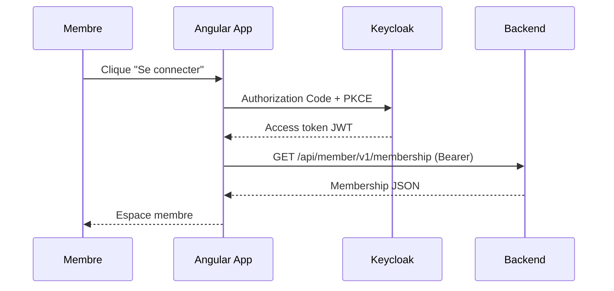
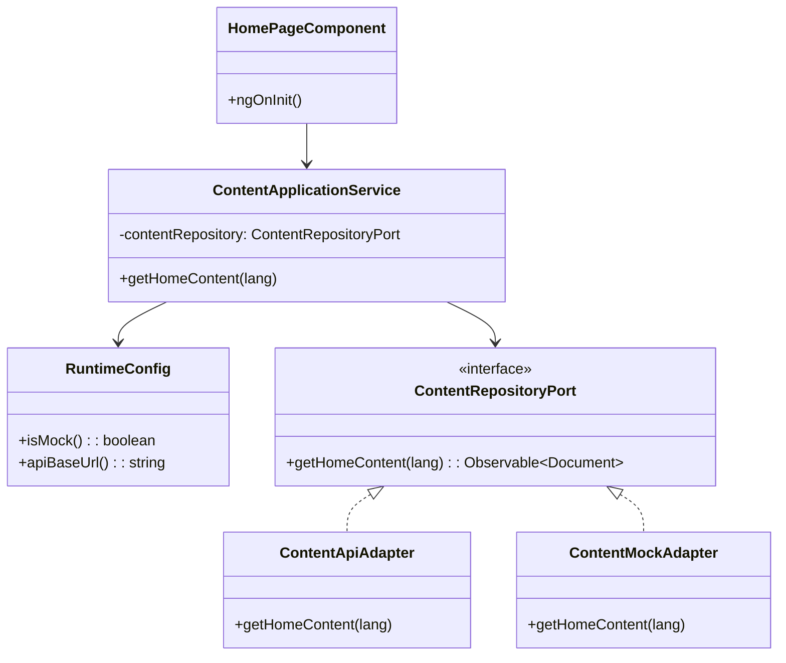
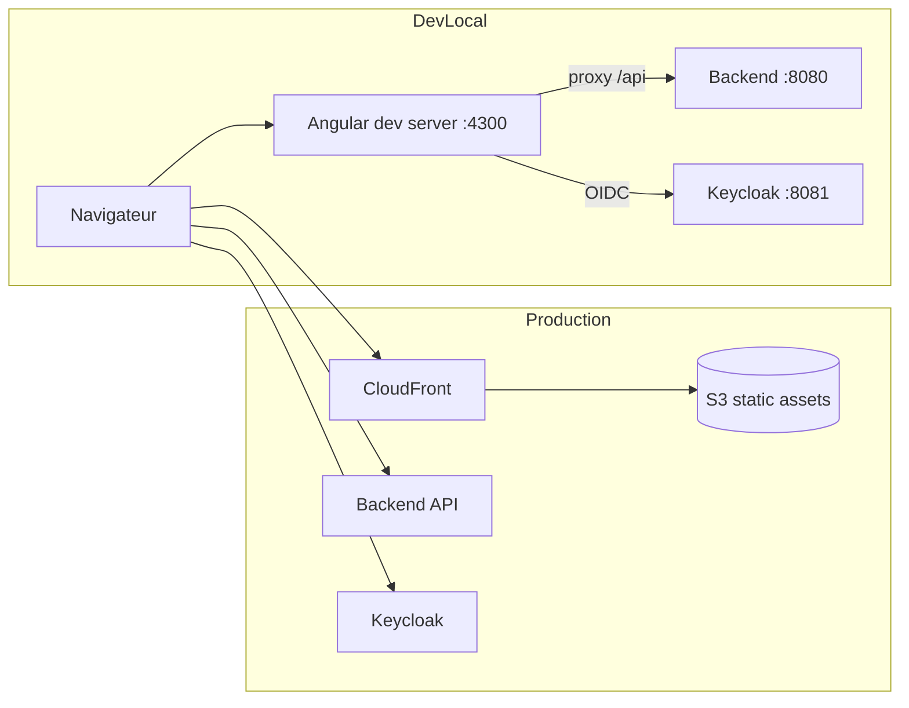

# OEI Frontend (Angular)

SPA Angular 22 de la plateforme OEI: site public multilingue, espace membre,
espace institution, back-office admin, et consommation API contract-first.

## Vue fonctionnelle

| Domaine | Fonctionnalites principales | Mode |
|---|---|---|
| Site public | Pages institutionnelles, contenus multilingues, livre blanc | Mock + API |
| Membre | Profil, adhésion, badges, objectifs de certification | Mock + API |
| Institution | Profil public, invitations, publications, audit | Mock + API |
| CMS | Parcours de contribution/relecture/publication | API prioritaire |
| Events | Liste, detail, inscriptions | Mock + API |
| Admin | Catalogue certifications, templates email, gouvernance contenus | API prioritaire |
| Identity | Login OIDC Keycloak, autorisations par roles | API |

## Architecture C4 (Mermaid)

### C4 - Niveau 1 (Contexte)



### C4 - Niveau 2 (Conteneurs frontend)



## Diagrammes de sequence

### Sequence - Consultation de contenu public



### Sequence - Connexion OIDC et appel API membre



## Diagramme de classes (vue logique simplifiee)



## Diagramme de deploiement



## Services applicatifs (extraits)

| Service | Responsabilite |
|---|---|
| `member-application.service.ts` | Lecture/édition du profil membre |
| `membership-application.service.ts` | Flux d'adhésion et état membership |
| `badge-application.service.ts` | Consultation badges et progression |
| `content-application.service.ts` | Accès contenu CMS |
| `public-content-application.service.ts` | Rendu contenu public multilingue |
| `institution-account-application.service.ts` | Espace institution |
| `admin-certification-catalog-application.service.ts` | Back-office certifications |
| `admin-email-templates-application.service.ts` | Back-office templates email |
| `event-application.service.ts` | Gestion d'événements |
| `event-registration-application.service.ts` | Inscriptions événements |

## Contrat API et generation OpenAPI

- Entrée générateur: `openapitools.json`
- Contrat consommé: `node_modules/@oei/api-contract/oei-api.yaml`
- Sortie générée: `src/app/infrastructure/api/generated`

Commandes:

```bash
cd frontend/oei-web
pnpm run generate:api
```

La commande exécute d'abord la préparation backend (`mvn ... process-resources`) puis la
génération Typescript Angular.

## Run, test, build

Dev local:

```bash
cd frontend/oei-web
pnpm install
pnpm run start
```

Tests unitaires:

```bash
cd frontend/oei-web
pnpm run test
```

E2E:

```bash
cd frontend/oei-web
pnpm run e2e
```

Build standard:

```bash
cd frontend/oei-web
pnpm run build
```

Build pipeline (avec regen API):

```bash
cd frontend/oei-web
pnpm run build:api
```

## Notes techniques

- `RuntimeConfig` permet le basculement `mock` / `api` sans recompiler.
- `proxy.conf.json` redirige `/api` vers le backend local en dev.
- Les contenus `content/` sont copiés dans `public/assets/content/` par script.
- `pnpm.overrides.lmdb` est un contournement CI/sandbox; si cache Angular réactivé, revoir.
